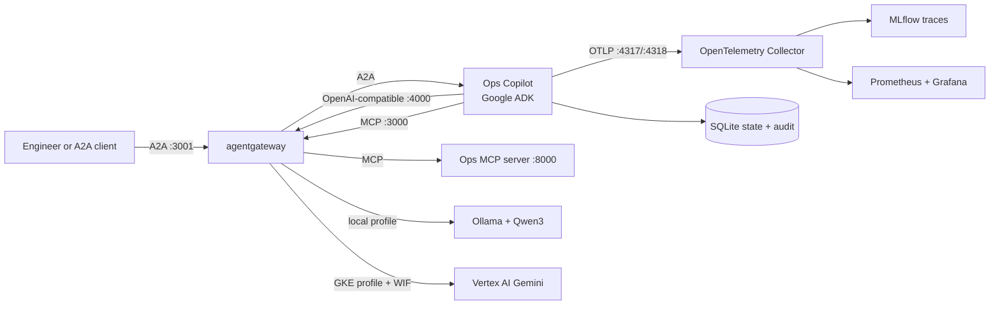

# AgentOps Open Course

[](https://github.com/MLOps-Courses/agentops-open-course/actions/workflows/ci.yml) [](https://agentops-open-course.fmind.dev/) [](https://github.com/MLOps-Courses/agentops-open-course/actions/workflows/scan.yml) [](https://github.com/MLOps-Courses/agentops-open-course/stargazers) [](./LICENSE.txt) [](./agents/LICENSE)

Build one production-shaped AI agent from first prompt to an observable Kubernetes workload. The course uses [Google ADK](https://google.github.io/adk-docs/), [agentgateway](https://agentgateway.dev/), [kagent](https://kagent.dev/), [MLflow](https://mlflow.org/), and [OpenTelemetry](https://opentelemetry.io/) to teach the full AgentOps lifecycle with runnable Python, tests, policies, and infrastructure.

**[Read the course](https://agentops-open-course.fmind.dev/)** | **[Start locally](#local-quickstart)** | **[Contribute](./CONTRIBUTING.md)**

## What makes this course practical?

- **One evolving system:** every chapter improves the same Ops Copilot instead of introducing disconnected demos.
- **Local first:** run an Apache-2.0 [Qwen3](https://huggingface.co/Qwen/Qwen3-4B) model through Ollama, with no model API account.
- **Real operational boundaries:** tools, Agent Skills, MCP, A2A, human approval, PII redaction, append-only audit records, and persistent sessions are implemented in the reference agent.
- **One data plane:** agentgateway routes and governs MCP, A2A, and OpenAI-compatible model traffic.
- **One local-to-cloud contract:** the same container and Kubernetes base run on k3d and on a small GKE lab; only overlays and model identity change.
- **Observable end to end:** optional OTLP telemetry flows to a self-hosted MLflow trace UI and Prometheus/Grafana metrics.
- **Verified examples:** documentation snippets mirror source under `agents/` and deployable resources under `infra/`.

The software used to build and operate the course system is open source. Gemini and Google Cloud are optional proprietary model and hosting substrates used by the native ADK and GKE learning paths; neither is presented as open source. GitHub hosts this public repository but is not part of the runtime stack.

## What will you build?

The **Ops Copilot** investigates incidents in a fictional service. It reads a committed SQLite seed, service logs, Markdown runbooks, and least-privilege Agent Skills. Read actions can run directly; state-changing mock actions require approval and append an application-level, append-only audit record. Runtime state is copied into `.state/`, so exercises never mutate the course dataset.



## Local quickstart

This first checkpoint installs the pinned toolchain and runs the complete offline test suite. It makes no model, cloud, or deployment calls.

```bash
git clone https://github.com/MLOps-Courses/agentops-open-course.git
cd agentops-open-course
mise install
mise run install
mise run test
```

Expected final output includes a passing pytest summary and coverage at or above the enforced 95% branch threshold:

```text
... passed
Required test coverage of 95% reached
```

To run the host data plane with the open-weight model, install Ollama, pull Qwen3, then start three processes in separate terminals:

```bash
ollama pull qwen3:4b
```

```bash
# Terminal 1: read-only MCP server
cd agents/python
mise run mcp:http
```

```bash
# Terminal 2: A2A agent through the local gateway model/MCP contracts
cd agents/python
AGENT_GATEWAY_ENABLED=true \
AGENT_MODEL=qwen3:4b \
AGENT_MCP_URL=http://localhost:3000/mcp \
OPENAI_BASE_URL=http://localhost:4000/v1 \
OPENAI_API_KEY=agentgateway \
mise run a2a
```

```bash
# Terminal 3: MCP, A2A, and model gateway listeners
mise run gateway:host
```

Inspect the A2A contract through the gateway, not the direct application port:

```bash
curl -fsS http://localhost:3001/.well-known/agent-card.json | jq .name
```

Expected output:

```text
"Ops Copilot"
```

The three processes remain in the foreground so logs are visible; stop them with `Ctrl-C`. Chapter 5 explains the routes and sends a model request.

To move the same contract to k3d, use the guarded root tasks. First create/resume the tracked cluster and install the pinned kagent control plane:

```bash
mise run cluster:start
mise run platform:install
```

Chapter 6 shows the required Ollama bridge bind before `mise run platform:dev`; the default loopback-only Ollama listener is intentionally not reachable from cluster pods.

## Which learning path should you choose?

| Path                | Model                | Infrastructure     | Best for                                                         |
| ------------------- | -------------------- | ------------------ | ---------------------------------------------------------------- |
| Offline engineering | None                 | Host process       | Tests, tools, policies, data, and code review                    |
| Local agent         | Qwen3 through Ollama | Host or k3d        | Completing the stack without provider credentials                |
| Native ADK          | Gemini               | Host process       | Learning ADK's direct Gemini integration in Chapters 2-4         |
| Cloud lab           | Gemini on Vertex AI  | Zonal GKE Standard | Workload Identity, GCS artifacts, and production-shaped delivery |

The GKE path is an optional lab, not a production reference architecture. Its single Spot node can be interrupted and is not highly available. The target of less than USD 20 per month assumes the billing account's GKE free-tier credit covers the zonal cluster management fee and that the cluster is destroyed when idle. Compute, storage, network, Artifact Registry, GCS, and Vertex usage remain billable. Always inspect the OpenTofu plan and current [GKE pricing](https://cloud.google.com/kubernetes-engine/pricing) before applying it.

## Course map

| Chapter                                                                        | Outcome                                                                      |
| ------------------------------------------------------------------------------ | ---------------------------------------------------------------------------- |
| [0. Overview](https://agentops-open-course.fmind.dev/0.%20Overview/)           | Choose the right agent architecture, stack, and learning path.               |
| [1. Setup](https://agentops-open-course.fmind.dev/1.%20Setup/)                 | Install one pinned, reproducible local workspace.                            |
| [2. Agents](https://agentops-open-course.fmind.dev/2.%20Agents/)               | Build the first ADK agent with explicit models, instructions, and sessions.  |
| [3. Capabilities](https://agentops-open-course.fmind.dev/3.%20Capabilities/)   | Add typed tools, skills, MCP, memory, workflows, and A2A.                    |
| [4. Quality](https://agentops-open-course.fmind.dev/4.%20Quality/)             | Enforce typing, tests, evaluations, guardrails, and adversarial regressions. |
| [5. Gateway](https://agentops-open-course.fmind.dev/5.%20Gateway/)             | Govern model, MCP, and A2A traffic through agentgateway.                     |
| [6. Platform](https://agentops-open-course.fmind.dev/6.%20Platform/)           | Deliver the same image to local k3d and an optional GKE lab with kagent.     |
| [7. Observability](https://agentops-open-course.fmind.dev/7.%20Observability/) | Trace, measure, evaluate, and audit the running system with OSS backends.    |
| [8. Community](https://agentops-open-course.fmind.dev/8.%20Community/)         | Maintain, release, license, cite, and contribute to an agent project.        |

## Repository layout

```text
agents/python/  Reference ADK agent, tests, evaluations, and A2A server
agents/data/    Immutable SQLite, runbook, skill, and log seed data
clients/web/    Minimal offline A2A web client for the Ops Copilot
load/           k6 load tests and latency budgets for the platform
docs/           FAQ-based course content published with Zensical
infra/          agentgateway, kagent, k3d/GKE, MLflow, and OTel resources
```

## Everyday commands

```bash
mise run serve    # documentation at http://localhost:8000
mise run format   # dprint + Ruff + shfmt
mise run check    # docs, Python, infrastructure, shell, and workflows
mise run test     # deterministic offline tests with branch coverage
mise run scan     # gitleaks history + Trivy dependency/secret/config scan
```

For local stack troubleshooting, start with `kubectl get pods -A`, `kubectl -n agentops get events --sort-by=.lastTimestamp`, and `docker compose -f infra/observability/compose.yaml logs`. To reset only the agent's local writable state, run `cd agents/python && mise run data:reset`.

## Stop and clean up

For the host quickstart, stop the MCP server, A2A server, gateway, and Ollama process with `Ctrl-C`. For the Chapter 6 Kubernetes path, first confirm the context, then remove only this course's workloads from `infra/`:

```bash
test "$(kubectl config current-context)" = k3d-local
skaffold delete -p local
```

This deletes the course PVCs and their data, but leaves the shared `local` cluster and kagent control plane available to other projects. If you ran `mise run observability:up`, `mise run observability:down` preserves its volumes. A manual Compose `down -v`, `helmfile destroy`, cluster deletion, and GKE teardown are separate destructive operations; Chapter 6 scopes and guards each one.

## Contributing and reuse

Course prose is [CC BY 4.0](./LICENSE.txt); code in `agents/`, `clients/`, `infra/`, and `load/` is [MIT](./agents/LICENSE). See [CONTRIBUTING.md](./CONTRIBUTING.md), [SECURITY.md](./SECURITY.md), and [CODE_OF_CONDUCT.md](./CODE_OF_CONDUCT.md) before opening a change. Release-facing changes are tracked in [CHANGELOG.md](./CHANGELOG.md), and academic/technical citations are available in [CITATION.cff](./CITATION.cff).
