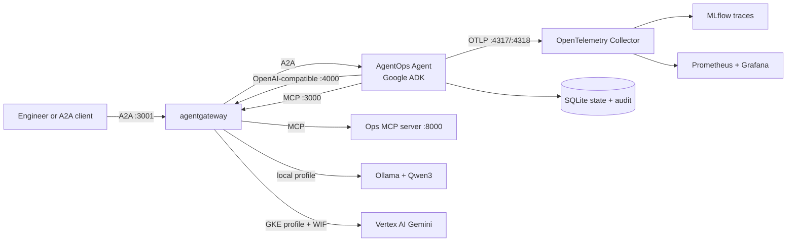

# AgentOps Open Course

[](https://github.com/MLOps-Courses/agentops-open-course/actions/workflows/ci.yml) [](https://github.com/MLOps-Courses/agentops-open-course/actions/workflows/docs.yml) [](https://github.com/MLOps-Courses/agentops-open-course/actions/workflows/scan.yml) [](https://github.com/MLOps-Courses/agentops-open-course/stargazers) [](./docs/LICENSE.txt) [](./LICENSE)

Learn the complete lifecycle of a production-shaped AI agent, from a first local model call to an observable Kubernetes workload. The course uses [Google ADK](https://google.github.io/adk-docs/), [agentgateway](https://agentgateway.dev/), [kagent](https://kagent.dev/), [MLflow](https://mlflow.org/), and [OpenTelemetry](https://opentelemetry.io/) with runnable Python, tests, policies, and infrastructure.

**[Read the course](https://agentops-open-course.fmind.dev/)** | **[Start locally](#local-quickstart)** | **[Build your capstone](https://agentops-open-course.fmind.dev/8.%20Community/8.7.%20Capstone.html)** | **[Contribute](./CONTRIBUTING.md)**

## What makes this course practical?

- **One completed reference:** every chapter inspects and runs the same AgentOps Agent, then the capstone guides you through replacing its fictional domain with your own platform.
- **OSS-first and account-free:** run the Apache-2.0 open-weight [Qwen3](https://huggingface.co/Qwen/Qwen3-4B-Instruct-2507) model through Ollama with no account, no mandatory SaaS, and no usage fee.
- **Real operational boundaries:** tools, Agent Skills, MCP, A2A, human approval, PII redaction, append-only audit records, and persistent sessions are implemented in the reference agent.
- **One data plane:** agentgateway routes and governs MCP, A2A, and OpenAI-compatible model traffic.
- **One local-to-cloud contract:** the same container and Kubernetes base run on k3d and on a small GKE lab; only overlays and model identity change.
- **Observable end to end:** optional OTLP telemetry flows to a self-hosted MLflow trace UI and Prometheus/Grafana metrics.
- **Verified examples:** critical documentation snippets are included directly from source under `agents/`, while commands and deployable resources mirror `infra/`.

The required host and local Kubernetes path uses open-source software and open-weight model artifacts. Gemini and Google Cloud are optional proprietary integrations; neither is presented as open source or required for completion. Repository and documentation hosting are release concerns, not runtime dependencies.

## What will you learn from?

The completed **AgentOps Agent** reference investigates incidents in a fictional service. It reads a committed SQLite seed, service logs, Markdown runbooks, and least-privilege Agent Skills. Read actions can run directly; state-changing mock actions require approval and append an application-level, append-only audit record. Runtime state is copied into `.state/`, so exercises never mutate the course dataset.



## Local quickstart

This first checkpoint installs the pinned toolchain and runs the complete offline test suite. It makes no model, cloud, container, or deployment calls.

```bash
git clone https://github.com/MLOps-Courses/agentops-open-course.git
cd agentops-open-course
mise install
mise run install
mise run doctor
mise run check:core
mise run test
```

The core gate validates course content, data, Python, shell, workflows, links, and licenses without invoking Docker or infrastructure tooling. Expected final output also includes a passing pytest summary and coverage at or above the enforced 95% branch threshold:

```text
... passed
Required test coverage of 95% reached
```

For the first interactive run, install Ollama and pull Qwen3:

```bash
ollama pull qwen3:4b-instruct
mise run doctor:model
```

Then run the agent directly against Ollama. These are the default settings, so no provider account or `.env` file is required:

```bash
cd agents/python
mise run run
```

Ask `List the open incidents`. The response should use the `list_incidents` tool and ground its answer in the local dataset. Chapter 2 explains the agent; Chapter 5 moves the same OpenAI-compatible model contract behind agentgateway.

The Chapter 5 host data plane runs the read-only MCP server and A2A server in separate terminals:

```bash
mise run doctor:gateway
mise run smoke:host # isolated fake-model composition check with automatic teardown
```

```bash
# Terminal 1
cd agents/python
mise run mcp:http
```

```bash
# Terminal 2
cd agents/python
AGENT_MODEL_PROVIDER=openai-compatible \
AGENT_MODEL=qwen3:4b-instruct \
AGENT_MCP_URL=http://127.0.0.1:3000/mcp \
OPENAI_BASE_URL=http://127.0.0.1:4000/v1 \
OPENAI_API_KEY=local-ollama \
mise run a2a
```

Start the digest-pinned gateway wrapper from the repository root. It publishes every gateway listener on loopback. On native Linux it also owns a Docker-bridge-only relay to the loopback MCP, A2A, and Ollama upstreams, plus the loopback gateway-metrics listener consumed by Compose Prometheus. Raw services remain off the workstation's LAN interfaces:

```bash
# Terminal 3
mise run gateway:host
```

To keep the gateway detached, use `mise run gateway:host:start`, inspect it with `mise run gateway:host:status` and `mise run gateway:host:logs`, then stop it with `mise run gateway:host:stop`.

Inspect the A2A contract through the governed listener, not the raw application port:

```bash
curl -fsS http://127.0.0.1:3001/.well-known/agent-card.json | jq .name
```

Expected output:

```text
"AgentOps Agent"
```

The MCP and A2A processes remain in the foreground so logs are visible; stop them with `Ctrl-C`. Stop the wrapper with `Ctrl-C` in foreground mode or the explicit stop task in detached mode; wrapper cleanup also removes its relay.

Kubernetes begins in Chapter 6. When you reach it, validate the heavier platform prerequisites before creating anything:

```bash
mise run doctor:platform
mise run cluster:start
mise run platform:install
```

Chapter 6 shows the required Ollama bridge bind before `mise run platform:dev`; the default loopback-only Ollama listener is intentionally not reachable from cluster pods.

## Which learning path should you choose?

| Path                | Model                | Infrastructure     | Best for                                                               |
| ------------------- | -------------------- | ------------------ | ---------------------------------------------------------------------- |
| Offline engineering | None                 | Host process       | Tests, tools, policies, data, and code review                          |
| Required OSS path   | Qwen3 through Ollama | Host, then k3d     | Completing every core outcome with no account, mandatory SaaS, or fee  |
| Optional provider   | Gemini               | Host process       | Comparing ADK's native provider integration after the local path works |
| Optional cloud lab  | Gemini on Vertex AI  | Zonal GKE Standard | Workload Identity, GCS artifacts, and production-shaped cloud delivery |

The GKE path is an optional lab, not a production reference architecture. Its single Spot node can be interrupted and is not highly available. The target of less than USD 20 per month assumes the billing account's GKE free-tier credit covers the zonal cluster management fee and that the cluster is destroyed when idle. Compute, storage, network, Artifact Registry, GCS, and Vertex usage remain billable. Always inspect the OpenTofu plan and current [GKE pricing](https://cloud.google.com/kubernetes-engine/pricing) before applying it.

## Course map

| Chapter                                                   | Outcome                                                                            |
| --------------------------------------------------------- | ---------------------------------------------------------------------------------- |
| [0. Overview](./docs/0.%20Overview/index.md)              | Choose the right agent architecture, stack, and learning path.                     |
| [1. Setup](./docs/1.%20Setup/index.md)                    | Install the staged prerequisites for the checkpoint you are running.               |
| [2. Agents](./docs/2.%20Agents/index.md)                  | Run and understand the ADK reference agent on local Qwen3.                         |
| [3. Capabilities](./docs/3.%20Capabilities/)              | Inspect typed tools, skills, MCP, memory, workflows, and A2A.                      |
| [4. Quality](./docs/4.%20Quality/)                        | Enforce typing, tests, evaluations, guardrails, and adversarial regressions.       |
| [5. Gateway](./docs/5.%20Gateway/)                        | Move the stable model contract behind agentgateway and govern MCP and A2A traffic. |
| [6. Platform](./docs/6.%20Platform/)                      | Deliver the same image to local k3d and an optional GKE lab with kagent.           |
| [7. Observability](./docs/7.%20Observability/)            | Trace, measure, evaluate, and audit the running system with OSS backends.          |
| [8. Community](./docs/8.%20Community/index.md)            | Maintain, release, and document an open-source agent project.                      |
| [8.7. Capstone](./docs/8.%20Community/8.7.%20Capstone.md) | Transform the completed reference into your own evidence-backed agent platform.    |

## Repository layout

```text
agents/python/  Reference ADK agent, tests, evaluations, and A2A server
agents/data/    Immutable SQLite, runbook, skill, and log seed data
clients/web/    Minimal offline A2A web client for the AgentOps Agent
load/           k6 load tests and latency budgets for the platform
docs/           FAQ-based course content built with Zensical
infra/          agentgateway, kagent, k3d/GKE, MLflow, and OTel resources
```

## Everyday commands

```bash
mise run serve    # documentation at http://localhost:8000
mise run doctor   # base docs/Python entry prerequisites
mise run format   # dprint + Ruff + shfmt
mise run check:core # static gate without Docker or infrastructure execution
mise run check    # docs, Python, infrastructure, shell, and workflows
mise run test     # deterministic offline tests with branch coverage
mise run scan     # gitleaks history + Trivy dependency/secret/license/config scan
```

For local stack troubleshooting, start with `kubectl get pods -A`, `kubectl -n agentops get events --sort-by=.lastTimestamp`, and `docker compose -f infra/observability/compose.yaml logs`. To reset only the agent's local writable state, run `cd agents/python && mise run data:reset`.

## Stop and clean up

For the host quickstart, stop the MCP server, A2A server, and foreground gateway with `Ctrl-C`; use `mise run gateway:host:stop` for the detached wrapper. Stop Ollama only if you started it manually. For the Chapter 6 Kubernetes path, first confirm the context, then remove only this course's workloads from `infra/`:

```bash
test "$(kubectl config current-context)" = k3d-local
cd infra
skaffold delete -p local
```

This deletes the course PVCs and their data, but leaves the shared `local` cluster and kagent control plane available to other projects. If you ran `mise run observability:up`, `mise run observability:down` preserves its volumes. A manual Compose `down -v`, `helmfile destroy`, cluster deletion, and GKE teardown are separate destructive operations; Chapter 6 scopes and guards each one.

## Contributing and reuse

Course prose is [CC BY 4.0](./docs/LICENSE.txt); software and repository automation are [MIT](./LICENSE). See [CONTRIBUTING.md](./CONTRIBUTING.md), [SECURITY.md](./SECURITY.md), and [CODE_OF_CONDUCT.md](./CODE_OF_CONDUCT.md) before opening a change. Release-facing changes are tracked in [CHANGELOG.md](./CHANGELOG.md), and academic/technical citations are available in [CITATION.cff](./CITATION.cff).

The rendered course is published at [agentops-open-course.fmind.dev](https://agentops-open-course.fmind.dev/). The source remains the verification surface: every critical excerpt, command, policy, and deployment contract is checked from this repository.
