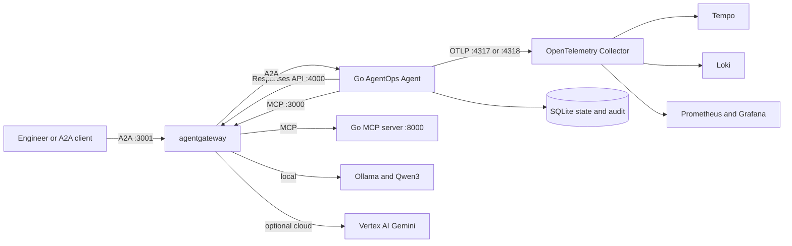

# AgentOps Open Course

[](https://github.com/MLOps-Courses/agentops-open-course/actions/workflows/ci.yml) [](https://github.com/MLOps-Courses/agentops-open-course/actions/workflows/docs.yml) [](https://github.com/MLOps-Courses/agentops-open-course/actions/workflows/scan.yml) [](https://github.com/MLOps-Courses/agentops-open-course/stargazers) [](./static/LICENSE.txt) [](./LICENSE)

Learn the complete lifecycle of a production-shaped AI agent in Go: build it with Google ADK, govern traffic with agentgateway, run it with kagent, and collect OpenTelemetry traces, logs, metrics, and evaluation evidence.

It is the only end-to-end open-source AgentOps curriculum a search on 11 August 2026 turned up: one application taken from a first local model call to a monitored Kubernetes workload with no SaaS, no cloud account, and no fee on the required path. [0.0. Course](./content/0.%20Overview/0.0.%20Course.md) compares it row by row against six adjacent courses and states what each of them does better; that claim is the result of a search, not a proof, and a correction is a welcome issue.

The course is published from this repository to <https://agentops-open-course.fmind.dev/> by `.github/workflows/docs.yml`. Every URL the course has ever served still resolves: `data/released-urls.json` records them and the build fails if one loses its redirect.

**[Read the course](https://agentops-open-course.fmind.dev/)** | **[Start locally](#local-quickstart)** | **[Build your capstone](https://agentops-open-course.fmind.dev/8-community/8-7-capstone/)** | **[Contribute](./CONTRIBUTING.md)**

## What makes the course practical?

- **One executable reference:** every chapter inspects and runs the same AgentOps Agent, then the capstone adapts it to a learner-owned domain.
- **Go from runtime to gates:** the agent, black-box evaluation harness, and repository maintenance tools are separate Go modules.
- **Account-free default:** local Qwen3 through Ollama requires no mandatory SaaS, provider account, or usage fee.
- **Typed operational boundaries:** tools, Agent Skills, MCP, A2A, confirmation, redaction, append-only audit evidence, persistent sessions, and recovery are implemented.
- **Bounded orchestration:** the conversational agent plans multi-step investigations; a runnable workflow enforces plan, investigate, evidence review, and recommendation.
- **One governed data plane:** agentgateway routes MCP, A2A, and OpenAI-compatible Responses API traffic.
- **One container contract:** the same static distroless image runs on the host, local k3d, and the optional GKE laboratory.
- **One observability stack:** OTLP fans out to Tempo, Loki, Prometheus, Alertmanager, and Grafana.
- **Evidence at the wire:** the standalone evaluator folds ADK REST and A2A events into the same typed turn and emits sanitized JSON plus OpenTelemetry evidence.
- **Source-linked teaching:** critical excerpts are rendered directly from named regions in `agents/go`, `agents/data`, `infra/`, and the repository's own scripts and workflows.

The required path is open source and uses open-weight model artifacts. Gemini, Vertex AI, GKE, GCS, Artifact Registry, and hosted repository services are optional proprietary comparisons.

The defensible difference is scope: one Go application and one wire-only Go evaluator cover typed tools, safety, gateway policy, Kubernetes, recovery, telemetry, and release evidence without requiring hosted evaluation. Adjacent courses go deeper than this one on framework breadth, hosted evaluation loops, and the internals of individual projects, and the comparison table in [0.0. Course](./content/0.%20Overview/0.0.%20Course.md) names which.

This course was taught in Python through v0.7.0. That version is archived, complete and readable, on the [`python` branch](https://github.com/MLOps-Courses/agentops-open-course/tree/python), and [8.8. From Python](./content/8.%20Community/8.8.%20From%20Python.md) maps LangGraph and Python-agent concepts onto their Go equivalents here.

## What will you build?

The AgentOps Agent is an on-call assistant for a fictional platform. Ask it to investigate `INC-002` and initiate a guarded restart only if the evidence supports one:

```text
> Investigate INC-002. If the evidence supports it, initiate a guarded inventory restart.
  -> get_incident(incident_id="INC-002")
  -> get_service_status(name="inventory")
  -> search_service_logs(service="inventory")
  -> get_runbook(slug="service-down")
  -> restart_service(name="inventory")
     ADK requests confirmation; the function has not run.
  [awaiting human approval and rationale; no state change]
```

Every domain claim must come from a tool result. The guarded call creates a confirmation request; only a later confirmed execution with a rationale can mutate state and append an audit record.


```mermaid
flowchart LR
    User[Engineer or A2A client] -->|A2A :3001| Gateway[agentgateway]
    Agent[Go AgentOps Agent] -->|Responses API :4000| Gateway
    Agent -->|MCP :3000| Gateway
    Gateway -->|MCP| MCP[Go MCP server :8000]
    Gateway -->|local| Ollama[Ollama and Qwen3]
    Gateway -->|optional cloud| Vertex[Vertex AI Gemini]
    Gateway -->|A2A| Agent
    Agent -->|OTLP :4317 or :4318| Collector[OpenTelemetry Collector]
    Collector --> Tempo[Tempo]
    Collector --> Loki[Loki]
    Collector --> Prometheus[Prometheus and Grafana]
    Agent --> State[(SQLite state and audit)]
```

**Diagram in words:** An engineer reaches the Go agent through agentgateway. The agent uses the same gateway for MCP, A2A, and model traffic; it writes controlled SQLite state and exports optional telemetry to the OpenTelemetry backends.

## Local quickstart

You need a Unix-like shell, Git, a C compiler, and [mise](https://mise.jdx.dev/). Linux x86_64 with cgroup v2 is the fully supported host; macOS, Linux arm64, and WSL2 are best-effort, and the host table in [1.0. System](./content/1.%20Setup/1.0.%20System.md) says what that costs on each. Clone the repository first:

```bash
git clone https://github.com/MLOps-Courses/agentops-open-course.git
cd agentops-open-course
```

Install and activate mise, then run the model-free gates:

```bash
mise run install
mise run doctor
mise run check:core
mise run test
```

The learner gate does not start a model, container, cluster, collector, paid API, or cloud resource.

`mise run test` in `agents/go` and in `evals` enforces an 80% line-coverage floor on every package, `cmd/` excluded by kind because those packages are `package main` composition wiring — flag parsing, dependency construction, process lifecycle — the project has chosen not to hold to the floor; their coverage is measured like every other package's and simply sits below it. `mise run coverage` in `agents/go` prints the per-function detail behind that number.

For the first grounded turn, install [Ollama](https://ollama.com/download), then run:

```bash
ollama pull qwen3:4b-instruct
mise run doctor:model
cd agents/go
AGENT_MODEL_TIMEOUT_S=300 mise run web
```

Open the ADK web UI on `http://localhost:8002`, ask `List the open incidents`, and inspect the event stream for `list_incidents(status="open")`, its returned seed rows, and the final answer. Matching seed IDs without the observed call and result is only a plausible answer, not grounding evidence. `mise run run` is a faster console preview but cannot prove the trajectory. `AGENT_MODEL_TIMEOUT_S=300` is a deadline sized for a CPU, because the shipped sixty seconds is this course's most common first failure; [1.4. Providers](./content/1.%20Setup/1.4.%20Providers.md) has you measure your own machine rather than guess. The first turn is the slowest, since the model loads before it answers, and a connection error instead means `ollama serve` is not running.

Model-backed commands are observations, not offline gate proof. They may vary across runs even with temperature zero.

Continue with the [canonical roughly three-hour build-first route](./content/0.%20Overview/0.0.%20Course.md#how-should-you-work-through-each-page) before entering the longer production-operations track.

## Which learning path should you choose?

| Path                | Model                | Infrastructure     | Best for                                                   |
| ------------------- | -------------------- | ------------------ | ---------------------------------------------------------- |
| Offline engineering | None                 | Host process       | Source, tests, tools, policy, state, and docs              |
| Required OSS path   | Qwen3 through Ollama | Host, then k3d     | Completing core outcomes without an account or fee         |
| Optional provider   | Gemini               | Host process       | Comparing ADK's native provider after the local path works |
| Optional cloud lab  | Gemini on Vertex AI  | Zonal GKE Standard | Workload Identity, GCS artifacts, and cloud delivery       |

The k3d half of the required OSS path has not been executed against the Go rewrite. The authoring host runs cgroup v1, where the platform doctor fails before it can create a cluster, so `mise run check:infra` validates those manifests and profiles but nobody has run the local Kubernetes journey on this code. [SUPPORT.md](./SUPPORT.md) owns that boundary.

The GKE path is a billable, interruptible laboratory, not a production architecture. [7.3. Costs](./content/7.%20Observability/7.3.%20Costs.md) owns the current estimate and verification date.

## Course map

| Chapter                                                      | Outcome                                                                              |
| ------------------------------------------------------------ | ------------------------------------------------------------------------------------ |
| [0. Overview](./content/0.%20Overview/_index.md)             | Choose the architecture, stack, and learning path.                                   |
| [1. Setup](./content/1.%20Setup/_index.md)                   | Install only the prerequisites needed for the current checkpoint.                    |
| [2. Agents](./content/2.%20Agents/_index.md)                 | Run and understand the ADK Go agent on local Qwen3.                                  |
| [3. Capabilities](./content/3.%20Capabilities/_index.md)     | Inspect typed tools, skills, MCP, memory, workflows, and A2A.                        |
| [4. Quality](./content/4.%20Quality/_index.md)               | Enforce types, tests, black-box evaluations, guardrails, and adversarial regression. |
| [5. Gateway](./content/5.%20Gateway/_index.md)               | Govern MCP, A2A, and Responses API traffic with agentgateway.                        |
| [6. Platform](./content/6.%20Platform/_index.md)             | Deliver the same static image to k3d and the optional GKE lab.                       |
| [7. Observability](./content/7.%20Observability/_index.md)   | Trace, measure, evaluate, audit, and recover the system.                             |
| [8. Community](./content/8.%20Community/_index.md)           | Maintain, document, and prepare an open-source agent project.                        |
| [8.7. Capstone](./content/8.%20Community/8.7.%20Capstone.md) | Adapt the completed reference into an evidence-backed platform.                      |

## Repository layout

```text
agents/go/     Go ADK agent, protocols, policy, state, tests, and image
agents/data/   Immutable SQLite, runbook, skill, and log seed data
evals/         Standalone black-box Go evaluation module and assets
tools/         Standalone Go repository-maintenance commands
clients/web/   Minimal dependency-free A2A web client
load/          k6 load tests and latency budgets
content/       Hugo course pages, ordered by hand in data/nav.yaml
layouts/       Hugo templates, source includes, and accessibility helpers
data/nav.yaml  Explicit hand-ordered learning path
infra/         agentgateway, kagent, k3d/GKE, and observability resources
skills/        Portable Agent Skills distilled from the course
```

The root `go.mod` exists only for the Hextra Hugo Module. Application, evaluation, and repository-tool dependencies stay in their own modules.

## Everyday commands

From the repository root:

```bash
mise run install
mise run doctor
mise run format
mise run check:core
mise run check
mise run test
mise run scan
mise run build:docs
mise run serve
```

From `agents/go`:

```bash
mise run check
mise run test
mise run coverage
mise run build
mise run run
mise run workflow
mise run coordinator
mise run web
mise run a2a
mise run mcp
mise run mcp:http
mise run data:reset
```

From `evals`:

```bash
mise run eval:validate        # offline: evalsets, assets, and the import boundary
mise run check
mise run test
mise run eval                 # model-backed: 3 samples, 0.33 floor, 5 required safety cases
mise run eval:judge-calibration # model-backed: judge agreement against the labeled set
mise run eval:ab              # offline: compare two results.json artifacts
```

The threshold is on the command line rather than in a policy file: `mise run eval` runs every case three times, requires a 0.33 aggregate pass rate, and requires five safety cases to pass in every sample. `evals/README.md` explains why that asymmetry is the honest shape for a 4B local model.

Resetting agent state removes only `agents/go/.state`; it never changes `agents/data/incidents.db`.

## What does evaluation evidence contain?

Model-backed evaluation produces sanitized artifacts at the `evals` module root: `results.json` from every run, and `judge-calibration-results.json` from the calibration task. Both are generated, never committed fixtures.

`results.json` records the source revision and dirty flag, the model and evalset identities, the transport, and per-case scores and token usage. It deliberately cannot contain prompts, answers, tool arguments, tool responses, judge rationales, endpoints, or secrets; serialization tests pin that boundary. See [evals/README.md](./evals/README.md) for the exact schema and task mapping.

The release story is one sentence: a workflow-dispatch run uploads `results.json`, and a human reads it before tagging. Local files are not release proof by themselves — exact-head hosted CI, runtime storage, artifact attestation, and public publication are separate boundaries.

## How do you preview the course?

```bash
mise run serve
# open http://localhost:8003
```

The Hugo build treats warnings and bad references as errors, derives canonical routes from reviewed page and section slugs, checks rendered canonical/Open Graph/search/sitemap/navigation/fragment parity, and extracts code from named source regions. Every changed Mermaid diagram needs equivalent prose.

A successful local build proves rendering only. Publication is a separate boundary: `.github/workflows/docs.yml` deploys `site/` to <https://agentops-open-course.fmind.dev/> on a push to `main`.

## Reuse and contribution

The top-level [`skills/`](./skills/) directory packages telemetry, guardrails, resilience, token budgets, least privilege, evaluation, and incident-response patterns in the portable Agent Skills format.

Course prose is [CC BY 4.0](./static/LICENSE.txt); software and repository automation are [MIT](./LICENSE). Release history is in [CHANGELOG.md](./CHANGELOG.md) and citation metadata in [CITATION.cff](./CITATION.cff). Read [CODE_OF_CONDUCT.md](./CODE_OF_CONDUCT.md), [SUPPORT.md](./SUPPORT.md), [CONTRIBUTING.md](./CONTRIBUTING.md), [GOVERNANCE.md](./GOVERNANCE.md), [ACCESSIBILITY.md](./ACCESSIBILITY.md), and [SECURITY.md](./SECURITY.md) before proposing a change.
