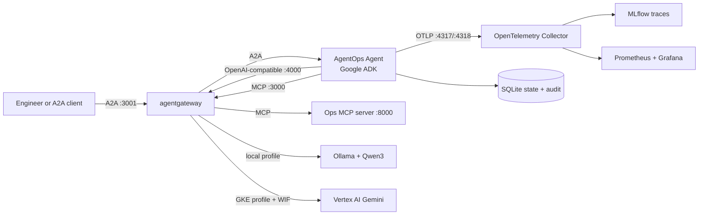

# AgentOps Open Course

[](https://github.com/MLOps-Courses/agentops-open-course/actions/workflows/ci.yml) [](https://github.com/MLOps-Courses/agentops-open-course/actions/workflows/docs.yml) [](https://github.com/MLOps-Courses/agentops-open-course/actions/workflows/scan.yml) [](https://github.com/MLOps-Courses/agentops-open-course/stargazers) [](./docs/LICENSE.txt) [](./LICENSE)

Learn the complete lifecycle of a production-shaped AI agent, from a first local model call to an observable Kubernetes workload. The course uses [Google ADK](https://google.github.io/adk-docs/), [agentgateway](https://agentgateway.dev/), [kagent](https://kagent.dev/), [MLflow](https://mlflow.org/), and [OpenTelemetry](https://opentelemetry.io/) with runnable Python, tests, policies, and infrastructure.

**[Read the course](https://agentops-open-course.fmind.dev/)** | **[Start locally](#local-quickstart)** | **[Build your capstone](https://agentops-open-course.fmind.dev/8.%20Community/8.7.%20Capstone.html)** | **[Contribute](./CONTRIBUTING.md)**

## How is the course structured?

Nine chapters follow the AgentOps lifecycle, from a first local model call to an observable Kubernetes workload. Every page opens with an **In one glance** block — what you will do, what you need first, and how long it takes — and ends with a checkpoint you can verify, so you can skim the opening and skip a page when it is not for you today. Depth that is not needed on a first pass sits behind collapsible sections rather than being cut.

## What makes this course practical?

- **One completed reference:** every chapter inspects and runs the same AgentOps Agent, then the capstone guides you through replacing its fictional domain with your own platform.
- **OSS-first and account-free:** run the Apache-2.0 open-weight [Qwen3](https://huggingface.co/Qwen/Qwen3-4B-Instruct-2507) model through Ollama with no account, no mandatory SaaS, and no usage fee.
- **Real operational boundaries:** tools, Agent Skills, MCP, A2A, human approval, PII redaction, append-only audit records, and persistent sessions are implemented in the reference agent.
- **Bounded reasoning:** the fast agent is instructed to plan multi-step work and verify approved actions; a runnable plan → investigate → evidence review → recommend workflow enforces deeper orchestration structurally.
- **One data plane:** agentgateway routes and governs MCP, A2A, and OpenAI-compatible model traffic.
- **One local-to-cloud contract:** the same container and Kubernetes base run on k3d and on a small GKE lab; only overlays and model identity change.
- **Observable end to end:** optional OTLP telemetry flows to a self-hosted MLflow trace UI and Prometheus/Grafana metrics.
- **Verified examples:** critical documentation snippets are included directly from source under `agents/`, while commands and deployable resources mirror `infra/`.

The required host and local Kubernetes path uses open-source software and open-weight model artifacts. Gemini and Google Cloud are optional proprietary integrations; neither is presented as open source or required for completion. Repository and documentation hosting are release concerns, not runtime dependencies.

## What will you learn from?

The completed **AgentOps Agent** is an on-call assistant for a fictional service. Ask it to investigate `INC-002` and initiate a guarded restart if the evidence supports one. It gathers the evidence, calls the guarded tool, and then ADK pauses before the function can change anything:

```text
> Investigate INC-002. If the evidence supports it, initiate a guarded inventory restart.
  → get_incident(incident_id="INC-002")   INC-002 · inventory · SEV1 · open
  → get_service_status(name="inventory")   inventory: down
  → search_service_logs(service="inventory")   panic · restarts · readiness refused · stock lookup 503
  → get_runbook(slug="service-down")

  INC-002 is a SEV1: inventory is down, its container keeps restarting, and stock lookups fail.
  After diagnosis, the runbook supports a restart to clear this crash loop.
  → restart_service(name="inventory")
      ADK requests confirmation; the function has not run.
  [awaiting human approval + rationale · no state change]
```

Every claim traces to a tool result. The guarded call creates ADK's confirmation request; only an approved call with a rationale executes `restart_service` and appends an audit record. The agent reads a committed SQLite seed, service logs, Markdown runbooks, and least-privilege Agent Skills; runtime state is copied into `.state/`, so exercises never mutate the course dataset. New to the acronyms below (MCP, A2A, OTLP)? The [glossary](https://agentops-open-course.fmind.dev/0.%20Overview/0.7.%20Glossary.html) defines every term.


```mermaid
flowchart LR
    User[Engineer or A2A client] -->|A2A :3001| Gateway[agentgateway]
    Agent[AgentOps Agent<br/>Google ADK] -->|OpenAI-compatible :4000| Gateway
    Agent -->|MCP :3000| Gateway
    Gateway -->|MCP| MCP[Ops MCP server :8000]
    Gateway -->|local profile| Ollama[Ollama + Qwen3]
    Gateway -->|GKE profile + WIF| Vertex[Vertex AI Gemini]
    Gateway -->|A2A| Agent
    Agent -->|OTLP :4317/:4318| OTel[OpenTelemetry Collector]
    OTel --> MLflow[MLflow traces]
    OTel --> Prometheus[Prometheus + Grafana]
    Agent --> State[(SQLite state + audit)]
```

## Local quickstart

You need a Unix-like shell (Linux, macOS, or WSL2), git, and basic Python. Install and activate mise first:

```bash
curl -fsSL https://mise.run | sh
# Follow mise's printed instructions to activate it in your shell.
```

The learner bootstrap installs only the pinned core tools and environments, then runs the model-free gates. It makes no model, cloud, container, or deployment calls; `test` is offline after installation, while `check:core` may query package-index advisory services.

```bash
git clone https://github.com/MLOps-Courses/agentops-open-course.git
cd agentops-open-course
mise run install
mise run doctor
mise run check:core
mise run test
```

The core gate validates course content, data, Python, shell, workflows, links, and licenses without invoking Docker or infrastructure tooling. Expected final output also includes a passing pytest summary and coverage at or above the enforced 95% branch threshold:

```text
... passed
Required test coverage of 95% reached
```

For the first interactive run, install [Ollama](https://ollama.com/download), then pull Qwen3 (~2.5 GB, Apache-2.0 open weights):

```bash
ollama pull qwen3:4b-instruct
mise run doctor:model
```

Then run the agent directly against Ollama. These are the default settings, so no provider account or `.env` file is required:

```bash
cd agents/python
mise run run
```

Ask `List the open incidents`. It should answer with **INC-002, INC-005, and INC-010** — three ids from the committed dataset, not three it invented. That is the whole local loop: an agent that reads real data through typed tools and refuses to make one up. `mise run run` prints the answer, not the tool calls behind it; use `mise run web` and its Events timeline to watch those. Chapter 2 explains how it is wired.

Later, Chapter 3 compares the same conversational agent with `mise run workflow` and `mise run coordinator`. Those tasks select bounded orchestration through the same lazy `src/agent` package; the default runtime tasks stay pinned to the conversational composition.

The first turn on CPU can take tens of seconds while the model loads; later turns are faster. A connection error (not just slowness) usually means `ollama serve` is not running — see the [troubleshooting guide](https://agentops-open-course.fmind.dev/0.%20Overview/0.6.%20Troubleshooting.html).

That is the first complete loop. [1. Setup](./docs/1.%20Setup/index.md) stages later prerequisites only when the corresponding chapter needs them.

## Run and tear down the full local stack

The gateway, Kubernetes, and observability tiers stay out of first-run setup. `mise run install:platform` adds that toolchain; the optional GKE path adds `mise run install:gcp`.

Their exact start order, verification, and every teardown belong to the chapters that own them: [5. Gateway](./docs/5.%20Gateway/index.md) for the host agentgateway process order and its smoke check, [6. Platform](./docs/6.%20Platform/index.md) for the Ollama bridge, the k3d deployment, backup, and the guarded cluster and cloud teardowns.

Follow those pages instead of a second infrastructure runbook here. Teardown deletes PersistentVolumeClaims and their data, and a duplicated copy of a destructive command is the copy that goes stale.

## Which learning path should you choose?

| Path                | Model                | Infrastructure     | Best for                                                               |
| ------------------- | -------------------- | ------------------ | ---------------------------------------------------------------------- |
| Offline engineering | None                 | Host process       | Tests, tools, policies, data, and code review                          |
| Required OSS path   | Qwen3 through Ollama | Host, then k3d     | Completing every core outcome with no account, mandatory SaaS, or fee  |
| Optional provider   | Gemini               | Host process       | Comparing ADK's native provider integration after the local path works |
| Optional cloud lab  | Gemini on Vertex AI  | Zonal GKE Standard | Workload Identity, GCS artifacts, and production-shaped cloud delivery |

The GKE path is an optional lab, not a production reference architecture. Its single Spot node can be interrupted and is not highly available, and it bills real money — [7.3. Costs](./docs/7.%20Observability/7.3.%20Costs.md) owns the current estimate and the date it was checked. Always inspect the OpenTofu plan and current [GKE pricing](https://cloud.google.com/kubernetes-engine/pricing) before applying it.

## Course map

| Chapter                                                   | Outcome                                                                            |
| --------------------------------------------------------- | ---------------------------------------------------------------------------------- |
| [0. Overview](./docs/0.%20Overview/index.md)              | Choose the right agent architecture, stack, and learning path.                     |
| [1. Setup](./docs/1.%20Setup/index.md)                    | Install the staged prerequisites for the checkpoint you are running.               |
| [2. Agents](./docs/2.%20Agents/index.md)                  | Run and understand the ADK reference agent on local Qwen3.                         |
| [3. Capabilities](./docs/3.%20Capabilities/index.md)      | Inspect typed tools, skills, MCP, memory, workflows, and A2A.                      |
| [4. Quality](./docs/4.%20Quality/index.md)                | Enforce typing, tests, evaluations, guardrails, and adversarial regressions.       |
| [5. Gateway](./docs/5.%20Gateway/index.md)                | Move the stable model contract behind agentgateway and govern MCP and A2A traffic. |
| [6. Platform](./docs/6.%20Platform/index.md)              | Deliver the same image to local k3d and an optional GKE lab with kagent.           |
| [7. Observability](./docs/7.%20Observability/index.md)    | Trace, measure, evaluate, and audit the running system with OSS backends.          |
| [8. Community](./docs/8.%20Community/index.md)            | Maintain, release, and document an open-source agent project.                      |
| [8.7. Capstone](./docs/8.%20Community/8.7.%20Capstone.md) | Transform the completed reference into your own evidence-backed agent platform.    |

## Repository layout

```text
agents/python/  Reference ADK agent, tests, evaluations, and A2A server
agents/data/    Immutable SQLite, runbook, skill, and log seed data
clients/web/    Minimal offline A2A web client for the AgentOps Agent
load/           k6 load tests and latency budgets for the platform
docs/           FAQ-based course content built with Zensical
infra/          agentgateway, kagent, k3d/GKE, MLflow, and OTel resources
skills/         Installable Agent Skills packaging the course's patterns
```

## Reuse the patterns in your own agents

The top-level [`skills/`](./skills/) directory packages this course's operational patterns — telemetry, guardrails, resilience, token budgets, least privilege, evaluation, incident response — as portable [Agent Skills](https://agents.md/) you can install into your own projects with the [`skills` CLI](https://github.com/vercel-labs/skills):

```bash
npx skills add MLOps-Courses/agentops-open-course --all
```

Each skill is tool-agnostic guidance that points back to the exact reference file it distils. See [`skills/README.md`](./skills/README.md).

## Everyday commands

```bash
mise run install    # core pinned tools, docs/agent environments, and hooks
mise run serve      # documentation at http://127.0.0.1:8003
mise run doctor     # base docs/Python entry prerequisites
mise run format:core # dprint + Ruff + shfmt
mise run check:core # static gate without Docker or infrastructure execution
mise run test       # deterministic offline tests with branch coverage
mise run course:evidence # clean-revision completion manifest from both gates

mise run install:maintainer # complete platform/security toolchain and environments
mise run format             # core plus OpenTofu
mise run check              # core plus both infrastructure overlays
mise run scan               # gitleaks history + Trivy scans
```

To reset only the agent's local writable state, run `cd agents/python && mise run data:reset`; it never touches the seed. For anything that will not start, the [troubleshooting guide](https://agentops-open-course.fmind.dev/0.%20Overview/0.6.%20Troubleshooting.html) is the owning page.

## Contributing and reuse

Course prose is [CC BY 4.0](./docs/LICENSE.txt); software and repository automation are [MIT](./LICENSE). See [SUPPORT.md](./SUPPORT.md), [CONTRIBUTING.md](./CONTRIBUTING.md), [GOVERNANCE.md](./GOVERNANCE.md), [ACCESSIBILITY.md](./ACCESSIBILITY.md), [SECURITY.md](./SECURITY.md), and [CODE_OF_CONDUCT.md](./CODE_OF_CONDUCT.md) before opening a change. Release-facing changes are tracked in [CHANGELOG.md](./CHANGELOG.md), and academic/technical citations are available in [CITATION.cff](./CITATION.cff).

The rendered course is published at [agentops-open-course.fmind.dev](https://agentops-open-course.fmind.dev/). The source remains the verification surface: every critical excerpt, command, policy, and deployment contract is checked from this repository.
