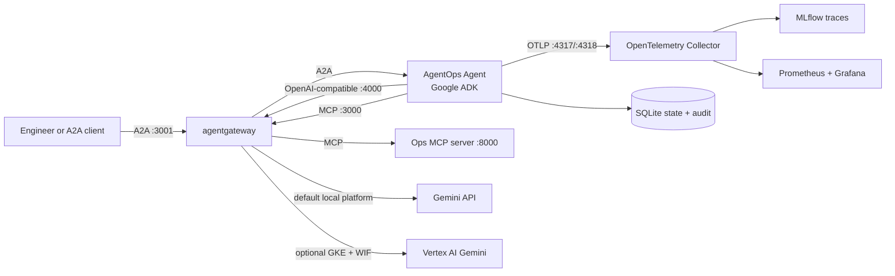

# AgentOps Open Course

[](https://github.com/MLOps-Courses/agentops-open-course/actions/workflows/ci.yml) [](https://github.com/MLOps-Courses/agentops-open-course/actions/workflows/docs.yml) [](https://github.com/MLOps-Courses/agentops-open-course/actions/workflows/scan.yml) [](https://github.com/MLOps-Courses/agentops-open-course/stargazers) [](./docs/LICENSE.txt) [](./LICENSE)

Build an agent in Python, then learn how a platform team operates it. The course uses **Google ADK, Gemini, MLflow, agentgateway, kagent, and OpenTelemetry** with executable exercises and a tested reference application.

**[Read the course](https://agentops-open-course.fmind.dev/)** | **[Start on your laptop](#local-quickstart)** | **[Developer handoff](./docs/4.%20Quality/4.8.%20Developer%20Handoff.md)** | **[Contribute](./CONTRIBUTING.md)**

## How is the course structured?

| Part                                         | Audience and prerequisites                                            | Outcome                                                                                    |
| -------------------------------------------- | --------------------------------------------------------------------- | ------------------------------------------------------------------------------------------ |
| **I — Agent development** (Chapters 1–4)     | Python developers familiar with venv, pip, imports, and debugging     | Build tools, state, approvals, a bounded workflow, and evaluations on a laptop             |
| **II — Platform engineering** (Chapters 5–7) | Container and Kubernetes knowledge assumed; explicitly more demanding | Operate the same application with agentgateway, kagent, and an observable Kubernetes stack |
| Capstone and community (Chapter 8)           | Your completed developer or platform work                             | Adapt the domain and provide reproducible evidence                                         |

Prepare with the [Python tutorial](https://docs.python.org/3/tutorial/) or [Kubernetes Basics](https://kubernetes.io/docs/tutorials/kubernetes-basics/) if needed. This course teaches agents and AgentOps rather than those prerequisites.

## What makes this course practical?

- **Build progressively:** six cumulative Python exercises preserve your work and provide offline checks and separate solutions.
- **Accessible laptop start:** Gemini is the default, so a GPU or model download is not required. Ollama/Qwen3 is an optional alternative.
- **One reference and a clear handoff:** the platform part operates the tested Python application without rewriting its domain behavior.
- **Distinct responsibilities:** ADK owns application orchestration, MLflow owns evaluation evidence, agentgateway governs connections, and kagent integrates agents with Kubernetes.
- **Real boundaries:** the reference implements approval, transactional action audit, persistent sessions, privacy policy, and crash recovery.

Course text is CC BY 4.0 and code is MIT. The agent and platform software are open source. **Gemini is a proprietary hosted service requiring an account and API key**; free quotas depend on current provider terms. Offline checks require no model access. The optional local path uses open-weight Qwen3 through Ollama.

## What will you learn from?

The completed **AgentOps Agent** is an on-call assistant for a fictional service. Ask it to investigate `INC-002` and initiate a guarded restart if the evidence supports one. It gathers the evidence, calls the guarded tool, and then ADK pauses before the function can change anything:

```text
> Investigate INC-002. If the evidence supports it, initiate a guarded inventory restart.
  → get_incident(incident_id="INC-002")   INC-002 · inventory · SEV1 · open
  → get_service_status(name="inventory")   inventory: down
  → search_service_logs(service="inventory")   panic · restarts · readiness refused · stock lookup 503
  → get_runbook(slug="service-down")

  INC-002 is a SEV1: inventory is down, its container keeps restarting, and stock lookups fail.
  After diagnosis, the runbook supports a restart to clear this crash loop.
  → restart_service(name="inventory")
      ADK requests confirmation; the function has not run.
  [awaiting human approval + rationale · no state change]
```

Every claim traces to a tool result. The guarded call creates ADK's confirmation request; only an approved call with a rationale executes `restart_service` and appends an audit record. The agent reads a committed SQLite seed, service logs, Markdown runbooks, and least-privilege Agent Skills; runtime state is copied into `.state/`, so exercises never mutate the course dataset. `AGENT_MCP_URL` reroutes only the conversational entrypoint's six reads; workflows and coordinator specialists keep local tools, and guarded writes always remain in-process. New to the acronyms below (MCP, A2A, OTLP)? The [glossary](https://agentops-open-course.fmind.dev/0.%20Overview/0.7.%20Glossary.html) defines every term.


```mermaid
flowchart LR
    User[Engineer or A2A client] -->|A2A :3001| Gateway[agentgateway]
    Agent[AgentOps Agent<br/>Google ADK] -->|OpenAI-compatible :4000| Gateway
    Agent -->|MCP :3000| Gateway
    Gateway -->|MCP| MCP[Ops MCP server :8000]
    Gateway -->|default local platform| Gemini[Gemini API]
    Gateway -->|optional GKE + WIF| Vertex[Vertex AI Gemini]
    Gateway -->|A2A| Agent
    Agent -->|OTLP :4317/:4318| OTel[OpenTelemetry Collector]
    OTel --> MLflow[MLflow traces]
    OTel --> Prometheus[Prometheus + Grafana]
    Agent --> State[(SQLite state + audit)]
```

## Local quickstart

You need git, a Linux/macOS/WSL2 terminal, working Python knowledge, and an activated [mise installation](https://mise.jdx.dev/getting-started.html).

```bash
git clone https://github.com/MLOps-Courses/agentops-open-course.git
cd agentops-open-course
mise run install:learner
mise run lab -- start 1
mise run lab -- check 1
```

The small installation adds uv and the locked runtime. It excludes contributor, evaluation, Kubernetes, and cloud tooling. Open `learning/step-1/learner_agent/agent.py`, then follow [2.1. First Agent](./docs/2.%20Agents/2.1.%20First%20Agent.md) and [2.6. Workshop](./docs/2.%20Agents/2.6.%20Workshop.md).

For an interactive run, create a [Gemini API key](https://aistudio.google.com/apikey), copy `.env.example` to `.env` only if it does not exist, and edit `GOOGLE_API_KEY` locally:

```bash
test -e .env || cp .env.example .env
chmod 600 .env
mise run config:check
mise run lab -- run 1
```

Open `http://127.0.0.1:8002`. Sending a message uses the configured model and may consume paid quota. The first turn is an unverified preview of model behavior; an offline exercise check is not a model-quality evaluation. Stop the UI with Ctrl-C.

For the completed reference, use `cd agents/python && mise run web`. Stop any other UI on port 8002 first. Ask `List the open incidents` and verify INC-002, INC-005, and INC-010 against the tool events. [1.4. Providers](./docs/1.%20Setup/1.4.%20Providers.md) documents the optional Ollama path.

## How do contributors validate the repository?

The contributor installation is intentionally larger than the learner runtime:

```bash
git clone https://github.com/MLOps-Courses/agentops-open-course.git
cd agentops-open-course
mise run install
mise run doctor
mise run check:core
mise run test
```

The core checks include docs, data, Python, shell, workflows, links, licenses, and workshop solutions. The full check also verifies the optional framework comparison. The Python suite enforces 95% combined line-and-branch coverage. Full maintainer validation adds infrastructure rendering and security scans; see [CONTRIBUTING.md](./CONTRIBUTING.md).

## Run and tear down the full local stack

The gateway, Kubernetes, and observability tiers stay out of first-run setup. `mise run install:platform` adds that toolchain; the optional GKE path adds `mise run install:gcp`.

Their exact start order, verification, and every teardown belong to the chapters that own them: [5. Gateway](./docs/5.%20Gateway/index.md) for the host agentgateway process order and its smoke check, [6. Platform](./docs/6.%20Platform/index.md) for Gemini credentials, the k3d deployment, backup, and the guarded cluster and cloud teardowns.

Follow those pages instead of a second infrastructure runbook here. Teardown deletes PersistentVolumeClaims and their data, and a duplicated copy of a destructive command is the copy that goes stale.

## Which model path should you choose?

| Path                       | Model                | Use                                                                     |
| -------------------------- | -------------------- | ----------------------------------------------------------------------- |
| Main learner path          | Gemini API           | Laptop development, then Gemini behind agentgateway on local Kubernetes |
| Optional local alternative | Qwen3 through Ollama | Open-weight inference on suitable hardware                              |
| Offline engineering        | None                 | Tools, policy, state, protocol checks, and grader calibration           |
| Optional cloud extension   | Gemini on Vertex AI  | GKE, Workload Identity, and cloud operations                            |

Gemini free-tier access is conditional. Check [pricing](https://ai.google.dev/gemini-api/docs/pricing) and [rate limits](https://ai.google.dev/gemini-api/docs/rate-limits). The optional GKE lab bills real money and is interruptible and non-HA; [7.3. Costs](./docs/7.%20Observability/7.3.%20Costs.md) owns the dated infrastructure estimate.

## Course map

| Chapter                                                   | Outcome                                                                            |
| --------------------------------------------------------- | ---------------------------------------------------------------------------------- |
| [0. Overview](./docs/0.%20Overview/index.md)              | Choose the right agent architecture, stack, and learning path.                     |
| [1. Setup](./docs/1.%20Setup/index.md)                    | Install the staged prerequisites for the checkpoint you are running.               |
| [2. Agents](./docs/2.%20Agents/index.md)                  | Run and understand the ADK reference agent with the configured model.              |
| [3. Capabilities](./docs/3.%20Capabilities/index.md)      | Inspect typed tools, skills, MCP, memory, workflows, and A2A.                      |
| [4. Quality](./docs/4.%20Quality/index.md)                | Enforce typing, tests, evaluations, guardrails, and adversarial regressions.       |
| [5. Gateway](./docs/5.%20Gateway/index.md)                | Move the stable model contract behind agentgateway and govern MCP and A2A traffic. |
| [6. Platform](./docs/6.%20Platform/index.md)              | Deliver the same image to local k3d and an optional GKE lab with kagent.           |
| [7. Observability](./docs/7.%20Observability/index.md)    | Trace, measure, evaluate, and audit the running system with OSS backends.          |
| [8. Community](./docs/8.%20Community/index.md)            | Maintain, release, and document an open-source agent project.                      |
| [8.7. Capstone](./docs/8.%20Community/8.7.%20Capstone.md) | Transform the completed reference into your own evidence-backed agent platform.    |

## Repository layout

```text
agents/python/  Reference ADK agent, tests, evaluations, and A2A server
agents/data/    Immutable SQLite, runbook, skill, and log seed data
clients/web/    Minimal offline A2A web client for the AgentOps Agent
load/           k6 load tests and latency budgets for the platform
docs/           FAQ-based course content built with Zensical
infra/          agentgateway, kagent, k3d/GKE, MLflow, and OTel resources
skills/         Installable Agent Skills packaging the course's patterns
```

## Reuse the patterns in your own agents

The top-level [`skills/`](./skills/) directory packages this course's operational patterns — telemetry, guardrails, resilience, token budgets, least privilege, evaluation, incident response — in the portable [Agent Skills format](https://agentskills.io/specification) for installation with the [`skills` CLI](https://github.com/vercel-labs/skills):

```bash
npx skills add MLOps-Courses/agentops-open-course --all
```

Each skill is tool-agnostic guidance that points back to the exact reference file it distils. See [`skills/README.md`](./skills/README.md).

## Everyday commands

```bash
mise run install    # core pinned tools, docs/agent environments, and hooks
mise run serve      # documentation at http://127.0.0.1:8003
mise run doctor     # base docs/Python entry prerequisites
mise run format:core # dprint + Ruff + shfmt
mise run check:core # static gate without Docker or infrastructure execution
mise run test       # deterministic offline tests with branch coverage
mise run course:evidence # clean-revision completion manifest from both gates

mise run install:maintainer # complete platform/security toolchain and environments
mise run format             # core plus OpenTofu
mise run check              # core plus both infrastructure overlays
mise run scan               # gitleaks history + Trivy scans
```

To reset only the agent's local writable state, run `cd agents/python && mise run data:reset`; it never touches the seed. For anything that will not start, the [troubleshooting guide](https://agentops-open-course.fmind.dev/0.%20Overview/0.6.%20Troubleshooting.html) is the owning page.

## Contributing and reuse

Course prose is [CC BY 4.0](./docs/LICENSE.txt); software and repository automation are [MIT](./LICENSE). See [SUPPORT.md](./SUPPORT.md), [CONTRIBUTING.md](./CONTRIBUTING.md), [GOVERNANCE.md](./GOVERNANCE.md), [ACCESSIBILITY.md](./ACCESSIBILITY.md), [SECURITY.md](./SECURITY.md), and [CODE_OF_CONDUCT.md](./CODE_OF_CONDUCT.md) before opening a change. Release-facing changes are tracked in [CHANGELOG.md](./CHANGELOG.md), and academic/technical citations are available in [CITATION.cff](./CITATION.cff).

The rendered course is published at [agentops-open-course.fmind.dev](https://agentops-open-course.fmind.dev/). The source remains the verification surface: every critical excerpt, command, policy, and deployment contract is checked from this repository.
