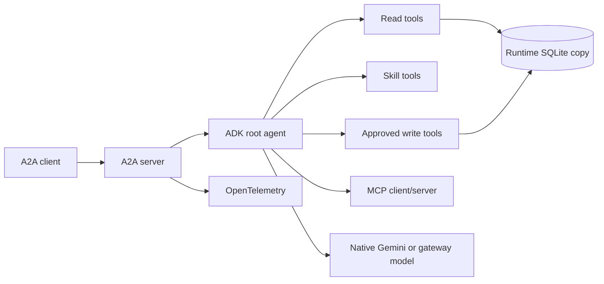

# Ops Copilot

The course reference system combines a self-contained Google ADK application with an immutable local dataset:

- [`python/`](./python) contains the typed agent, MCP and A2A servers, evaluations, and tests.
- [`data/`](./data) contains the SQLite seed, service logs, runbooks, and least-privilege Agent Skills.

The deterministic engineering path runs offline after dependencies are installed. Interactive model-backed runs use either local Qwen3 through Ollama and agentgateway or optional native Gemini credentials.

## Architecture



## Capability map

| Capability                                       | Source                               | Course               |
| ------------------------------------------------ | ------------------------------------ | -------------------- |
| Agent, instructions, callbacks                   | `python/src/agent/agent.py`          | Chapter 2            |
| Typed configuration and model selection          | `config.py`, `model.py`, `models.py` | Chapters 2 and 5     |
| Immutable seed and runtime state                 | `data.py`, `data/`                   | Chapter 3            |
| Incident, service, and log tools                 | `tools.py`                           | Chapter 3.1          |
| Least-privilege Agent Skills                     | `skills.py`                          | Chapter 3.2          |
| MCP server and client                            | `mcp_server.py`, `mcp_client.py`     | Chapter 3.3          |
| Runbook retrieval                                | `memory.py`                          | Chapter 3.4          |
| Deterministic workflow                           | `workflow.py`                        | Chapter 3.5          |
| Delegation and A2A                               | `delegation.py`, `server.py`         | Chapters 3.6 and 6   |
| Approval, actions, append-only audit             | `guardrails.py`, `actions.py`        | Chapters 4.5 and 7.6 |
| Request, response, and tool-output PII callbacks | `pii.py`                             | Chapters 4.5 and 4.6 |
| ADK and MLflow evaluations                       | `python/evals/`                      | Chapters 4.4 and 7   |
| OTLP telemetry                                   | `telemetry.py`                       | Chapter 7.1          |

## Offline checkpoint

From the repository root:

```bash
mise install
mise run install
mise run check
mise run test
```

Tests enforce at least 95% branch coverage and do not call a model or cloud service.

## Run a model-backed agent

Native Gemini reads the repository-root `.env`:

```bash
cp .env.example .env
# Set GOOGLE_API_KEY in .env, then:
cd agents/python
mise run web
```

The account-free path uses Ollama/Qwen3 behind agentgateway and is documented in [Chapter 5](../docs/5.%20Gateway/). It keeps provider switching, model policy, and telemetry outside the application.

## Licenses

Agent code is [MIT](./LICENSE). Model weights, SDKs, and services retain their own licenses and terms; see the course's provider chapter before redistributing an image or model.
