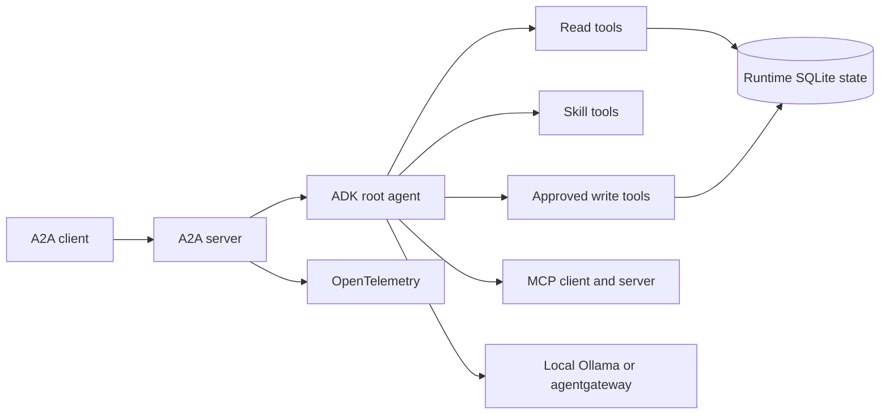

# AgentOps Agent

The reference system combines one Google ADK Go application with immutable local data:

- [`go/`](./go) contains the agent, MCP and A2A servers, policy, state machinery, and offline tests.
- [`data/`](./data) contains the SQLite seed, service logs, runbooks, and least-privilege Agent Skills.

The deterministic engineering path runs offline after dependencies are installed. The first interactive run uses the Apache-2.0 open-weight Qwen3 model through local Ollama. Chapter 5 changes the same OpenAI-compatible endpoint to agentgateway; native Gemini remains optional.

## Architecture


```mermaid
flowchart LR
    Client[A2A client] --> Server[A2A server]
    Server --> Agent[ADK root agent]
    Agent --> Read[Read tools]
    Agent --> Skills[Skill tools]
    Agent --> HITL[Approved write tools]
    Read --> State[(Runtime SQLite state)]
    HITL --> State
    Agent --> MCP[MCP client and server]
    Agent --> Model[Local Ollama or agentgateway]
    Server --> OTel[OpenTelemetry]
```

## Capability map

| Capability                                       | Source                       | Course               |
| ------------------------------------------------ | ---------------------------- | -------------------- |
| Agent composition and instructions               | `compose/`                   | Chapter 2            |
| Typed configuration and model selection          | `config/`, `model/`          | Chapters 2 and 5     |
| Immutable seed and runtime state                 | `data/`, `state/`            | Chapter 3            |
| Incident, service, and log tools                 | `tools/`                     | Chapter 3.1          |
| Least-privilege Agent Skills                     | `compose/skills.go`          | Chapter 3.2          |
| MCP server and client                            | `cmd/agent/`, `compose/`     | Chapter 3.3          |
| Runbook retrieval and durable memory             | `memory/`                    | Chapter 3.4          |
| Deterministic workflow and delegation            | `compose/`                   | Chapters 3.5 and 3.7 |
| Persistent deployed A2A surface                  | `a2aserver/`                 | Chapters 3.6 and 6   |
| Approval, actions, and append-only audit         | `policy/`, `tools/`, `data/` | Chapters 4.5 and 7.6 |
| Request, response, and tool-output PII redaction | `policy/`, `piiwebhook/`     | Chapters 4.5 and 4.6 |
| OTLP telemetry                                   | `telemetry/`                 | Chapter 7.1          |

Black-box model evaluations live in the separate [`../evals`](../evals) Go module. It imports no agent package and exercises only REST or A2A wire contracts.

## Offline checkpoint

From the repository root:

```bash
mise run install
mise run check:core
mise run test
```

The Go suites use race detection and enforce measured coverage: `mise run test` fails any package under 80%, with `cmd/` excluded by kind (see `scripts/check-coverage.sh`). Offline gates call no model or cloud service.

## Run the account-free model path

Install Ollama, pull the model, and validate the staged prerequisite:

```bash
ollama pull qwen3:4b-instruct
mise run doctor:model
cd agents/go
mise run run
```

The defaults are `AGENT_MODEL_PROVIDER=openai-compatible`, `AGENT_MODEL=qwen3:4b-instruct`, `OPENAI_BASE_URL=http://127.0.0.1:11434/v1`, and the non-secret `local-ollama` marker. No provider account or `.env` file is required. [Chapter 5](../content/5.%20Gateway/) changes the base URL to agentgateway so central policy and telemetry apply to every model client.

For optional native Gemini, set `AGENT_MODEL_PROVIDER=gemini`, an explicit model, and either a Gemini API key or Application Default Credentials in the repository-root `.env`.

## Licenses

Agent code is [MIT](./LICENSE). Model weights, SDKs, and services retain their own licenses and terms.
