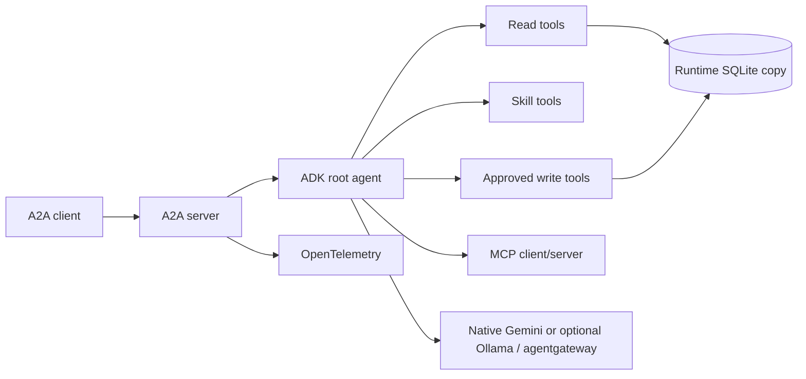

# AgentOps Agent

The course reference system combines a self-contained Google ADK application with an immutable local dataset:

- [`python/`](./python) contains the typed agent, MCP and A2A servers, evaluations, and tests.
- [`data/`](./data) contains the SQLite seed, service logs, runbooks, and least-privilege Agent Skills.

The deterministic engineering path runs offline after dependencies are installed. The default interactive path uses native Gemini with an API key and available quota. The optional local alternative uses Apache-2.0 open-weight Qwen3 through Ollama. Chapter 5 routes model traffic through agentgateway; changing transport requires fresh behavior evidence.

## Architecture


```mermaid
flowchart LR
    Client[A2A client] --> Server[A2A server]
    Server --> Agent[ADK root agent]
    Agent --> Read[Read tools]
    Agent --> Skills[Skill tools]
    Agent --> HITL[Approved write tools]
    Read --> State[(Runtime SQLite copy)]
    HITL --> State
    Agent --> MCP[MCP client/server]
    Agent --> Model[Native Gemini or optional Ollama / agentgateway]
    Server --> OTel[OpenTelemetry]
```

**Diagram in words:** The A2A server runs the ADK agent and exports telemetry. The agent calls its configured model, uses local or MCP reads and reviewed skills, and requires approval before writes to runtime SQLite state.

## Capability map

| Capability                                       | Source                               | Course               |
| ------------------------------------------------ | ------------------------------------ | -------------------- |
| Agent composition and instructions               | `python/src/agent/composition.py`    | Chapter 2            |
| Shared application policy                        | `python/src/agent/governance.py`     | Chapters 2 and 4     |
| Typed configuration and model selection          | `config.py`, `model.py`, `models.py` | Chapters 2 and 5     |
| Immutable seed and runtime state                 | `data.py`, `data/`                   | Chapter 3            |
| Incident, service, and log tools                 | `tools.py`                           | Chapter 3.1          |
| Least-privilege Agent Skills                     | `skills.py`                          | Chapter 3.2          |
| MCP server and client                            | `mcp_server.py`, `mcp_client.py`     | Chapter 3.3          |
| Runbook retrieval                                | `memory.py`                          | Chapter 3.4          |
| Deterministic workflow                           | `workflow.py`                        | Chapter 3.5          |
| Delegation and A2A                               | `delegation.py`, `server.py`         | Chapters 3.6 and 6   |
| Approval, actions, append-only audit             | `guardrails.py`, `actions.py`        | Chapters 4.5 and 7.6 |
| Request, response, and tool-output PII callbacks | `pii.py`                             | Chapters 4.5 and 4.6 |
| ADK and MLflow evaluations                       | `python/evals/`                      | Chapters 4.4 and 7   |
| OTLP telemetry                                   | `telemetry.py`                       | Chapter 7.1          |

## Offline checkpoint

From the repository root:

```bash
mise run install
mise run check:core
mise run test
```

Tests enforce at least 95% combined line-and-branch coverage and do not call a model or cloud service.

## Run the default model path

Follow [1.4. Providers](../docs/1.%20Setup/1.4.%20Providers.md) to create the root `.env` from `.env.example` and configure `GOOGLE_API_KEY`. Keep the default `AGENT_MODEL_PROVIDER=gemini` and `AGENT_MODEL=gemini-3.5-flash`, then validate the prerequisite:

```bash
mise run doctor:model
```

Then run from the Python agent directory:

```bash
cd agents/python
mise run run
```

Gemini is a proprietary hosted service; prompts consume provider quota and may be billed. [Chapter 5](../docs/5.%20Gateway/) changes the application to an OpenAI-compatible gateway endpoint and moves the upstream credential into the gateway.

For the account-free local alternative, follow the same model preparation page: install and start Ollama, pull `qwen3:4b-instruct`, and explicitly select `AGENT_MODEL_PROVIDER=openai-compatible`, `AGENT_MODEL=qwen3:4b-instruct`, `OPENAI_BASE_URL=http://127.0.0.1:11434/v1`, and the non-secret `OPENAI_API_KEY=local-ollama`. This path needs enough RAM for local inference; the offline checkpoint needs neither provider.

## Licenses

Agent code is [MIT](./LICENSE). Model weights, SDKs, and services retain their own licenses and terms; see the course's provider chapter before redistributing an image or model.
