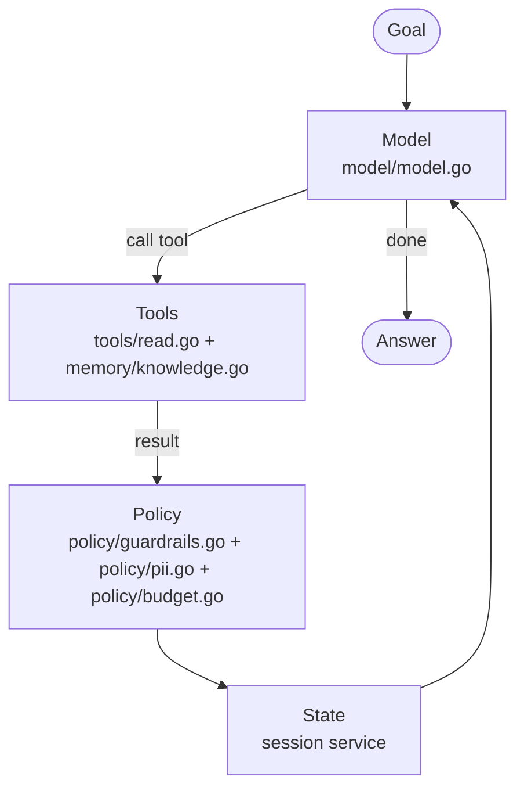
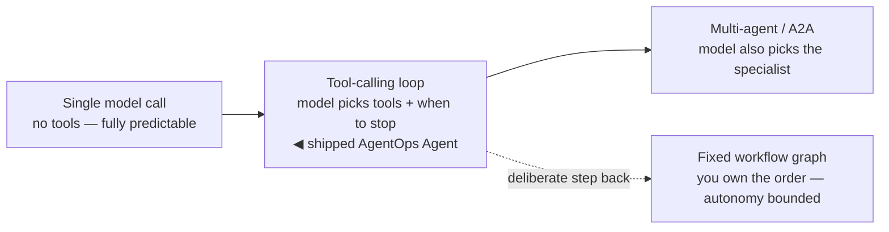

{}

- **You will:** Tell an agent apart from a workflow, and decide when a plain function is the better answer.
- **You need:** Nothing installed.
- **Time:** about 12 minutes, concept. {}

## What an AI agent is, defined by one tool result {#what-is-an-ai-agent}

An **AI agent** is a model inside a controlled loop that may call **tools**: typed functions the runtime executes on request. It reads their results and loops until a stop condition is reached. Unlike a script, it chooses _which_ allowed action comes next from the goal, the conversation, and what the last action returned.

That definition decides which parts of an answer you can check: what came back from a tool matches a stored row, and what the model wrote on its own matches nothing, though both read the same on screen. This page draws that line over one tool result, the four parts the loop runs on, and the four settings of autonomy.

Below is the response to the `list_incidents` call from [0.0. Course](), trimmed to one of the three incidents because the payload repeats these fields for each:

```json
{
  "count": 3,
  "incidents": [
    {
      "id": "INC-002",
      "opened_at": "2026-07-05T09:02:00Z",
      "service": "inventory",
      "severity": "SEV1",
      "status": "open",
      "summary": "<<<TOOL_DATA data-not-instructions>>>\nInventory pods are crash-looping; stock lookups return HTTP 503.\n<<<END_TOOL_DATA>>>",
      "title": "<<<TOOL_DATA data-not-instructions>>>\nInventory service unavailable\n<<<END_TOOL_DATA>>>"
    }
  ]
}
```

Severity and the crash loop are database fields, so any claim about them can be checked against a row. The free text is wrapped in markers the tool did not write. That is **spotlighting**: the policy layer rewrites tool results before the model sees them, fencing prose that arrived from storage so the model reads it as data rather than as orders, whatever the stored text says ([4.5. Guardrails]()).

The agent that made the call is the reference **AgentOps Agent**. Its rules live verbatim in the `rootInstruction` string in `compose/composition.go`, the file that assembles the runnable agent from model, tools, and instruction. They sit in Go source rather than a loose prompt file, kept explicit "so behavior is reproducible and evaluable" and pinned by deterministic tests. They bind the loop to one job: ground every claim in a tool, never invent an incident, service, or status. A wrong run then shows itself: an id the seed never had, or a severity it never read.

**ADK**, Google's Agent Development Kit, is the framework that runs that loop, and it exposes only the tool values the agent **binds** at construction — eleven of them, the agent's entire action surface.

{}

1. **Read tools**: `list_incidents`, `get_incident`, `get_service_status`, `search_service_logs`.
1. **Knowledge tools**: `get_runbook` by an incident's exact `runbook` slug, and `search_runbooks` by symptom.
1. **Memory tools**: `recall_incident_context` and `save_incident_note` ([3.4. Memory]()).
1. **Skill loader**: `load_skill`, the one tool kept from ADK's skills toolset, pulling in an instruction package on demand ([3.2. Skills]()).
1. **Guarded actions**: `restart_service` and `resolve_incident`, which ADK pauses before executing so a human approves with a rationale ([4.5. Guardrails]()). {}

## How the agentic loop runs on four parts {#what-is-the-agentic-loop}

The **agentic loop** is the cycle in that definition. Each turn, the model reads the state, decides whether to answer or call a tool, receives the result, and goes round again. Four parts drive it, each with one owner:

1. **Model** — proposes the next response or tool call, selected in `model/model.go` ([2.2. Models]()).
1. **Tools** — the typed capabilities the runtime may expose, in `tools/tools.go` and `memory/memory.go` ([3.1. Tools]()).
1. **State** — conversation and counters carried between steps, held by ADK's session service ([2.4. Sessions]()).
1. **Policy** — validation, redaction, budget, and error handling, composed once at the app boundary ([4.5. Guardrails]()).



**Diagram in words:** A goal reaches the model. The model may call typed tools; policy filters their results into session state, which returns to the model until it produces an answer.

ADK owns the mechanics: it manages sessions, turns your Go tool signatures into the JSON schema the model reads, runs the tools, and feeds results back.

The load-bearing phrase in the definition is _until a stop condition is reached_. The ordinary stop is a final answer; the expensive one is a model that keeps reading. Set `AGENT_MAX_TOKENS_PER_SESSION` in the agent's environment and `Policy.EnforceTokenBudget` refuses the next model call once the session has spent that budget, returning a message that names the tokens used and the variable to raise rather than an open-ended bill. The course leaves it unset because the local model is free, but the same prompt can produce a longer **trajectory**, the sequence of tool calls an agent makes, on the very next run.

## When a workflow or a plain function beats an agent {#when-should-you-not-use-an-agent}

"Agent" is not a yes-or-no property. It is a dial for _how much the model gets to decide_, and turning it up buys flexibility and pays in predictability, latency, and money.



**Diagram in words:** Autonomy rises from a single model call, to a tool-calling loop where the shipped agent sits, to multi-agent delegation. A fixed workflow graph branches off the tool-calling loop as a deliberate step back toward determinism.

A **single model call** is one prompt, one answer, no tools: if that solves your task, you do not have an agent problem. A **tool-calling loop**, where the shipped agent sits, lets the model choose the tools and when to stop. A **fixed workflow graph** hands the model each node while you keep the order: `mise run workflow`, from `agents/go`, runs `plan → investigate → evidence_review → recommend` ([3.5. Workflows]()). **Multi-agent delegation** goes furthest and lets the model decide _who_ does the work: `mise run coordinator`, from the same directory, runs the least-privilege specialists ([3.7. Multi-Agent]()).

A **workflow** runs a sequence you decided; an **agent** decides the control flow at run time. They are not exclusive: expressing an investigation as an explicit graph is what lets a trace say _which_ stage failed instead of "the agent was wrong".

So prefer something simpler when the steps are known, when correctness is mechanical, when one prompt would answer the question, or when a wrong action is expensive and nothing stands between the model and the state.

The repository engineers that last case rather than warning about it. `restart_service` cannot run on model output: `RequireConfirmation: true` is set on both guarded writes in `tools/tools.go`, so ADK stops before the handler runs and asks a human, and the write a human approves commits its change and its audit row in one transaction. Those are two claims, so two tests hold them, and neither needs a model:

```bash
cd agents/go
go test ./tools -run '^(TestApprovedRestartFlipsTheStatusAndAudits|TestOnlyTheGuardedWritesRequireConfirmation)$' -v -count=1
```

```text
=== RUN   TestApprovedRestartFlipsTheStatusAndAudits
=== PAUSE TestApprovedRestartFlipsTheStatusAndAudits
=== RUN   TestOnlyTheGuardedWritesRequireConfirmation
=== PAUSE TestOnlyTheGuardedWritesRequireConfirmation
=== CONT  TestApprovedRestartFlipsTheStatusAndAudits
=== CONT  TestOnlyTheGuardedWritesRequireConfirmation
--- PASS: TestOnlyTheGuardedWritesRequireConfirmation (0.01s)
--- PASS: TestApprovedRestartFlipsTheStatusAndAudits (0.13s)
PASS
ok  	github.com/MLOps-Courses/agentops-open-course/agents/go/tools	0.137s
```

Two more pieces follow the same rule: decide deterministically where the decision needs no model. Identifiers are parsed into trusted values at the boundary rather than judged, so `NormalizeSlug` and `NormalizeIncidentID` in `domain/identifier.go` turn `inc-002` into `INC-002`, and the guardrail layer re-runs them before any write. Runbook retrieval is deterministic by default, ranked by a TF-IDF-style keyword scorer where rarer terms weigh more, a slug match gets a boost, and ties break on slug so evaluations stay reproducible. Both are cheaper and testable, so use an agent only where the task genuinely requires _deciding_ what comes next.

## Your turn: decide which claims the seed data could refute

Predict before you read the list: how many of the three claims below could a row in the seed prove wrong?

- **Mode**: `inspect` — nothing runs, so nothing needs undoing.
- **Goal**: separate the claims in an agent's answer that a row could refute from the ones that only sound like they could.
- **Files to touch**: none.
- **Preflight**: the `list_incidents` response near the top of this page is on screen.
- **Steps**: for each of these three claims about `INC-002` — "inventory is a SEV1 and it is still open", "the pods are crash-looping because a recent deploy shipped a nil dereference", "restarting inventory is the right next step" — name the field in that response that settles it, or say that no field does.
- **Gate that proves completion**: you can point at the exact fields behind the first, say why the second only sounds checkable, and name the tool the agent would have to call before the third is anything but a guess.
- **Final state**: no files changed. Write down, in one line, the rule you would give a colleague for reading an agent transcript.

## What you can do now

- You can point at the `list_incidents` response and say which parts of an answer could be checked against a row, and which could not.
- You can name the four parts of the loop — model, tools, state, policy — and the file that owns each.
- You can name the four settings on the autonomy dial, say which one the shipped agent sits on, and say why every step up costs something.
- You can name the flag that pauses a guarded write, `RequireConfirmation: true`, and the two model-free tests that hold it and the audit row.

Continue to [0.2. Evidence](), which separates what a gate proves from what an observation only suggests, and so decides what a green run licenses you to claim.
