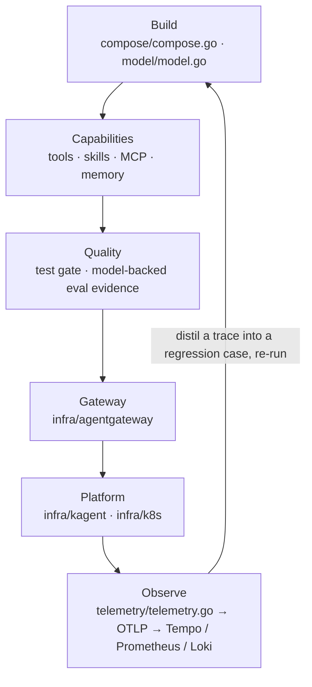

{}

- **You will:** Follow the six lifecycle phases the course chapters are built from, and see the artifact behind each.
- **You need:** `mise run install` done for the one `mise run eval:validate` command below. No model, container, or account. Assumed, not required: the agent loop from [0.1. Agents]().
- **Time:** about 8 minutes, concept. {}

## What AgentOps is, and what it adds to MLOps {#what-is-agentops}

**AgentOps** is the practice of building, evaluating, securing, deploying, and operating agents as reliable production software — the agent-shaped sibling of MLOps and LLMOps. MLOps owns a model you train; LLMOps adds what you get when you consume one instead, from prompts to token cost; AgentOps adds what you get when the model can call your functions.

The outer layer is what the autonomy costs you. An agent's route through its tools can vary between runs, change state, and spend tokens at every step, and none of that shows up in the evidence an ordinary service ships with: a green build and a healthy endpoint say the process answers, not which tools it called. So when a provider ships a minor version and the same prompt takes a different route, a normal release process cannot say whether the new route is better, worse, or skipping the step that made the old one safe.

This page is the map: the six phases, the directory behind each, the four failure modes an agent adds with the stated limit of each defense, and the three habits that turn an observation back into a test. If you are still deciding whether you want that cost, the decision is one page back in [0.1. Agents]().

## How the six lifecycle phases map to chapters and directories



**Diagram in words:** The six phases run in a line — Build, Capabilities, Quality, Gateway, Platform, Observe — each naming the artifact that implements it. One edge closes the loop: what Observe records is distilled into a regression case and re-run from Build, which makes this a cycle rather than a checklist.

The table of contents _is_ that loop: [2. Agents](), [3. Capabilities](), [4. Quality](), [5. Gateway](), [6. Platform](), and [7. Observability](), with [1. Setup]() before them and [8. Community]() after.

No phase is a bullet you have to imagine; each is a directory you can open, and paths without an `infra/` prefix live under `agents/go/`.

- **Build** is `compose/` and `model/`: assembling the agent object and the model client behind it.
- **Capabilities** is `tools/`, `compose/skills.go`, `mcpserver/`, and `memory/`: everything the agent reaches beyond its prompt.
- **Quality** is the `*_test.go` suites, the root `evals/` module, and `policy/`: what proves behavior and what constrains it.
- **Gateway** is `infra/agentgateway/`: the data plane the agent's MCP, agent-to-agent, and model calls route through.
- **Platform** is `infra/kagent/` with `infra/k8s/`: the same stack on Kubernetes instead of your shell.
- **Observe** is `infra/observability/`: where traces, metrics, and logs land.

"Harden it" and "watch it" are two files here, `policy/guardrails.go` and `telemetry/telemetry.go`. Only the closing edge has no directory: it is a habit rather than an artifact, spelled out in the last section.

## What an agent adds to the operations problem

Compared with a stateless model endpoint, an agent introduces four failure modes. Each already ships a defense you can read rather than a warning you have to heed. Two words the table leans on: a **trajectory** is which tools ran, with which arguments, in which order; **spotlighting** wraps untrusted tool text in markers that tell the model to read it as data rather than instructions.

| The new failure mode                             | What the reference agent does about it                                                                                                                                            |
| ------------------------------------------------ | --------------------------------------------------------------------------------------------------------------------------------------------------------------------------------- |
| The same input can produce different tool calls  | Evaluations score the _trajectory_ over fixed seed data rather than exact strings ([4.4. Evaluations]())                          |
| A tool call can change state                     | Mutating tools pause for a human yes, then commit the change and an append-only audit row in one transaction ([4.5. Guardrails]()) |
| Every loop step is another model call            | Per-session token accounting, with a configured budget blocking the next call once it is spent ([7.3. Costs]())                   |
| Untrusted tool output can hijack the instruction | Lookalike characters normalized, injection markers neutralized, free text spotlighted as data ([4.6. Security]())                    |

Each chapter also states its own edge, because a defense described without its limit is marketing. The audit trail is append-only: a committed row cannot be edited or deleted, so the record of what the agent changed outlives the change. SQLite triggers enforce that, and the trail is still not tamper-proof against an administrator. Spotlighting is defense in depth rather than a guarantee. The token budget bounds one conversation rather than one client.

## How a bad trace becomes a regression case

The edge from Observe back to Build is easy to assert and easy to leave hollow. Three habits close it here, and none is an automated online scorer.

First, a bad trace becomes a regression case: a wrong trajectory or an unsafe proposal is distilled into one evaluation case that names the behavior, and its structure is checked without spending a token.

```bash
mise run eval:validate
```

```text
[eval:validate] $ cd evals && mise run eval:validate
[eval:validate] $ go run ./cmd/agentops-eval validate
{
  "evalsets": 3,
  "cases": 22,
  "calibration_cases": 12
}
```

Those counts name what the harness is made of: an **evalset** is a committed JSON file of cases, a **case** is one question with its expected tool calls and deterministic answer checks, and a **calibration case** is a labeled example that keeps a model-backed judge honest.

Second, every change re-runs the same three commands — `mise run format`, `mise run check`, `mise run test` — with the race detector on, and in the two Go modules the course teaches from, `agents/go` and `evals`, `test` also holds an 80% per-package line-coverage floor. Clearing that floor means the tests reach the code, which is a weaker claim than it sounds ([0.2. Evidence]()).

Third, claims that rot on a calendar rather than a commit, such as pinned versions and model names, are re-checked by a quarterly job in `.github/workflows/scan.yml` that compares those pins against upstream releases and appends its report to one open tracking issue.

## What you can do now

- You can name the six phases in order and the chapter that owns each.
- You can name one artifact behind any two phases, such as `policy/guardrails.go` for Quality.
- You can name a shipped defense, and its stated limit, for at least two of the four failure modes an agent adds.
- You can describe the Observe-to-Build edge concretely: one bad trace becomes one validated evaluation case.

Continue to [0.4. Ecosystem]() when you want to know which component owns which boundary.
