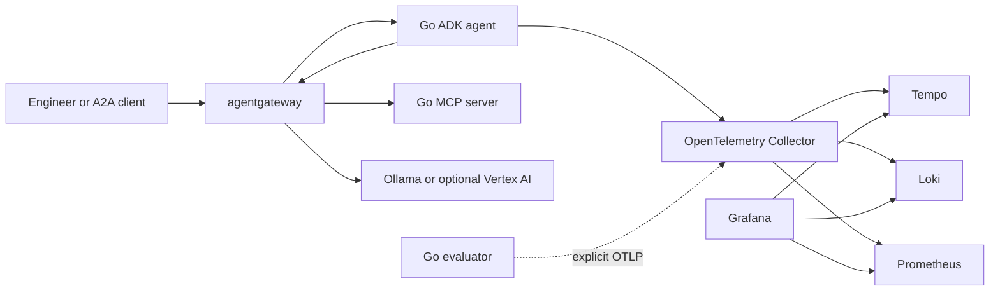

{}

- **You will:** Find out which component owns a boundary, and which port it answers on.
- **You need:** Nothing installed — this page runs no command. Assumed, not required: the lifecycle from [0.3. AgentOps]().
- **Time:** no reading time — this is a lookup page. Come back when you need an owner. {}

## Which component owns each boundary, and where it lives

A **boundary** is a place where responsibility changes hands: the agent loop, the traffic a client sends in, the store a trace lands in. Exactly one component owns each boundary here, and they compose through public protocols rather than shared internals, so one layer can change without rewriting the others.

The previous page's six phases say what work has to happen; this page says which component does it and where it is configured:

| Boundary                            | Component                   | Repository owner                          |
| ----------------------------------- | --------------------------- | ----------------------------------------- |
| Agent loop, tools, sessions, policy | Google ADK for Go           | `agents/go/`                              |
| MCP, A2A, and model traffic         | agentgateway                | `infra/agentgateway/`                     |
| Kubernetes agent resources          | kagent                      | `infra/kagent/` and `infra/helmfile.yaml` |
| Local open-weight model             | Ollama and Qwen3            | validated environment and model catalog   |
| Black-box evaluation                | Standalone Go harness       | `evals/`                                  |
| Telemetry transport                 | OpenTelemetry               | agent and collector configuration         |
| Trace storage                       | Tempo                       | `infra/observability/`                    |
| Log storage                         | Loki                        | `infra/observability/`                    |
| Metrics and alerts                  | Prometheus and Alertmanager | `infra/observability/`                    |
| Visualization                       | Grafana                     | dashboards and datasources                |
| Optional cloud substrate            | GKE, Vertex AI, GCS         | `infra/gcp/` and GKE overlay              |

Two open-source categories are deliberately absent, because the third column asks who owns them and the honest answer is nobody: a GitOps reconciler such as Argo CD or Flux, which [6.7. Promotion and Rollback]() explains this course stops one step short of, and a prompt and evaluation store such as Langfuse or Arize Phoenix, whose absence [7.1. Tracing]() explains as a content-privacy decision rather than an oversight.



**Diagram in words:** Clients and the Go agent use agentgateway for A2A, MCP, and model traffic. The agent and optional evaluator send distinct OpenTelemetry signals through one collector to the three storage backends, which Grafana queries.

## Which ports agentgateway listens on, and what it enforces

agentgateway is the only component that fronts traffic, on three listeners. They are **MCP**, the Model Context Protocol for discovering and invoking tool servers; **A2A**, the protocol agents exchange tasks over; and `llm` for model calls. Their ports are not a convention to remember: the gateway binds whatever its config file says, so the file is the authority and this page only copies it:

```bash
awk '/^  (mcp|a2a|llm):$/ {name=$1} /^    port:/ && name {print name, $2; name=""}' infra/agentgateway/host/config.yaml
```

```text
mcp: 3000
a2a: 3001
llm: 4000
```

Behind them it applies routing, authentication, rate limits, prompt guards, masking, and metrics, while raw upstreams stay bound to loopback or cluster networking. Traffic that has passed those policies is what this course calls **governed**. What it does **not** get is write authority: confirmed write tools stay inside the Go process, so a compromised proxy can misroute a request but never approve a restart.

ADK owns the agent and model interfaces, the tool loop, plugins, session services, confirmation, the development web surface, and A2A integration, with `agents/go/go.mod` as the dependency authority; the repository supplies the domain, tools, policy, state rules, composition, and tests. kagent owns the other direction, turning declared resources into Kubernetes workloads: a BYO `Agent` running the course image, a `ModelConfig` pointing at the in-cluster model listener, and a `RemoteMCPServer` exposing only governed read tools. Those are custom resource kinds kagent teaches the cluster, so an agent is declared and reconciled by a controller rather than deployed by hand. Every host quickstart publishes on loopback and no course profile creates a public endpoint, so nothing here is reachable from another machine until you change that.

Ports are pinned rather than picked at runtime, so a collision fails the same way every time.

{}

| Port              | Service                | Scope                             |
| ----------------- | ---------------------- | --------------------------------- |
| `:3000`           | agentgateway MCP       | Governed MCP front door           |
| `:3001`           | agentgateway A2A       | Governed A2A front door           |
| `:4000`           | agentgateway model     | Responses API front door          |
| `:15020`          | agentgateway metrics   | Prometheus scrape target          |
| `:15021`          | host gateway readiness | Wrapper readiness probe           |
| `:8000`           | raw MCP server         | Upstream, not a LAN service       |
| `:8080`           | raw A2A server         | Agent serving and kagent probe    |
| `:8083`           | kagent control plane   | Agent-as-MCP and session/task API |
| `:8001`           | web client             | Local A2A client                  |
| `:8002`           | ADK development web UI | Local inspection UI               |
| `:8003`           | Hugo preview           | Local documentation reload        |
| `:11434`          | Ollama                 | Local model endpoint              |
| `:3200`           | Tempo                  | Trace query API                   |
| `:4317` / `:4318` | OTLP                   | Collector gRPC and HTTP receivers |
| `:8889`           | collector metrics      | Span-derived RED metrics          |
| `:13133`          | collector health       | Pod-local readiness and liveness  |
| `:9090`           | Prometheus             | Metric store and rules            |
| `:9093`           | Alertmanager           | Host alert routing                |
| `:3002`           | Grafana                | Host dashboards and Explore       |
| `:3100`           | Loki                   | Log store                         |
| `:5050`           | local registry         | k3d image registry                |

{}

## How the agent and the evaluator share one telemetry stack

The evaluation harness in `evals/` never imports the agent. It calls ADK's REST surface or A2A, folds both transports into one typed turn, and scores trajectories, usage budgets, grounding, and report schemas from that, recording outcomes without prompts, answers, tool payloads, endpoints, or credentials.

**OTLP** is the OpenTelemetry wire protocol both of them export through. The agent exports its signals when its OTLP endpoint is configured; the evaluator exports run, case, and score signals only through its own explicit endpoint, so an evaluation cannot contaminate the traces you operate the agent with. Tempo, Loki, and Prometheus store what arrives, Grafana reads all three and changes nothing, and trace-to-log links work because the agent stamps trace and span ids onto its log records.

## Verify one component at a time before upgrading it {#what-should-you-verify-before-upgrading}

Treat each manifest as the authority and change one component at a time. A suite that turns red after two upgrades does not tell you which one broke. Then run the three commands that own that component. `mise run check` includes the infrastructure render, so it needs the platform tier from `mise run install:platform`; `mise run check:core` is the model-, container-, and cloud-free subset:

```bash
mise run format
mise run check
mise run test
```

For agent or model changes, add a model-backed evaluation against the exact candidate; for infrastructure, render and validate manifests before starting a cluster. Two implementations of one open standard are still two implementations, so a shared project name or a floating tag never settles compatibility — the contract tests do.

Stewardship and currency are two more lookups, and both move independently of the locks. agentgateway is a Linux Foundation project, donated by Solo.io on 25 August 2025 and under its Agentic AI Foundation since 4 June 2026; kagent and kgateway are separate CNCF Sandbox projects, accepted 22 May 2025 and 4 March 2025. Checked on 11 September 2026: ADK Go `v2.3.0` and the kagent chart `0.10.1` are current, while agentgateway `v1.4.1` trails upstream `v1.5.0` — `mise.toml` records why, because `v1.5.0` redefines what counts as an input token and every captured usage figure in Chapters 5 and 7 would have to be taken again.

## How to use this page later

- Come back with a boundary in mind — agent logic, traffic, reconciliation, evaluation, transport, or storage — and read one row.
- Come back with a port number and find its owner in the collapsible inventory.
- Come back before an upgrade, and run the three commands above against one component at a time.

Continue to [0.5. Provider Options]() when every boundary on this page has one named owner.
