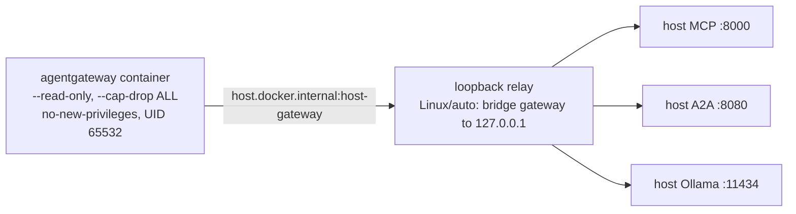

{}

- **You will:** Verify a container engine end to end, then run one throwaway container under the exact hardening the gateway wrapper uses.
- **You need:** A Docker-compatible engine installed and running, plus `mise run install` and `mise run install:platform`, because the checkpoint below checks `yq` from the platform tool tier. No cluster, model, account, or earlier page. On the local model path, skip straight to [1.4. Providers]() — [5.1. Gateway Setup]() brings you back here before it starts the gateway.
- **Time:** about 12 minutes, hands-on. {}

## Check the client, the engine, and Compose in four commands

The `docker` command is a **client**. What actually runs containers is a separate **engine** — a daemon on Linux, a virtual machine on macOS — reached over a socket. So a client on `PATH` proves nothing: it answers `--version` and `--help` with no engine behind it, and only a command that has to _run_ something exposes the gap.

A Docker CLI installed on macOS without its virtual machine is one such client, and everything downstream needs the engine it lacks: the hardened gateway container in Chapter 5, the agent image and local cluster in Chapter 6, the Compose observability stack in Chapter 7. Nothing complains at install time; unchecked, it surfaces chapters later as a hang inside something unrelated.

This page checks each layer separately, then runs one container under the restrictions the Chapter 5 gateway uses. Four commands, four layers — client and server, the engine's own view of itself, a container actually executed, and the Compose plugin:

```bash
docker version
docker info
docker run --rm hello-world
docker compose version
```

`docker version` separates the two, and both halves have to be there — the engine answers as the `Server` block:

```text
Client: Docker Engine - Community
 Version:           29.6.2
 API version:       1.55
 OS/Arch:           linux/amd64

Server: Docker Engine - Community
 Engine:
  Version:          29.6.2
  API version:      1.55 (minimum version 1.40)
  OS/Arch:          linux/amd64
```

One real run, trimmed to the fields that matter: a client-only install prints `Client` then an error where `Server` should be. `docker run --rm hello-world` then proves the engine can pull and run one container — a real first pull, with the interleaved layer-progress lines cut and the greeting stopped after two of its twenty:

```text
Unable to find image 'hello-world:latest' locally
latest: Pulling from library/hello-world
4f55086f7dd0: Pull complete
Digest: sha256:7f4da0fc94bcece205a8c0b6f4d11c8196924654ffe5c4d1aa439b7f632048b2
Status: Downloaded newer image for hello-world:latest

Hello from Docker!
This message shows that your installation appears to be working correctly.
```

The `Digest:` line names that image by a hash of its own bytes, not by a tag that can be repointed tomorrow. Chapter 6 pins every base image by exactly that string, so a rebuild fetches the bytes that were reviewed.

`docker compose version` covers the fourth layer: Chapter 7's local observability stack — the OpenTelemetry Collector, Tempo, Loki, Prometheus, Alertmanager, and Grafana — is a Compose project, so a missing plugin stays silent until then.

The repository's gateway profile checks the same ground; it owns Docker because the gateway is the first thing in the course that runs a container. It also checks for `yq`, which arrives with the platform tool tier rather than with the core `mise run install`, so run `mise run install:platform` first if you have not:

```bash
mise run doctor:gateway
```

```text
[doctor:gateway] $ ./scripts/doctor.sh gateway
gateway    ready
env        optional .env is absent
docker     ready
```

That last line covers three checks at once: the doctor runs `docker info` and `docker compose version`, and confirms the host gateway wrapper is executable. Without an engine it prints `docker     daemon is unavailable` and exits non-zero.

Any engine that implements the open-source Docker CLI, Engine API, and Compose specification works: [Docker Engine](https://docs.docker.com/engine/) on Linux, [Podman](https://podman.io/) with Podman machine, or [Colima](https://github.com/abiosoft/colima) behind a Docker-compatible CLI on macOS. Docker Desktop runs the same commands but is a proprietary product with its own licence terms, so it stays optional rather than part of the course's open-source claim. Podman is adaptable but not the validated learner path: the Chapter 5 wrapper shells out to `docker` and hardens the container in ways whose host-reachability behavior differs per engine.

## What an OCI image freezes, and what stays outside it

Packaging an agent buys one property: the same bytes run on your laptop and in a cluster. That means the local k3d cluster of Chapter 6 and GKE, Google's hosted Kubernetes, with no re-install and no version drift.

An **OCI image** is the open container-image format Docker and Podman both produce. It freezes one statically linked Go binary, its A2A and MCP entrypoints, and the seed dataset into an immutable artifact, content-addressed by the same kind of digest you just saw.

What deliberately stays outside is everything that changes per environment: provider keys, writable state, telemetry endpoints, and the model backend, all injected at runtime.

The agent's own image — build stages, digest-pinned bases, package pins, non-root UID — belongs to [6.1. Containers](), which validates it with the local registry and the Kubernetes deployment. Do not build it now.

## Five engine features the Chapter 5 wrapper depends on

The container Chapter 5 runs is **agentgateway**, the proxy in front of the agent, its tools, and the model ([0.8. Glossary]()). Traffic reaches it first, so a compromise there must not be able to rewrite its image or gain privilege. Five standard Docker options enforce that, and your engine must accept all five:

- A **read-only root filesystem** (`--read-only`): the container cannot write into its own image.
- **Dropping every Linux capability** (`--cap-drop ALL`): capabilities are the individual pieces of root privilege, and the container keeps none of them.
- **`no-new-privileges`**: nothing inside can gain more privilege than it started with.
- A **`noexec` tmpfs**: a small in-memory scratch directory at `/tmp`, mounted so that nothing written there can be executed.
- The **`host.docker.internal:host-gateway` mapping**: the name the container uses to reach services on your host.

The `gateway:host*` tasks run one hardened agentgateway container that fronts host-loopback services: the agent's A2A server (`:8080`), its MCP server (`:8000`), and the model backend (Ollama `:11434`). The wrapper [`gateway-host.sh`](https://github.com/MLOps-Courses/agentops-open-course/blob/main/infra/scripts/gateway-host.sh) assembles that run as UID 65532, binding every published port to loopback only, so the gateway never listens on a routable interface. [5.1. Gateway Setup]() prints the exact argument list and owns it.

The fifth requirement is the portability seam, where engines genuinely differ. Those three services bind to **host loopback**, the host's own `127.0.0.1`, reachable only from the host itself. Docker Desktop routes `host.docker.internal` to the host, so a container reaches them; native Linux Docker resolves it to the **bridge gateway address** — the host side of the container network's virtual bridge, where nothing is listening.

The wrapper closes that gap with a bounded Go relay in `tools/cmd/loopback-relay`, controlled by `AGENTOPS_GATEWAY_LOOPBACK_RELAY=auto`. On `auto`, the default, the wrapper starts the relay only on a Linux host whose `docker info` does not report Docker Desktop; force `on` or `off` when that guess is wrong on your engine. The relay binds the wrapper-owned bridge gateway and forwards MCP, A2A, and model traffic to host loopback. Metrics never cross the seam: Compose Prometheus scrapes the gateway container directly.



**Diagram in words:** The hardened gateway container reaches the host through the `host.docker.internal` mapping; on Linux a wrapper-owned relay listens on the bridge gateway and forwards the MCP, A2A, and model traffic to the host's own loopback ports.

## Your turn: run one container under all five hardening options

Reading a list of flags is not knowing your engine honors them; one throwaway container and about fifteen seconds settles it.

Predict first: with a read-only root filesystem and a writable `/tmp`, which of the two writes below succeeds — and what should `host.docker.internal` resolve to inside the container on your host?

- **Mode**: `inspect` — `--rm` removes the container when it exits, and nothing is written outside it.
- **Goal**: confirm your engine accepts all five hardening options and wires the host mapping.
- **Files to touch**: none.
- **Preflight**: `mise run doctor:gateway` exits zero.
- **Steps**: run the command below. Its five hardening arguments are copied from the wrapper's `hardened-container-args` block, so if your engine accepts these it accepts the gateway.

```bash
docker run --rm --user 65532:65532 --read-only --cap-drop ALL \
  --security-opt no-new-privileges=true \
  --tmpfs "/tmp:rw,noexec,nosuid,nodev,size=16m,mode=1777" \
  --add-host "host.docker.internal:host-gateway" \
  busybox:latest \
  sh -c 'id; echo probe > /probe 2>/dev/null || echo "root filesystem: read-only"; echo probe > /tmp/probe && echo "tmpfs: writable"; grep host.docker.internal /etc/hosts'
```

- **Gate that proves completion**: the run prints an unprivileged identity, refuses the write to `/`, accepts the write to `/tmp`, and resolves the host mapping to an address. On a native Linux engine it looks like this, with the shell's error arriving wherever the two output streams interleave:

```text
sh: line 0: can't create /probe: Read-only file system
uid=65532 gid=65532 groups=65532
root filesystem: read-only
tmpfs: writable
172.17.0.1	host.docker.internal
```

- **Final state**: the container is already gone. Nothing on your host changed, and no agent image was built.

The address on the last line is your engine's bridge gateway address, and it differs on your machine — the address the loopback relay exists to bridge. If your engine rejects one of the five options, you have found the real blocker four chapters before it would surface as "the gateway will not start".

## What you can do now

- `docker version` shows both a client and a server, and `docker run --rm hello-world` actually executes a container.
- `mise run doctor:gateway` prints `docker     ready` rather than `docker     daemon is unavailable`.
- You can name the five hardening options the wrapper sets, and say which write a read-only root refuses and which `/tmp` accepts.
- You have not built the agent image, and you can name the chapter that does.

A client is not an engine, and you now have proof that yours accepts the restrictions this course's proxy runs under — five flags checked against your own daemon, not assumed from a README.

Return to [5.1. Gateway Setup]() now that `mise run doctor:gateway` reaches your engine. [1.3. Kubernetes]() waits until Chapter 6.
