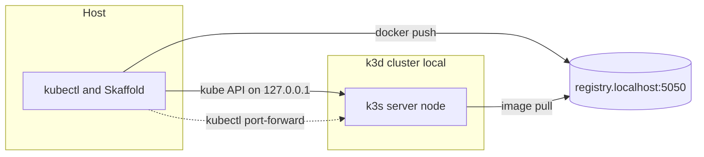
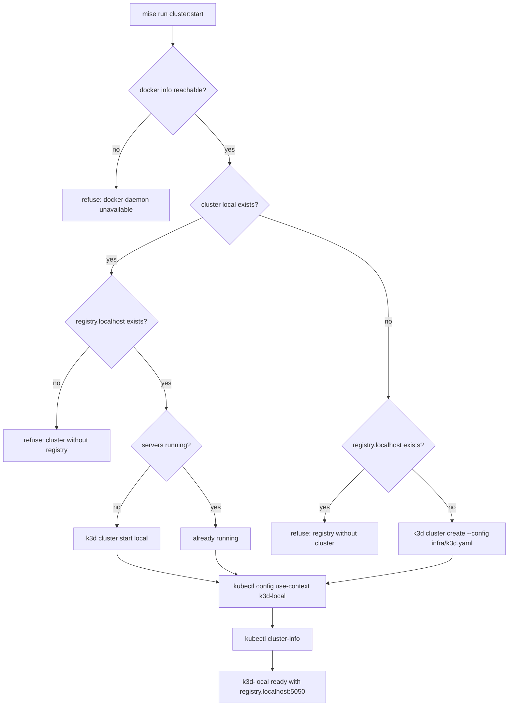

{}

- **You will:** Install the platform tier, run a check that deliberately creates nothing, and read the shape of the cluster Chapter 6 will create.
- **You need:** [1.0. System]() finished and a working container engine. On the local model path, skip this page — [6.1. Containers]() brings you back when the cluster becomes load-bearing.
- **Time:** about 20 minutes, reference. {}

## How the platform doctor validates without creating a cluster

The **platform tier** is everything Chapter 6 needs from your machine: the pinned Kubernetes tools, plus three requirements a tool list cannot report. Those three are a reachable container engine, a **cgroup v2** hierarchy (the unified Linux resource-control hierarchy modern kubelets require), and Helm's `helm-diff` plugin. `mise run doctor:platform` checks all of them; it installs nothing and creates nothing.

Creating nothing is a design rule rather than caution. A cluster tool pointed at a host that cannot run a control plane still gets far enough to write a kubeconfig context, leaving something that answers `kubectl` and schedules nothing. The host fact behind that failure was readable before the first container started, so a read-only check reports it in one line rather than leaving you to find it in kubelet logs.

This page installs the tier, runs that check, reads the cluster Chapter 6 will create out of `infra/k3d.yaml` before it exists, and then proves in two commands that nothing was created.

Install the tier and run the check:

```bash
mise run install:platform
mise run doctor:platform
```

One rule first: the first line reports tool presence; the verdict is the exit code. Here is that run on the machine this page was written on:

```text
[doctor:platform] $ ./scripts/doctor.sh platform
platform   ready
env        optional .env is absent
docker     ready
cgroup v2 required for pinned Kubernetes; enable the unified cgroup hierarchy before running local k3d
[doctor:platform] ERROR task failed
```

It applies no **manifest** — a YAML file describing one Kubernetes object — and creates no cluster. `platform   ready` says only that every pinned tool in the tier is present on `PATH`, and the run then goes on to check what a tool list cannot tell you. Here it found a cgroup v1 host, which Kubernetes 1.35 and later refuse outright, and stopped before creating anything. [0.7. Troubleshooting]() owns the fix.

On a cgroup v2 host the run continues and prints three more kinds of line: `cgroup     v2 ready`, a capacity summary of your total and available RAM and free disk, `helm       helm-diff 3.15.10 ready`, and finally a `cluster` line. Everything before the cluster line can fail the run, and these are the only failures:

1. a missing pinned tool from the platform tier or the base and gateway tiers it inherits;
1. a missing repository tool binary under `tools/bin`, which `mise run install` compiles;
1. a non-executable gateway wrapper (`infra/scripts/gateway-host.sh`);
1. an unreachable Docker engine, from either `docker info` or `docker compose version`;
1. a cgroup v1 host;
1. a missing `helm-diff` plugin — the Helm add-on that shows what an apply would change before it changes it. This host does have it, as `helm plugin list` shows:

```text
NAME	VERSION	TYPE  	APIVERSION	PROVENANCE	SOURCE
diff	3.15.10	cli/v1	legacy    	unknown   	unknown
```

The `cluster` line proves the "validate without creating" promise by construction: the block that produces it only prints. It reports your **kubeconfig context** — the cluster-and-credentials pair `kubectl` currently talks to — and cannot fail the run whatever it finds:

```bash
context=$(kubectl config current-context 2>/dev/null || true)
if [[ ${context} == "k3d-local" ]]; then
	printf 'cluster    k3d-local selected\n'
elif [[ -n ${context} ]]; then
	printf 'cluster    %s selected; local tasks require k3d-local\n' "${context}"
else
	printf 'cluster    not created yet; run mise run cluster:start when needed\n'
fi
```

See [`scripts/doctor.sh`](https://github.com/MLOps-Courses/agentops-open-course/blob/main/scripts/doctor.sh) for the whole thing. **You can now tell, before spending a single container, whether this machine can host the Chapter 6 platform at all.**

## What the k3d cluster will contain, before it exists

Today the agent runs in your terminal and stops when you close it. In Chapter 6 the same container runs as a **pod** — the smallest unit Kubernetes schedules — and deleting that pod brings it straight back, with its configuration injected from a manifest rather than baked into the image, and its state on a volume that survives the replacement.

A long-lived agent service needs its configuration injected, its secrets kept out of the image, its health probed, its state persisted, and new versions rolled out without a hand edit on a box. Kubernetes gives each of those a first-class object instead of a shell script, and that set of objects is the operational surface AgentOps has to observe and govern. [kagent]() adds an agent-specific **custom resource** — a new object type an add-on registers with the Kubernetes API, named `Agent.kagent.dev` and referenced in `infra/skaffold.yaml` — while the underlying container stays runnable without the operator.

[k3d](https://k3d.io/) runs lightweight k3s nodes inside containers. k3s is a certified, minimal Kubernetes distribution, so the same manifests, Helm **charts** (packaged bundles of manifests), and Skaffold build-and-redeploy loop that would run on GKE run on a laptop with no cloud account. The GKE path differs only by a Kustomize **overlay**: a per-environment patch over one shared set of manifests.

The whole cluster shape lives in one tracked file, and four of its values are the ones Chapter 6 depends on:

1. `metadata.name: local` names the cluster; k3d derives the `k3d-local` context from it.
1. `registries.create` provisions a managed registry named `registry.localhost` on `127.0.0.1:5050`.
1. `disableLoadbalancer` plus `--disable=traefik,servicelb` strip the default ingress and load-balancer machinery.
1. `updateDefaultKubeconfig` and `switchCurrentContext` write the new context into your default kubeconfig and switch to it.



**Diagram in words:** The host CLI reaches one k3s server through a loopback API, pushes images to the local registry, and opens only temporary port-forwards. The server pulls those images; no worker, ingress, or load-balancer node exists.

A **Service** is the stable in-cluster address Kubernetes gives a set of pods, and in this cluster the only path from your host to one is a temporary `kubectl port-forward`. [`infra/k3d.yaml`](https://github.com/MLOps-Courses/agentops-open-course/blob/main/infra/k3d.yaml) is the complete source: it also pins the k3s tag and its manifest digest, creates one server with no worker, binds the API to loopback, and waits up to 120 seconds for readiness.

{}

Three defaults go at once: `disableLoadbalancer` drops k3d's proxy container, `--disable=servicelb` removes k3s's built-in ServiceLB controller, and `--disable=traefik` removes the ingress controller k3s installs by default. No `Service` is then reachable from the host automatically: nothing publishes ports for you.

That absence is deliberate. agentgateway is this course's data plane; a default Traefik ingress would quietly become a second, unmanaged data plane beside it, and a ServiceLB would hand out addresses you never asked for. Disabling all three forces every exposure in Chapter 6 to be an explicit `kubectl port-forward`, so you always know what is published and through which layer. {}

{}

The reference `registry.localhost:5050` is load-bearing because the same string must resolve from two vantage points: the host side, where Skaffold and `docker push` upload images, and inside the cluster, where the kubelet on each node pulls them. k3d creates the registry container and wires its name into the nodes so the string resolves identically on both sides. A plain `localhost:5050` would only work host-side, because inside a node `localhost` is the node itself.

That single consistent reference is what lets Skaffold build, push, and deploy in one loop; `platform:dev` runs Skaffold with `SKAFFOLD_DEFAULT_REPO=registry.localhost:5050` for that reason. The native conventions gate rejects any earlier spelling of it, so no page can drift. {}

## The pinned platform tools, and three requirements beyond them

`mise run install:platform` provides every tool below at the version the root `mise.toml` pins, and the documentation gate fails when the two disagree.

| Tool         | Version | What it does here                                                      |
| ------------ | ------- | ---------------------------------------------------------------------- |
| k3d          | 5.9.0   | Runs the k3s cluster nodes as containers on your machine.              |
| kubectl      | 1.36.3  | Talks to Kubernetes and renders both overlays with built-in Kustomize. |
| Helm         | 4.3.0   | Installs packaged bundles of manifests, called charts.                 |
| Helmfile     | 1.7.4   | Declares the whole set of Helm releases in one file and applies it.    |
| Skaffold     | 2.24.0  | Builds, pushes, and redeploys the image in one loop while you edit.    |
| kubeconform  | 0.8.0   | Validates a rendered manifest against the Kubernetes schema.           |
| kube-linter  | 0.8.3   | Flags insecure or unreliable settings in a rendered manifest.          |
| agentgateway | 1.4.1   | The Chapter 5 gateway binary, also used to validate gateway configs.   |

Three requirements complete the set and none of them is a pinned tool: a reachable Docker engine, verified in [1.2. Container Engine](); a cgroup v2 host; and the Helm `helm-diff` plugin at 3.15.10, which `mise run install:platform` installs for you. They are also the most common reasons this tier fails on a machine where every version above is correct.

## `cluster:start` reconciles; it never recreates

The doctor was validating for one task in particular: `mise run cluster:start`, which Chapter 6 owns and runs. The repository treats the `local` cluster as one other projects on your machine may also be using, so the task is a **reconciler**: it brings an existing cluster to the wanted state rather than recreating it, and when the cluster and its registry disagree it stops and hands the decision back to you instead of half-fixing the pair.

The footgun is the context. Creating or starting the cluster silently repoints your default kubectl context to `k3d-local`, because `switchCurrentContext` in `infra/k3d.yaml` and an explicit `kubectl config use-context` inside the task both say so — check `kubectl config current-context` before running anything destructive elsewhere. Sharing also decides cleanup: course cleanup removes namespace workloads rather than deleting a cluster other projects may still be using. `platform:install` and `platform:dev` both open with a hard context guard, so an accidental switch is annoying rather than dangerous:

```bash
test "$(kubectl config current-context)" = k3d-local
```

{}

The task checks its required commands, then the cgroup hierarchy, then the Docker engine, and only then looks at what already exists:

```bash
if jq -e 'any(.[]; .name == "local")' <<<"${clusters}" >/dev/null; then
	if ! jq -e 'any(.[]; .name == "registry.localhost")' <<<"${registries}" >/dev/null; then
		printf 'k3d: cluster local exists without registry.localhost; reconcile it before continuing\n' >&2
		exit 1
	fi
	if ! jq -e '.[] | select(.name == "local") | .serversRunning == .serversCount' <<<"${clusters}" >/dev/null; then
		k3d cluster start local
	fi
else
	if jq -e 'any(.[]; .name == "registry.localhost")' <<<"${registries}" >/dev/null; then
		printf 'k3d: registry.localhost exists without cluster local; reconcile it before continuing\n' >&2
		exit 1
	fi
	k3d cluster create --config infra/k3d.yaml
fi
```

See [`scripts/cluster-start.sh`](https://github.com/MLOps-Courses/agentops-open-course/blob/main/scripts/cluster-start.sh). It refuses rather than half-fixing a mismatched pair:

1. If `docker info` fails, it stops with `docker: daemon is unavailable`.
1. If the `local` cluster exists but `registry.localhost` does not — or the registry exists without the cluster — it exits with `reconcile it before continuing`.
1. If the cluster exists but its servers are stopped, it resumes them.
1. If neither exists, it creates the cluster from `infra/k3d.yaml`.

Only then does it select the context, run `kubectl cluster-info`, and print `cluster: k3d-local is ready with registry.localhost:5050`.



**Diagram in words:** `mise run cluster:start` asks four questions in order and refuses three of the answers rather than guessing. If the Docker daemon is unreachable, it refuses. If the `local` cluster exists, its registry must exist too, or it refuses; the servers are then either running already or started. If the cluster does not exist, the registry must not exist either, or it refuses; otherwise it creates both from `infra/k3d.yaml`. Every surviving path selects the `k3d-local` context, runs `kubectl cluster-info`, and prints that the cluster is ready with `registry.localhost:5050`.

{}

## Your turn: prove the doctor created no cluster or context

Two commands check the "validate without creating" claim instead of trusting it.

Predict first: how many k3d clusters exist on this machine now, and has your kubectl context moved?

- **Mode**: `inspect` — both commands only list.
- **Goal**: confirm the platform doctor left your machine exactly as it found it.
- **Files to touch**: none.
- **Preflight**: you have run `mise run install:platform` and `mise run doctor:platform` at least once.
- **Steps**: run `k3d cluster list` and then `kubectl config current-context`.
- **Gate that proves completion**: `k3d cluster list` prints its header row and no cluster named `local`, and `kubectl config current-context` prints whatever it printed before this page — the context you already had, or an error if you had none.

```text
NAME   SERVERS   AGENTS   LOADBALANCER
```

- **Final state**: no cluster, no registry container, no kubeconfig change.

If a `local` cluster does appear, you have not broken anything: something else on this machine already owns that name, which is the shared-cluster case `cluster:start` reconciles rather than recreates.

## What you can do now

- `mise run doctor:platform` runs on your machine, and you can read its first line as tool presence rather than as a verdict.
- You can name the six conditions that fail the tier, and which of them are host facts rather than missing tools.
- You can say why the course pushes to `registry.localhost:5050` rather than `localhost:5050`, and why nothing in the cluster is reachable without an explicit port-forward.
- `k3d cluster list` shows no `local` cluster, so the "validate without creating" promise held on your machine too.

You can describe the cluster before it exists: its name, its registry, its missing ingress, its context footgun. Chapter 6 turns that description into workloads; nothing before it needs the cluster running.

Return to [6.1. Containers]() once this tier passes on your host. The required local-model path reaches [1.4. Providers]() long before this deferred page.
