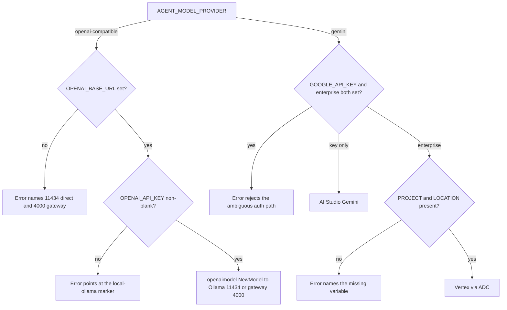
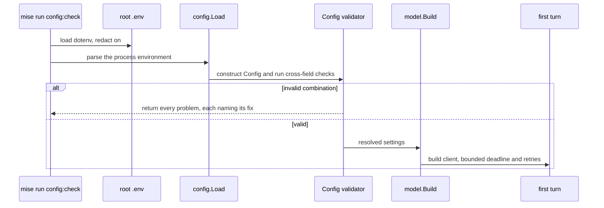

{}

- **You will:** Install Ollama, pull Qwen3, get `mise run doctor:model` green, and set a model deadline your hardware can meet.
- **You need:** `mise run install` and `mise run doctor` green from [1.0. System]() — that covers the one Go command here, so [1.1. Go]() can wait.
- **Time:** about 30 minutes, hands-on. {}

## Install Ollama, pull Qwen3, and verify with the model doctor

A **model provider** is the backend an agent's model client sends its requests to, chosen by configuration rather than code. On the required path it is Ollama, serving open-weight Qwen3 on your own machine: a hosted provider would put an account, a key, and a per-token bill in front of every exercise, while a local one keeps every prompt and tool argument on your hardware. The offline suite you took green on [1.0. System]() proved everything the agent can check without a model; this page adds the component those checks exclude.

You install Ollama, prove it with `mise run doctor:model`, size `AGENT_MODEL_TIMEOUT_S` from the inference time it measures, and separate the variable that picks the provider from the URL that picks the topology.

That deadline is what most first runs get wrong. A four-billion-parameter model on a laptop CPU takes longer than the shipped sixty seconds to load itself and read a prompt carrying every tool's schema, so the first real question dies on a timeout — three times over, because the client retries — on an installation that is healthy.

Get Ollama from [ollama.com/download](https://ollama.com/download). On macOS and Windows the app installer starts the server for you; on Linux, read the official script before running it, the same curl-then-run pattern as mise:

```bash
curl -fsSL https://ollama.com/install.sh -o /tmp/ollama-install.sh
sh /tmp/ollama-install.sh
```

With the daemon serving, pull the Apache-2.0 open-weight model and list what you have:

```bash
ollama pull qwen3:4b-instruct
ollama list
```

```text
NAME                       ID              SIZE      MODIFIED
nomic-embed-text:latest    0a109f422b47    274 MB    3 days ago
qwen3:4b-instruct          0edcdef34593    2.5 GB    3 days ago
```

Weights are fetched once and cached on disk, so a slow progress bar on a home connection is normal, not stuck. The second entry is optional: `nomic-embed-text` is the embedding model behind Chapter 3's semantic runbook retrieval, and nothing before it needs the model.

Now verify the path the way CI does:

```bash
mise run doctor:model
```

```text
[doctor:model] $ ./scripts/doctor.sh model
model      ready
env        optional .env is absent
ollama     0.32.9 with qwen3:4b-instruct ready on 127.0.0.1:11434
inference  ok in 24s (a full turn needs several calls of this size or larger)
```

**A language model is now running on your own hardware — no account, no API key, no per-token bill, and nothing you ask it will leave the machine.** The `env` line reads `.env available to explicit live/config tasks` once you create a `.env`, which only the deadline below and the optional Gemini path need.

## What the model doctor checks, and why it starts nothing

That green line is worth more than `ollama list`, because the check is deliberately a probe rather than a launcher. It never starts Ollama and never pulls a model; it asks the server two questions and refuses on either.



The first question is which version is answering. The agent reaches Ollama through ADK's **OpenAI-compatible** client, named for the wire protocol the OpenAI SDK speaks rather than for a vendor, which is why a local server can serve it at all. That client speaks only the **Responses API**, one endpoint shape within that protocol, and Ollama grew it in 0.13.3, so an older daemon returns 404 for every model call while looking healthy from every other angle. That is a miserable failure to diagnose, and the floor above turns it into one sentence.

The second question is whether the model is there: the check reads `/api/tags` and requires a served model name starting with `qwen3:4b-instruct`. A stopped daemon and a never-pulled model therefore produce different messages — `start Ollama: it is not answering on 127.0.0.1:11434` when nothing responds on the port, and `start Ollama and run: ollama pull qwen3:4b-instruct` when the server is up but the model is absent.

Take the first message literally: nothing in this repository starts Ollama for you, not the doctor, not a mise task, not the agent. Starting the model server stays yours, so no course command can quietly spin up a process it does not know how to stop.

## Size the model deadline from the measured inference time

The shipped deadline is sixty seconds with two bounded retries, sized for a warm GPU. A CPU host needs more, and the reason is not the load. Every model call re-reads the whole context from scratch, and a **grounded turn** — one where the model calls a tool and then answers from what the tool returned — makes at least two such calls. The second is the larger, because it carries everything the first did plus the tool's output.

`mise run doctor:model` measures that cost for you. Its `inference` line — the last one in the capture above — times one single-token call:

```text
inference  ok in 24s (a full turn needs several calls of this size or larger)
```

Read that number as a threshold. Under about ten seconds, the shipped default is fine. Above it, expect turns in minutes rather than seconds and raise the budget accordingly — or use a smaller model, the lever that changes the shape of the curve rather than the wait for it.

The variable lives in a gitignored `.env` at the repository root, not beside the Go module: the agent's model-backed tasks run from `agents/go` and load `../../.env`. Copy the example there and restrict it to your own account:

```bash
cp .env.example .env
chmod 600 .env
```

Then set one line in it: `AGENT_MODEL_TIMEOUT_S=180` for a CPU-only laptop whose inference line reads a few seconds, or `600` and upwards when it reads twenty and above, as the capture here does. `mise run config:check` confirms the file was read: it parses the environment into the agent's typed configuration and prints every resolved setting with secrets masked.

Predict what the validator does with a value above the ceiling, then run it:

```bash
AGENT_MODEL_TIMEOUT_S=4000 mise run config:check
```

```text
[config:check] $ cd agents/go && mise run config:check
[config:check] $ go run ./cmd/agent config:check
Agent configuration is invalid:
- AGENT_MODEL_TIMEOUT_S: must be greater than 0 and at most 3600, got 4000
exit status 1
[config:check] ERROR task failed
[config:check] ERROR task failed
```

The three middle lines are the agent talking; everything around them is mise, which echoes each command before running it and reports the failure once per level: the root task delegating into the module, then the module task running the binary.

One hour is the ceiling, on purpose: a turn that never finishes under an unbounded deadline is a hang rather than a slow model, and it deserves to be found rather than waited out. It sits far above what any comfortable machine needs, because a ceiling a slow host could not reach would leave the required, account-free path unable to finish its first turn. [0.7. Troubleshooting]() walks through timing one turn before you tune.

The retry count is bounded for a sharper reason: a chat completion is not idempotent, so a network failure _after_ inference means an SDK retry repeats the model work, the latency, and — on a hosted provider — the cost. Both provider branches therefore fix their own deadline and retry count rather than accepting SDK defaults, the gateway adds no retries, and a **guarded write** — a state-changing tool that runs only once a human confirms it — is never retried at all. [4.5. Guardrails]() owns that last rule.

Deterministic checks still see none of this: `mise run check:core` and `mise run test` load no dotenv, so nothing in `.env` can turn an offline check green or red.

## One variable picks the provider; one URL picks the topology

The defaults already select local Ollama, so on the required path you configure no provider variable at all. Two names are still worth learning, because Chapter 5 changes one and leaves the other alone.

`AGENT_MODEL_PROVIDER` is a two-value enum: `openai-compatible` (the default) or `gemini`. It selects the ADK client, and every other provider field is read only on its own branch. The `openai-compatible` branch reads `OPENAI_BASE_URL` (default `http://127.0.0.1:11434/v1`, direct Ollama) and `OPENAI_API_KEY` (default the non-secret marker `local-ollama` — the OpenAI SDK refuses an empty key even when nothing authenticates it).

The field names the client contract, not the deployment topology, which is why the whole Chapter 5 gateway swap is a URL rather than a provider:

- `OPENAI_BASE_URL=http://127.0.0.1:11434/v1` points at Ollama directly.
- `OPENAI_BASE_URL=http://127.0.0.1:4000/v1` points at the agentgateway model route, which then owns policy and telemetry in front of the same Ollama.

The application-side provider value never changes across that switch. Naming the field `ollama` would have baked one topology into a contract deliberately built to outlive it.

{}

`agents/go/config/config.go` parses the environment once into a typed `Config`, so the defaults below are the ones the runtime uses rather than prose that can drift:



The whole provider question is that one two-branch, four-leaf decision:



**Diagram in words:** The provider variable chooses one of two branches. `openai-compatible` needs a base URL and a non-blank key before it builds an OpenAI-protocol client against direct Ollama or the gateway; `gemini` needs exactly one authentication path — an AI Studio key, or enterprise mode with a project and a location.

Each error box is a real validator message, quoted in the next collapsible, and each leaf a real branch of `model.Build` in `agents/go/model/model.go`. {}

The Gemini branch below is optional: it matters only if you pick Gemini or run Chapter 6's optional GKE laboratory. It needs a Google account and changes three lines. For an AI Studio key:

```bash
AGENT_MODEL_PROVIDER=gemini
AGENT_MODEL=gemini-3.6-flash
GOOGLE_API_KEY=replace-me
```

For Vertex AI through **Application Default Credentials** — the credentials Google's SDKs find on the machine — use enterprise mode with an explicit project and location instead of a key:

```bash
gcloud auth application-default login
AGENT_MODEL_PROVIDER=gemini
AGENT_MODEL=gemini-3.6-flash
GOOGLE_GENAI_USE_ENTERPRISE=true
GOOGLE_CLOUD_PROJECT=your-gcp-project-id
GOOGLE_CLOUD_LOCATION=global
```

Verify that path against the same project first:

```bash
GCP_PROJECT_ID=your-gcp-project-id mise run doctor:gcp
```

The doctor reads `GCP_PROJECT_ID` and nothing else. Leave it unset and the check refuses with `ambient project fallback is disabled` rather than picking up whatever project `gcloud` has configured; when that ambient project disagrees with the approved one, it refuses again and names both. It also does not load `GOOGLE_CLOUD_PROJECT` from `.env`, so the variable that configures the agent and the one that authorizes a cloud check stay separate on purpose.

One credentials rule holds on every path, local included: a key lives in `.env`, readable only by you, and nowhere a build can copy it. A key committed to Git costs an afternoon — rotate it, force the history, move on. A key baked into a container image is worse: an image is named by a hash of its own bytes, so the layer carrying that key keeps its digest, gets pushed to a registry, pulled onto every node that schedules it, and cached there. Rotation reaches none of those copies.

The tooling keeps that file out of everything else. The Trivy scan in `mise run secure` skips `.env`, so a local secret never trips the scan and never becomes a reason to weaken it. `config:check` masks `Secret` fields and the mise dotenv loader runs with redaction on, so neither a resolved-config dump nor a task log echoes a key. Cloud workloads carry no key: the optional GKE overlay federates an identity instead of storing a service-account file. Prompts and tool arguments are a second copy of your data with a switch of their own, off by default, and [7.1. Tracing]() owns it.

{}

The validator itself, quoted from `agents/go/config/validate.go`:



What that rejects, and why each message earns its length:

- **`openai-compatible` with no `OPENAI_BASE_URL`** names both correct values in one line, so the port is never a guess.
- **`openai-compatible` with a blank `OPENAI_API_KEY`** explains that the local path still needs a non-empty marker.
- **`gemini` with both an API key and enterprise mode** is rejected rather than silently preferring one, so ambiguous intent fails instead of guessing.
- **`gemini` enterprise mode missing project or location** names each absent variable individually.
- **A removed `AGENT_GATEWAY_ENABLED`** produces a migration error instead of being ignored, pointing at the URL switch that replaced it.

Cross-field checks append to a list and raise together, so one run surfaces every problem at once instead of one failure per restart:



**Diagram in words:** A mise task loads the root environment and asks the typed loader to parse and cross-check it. Invalid combinations return every problem before startup; valid configuration reaches model construction, and only then can a first turn run. {}

## Your turn: make the validator refuse, three ways

The cheapest way to trust a validator is to watch it reject things. None of this touches a file, and each command exits non-zero.

Predict each answer first: does a blank key fail, or fall back to a default? Do two bad settings produce two messages, or only the first?

- **Mode**: `inspect` — every command sets a variable for one process and changes nothing on disk.
- **Goal**: see that configuration is rejected at startup, with the fix named, before any model client exists.
- **Files to touch**: none.
- **Preflight**: `mise run config:check` exits zero and prints your resolved settings.
- **Steps**: run `OPENAI_API_KEY= mise run config:check`, then `AGENT_MODEL_TIMEOUT_S=4000 AGENT_TOOL_TIMEOUT_S=700 AGENT_A2A_PORT=99999 mise run config:check`, and finally `AGENT_MODEL_PROVIDER=gemini mise run config:check`.
- **Gate that proves completion**: each run exits non-zero and names the exact variable to change. The second one reports all three problems in one pass, sorted, rather than dying on the first:

```text
[config:check] $ cd agents/go && mise run config:check
[config:check] $ go run ./cmd/agent config:check
Agent configuration is invalid:
- AGENT_A2A_PORT: must be between 1 and 65535, got 99999
- AGENT_MODEL_TIMEOUT_S: must be greater than 0 and at most 3600, got 4000
- AGENT_TOOL_TIMEOUT_S: must be greater than 0 and at most 600, got 700
exit status 1
[config:check] ERROR task failed
[config:check] ERROR task failed
```

- **Final state**: nothing changed. `mise run config:check` with no prefix still exits zero.

## What you can do now

- `mise run doctor:model` exits zero and names the Ollama version and the model serving on your machine.
- Your `.env` carries a model deadline your hardware can meet, and `mise run config:check` shows the resolved value with secrets masked.
- You can say what changes when Chapter 5 puts a gateway in front of the model, and what deliberately does not.
- You can make the validator refuse three ways and read the fix from each message.

There is now a model on your own hardware, a check that proves it without spending a token, and a deadline set from measured behavior rather than a default written for a GPU. The number worth carrying forward is the doctor's `inference` line: everything Chapter 2 asks of the model costs several multiples of it.

Continue to [2.1. First Agent]() and spend the model you just pulled on a grounded turn. [1.1. Go]() and [1.5. Workspace]() wait until you edit this repository rather than read it.
