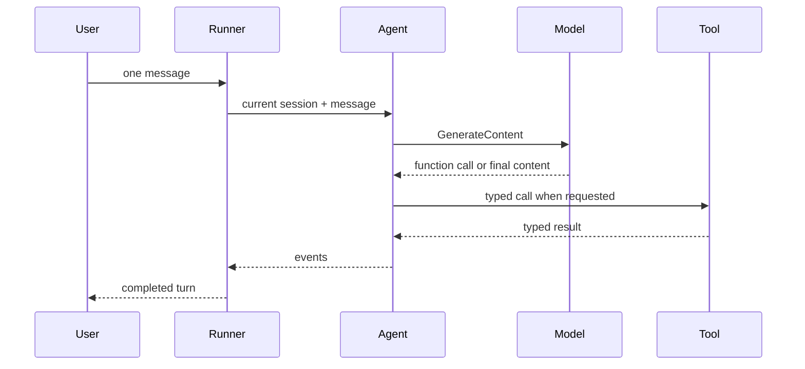

{}

- **You will:** Read the typed record of one real turn and learn the six objects it names, before you run a turn of your own.
- **You need:** `mise run install` done. No model, container, or network.
- **Time:** about 18 minutes, concept. {}

## The six objects of a turn, defined by its record

A **turn** is one user message processed to completion. It is not an opaque exchange but a typed record, produced by the **runner**, which takes one message and emits typed events across the agent, the model, the tools, the session service, and the application-wide plugins.

That typing makes a misbehaving turn something you read rather than something you reconstruct — but only if you can name the objects it touched. So this page reads one real record, defines its six words, and maps this chapter's concepts to the Go packages that own them.

That record came from a run that failed on the machine this page was written on: `List the three open incidents.` was asked against the local seed, and the model never produced an answer. It is trimmed to the fields worth naming; the full document also carries the agent's message parts and the artifact it produced:

```json
{
  "kind": "task",
  "id": "019fece9-42f5-74d4-be1e-3b9fd196e62a",
  "contextId": "019fece9-4304-7c28-94f8-33f33ef59027",
  "history": [
    {
      "kind": "message",
      "messageId": "m1",
      "role": "user",
      "parts": [{ "kind": "text", "text": "List the three open incidents." }]
    }
  ],
  "status": { "state": "failed", "timestamp": "2026-08-10T20:25:19.258288692+02:00" },
  "metadata": {
    "adk_app_name": "agentops-agent",
    "adk_author": "agentops_agent",
    "adk_error_code": "MODEL_UNAVAILABLE",
    "adk_invocation_id": "e-9e533467-bcfd-47e1-b529-f557938c1669",
    "adk_session_id": "019fece9-4304-7c28-94f8-33f33ef59027"
  }
}
```

Six words in that document are the vocabulary of this entire chapter. The **app** is the deployed application that work is attributed to: `agentops-agent`, the name sessions, audit rows, and telemetry share. The **author** is the agent that produced the reply. The **session** is the conversation this message belongs to; the **invocation**, this one attempt at answering it. The **task** is the protocol object tracking the request, and the **state** says what became of this attempt: `failed`.

Only two of those six are places you can open, which is why only those two get a row in the table below. Sessions and tasks are stores: `agents/go/cmd/agent/session_store.go` opens the session database, `agents/go/a2aserver/taskstore.go` persists tasks. App, author, and invocation are stamps the runner writes onto every event, and state is a field of the task's status — read them to know which store to open.

Nothing is guessed at: `adk_error_code` already names the model endpoint as the problem, so nobody has to argue about whether the tools misbehaved.

On a laptop with no GPU that code usually means the sixty-second request deadline expired. `AGENT_MODEL_TIMEOUT_S` carries that deadline: it bounds one model request rather than a whole turn, and CPU-only inference routinely runs past it. Raising it, up to the 3600 seconds it accepts, is right when the provider is merely slow and wrong when nothing is listening.

The runner constructs none of the pieces it drives. The command layer builds each dependency explicitly, hands them over, and closes them on shutdown, which is why a test can swap any single one for a fake and nothing global changes when it does.



**Diagram in words:** A user gives one message to the runner, which invokes the agent with its session. The agent asks the model, may call a typed tool and return its result, then emits the events that form the completed turn.

Those **events** are the runner's record of the turn: authored messages, function calls, function responses, state changes, errors, and completion. The evaluation harness in `evals/` — the offline program that replays fixed questions and scores the answers — reads those same events.

A **session** is where those events accumulate: the conversation state for one app, one user, and one session id, stored in SQLite so a restart does not erase a conversation. Two lookalikes are deliberately not sessions — cross-session operator notes, a separate store with its own redaction rules, and the protocol task above, with its own lifecycle. [2.4. Sessions]() takes both apart.

## What ADK provides, and what this repository must decide

Google ADK for Go supplies the interfaces and runtime machinery: agents, models, tools, the runner, sessions, events, plugins, workflows, and the launchers that expose them.

The questions it leaves open are the ones that matter when the agent is real. Which tools may write. How a caller's identity is verified. What content may reach telemetry. Where state persists and how it is recovered. Which failures retry, and how often. What has to be true before a change ships. A framework that answered those would be answering them for a system it has never seen, so this repository answers each one in code you can read and tests you can run.

That split is also the map of the source tree:

| Concept                    | Go authority                                                           |
| -------------------------- | ---------------------------------------------------------------------- |
| Composition and root agent | `agents/go/compose/composition.go`                                     |
| Model construction         | `agents/go/model/model.go`                                             |
| Runner and command wiring  | `agents/go/cmd/agent/`                                                 |
| Typed configuration        | `agents/go/config/`                                                    |
| Sessions and A2A tasks     | `agents/go/cmd/agent/`, `agents/go/state/`, and `agents/go/a2aserver/` |
| Tools and guarded writes   | `agents/go/tools/`                                                     |
| App-wide policy            | `agents/go/policy/`                                                    |
| Workflows and delegation   | `agents/go/compose/workflow.go` and `agents/go/compose/delegation.go`  |
| Black-box evaluation       | `evals/`                                                               |

When a framework behavior surprises you, the answer is in `go.mod`, the installed module source, and the tests — never in a versionless snippet copied from a blog post.

## What tools, policy hooks, workflows, and delegation each control

A **tool** is a capability the model may select. The reads cover incidents, services, logs, and runbooks; two **guarded writes** pause for human approval and record who gave it before anything is mutated. Selecting one is the model's move: a proposal, not a decision.

A **policy hook** is not selectable at all: an application-wide control that surrounds every model call and tool call regardless of which agent is running — budget enforcement, history compaction, PII redaction, injection hardening, telemetry rules — attached once at the application root. Attaching it there rather than to each agent is what makes it hold: add a sub-agent tomorrow and it is governed on arrival, because the plugin lives above every composition.

Two more shapes exist for when the choice should not be the model's. A **workflow** is a declared sequence or parallel graph: the reference `triage_workflow` runs plan, investigate, evidence review, and recommendation, read-only and bounded, so a stage cannot reopen discovery and drift onto a different incident. **Delegation** puts a coordinator in front of specialists whose tool sets are structurally restricted: the read-only specialist cannot mutate anything because it holds no write tool. Neither shape is a prompt rule the model may ignore.

**A2A** — Agent2Agent — is how all of this becomes reachable by other agents: an agent card, tasks, messages, and streaming task events over the network. The deployed surface in this course is `agent a2a` rather than ADK's in-memory demonstration launcher, because it adds a persistent task store, verified-identity binding, readiness, cancellation, drain, and restore recovery — the difference between a demo that answers and a service that can be operated.

## Your turn: map each symptom to the package that owns it

A symptom is not knowledge until you can name the package that owns it. Two minutes of reading and one test the package finishes in eleven milliseconds.

Predict first: the diagnosis specialist's instruction ends with the sentence _You cannot take actions_. Delete that sentence in your head. Does the specialist's inability to mutate anything survive the deletion, and which line decides?

- **Mode**: `inspect` — you read code and run one test; nothing is modified.
- **Goal**: map each symptom to the package the table names, and see least privilege settled by a test rather than by a sentence.
- **Files to touch**: none.
- **Preflight**: Chapter 1 finished, so `go` and the module dependencies are already resolved.
- **Steps**: for each of four symptoms — a bad tool result, a lost conversation, an unauthorized write, a turn that never started — write down the package you would open first from the table above. Then open `agents/go/compose/delegation.go`, read `diagnosisInstruction` and the `diagnosisConfig` function beneath it, and note which of the two a running model could argue with. Run the test below.
- **Gate that proves completion**: the test passes, and you can state in one sentence what `diagnosisConfig` does that an instruction never could.
- **Final state**: no files changed.

```bash
cd agents/go
go test ./compose -run TestDelegationRespectsToolBoundaries -v -count=1
```

```text
=== RUN   TestDelegationRespectsToolBoundaries
=== PAUSE TestDelegationRespectsToolBoundaries
=== CONT  TestDelegationRespectsToolBoundaries
--- PASS: TestDelegationRespectsToolBoundaries (0.00s)
PASS
ok  	github.com/MLOps-Courses/agentops-open-course/agents/go/compose	0.011s
```

The claim survives the deletion. The deciding line is `cfg.Tools = concatTools(c.tools.ReadTools(), c.tools.KnowledgeTools())` inside `diagnosisConfig`: the two guarded writes are simply not in the list the model may choose from. `agents/go/compose/delegation_test.go` names the write tools each specialist must not hold and compares them against the ones it does. A prompt injection can talk a model into wanting anything; it cannot append an element to a Go slice. The instruction's last sentence is a courtesy that tells the model in advance why it will fail, and the test never reads it.

## What you can do now

- You can name the six words in a turn's typed record, and which two are stores you can open.
- You can say what the runner owns and what the command layer hands it.
- You can explain why a policy hook governs a sub-agent that did not exist when it was written.
- Given a misbehaving turn, you can name the one package you would open first — and defend the choice.

Six words, two stores, and a habit: when an agent does something strange, ask which object it happened inside before asking what the model was thinking.

Continue to [2.1. First Agent](), where those six objects produce a turn that answers, and where you check the answer came from a tool call rather than the model's memory.
