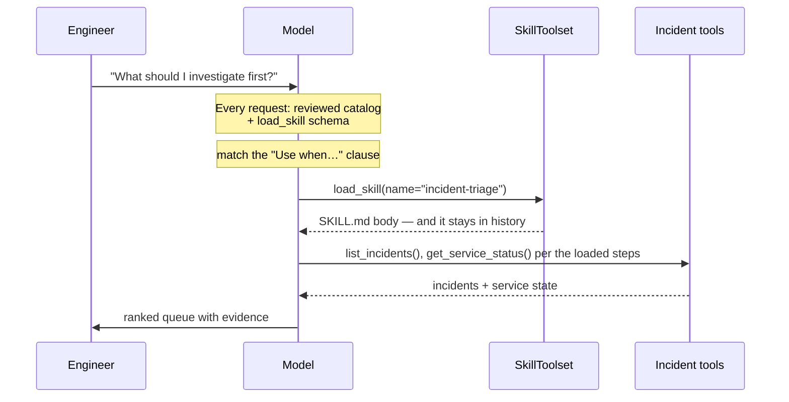
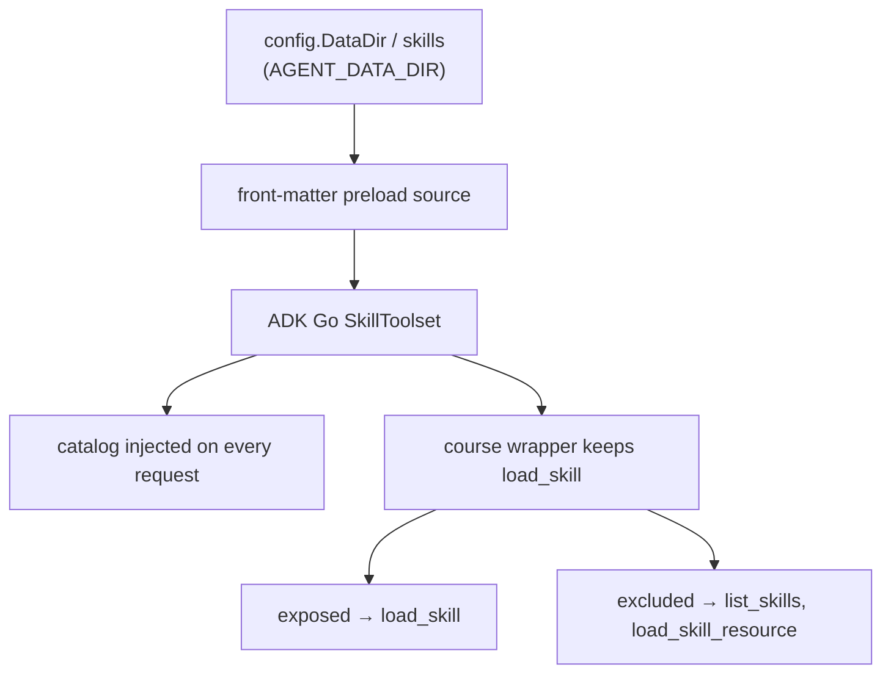

{}

- **You will:** See what the model knows about a procedure before it loads it, what loading costs, and what happens when a skill file is malformed.
- **You need:** [3.1. Tools]() finished, `go test` working inside `agents/go`, and the `.env` from Chapter 1. No model is needed until the exercise's closing gate, which asks whether your "Use when…" clause actually fires.
- **Time:** about 25 minutes, hands-on. {}

## What a skill is, and why it lives outside the instruction

An **Agent Skill** is a procedure kept outside the system instruction: a directory rooted at a `SKILL.md` file. That file carries name and description **front matter** — the `---` metadata block at the top — followed by Markdown instructions for one class of task, plus optional `references/`, `assets/`, and `scripts/` folders. The model is shown the name and description on every request, and pulls the body into context only on a turn that matches. That two-phase move is **progressive disclosure**.

It exists because instruction, tool schemas, history, and tool results share one fixed context window, and a procedure that applies to one turn in twenty is the most wasted thing in it. Twenty procedures pasted into the instruction cost twenty procedures on every turn; twenty advertised ones cost one description each, plus one body on the turn it fires.

The format is the open Agent Skills standard that AI coding assistants use. In this repository skills live under `agents/data/skills` beside the shared dataset, wired through `SkillToolset`, Google ADK's Go type that turns a directory of skill folders into tools.

This page prices progressive disclosure on the two skills that directory ships: what the catalog costs in characters, what a load costs, what happens when front matter is malformed, and where a rule belongs when a skill is the wrong home for it.

The description is the only part of a skill the model sees before it loads anything, so the runtime refuses to start without one. No Go file imports those skill directories and no test compiles them, which makes it easy to assume nothing checks them either. Delete the `description` line from `agents/data/skills/incident-triage/SKILL.md` and start the agent:

```bash
cd agents/go
mise run a2a
```

```text
agent: building the skill toolset from ../data/skills: preload: invalid frontmatter: parse frontmatter: invalid frontmatter: description must be between 1 and 1024 characters long
```

One line, exit code 1, and no model client was ever constructed. Put the line back with `git restore -- agents/data/skills/incident-triage/SKILL.md` before you read on.

The two shipped skills have deliberately different shapes. `agents/data/skills/incident-triage/SKILL.md` is a pure decision procedure over read tools: six numbered steps, about 140 words, and completely irrelevant to the question "is checkout up?". It is quoted in full because it is the shape yours should imitate:

```markdown
---
name: incident-triage
description: Prioritize open incidents deterministically. Use when the engineer asks what to investigate first, requests a queue ranking, or needs an evidence-backed triage summary.
---

# Incident Triage Skill

## Instructions

1. List every incident with `list_incidents` (no `status` filter), then keep only those whose status is `open` or `investigating` (drop any `resolved`).
1. Stop with a clear data-quality error if an active incident has no id, service, supported severity, or `opened_at`; do not guess a ranking key.
1. Rank by severity — **SEV1** before SEV2 before SEV3 — then by the oldest `opened_at` first.
1. For tied top candidates, call `get_service_status`; a `down` service outranks a `degraded` service, which outranks a healthy service.
1. Report the most urgent incident first with its id, service, severity, age evidence, current service state, and one-line summary. List the remaining active incidents in priority order.
1. Separate observed facts from your recommendation. Do not invent incidents, severities, timestamps, or service state, and do not run remediation from a triage request.
```

`agents/data/skills/remediation/SKILL.md` has a different shape, because acting is riskier than ranking. Its body is a propose-approve-verify loop: fetch the incident with `get_incident` and stop if it is already resolved; read the runbook with `get_runbook`, or `search_runbooks` when the slug is unknown; follow that runbook's Remediation section and recommend the least disruptive step with its expected recovery evidence and stop condition; call the guarded tool when the engineer asks to initiate one, knowing ADK pauses and the initiating message is not approval; then **re-read** the incident and service and report the audited state rather than claiming success from the action response.

Notice what that skill does with its hardest rules: it defers them. The tool call creates an approval request rather than executing anything, and the guardrail in [4.5. Guardrails]() enforces the pause. A skill can ask; only runtime policy can require.

## What progressive disclosure costs, and how the toolset is built

Before any load, the model has two things: the standing skill instruction, with each reviewed skill's name and description injected into its system context. The second is the JSON declaration for `load_skill`, the only skill tool this composition exposes.

The trade has one constant cost per skill you own and one variable cost per skill the model actually reaches for. The constant side is smaller than the pitch suggests, which matters before you build a library on it. Every request pays the standing skill instruction — 667 characters, replacing ADK's default text — plus one description per reviewed skill: 168 characters for `incident-triage`, 162 for `remediation`. Only a triage turn pays the 1,147-byte body. At two skills that is near break-even; at twenty it is the whole argument, because the constant part grows by one description while the variable part still loads exactly one body.

`list_skills` is absent on purpose, because it would ask the model to call a tool to discover a catalog ADK has already injected into the system context. The root instruction tells the model to call `load_skill` directly with the exact matching name, so disclosure costs one round trip rather than two:



**Diagram in words:** Every request carries the small reviewed catalog and one loader schema. The model selects an exact name, loads that body, then follows it through typed incident tools.

That makes the description the single most load-bearing line in a skill, because it is the only thing the model can reason about while the body is still hidden. It is why the real one ends with "Use when the engineer asks what to investigate first, requests a queue ranking, or needs an evidence-backed triage summary." That clause is not documentation for humans; it is the pattern a user request gets matched against. A description that only names the skill — "Prioritize open incidents" — says what it _is_ and never says _when_, so the skill either never loads or loads on the wrong turn. Write the clause as concrete user intents, and keep the two skills' clauses disjoint, because overlapping triggers make the choice between triage and remediation a coin flip.

Discovery and **least privilege** — giving a component only the access its job needs — both happen at build time, in `agents/go/compose/skills.go`. `NewSkills` preloads front matter from an `os.DirFS` rooted at the skills directory, a filesystem handle scoped so that a path cannot reach outside it. It then constructs ADK's Go skill toolset, keeps only `load_skill`, and forwards ADK's catalog injection on every request. Three properties fall out of that shape:

1. **Exact-name lookup, not host access.** The filesystem source is rooted at the configured directory and ADK resolves catalog names inside that root, so an unknown or traversal-shaped name is refused rather than interpreted as a path.
1. **The allowlist is policy, not ceremony.** ADK Go builds `list_skills`, `load_skill`, and `load_skill_resource`. The course wrapper keeps one. Discovery needs no tool of its own, since ADK injects the catalog into the system context on every request. Arbitrary bundled resources stay unreachable.
1. **Trusted instruction stays instruction.** Only the result of the concrete, locally constructed `load_skill` tool skips the treatment every other tool result gets: its reviewed body is not neutralized or fenced as untrusted data, because the model is meant to follow it. That exemption is keyed on the tool value itself rather than its name — a name is something a remote MCP server picks for itself. Recursive PII and credential redaction still runs over the body, and every retrieved-data result stays hardened as untrusted.



**Diagram in words:** The configured data directory roots the reviewed catalog. ADK injects that catalog, while the course wrapper exposes only exact-name instruction loading and excludes redundant listing and arbitrary resources.

Look at the root of that flowchart. `SkillsDir(config.DataDir)` appends `skills` to `AGENT_DATA_DIR`, so repointing the data directory repoints where the agent's executable influence comes from. The container image sets `AGENT_DATA_DIR` to its own bundled directory, which is what makes the loadable skills exactly the ones baked into that image rather than whatever happens to be on a host.

Preloading front matter at startup is why the refusal above arrived before a model client existed, rather than on the turn a learner first asks for a procedure. Be precise about which surfaces it covers: `mise run run`, `mise run web`, and `mise run a2a` all build the skill toolset, so any of them shows you that message. `mise run mcp` and `mise run mcp:http` build no skills at all — that process serves six read tools and nothing else — so a malformed `SKILL.md` will not stop them, and reaching for the MCP task to check your work will teach you nothing.

Refusing to start is the right trade. A skill with no trigger clause is a skill that will silently never load, and silent never-loads are the hardest agent bug to notice. The directory convention pays off twice: a new procedure is a folder, with no Go and no wiring, and bad front matter surfaces at startup rather than on a live turn.

Progressive disclosure is a saving, not a free lunch, and three different things sit in the window at very different prices:

| What is in context    | What it holds                                    | What it costs                                                      |
| --------------------- | ------------------------------------------------ | ------------------------------------------------------------------ |
| Always, every request | standing instruction, catalog names/descriptions | small but constant catalog tokens                                  |
| Always, every request | the `load_skill` JSON schema                     | one constant tool schema, not three                                |
| After `load_skill`    | the selected `SKILL.md` body in session events   | that procedure's tokens until compaction or the end of the session |

Neither constant cost is unique to skills: the standing schema weighs what any other tool schema weighs, and the lingering body is the same "tool results persist into history" effect [3.4. Memory]() describes for runbooks.

That persistence is also an attack surface. A loaded body is trusted instruction text sitting in the transcript, so a compromised skill file influences every subsequent turn, not just the one that loaded it. The defence is the same as the saving's premise: keep each skill small, load it only when its description matches, and drop bodies you no longer need — by compaction, which replaces older messages with one marker, or by ending the session.

## A skill is instruction; a runbook is data

Both are committed Markdown the model reads, so conflating them is a security mistake rather than a naming quibble. They sit on opposite sides of the trust boundary.

A **runbook** ([3.4. Memory]()) is _data_. The model retrieves it with `get_runbook` or `search_runbooks`, must cite it, and the system instruction treats it — like all tool output — as untrusted content. A **skill** is _instruction_. Its body is loaded expressly so the model follows it, which is why its provenance matters more than a runbook's.

The two compose rather than compete: the `remediation` skill is a procedure that tells the model to go read a runbook and follow its Remediation section. The skill supplies the reusable how; the runbook supplies the incident-specific what. Keep durable domain content in runbooks and reusable procedure in skills, and never let a retrieved runbook do a skill's job of steering the trajectory.

Which leaves the placement question: a rule can live in four places, and you choose by how often it applies and how badly it must hold:

- A **tool** for a typed observation or action — `list_incidents` returns data, `restart_service` changes state.
- A **skill** for a reusable decision procedure that composes those tools — ranking the queue, or the propose-approve-verify loop.
- The **system instruction** for rules that apply to every task on every turn.
- **Code or runtime policy** for invariants the model must never bypass.

Requiring an attributable approval before a write, for instance, is runtime policy in `agents/go/tools/action.go`, not a hope encoded in a skill body. Put a rule in a skill only if it is safe for the model to sometimes not load it.

{}

Treat authoring one as adding trusted code, because that is what it is.

- Review provenance. Skills come from `AGENT_DATA_DIR`, so whoever owns that directory — or the image that bakes it — owns the agent's procedure library.
- Keep the allowlist tight (`load_skill` only) so the model cannot repeat discovery or read arbitrary bundled files and scripts.
- Reference only tools the agent actually owns, and no secret material: the body is prompt text that persists in history.
- Push hard invariants down to runtime policy. A skill can _recommend_ approval; only the guardrail can _require_ it.

Loading a repository skill is not the same risk as trusting arbitrary user-supplied Markdown, and the entire difference is who controls the data directory. {}

The repository also ships a top-level `skills` directory in the same format, aimed the other way — at whoever is _building_ an agent rather than at this agent's runtime. That is a different subject from this page, and [8.0. Repository]() owns it.

## Your turn: author a skill the catalog will advertise

Adding a skill touches no Go wiring at all: discovery is by directory, so a valid folder is the entire change. What stands between your procedure and the model is the description you write for it. Predict before you run the gate: which request should fire your clause, and can you word it so neither shipped clause fires on that request too?

- **Mode**: `keep`.
- **Goal**: create a new skill — `postmortem-writer`, say — whose name and description enter the injected catalog and whose body loads only by exact-name `load_skill`.
- **Files to touch**: a new `SKILL.md` (plus any reviewed `references/`) under `agents/data/skills/<your-skill>/`, and focused cases in `agents/go/compose/skills_test.go`. The root instruction already requires direct loading.
- **Preflight**: choose a new skill name, then require `test ! -e agents/data/skills/<your-skill>` and `git diff --quiet -- agents/go/compose/skills_test.go`.
- **Steps**: write front matter with a concrete "Use when…" clause disjoint from the two shipped skills, then extend the tests so the injected catalog names your skill, its exact name loads its body, and an unknown or traversal-shaped name such as `../../secret` is refused before it reaches another filesystem path — while the model surface still exposes only `load_skill`. Delete your description line once, run `mise run a2a`, confirm the startup refusal from the top of this page, then restore it.
- **Gate that proves completion**: `cd agents/go && go test ./compose -run Skill -count=1` passes. Then find out whether your "Use when…" clause actually decides anything: with `cd agents/go && mise run web` running, type a request matching your clause verbatim and confirm `load_skill(name="<your-skill>")` appears in Events; then type one matching the shipped `incident-triage` clause — `Use when the engineer asks what to investigate first, requests a queue ranking, or needs an evidence-backed triage summary.` — and confirm yours does **not** fire. About 5 minutes. `load_skill` is an ordinary ADK function tool, so it renders as a `functionCall` like any other.
- **Final state**: only the new skill, its tests, and any intentional instruction change; `git status --short` shows no unrelated or generated file.

## What you can do now

- You can say what ADK injects on every request, what enters only on `load_skill`, and how long a loaded body lingers in history.
- You can write a description whose "Use when…" clause decides correctly whether a skill loads, and you have seen the startup refusal when it is missing.
- You can place a rule in a tool, a skill, the instruction, or runtime policy, and defend the choice.
- `cd agents/go && go test ./compose -run Skill -count=1` passes with both shipped skills discovered and only `load_skill` exposed.

A skill library is now a directory you grow, with contents you can audit, a cost you can count, and malformed members that stop the process instead of failing silently in production. Whether the model picks the right skill on a given turn is a different kind of question, answered by measurement rather than by construction — [0.2. Evidence]() draws that line.

Continue to [3.3. MCP](), which moves the boundary again: skills keep procedures out of the instruction, and MCP moves the tools themselves out of this process.
