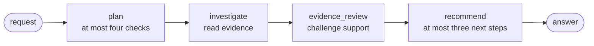
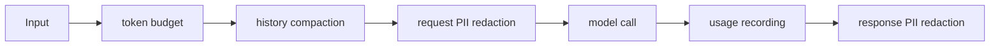

{}

- **You will:** Run a plan → investigate → evidence review → recommend graph, then move one stage and watch an offline test refuse the new topology.
- **You need:** [3.1. Tools](), [3.4. Memory](), and the local model from [1.4. Providers]().
- **Time:** about 30 minutes, hands-on. {}

## Why a declared stage order beats letting the model choose

A **workflow** is control flow declared as a graph of stages, fixed when the program is built. Nothing in it is chosen anew by the model on every turn. The model still interprets natural language and tool results inside a stage; the graph owns which stages exist and what follows each one. That split makes the topology testable while stage outputs stay nondeterministic.

Some steps have no payoff for a model. Ask the conversational agent from Chapter 2 to investigate an incident and it reads the record, the logs, and the runbook, then proposes a fix; what it will not reliably do is stop and ask whether what it read supports that fix. The check produces no new information and delays the answer, so a step you want on every investigation has to be structural.

This page makes that check one stage of a four-stage chain, moves a stage to watch an offline assertion refuse the new topology, and gives each stage only the tools its job needs. It is also where the chapter turns: earlier pages added capabilities the model chooses to use, and from here they change who decides. The worked example is `INC-001` through plan → investigate → evidence_review → recommend, standing in for any confident recommendation built on evidence nobody challenged.

The graph is pinned by a test that needs no model at all, so start from the assertion rather than the run:

```bash
cd agents/go
go test ./compose -run Workflow -count=1 -v
```

```text
--- PASS: TestWorkflowPromptContracts (0.00s)
--- PASS: TestWorkflowUsesStageSpecificReadOnlyTools (0.01s)
--- PASS: TestWorkflowEdgesAreALinearReadOnlyChain (0.02s)
--- PASS: TestWorkflowChainsFourStagesInOrder (0.02s)
ok  	github.com/MLOps-Courses/agentops-open-course/agents/go/compose	0.139s
```

Those are the four top-level result lines. The verbose run also prints `=== RUN`, `=== PAUSE`, and `=== CONT` for every test and sub-test, and an indented `--- PASS` for each sub-test; because these tests run in parallel it reports them in whatever order they finish, so yours will not match this block line for line.

Predict what happens if someone decides the review stage would be tidier at the end, after the recommendation. `workflowStageConfigs` is the method that returns the four stage configurations in execution order; swap its last two entries and run the same command:

```text
--- FAIL: TestWorkflowEdgesAreALinearReadOnlyChain (0.00s)
    workflow_test.go:92: the chain ends at "evidence_review", want "recommend"
--- FAIL: TestWorkflowChainsFourStagesInOrder (0.01s)
    workflow_test.go:32: stages = [plan investigate recommend evidence_review], want [plan investigate evidence_review recommend]
FAIL
FAIL	github.com/MLOps-Courses/agentops-open-course/agents/go/compose	0.030s
FAIL
```

The topology is an assertion, not a diagram in a design document: reordering it is a red test in under a second. Put the order back with `git restore -- agents/go/compose/workflow.go`.

## Run the four-stage investigation against the local model

Confirm Ollama is serving, then launch the workflow composition — the same binary as `mise run run`, with a different `AGENT_ENTRYPOINT`:

```bash
mise run doctor:model
cd agents/go
mise run workflow
```

Ask it:

```text
Investigate INC-001 and recommend the safest next step.
```

This makes local model calls through Ollama: no hosted service, no account, no API key. Every run crosses the same four stages:



**Diagram in words:** One request enters a fixed chain — plan, then investigate, then evidence review, then recommend. Each stage receives only its predecessor's **handoff**, the text that stage passes forward. The console prints every stage as it speaks, so the whole chain scrolls past; only the last stage's text is the answer.

Read the output for four things rather than for correctness: a target and a stopping condition in the plan, sourced observations in the investigation, an explicit verdict in the review, and a runbook-backed recommendation at the end. No stage can change incident state, so the worst outcome is bad advice whose reasoning you can read.

Most questions do not deserve four model calls, which is why `mise run run` still launches the faster conversational agent: its instruction _asks_ for a concise plan on multi-step investigations and a post-action check before claiming recovery, and both remain advisory model behavior. The graph always plans and always reviews.

| Surface                | Who chooses the next step? | Best fit                                         |
| ---------------------- | -------------------------- | ------------------------------------------------ |
| `mise run run`         | The model                  | Short questions and interactive approved actions |
| `mise run workflow`    | The declared graph         | Repeatable, read-only deep investigations        |
| `mise run coordinator` | A coordinator model        | Delegation between bounded specialists           |
| A plain Go function    | The code                   | Work needing no model judgment                   |

## Control flow you declare, not control flow the model picks

A declared graph is one rung on a ladder, so use the simplest mechanism that fits:

1. Plain Go when the rules are complete and no judgment is needed.
1. An ADK workflow when model-backed steps need a visible, bounded order.
1. An autonomous agent when the useful sequence genuinely depends on what it discovers.
1. A durable engine when work must survive process death, wait for hours, or run on a schedule.

ADK's `Workflow` is in-process orchestration, not a durable job system: a restart interrupts it, and graph structure does not change that.

Each of the four stages has one job and a bounded output contract. Every bound below is instruction text the model is asked to respect rather than code that refuses — the distinction the exercise tests.

| Stage             | Responsibility                                                          | Bound                                                                                          |
| ----------------- | ----------------------------------------------------------------------- | ---------------------------------------------------------------------------------------------- |
| `plan`            | Preserve the target and prescribe the four sources to read              | At most four bullets; no tools or invented facts                                               |
| `investigate`     | Derive service and runbook from one incident, then read those sources   | Exact reads plus incident-list fallback; observations separated from inference                 |
| `evidence_review` | Re-read only named sources and challenge missing or conflicting support | Exact incident, service, runbook, key observations, gaps, and one verdict in a compact handoff |
| `recommend`       | Reload only the handed-off runbook and offer what the verdict supports  | At most three steps; no discovery or action call                                               |

Three ADK calls build that graph, and the whole of it fits on a screen:



`workflow.NewAgentNode` wraps one configured agent as a node, taking the node's name and description from the agent itself; `workflow.Chain` turns the node list into the pairwise edges the runtime takes; `workflowagent.New` builds the graph agent that runs them. That produces `START → plan → investigate → evidence_review → recommend`. In the installed ADK runtime each node receives only its immediate predecessor's output, not an accumulated transcript, which is why the handoffs are load-bearing: `investigate` must carry the exact incident id, service, runbook slug, observed status, unfiltered log excerpts, and relevant runbook guidance forward, and `evidence_review` must preserve those identifiers plus up to four key observations, remaining gaps, and its supported, insufficient, or conflicting verdict. `recommend` can only preserve facts that survived both handoffs.

The handoff is contextual text rather than a typed object today. ADK ships the typed route: set `OutputKey` on a stage and its answer lands in session state under that key, which a later stage's instruction reads back with `{key}` templating. A consumer that needs an exact incident id or a verdict enum should take that route, or an output schema, instead of relying on phrasing — [4.0. Type Safety]() shows the schema half in the agent that already uses it.

The plan says what to look at, not what was found: it may not invent a symptom, cause, system, time window, or recovery fact.

Least privilege — only the access a stage's own job needs — runs per stage, not per graph. `investigate` gets the exact incident, service, log, and runbook readers plus `list_incidents` as a no-id fallback, listed last so the model reaches for it only when the plan named no incident. `evidence_review` gets the four exact readers and no listing or fuzzy search. `recommend` gets `get_runbook` alone. `plan` gets no tool at all. That is a foreign-key rule in tool form: `get_runbook` uses the slug `get_incident` supplied, and `search_runbooks` belongs to open-ended discovery, so this graph never sees it.

Three tools never reach any stage: `restart_service`, `resolve_incident`, and `save_incident_note`. The first two stay on the interactive agent behind confirmation and validated identity; the third writes memory, which a read-only graph has no business doing. A recommendation may name an action. Only a human-approved interactive turn can perform one.

Every stage runs under the same policy callbacks as the main agent, so the deep path is not a less-governed side road:



**Diagram in words:** Before each model call the workflow enforces the session token budget, compacts history, and redacts request PII; after it, usage is recorded and response PII redacted. That order is load-bearing: a refused call needs no further work, compaction decides which messages survive, and redaction runs on only those.

Tool output is treated as untrusted data, and model or tool failures become stable safe responses with the detail kept in logs. The fixed four-node topology bounds the minimum number of model calls per run — it is not permission to remove the session budget, because repeated runs still accumulate usage.

{}

The review stage is a bounded form of reflection: one separate node challenges what was gathered, before any advice exists. ADK ships a bounded reflection of its own — `plugin/retryandreflect`, which re-prompts a fixed number of times after a failed attempt — and this course declines it here for the same reason it declines the unbounded kind: a retry that re-reads nothing new buys confidence rather than evidence. An open-ended "reflect until satisfied" loop has no stopping condition and can multiply cost without reading anything new, so this course uses one pass with three explicit outcomes; when support is insufficient or conflicting, `recommend` asks for the missing check instead of smoothing uncertainty into confidence. The interactive agent asks for a second reflection point after an approved write. That one is advisory, kept from vanishing silently by a prompt-presence test — an assertion that the phrase is still in the instruction string — and only a controlled run shows whether a model obeys it.

Sequential, parallel, loop, and router shapes cover most useful orchestration. A sequential chain fits dependent stages, as here. A parallel fan-out fits independent reads whose latency you want to overlap. A loop fits refinement only when iterations and a failure exit are explicit. A router fits distinct task types deserving different tools or policies. On the pinned ADK 2.x stack, one `workflowagent.New` graph expresses all of them as edges; ADK Go also ships `sequentialagent`, `parallelagent`, and `loopagent` under `agent/workflowagents`, each fixing one shape over a list of sub-agents, so this repository declares its topology once as edges instead. Add another orchestration layer only when ADK's graph is the limiting factor. {}

## Your turn: find out whether the read-only limit is prose or construction

Two things could be keeping the `recommend` stage from changing state: `recommendInstruction` and its tool list. The instruction string it runs under tells it never to call either action, and the list does not contain them. Predict which of the two produces the failure when you hand a write tool back.

- **Mode**: `temporary experiment` — hand a write to a stage that should not have one, then take it back.
- **Goal**: distinguish a limit enforced by construction from one enforced by prose.
- **Files to touch**: `agents/go/compose/workflow.go` only.
- **Preflight**: `git diff --quiet -- agents/go/compose/workflow.go`, and `cd agents/go && go test ./compose -run Workflow -count=1` green.
- **Steps**: read `recommendInstruction`, then add `c.tools.RestartService` to the `recommend` stage's tool list and run the focused test again.
- **Gate that proves completion**: the focused run fails naming the stage and the tool it must not hold, and you can say which of the two prohibitions — the sentence or the list — produced the failure.
- **Final state**: `git restore -- agents/go/compose/workflow.go`, then `cd agents/go && go test ./compose -run Workflow -count=1` green again.

To extend the graph instead, the natural next step is a parallel fan-out: a service-health node and a log node after `plan`, joined before `evidence_review`. Read the installed API first with `cd agents/go && go doc google.golang.org/adk/v2/workflow`, and make the test assert the new topology, both read-only tool lists, the app-wide policy, and an unchanged stopping condition. Parallelism changes latency and event order, and must not change what the review stage receives.

## What you can do now

- You can name the chain `plan → investigate → evidence_review → recommend`, and say what each stage receives: its predecessor's handoff, not a transcript.
- You can point at `workflowStageConfigs` as the only place stage order lives, and predict the two assertions that fail when it moves.
- You can say why one bounded review pass is safer than an unbounded self-reflection loop, and name the three write-capable tools no stage receives.
- You can choose between plain Go, the interactive agent, and the declared graph for a new task, and justify the extra model calls when you pick the graph.

Whether a model diagnoses `INC-001` well _inside_ those bounds is measured separately: run the harness against `workflow.evalset.json` with `--entrypoint workflow` and read the sanitized artifact, keeping it in the model-backed lane that [0.2. Evidence]() defines.

Continue to [3.6. A2A](), where the agent becomes something another team can call.
