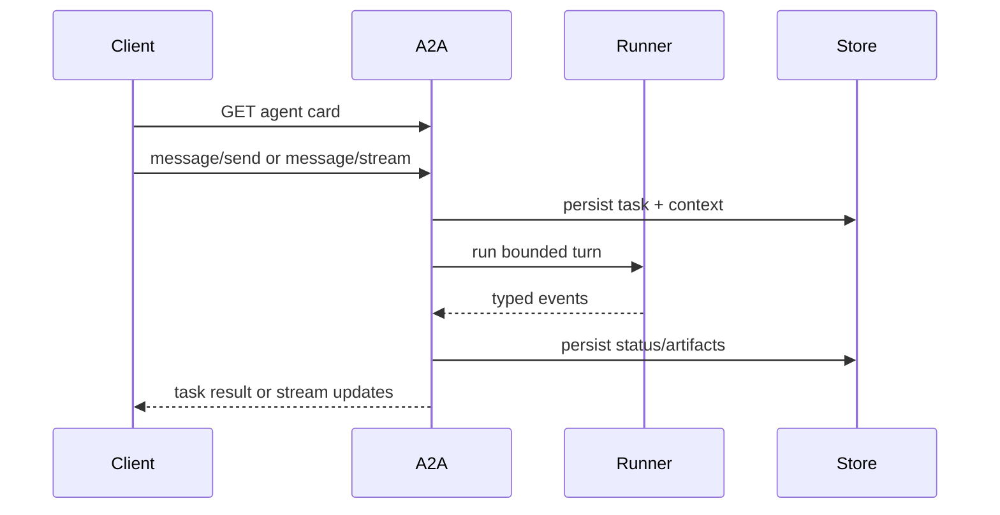

{}

- **You will:** Serve the agent over A2A, read its card and probes, submit a task and query its persisted state, and watch a confirmed network write refuse anyway.
- **You need:** [2.4. Sessions]() finished; a configured model only for the live task.
- **Time:** about 40 minutes, hands-on. {}

## What A2A adds: an address, a card, and durable tasks

**A2A** is a protocol for discovering an agent over the network and exchanging stateful work with it. The exchange covers messages, **artifacts** (a task's typed outputs, as opposed to its status), status, streaming events, push notifications, and cancellation. The unit of work is a **task** — one request the server persists, with an id, a state, and a terminal outcome. MCP exposes tools to a consumer; A2A exposes the agent itself as a peer service, and this course uses both: MCP for six reads, A2A for the whole conversational surface.

Everything that makes a local agent workable disappears once another team's tooling is the caller: no terminal, no session held in memory, nobody watching the output. That caller needs an address, a machine-readable description of what lives there, and work that survives a dropped connection. This page publishes all three and ends on a confirmed write that refuses anyway.

Start it from the Go module:

```bash
cd agents/go
mise run a2a
```

In a second terminal, read only the public metadata:

```bash
curl -s http://127.0.0.1:8080/.well-known/agent-card.json | jq .
```

```json
{
  "name": "AgentOps Agent",
  "description": "Runbook-grounded incident triage and guarded remediation for the AgentOps Open Course.",
  "version": "development",
  "skills": [
    { "id": "incident-triage", "name": "Incident triage", "tags": ["incident", "triage", "operations"] },
    { "id": "remediation", "name": "Guarded remediation", "tags": ["runbook", "remediation", "approval"] }
  ],
  "capabilities": { "streaming": true },
  "supportedInterfaces": [
    { "url": "http://localhost:8080/", "protocolBinding": "JSONRPC", "protocolVersion": "0.3" },
    { "url": "http://localhost:8080/a2a/v1/invoke", "protocolBinding": "JSONRPC", "protocolVersion": "1.0" }
  ],
  "url": "http://localhost:8080/",
  "preferredTransport": "JSONRPC"
}
```

That card is trimmed for width: the real one also lists input and output modes, describes each skill with examples, and carries a top-level `"protocolVersion": "0.3"`. A2A itself is past that number: the specification reached stable v1.0 on 12 March 2026. The pinned `a2a-go/v2` sets `a2a.Version` to `1.0`; its `a2acompat/a2av0` package keeps the `0.3` binding, and the top-level field advertises the older one so a client that never moved can still parse the card. <a id="what-does-the-agent-card-declare"></a>What is left is what a client needs to decide whether to call this agent: identity, description, skills, both protocol interfaces, streaming capability, and the callable URL. That URL comes from `AGENT_A2A_PROTOCOL`, `AGENT_A2A_HOST`, and `AGENT_A2A_PORT`, never from the interface the server binds, so it never advertises a bind wildcard. The flag that is absent is `pushNotifications`: A2A's third delivery mode posts task updates to a URL the caller supplies, so serving it means an outbound request into the cluster aimed by whoever called. This server declines it, because the loopback and port-forward profiles here carry neither callback authentication nor an egress allowlist to bound one.

The two probes answer the same questions they answer for MCP, and here both say yes, because this process publishes runtime state at startup:

```bash
curl -s http://127.0.0.1:8080/livez
curl -s http://127.0.0.1:8080/healthz
```

```text
{"status":"alive"}
{"status":"ready"}
```

## How a task is persisted, bounded, and drained

A client discovers the card, sends a message tagged with a task id or a **context id**, which groups tasks into one logical conversation. It watches the task change state, and can reconnect, query, or cancel:



**Diagram in words:** The client reads the agent card, then sends or streams a message. The server persists task and context state, runs one bounded ADK turn, persists status and artifacts from typed events, and returns either a final task or streaming updates.

Send one. This calls the configured model, so it is the slow command on this page:

```bash
curl -s -X POST http://127.0.0.1:8080/ -H 'Content-Type: application/json' \
  -d '{"jsonrpc":"2.0","id":1,"method":"message/send","params":{"message":{"role":"user","parts":[{"kind":"text","text":"What is the status of the inventory service?"}],"messageId":"m-1","kind":"message"}}}'
```

Predict what the server does when the model never answers: nothing, hang until the client gives up, or write something down. Stop Ollama first to see it yourself; with a warm model you get the happy path. On a cold CPU-only laptop the model had not been loaded yet and every attempt exceeded `AGENT_MODEL_TIMEOUT_S`, so the first attempt at that request produced this rather than an answer — the task's status object, with its ids and timestamp trimmed away:

```json
{
  "state": "failed",
  "message": {
    "role": "agent",
    "parts": [
      { "kind": "text", "text": "llm error response (code MODEL_UNAVAILABLE): \"Model request failed safely.\"" },
      {
        "kind": "text",
        "text": "The model provider is unavailable. Retry the request or inspect the provider endpoint logs."
      }
    ]
  }
}
```

A bad turn, and a good demonstration: the failure is a task in a terminal state with a sanitized message, not a truncated answer and not silence. Query it afterwards with the id from the response — no model involved:

```bash
curl -s -X POST http://127.0.0.1:8080/ -H 'Content-Type: application/json' \
  -d '{"jsonrpc":"2.0","id":9,"method":"tasks/get","params":{"id":"<your-task-id>"}}' | jq '.result.status.state'
```

```json
"failed"
```

The state is durable because the task store is SQLite under the configured state directory, alongside ADK's database session service, and both are opened during the same startup sequence that publishes the dataset [3.3. MCP]() found missing. Ask for a task that never existed and the answer is equally specific, with the error's type URL, domain, and timestamp trimmed:

```json
{
  "error": { "code": -32001, "message": "failed to get task: task not found", "data": [{ "reason": "TASK_NOT_FOUND" }] }
}
```

That same message is what an authenticated caller gets for a task owned by somebody else. Creating a task stores the subject a trusted gateway verified — `AGENT_TRUSTED_IDENTITY_HEADER` below carries it — and get, update, and list all require that owner, reported as "not found" rather than "forbidden", matching the pinned A2A store and refusing to act as an ownership oracle. Be honest about the limit of that: the account-free anonymous surface makes no multi-user confidentiality claim at all, so keep it on a reviewed private or loopback path and require gateway authentication before sharing it.

Several bounds keep one task from becoming an unbounded agent loop: `AGENT_A2A_MAX_LLM_CALLS` caps model calls in one invocation, the model, tool, and drain timeouts are typed configuration, the session token budget can stop the next model call, the runner serializes one logical context while unrelated sessions run concurrently, and task state and error detail are persisted with the details sanitized. They bound work. None of them claims a quality score.

The card advertises `"streaming": true`, so a `message/stream` client always receives server-sent events of whole task updates. Whether the _model_ streams token by token is a separate switch:



`AGENT_A2A_STREAMING` chooses between ADK's SSE streaming mode and none, and the default is none. A client must therefore treat partial text as provisional and query the persisted task before deciding what completed, so that a failed stream is never mistaken for a successful empty answer. [3.8. Streaming]() owns that switch.

Cancellation arrives as a canceled context, and so does shutdown, which is why one function handles both:



`Serve` starts the listener and waits on two things: a listener error, or the context being done. Ctrl-C and a Kubernetes SIGTERM both arrive on the second branch and both return `nil`, because neither is a failure. The part worth copying is the drain: its context is built with `context.WithoutCancel`, since a shutdown context that is already canceled would drain for exactly zero seconds. In-flight turns get `DrainTimeout` to finish and then the process exits, which reduces avoidable interruption and nothing more — a turn that outlasts the window is still cut. Correctness comes from the transactional write in [3.1. Tools](), never from drain time: a canceled task cannot leave a committed mutation without its audit row. `AGENT_DRAIN_TIMEOUT_S` sets that window, and it must stay below the Pod's termination grace period, the time Kubernetes allows between SIGTERM and SIGKILL, wherever one exists.

To exercise the whole A2A path against a model, use the black-box harness rather than a hand-rolled client: it drives the agent over the protocol and never imports its packages. Transport is a flag on the one evaluation task:

```bash
mise run eval -- --transport a2a --output a2a-results.json
```

It folds task, status, and artifact events into the same captured `Turn` that REST produces, so one scorer grades either surface and transport equivalence compares normalized completed turns rather than frame layout. The `--output` override keeps the A2A artifact beside the REST one instead of overwriting it. That run is model-backed, not an offline check — [0.2. Evidence]() draws the line.

{}

Start from the Go A2A SDK types pinned in `agents/go/go.mod`, not from handwritten maps copied out of a tutorial. Fetch and validate the card, select one supported interface, send a read-only message with explicit ids, fold task, status, message, and artifact events into one typed local result, and treat partial text as provisional while handling cancellation. The executable version is `evals/client.go`; `evals/turn_client_test.go` exercises the event folding without importing the agent. The second exercise below is that client, cut to its shortest honest form.

<a id="what-is-in-process-delegation"></a>Splitting is the harder decision. In-process delegation — [3.7. Multi-Agent]() — transfers work to a specialist inside the same process, sharing the policy plugin, model, and resource lifecycle. A2A adds discovery, authentication, persistence, transport failure, versioning, and deployment ownership. Pay for those when a split has an owner and a measurable reason: different data authority, release cadence, scaling profile, runtime, or availability objective. "Multi-agent" on its own is not a reason to add a network hop. {}

## Why an A2A confirmation is not authentication

**Confirmation** approves a proposed action; **authentication** establishes who is asking. Locally the difference is invisible, because the only person who can approve is the one at the keyboard. On an unauthenticated A2A request the "user" is a synthetic identity derived from the context id, invented for session and memory scoping — the edge [3.4. Memory]() traces through the stores.

So the guarded writes ask for more: even after a valid ADK confirmation, `restart_service` and `resolve_incident` refuse to mutate operational state unless a trusted gateway supplied a verified subject and that subject owns the invocation. Watch it happen with no model and no listener:

```bash
cd agents/go
go test ./a2aserver -run TestUnauthenticatedA2AConfirmationCannotMutateTheRealStore -count=1 -v
```

```text
=== RUN   TestUnauthenticatedA2AConfirmationCannotMutateTheRealStore
--- PASS: TestUnauthenticatedA2AConfirmationCannotMutateTheRealStore (0.90s)
PASS
ok  	github.com/MLOps-Courses/agentops-open-course/agents/go/a2aserver	0.930s
```

Those are four lines of about seventy-five. Between them come a `=== PAUSE`, a `=== CONT`, and ADK's session store printing GORM `record not found` chatter, because the test opens a brand-new temporary database where the first lookup of anything is correctly a miss. None of it is a failure.

The test completes the real confirmation flow against that temporary SQLite store, then checks that the service stayed down and no audit row was inserted. `AGENT_TRUSTED_IDENTITY_HEADER` turns a gateway-verified subject into that typed principal, and setting it is safe only behind a gateway that validates credentials and overwrites any client-supplied copy. Left unset — the default — no arbitrary header is ever trusted.

## Your turn: widen the bind address and reread the agent card

A service that binds every interface and then tells clients to call `0.0.0.0` has published an address no client can use. It is also an invitation nobody should accept. Read the card under the condition that would expose that mistake.

- **Mode**: `inspect` — every step is a read; nothing on disk changes.
- **Goal**: confirm the advertised URL comes from the advertised-host settings and never from the bind interface.
- **Files to touch**: none.
- **Preflight**: `cd agents/go && mise run build`, stop any A2A server already on `:8080`, and have `curl` and `jq` on your path.
- **Steps**: start the server with a wide bind and a spare port — `cd agents/go && AGENT_A2A_BIND_HOST=0.0.0.0 AGENT_A2A_PORT=8086 ./bin/agent a2a` — then fetch the card from `http://127.0.0.1:8086/.well-known/agent-card.json` and read `.url` and every entry of `.supportedInterfaces[].url`. Look at the startup log line too.
- **Gate that proves completion**: every advertised URL names `localhost:8086`, none of them contains `0.0.0.0`, and you can explain why the log line prints `address=<IP_ADDRESS>:8086` rather than the literal bind address.
- **Final state**: stop the server with Ctrl-C. No files changed.

The redacted log line is not an accident: every record passes through the sanitizing handler, which masks IP addresses wherever they appear, including in the server's own startup message. When you need the bind address, read `mise run config:check`, not the log.

## Your turn: write the client that consumes somebody else's agent

Reading a card proves the server keeps its promises. Writing a client proves you can consume one, which is the more likely thing you will do at work: most teams meet A2A as a peer's endpoint long before they publish their own.

Predict first: your client sends one message and gets back a task. Which field tells you whether the answer is final, and which tells you whether the agent is waiting for something from you?

- **Mode**: `keep` — this client is yours; it stays in your working tree.
- **Goal**: fetch a card, pick an interface, ask one read-only question, and fold the reply into a final answer plus a terminal state.
- **Files to touch**: one new `main.go` in a directory you create under `agents/go/cmd/`, which keeps it inside the module whose `go.mod` already pins the A2A SDK. This page calls it `a2a-peek`.
- **Preflight**: `cd agents/go && mise run build`, then `mise run a2a` in one terminal; `curl -fsS http://localhost:8080/healthz` returns `ready`.
- **Steps**: fetch `/.well-known/agent-card.json` and decode it into the SDK's card type rather than a map — a card that does not decode is a peer you should not call. Read `supportedInterfaces` and pick the JSON-RPC one by its declared transport instead of hard-coding a path. Send one `message/send` with a `contextId` you minted and a text part asking `What is the status of the inventory service?`. Decode the result and fold it: text parts from `artifacts` and from `status.message` are the answer, `status.state` is the terminal condition. Print both. Handle `input-required` explicitly — printing "the peer is waiting for you" is a correct outcome, and treating it as a final answer is the bug this exercise exists to teach.
- **Gate that proves completion**: `cd agents/go && go run ./cmd/a2a-peek` prints a folded answer naming `inventory` and a state of `completed`, and prints the waiting message rather than an empty answer if you point it at a question that proposes a guarded write.
- **Final state**: your client stays; `git status --short` shows only the directory you added. Stop the server with Ctrl-C.

Sixty lines is enough, and `evals/client.go` is the reference when a field surprises you — it folds the same four event shapes, with the sanitization rules a published client needs on top.

## What you can do now

- You published the agent as a discoverable service and read its card, both protocol interfaces, and its two probes.
- You submitted a task, read its persisted state back with no model running, and can say what the server writes down when a turn fails.
- You can explain why a confirmed action over an unauthenticated A2A request still changes nothing, and which setting turns a gateway-verified subject into an approver.
- `cd agents/go && go test ./a2aserver` passes — card, task persistence, concurrent sessions, streaming, cancellation, drain, and restore — and `cd evals && mise run eval:validate` validates the assets without importing agent internals.

Continue to [3.7. Multi-Agent](), where one agent becomes three and only one of them can act.
