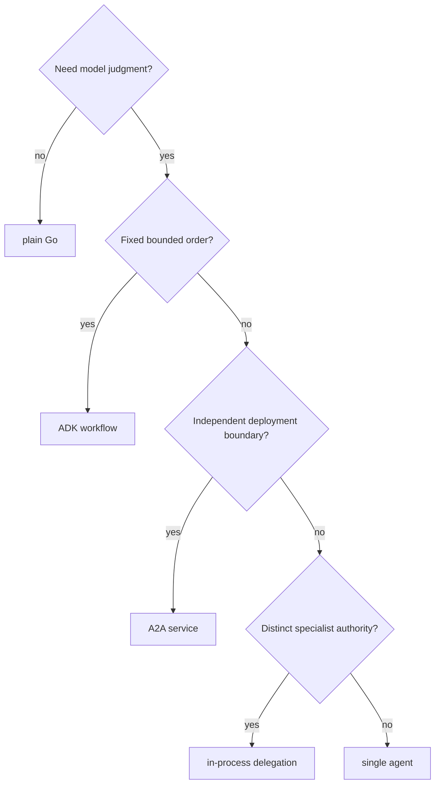

{}

- **You will:** Add ten capabilities one at a time, each with a limit and a check that fails when it is widened.
- **You need:** `mise run install` done at the repository root. No model, key, or container for the commands here. Assumed, not required: the agent from [2.1. First Agent]().
- **Time:** about 8 minutes, orientation. {}

## What the agent cannot do yet, and which page adds it

A **capability** is an addition that widens the agent's reach: a tool, a reviewed procedure, a memory store, a declared stage order, a specialist. Adding one is easy: anything gets more capable when you hand it more tools. The work is drawing a limit around each addition, so that widening it fails a check instead of surfacing during an incident.

Most of those limits are decidable **offline**: a Go test or a schema comparison settles them in seconds, with no model or network. Two are not, because the model decides them at runtime — which skill it loads, and which specialist the coordinator picks — and their pages say so.

The agent you ran in [2.1. First Agent]() answers from a fixed list of reads it holds in-process, and that is all. It cannot answer a single question in the left column below.

Ten pages, one capability each. Each tag names the page kind, then what it costs to run:

| When you ask...                  | What the page hands you                          | Page                                                                                                                         |
| -------------------------------- | ------------------------------------------------ | ---------------------------------------------------------------------------------------------------------------------------- |
| What am I actually building?     | one module, one binary, four surfaces            | [3.0. Packaging]() _(hands-on · offline)_                                 |
| How does it reach a real system? | typed reads, writes that fail closed             | [3.1. Tools]() _(hands-on · offline; model at the exercise gate)_             |
| Where do procedures live?        | reviewed procedures, loaded only when they match | [3.2. Skills]() _(hands-on · offline; model at the exercise gate)_           |
| Who else can call these tools?   | six reads on the wire, allowlisted               | [3.3. MCP]() _(hands-on · offline, second terminal)_                            |
| What should it remember?         | six stores, and ranking you can watch            | [3.4. Memory]() _(hands-on · offline, MCP server running)_                   |
| What stops it skipping a step?   | four stages the model cannot shortcut            | [3.5. Workflows]() _(hands-on · offline, except the live run)_            |
| How does another team call it?   | an address, a card, durable tasks                | [3.6. A2A]() _(hands-on · offline, except the live task)_                       |
| Who is allowed to act?           | specialists that cannot borrow authority         | [3.7. Multi-Agent]() _(hands-on · offline, except the coordinator run)_ |
| Why is nothing on screen yet?    | per-token delivery, and its redaction window     | [3.8. Streaming]() _(hands-on · needs a model)_                           |
| Does the whole thing work?       | INC-002, read back call by call                  | [3.9. Incident Run]() _(hands-on · needs a model)_                     |

Those ten pages run to about five hours of hands-on work in total, with a seam in the middle: 3.0 to 3.4 add capabilities the model chooses to use, while 3.5 to 3.9 change who decides the sequence and who is allowed to act. [3.4. Memory]() closes that first half, a natural stopping point.

Every one of those pages adds an element to the same value you already read in Chapter 2 — a config with an instruction, a tool list, and a toolset list, where a **toolset** supplies its tools per turn rather than at build time:



## How to choose where a new capability lives

Placement is the decision that survives contact with production; there are only five answers. Four questions pick between them, in order.



**Diagram in words:** Work needing no model judgment stays plain Go. Model-backed work with a fixed order becomes a workflow. A capability with its own deployment owner becomes an A2A service; distinct authority inside one runtime becomes delegation. Everything else stays one agent.

MCP sits outside that tree: it moves a tool into another process without deciding the orchestration shape, which is why 3.3 changes where the six reads execute and changes nothing the model sees.

## Where each capability lives, and what it deliberately lacks

Each capability has one owning package, and its authority stops at that package's edge.

| Capability                 | Source authority                                           | Authority it does not get                      |
| -------------------------- | ---------------------------------------------------------- | ---------------------------------------------- |
| Packaging                  | `agents/go/go.mod`, `go.sum`, and `vendor/` when generated | no second binary per composition               |
| Incident tools and actions | `agents/go/tools`                                          | no generic SQL or filesystem escape hatch      |
| Skills                     | `agents/go/compose/skills.go`, `agents/data/skills`        | no arbitrary file reads from a skill directory |
| MCP server and client      | `agents/go/mcpserver`, `agents/go/compose/mcp.go`          | no write tool, in either direction             |
| Memory and retrieval       | `agents/go/memory`                                         | no silent context injection                    |
| Workflow and delegation    | `agents/go/compose/workflow.go`, `delegation.go`           | no write tool on any workflow stage            |
| A2A runtime                | `agents/go/a2aserver`                                      | no guarded write without a verified principal  |
| Black-box protocol runs    | `evals`                                                    | no import of the agent implementation          |

Typed configuration owns the switches that move those limits; `mise run config:check` prints the resolved values with secrets masked:

- **Placement**: `AGENT_MCP_URL` moves conversational reads to a remote server; `AGENT_ENTRYPOINT` selects the agent, workflow, or coordinator composition.
- **Retrieval**: `AGENT_SEMANTIC_RETRIEVAL` swaps the retrieval scorer.
- **Bounds**: `AGENT_MAX_HISTORY_MESSAGES` and `AGENT_MAX_TOKENS_PER_SESSION` bound context work; `AGENT_A2A_MAX_LLM_CALLS` and `AGENT_A2A_STREAMING` bound network execution.
- **Writes**: `AGENT_WRITES_DISABLED` freezes actions without touching a read schema.

## What this chapter proved

Run the whole Go module suite, then the standalone evaluation assets. Neither needs a model:

```bash
cd agents/go
mise run check
mise run test
cd ../../evals
mise run eval:validate
```

`mise run test` ends by reading the coverage profile it just wrote. Here is the tail of a real run in this checkout, with fourteen of the twenty package lines cut for width:

```text
DONE 1828 tests, 1 skipped in 1.807s
[test] $ ../../scripts/check-coverage.sh coverage.out 80 agents/go
  ok      84.2%  agents/go/a2aserver
  ok      91.7%  agents/go/compose
  ok      88.6%  agents/go/mcpserver
  ok      87.7%  agents/go/memory
  ok      90.9%  agents/go/policy
  ok      98.5%  agents/go/tools
agents/go meets the 80% per-package coverage floor
```

Two seconds, no model, no network. The floor applies per package, not to a repository total, because a total lets a well-tested `domain` package carry an untested `mcpserver`: a capability added without tests fails the run instead of diluting an average.

**You are done when:**

- The tool, skill, MCP, retrieval, workflow, A2A, and delegation tests pass under the race detector, and the evaluation assets validate without importing the agent.
- If you took the exercise, you kept the read tool you prototyped in [3.1. Tools]() — parse-at-the-boundary input, bounded output, and an explicit MCP exposure decision.
- You can pick between plain Go, a workflow, one agent, delegation, and A2A for a new task, and say what each costs.
- For any capability here, you can name the authority it deliberately lacks and the test that would fail the moment it gained one.

Every limit in this chapter is a claim about code, and a claim holds only as long as the suite that pins it — which is what [4. Quality]() establishes next.

Continue to [3.0. Packaging]() once `mise run test` is green inside `agents/go`, because every capability in this chapter is added to the one module that page builds.
