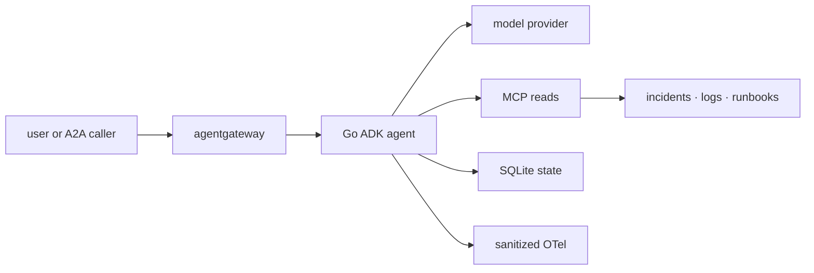

{}

- **You will:** Watch a write tool fail to exist, run the adversarial regression suite, and widen a least-privilege allowlist until the tests stop you.
- **You need:** `mise run install` done, plus `mise run install:platform` and the Docker CLI for `check:infra`. No model, cluster, or account; the scanners use the network.
- **Time:** about 28 minutes, hands-on. {}

## Why removing a write tool beats guarding it

**Subtraction** is the security move this page teaches: rather than guard a capability, do not build it. **Least privilege** taken to zero: a capability a process does not hold cannot be bypassed, misconfigured, or argued into firing — no rule to weaken, no configuration to get wrong, no check to skip. A guardrail cannot reach that property, because it refuses an action the system could still take; that is why the previous page's guardrails come second, not first.

This page covers what the design removes, the offline suite that proves it, the pins a scanner can read, and an allowlist you will fail to widen.

The reference agent's MCP server serves an allowlist of six read tools and no writes, so a client asking it to restart a service gets an answer about existence, not permission — the response's `error` object, indented for reading:

```json
{ "code": -32602, "message": "unknown tool \"restart_service\"" }
```

There is no permission check to bypass, because there is no tool to call.

Serve the reads with `mise run mcp:http` from `agents/go` and you can send that request yourself, with the `curl` recipe from [3.3. MCP](). Try a path-traversal attempt through `get_runbook` while the server is up; the answer arrives in the call's `structuredContent`, because the surface never builds a file path from the string:

```json
{
  "error": "Invalid runbook slug \"../../../etc/passwd\". Available runbooks: cascade-failure, deployment-rollback, disk-full, elevated-errors, high-latency, memory-leak, service-down."
}
```

Neither refusal came from an authorization rule. A test pins the missing write; the build fails if anyone adds one back:

```bash
cd agents/go
go test ./mcpserver -run TestServerNeverExposesTheGuardedWrites -count=1
```

```text
ok  	github.com/MLOps-Courses/agentops-open-course/agents/go/mcpserver	0.063s
```

## What the attack surface covers, and what the design removes

Every place untrusted input, authority, state, or a dependency crosses a boundary belongs to the **attack surface**:



**Diagram in words:** A user or A2A caller reaches the Go agent through an optional gateway. The agent calls a model, reads through local or MCP tools, writes only through guarded SQLite actions, consumes untrusted incident data, and exports sanitized telemetry.

The threats on those edges are familiar: prompt injection in retrieved data, PII disclosure, credential leakage, path traversal, unsafe targets, replayed writes, unverified identity, tool-surface widening, denial of service, and dependency compromise.

The design's first move against each is subtraction rather than defense:

- The public MCP surface carries six reads and no writes.
- Workflow stages are read-only.
- Diagnosis cannot act; remediation cannot read raw logs or runbooks.
- The coordinator holds no action tools at all.
- Writes require confirmation, verified identity, target validation, and an atomic audit.
- Host listeners bind loopback; Kubernetes uses explicit NetworkPolicies and no public Service.
- The default model path is local and account-free.

With no write on the MCP surface there is nothing to replay or widen, and a loopback-only listener puts remote denial of service out of reach. Prompt injection and PII disclosure get no subtraction, because both arrive inside data the agent must read; guardrails hold that line instead.

Instruction text reinforces those boundaries; it does not create them, because a sentence in a prompt is a request, and an adversarial reader ignores it.

The clearest subtraction is the tool this course does not implement. A code executor would convert generated text into direct process, filesystem, and possibly network authority — the largest privilege jump available in an agent design. If an extension needs one, isolate it in an ephemeral sandbox with no credentials, no host mounts, closed egress, strict CPU, memory and time limits, an input/output allowlist, and disposable storage, and treat sandbox escape as its own threat model rather than a footnote in this one.

## How the offline red-team suite pins every refusal

Everything the policy layer refuses is pinned by deterministic tests, under the race detector, with no model in sight:

```bash
mise run redteam
```

```text
[redteam] $ cd agents/go && go test -race ./policy -run 'Injection|Redact|PII|Credential|Prompt'
ok  	github.com/MLOps-Courses/agentops-open-course/agents/go/policy	1.079s
```

A little over a second, and the echoed command line is the only hint of what it covered. Run the same filter verbosely and its twenty-six tests name themselves; here are the first six a run finished:

```bash
cd agents/go
go test -race ./policy -run 'Injection|Redact|PII|Credential|Prompt' -v -count=1
```

```text
--- PASS: TestRedactionNeedsNothingFromTheContext (0.00s)
--- PASS: TestAfterModelCallbackRedactsFinalOutput (0.00s)
--- PASS: TestStreamedPartialChunksAreRedactedIndividually (0.00s)
--- PASS: TestRequestCallbackRedactsFunctionCallArguments (0.00s)
--- PASS: TestRequestCallbackRedactsCredentialsInTextAndStructuredValues (0.00s)
--- PASS: TestPersistedRedactionRecursesThroughSessionAndToolShapes (0.01s)
```

They run in parallel, so yours arrive in a different order. Read the names, not the order: each is a specific way data or instructions reach somewhere they do not belong — a streamed chunk that skipped redaction, a credential hiding inside a function-call argument, a saved session that kept what the response dropped. Other packages pin the rest — traversal, approval, identity, replay, state recovery, protocol allowlists — and none needs a model, gateway, cluster, cloud resource, or account. That makes this suite a **merge gate**, a check that must be green before code lands, rather than a report; [0.2. Evidence]() owns that distinction.

This is not penetration testing. These cases prove the code refuses the attacks _somebody already thought of_, in a deterministic harness. Live-model security testing is a different activity with a different budget: a separately authorized, cost-bounded campaign against a non-production target, with fixed hostile prompts, explicit expected refusals, sanitized captures, request and token caps, and a teardown plan. Do not call an external model from the offline suite, and do not turn probabilistic live behavior into a silent merge blocker.

## Secrets, pins, and the questions a scanner cannot answer

Credentials stay outside source and are masked at every reporting boundary. `.env` is gitignored, user-readable only, and loaded only by model-backed tasks; `config.Secret` masks values in `config:check`; Kubernetes uses encrypted secret workflows or Workload Identity rather than a committed cloud key; and logs, traces, evaluation artifacts, screenshots, and examples must contain no credential, which is why the deterministic tests use non-secret markers. If you find a real credential in this tree, revoke or rotate it — deleting the text only removes your ability to find it again.

Dependencies are pinned with one authority per ecosystem: root `mise.toml` and `mise.lock` for CLI tools, `go.mod` plus `go.sum` for the three Go modules, digest-pinned container image references at their use sites, pinned Helm charts and Kubernetes API versions in platform configuration, and recorded version plus SHA-256 for vendored browser assets. Where a version is held back, the reason sits next to the pin, because an upgrade is a tested decision rather than a search-and-replace.

Then run the scanners, each answering a different question: Go vulnerability analysis reads reachable module code, the license inventory reads the locked dependency graphs, the infrastructure check renders and validates the manifests, and Trivy plus gitleaks cover dependencies, configuration, secrets, images, and history.

```bash
mise run check:vuln
mise run check:licenses
mise run check:infra
mise run secure
```

Advisory data can be stale or unreachable, and a scan whose database never loaded is not a scan that passed — report that boundary rather than the exit code.

Be equally plain about what no scanner decides: model behavior, authorization design, runtime isolation, and unknown vulnerabilities. An accepted exception needs a narrow scope, a written rationale, an expiry or review trigger, and a compensating control. `trivy.yaml` holds the two this repository carries, unfixed vulnerabilities and eleven reviewed license identifiers, each with its reason written above it. Everything else on this page is a lab boundary rather than a production posture, so read the controls as shapes to fit your own identity, retention, capacity, and review, not as a deployment to adopt.

## Your turn: widen the MCP allowlist and count what refuses

Least privilege is only real if something enforces it. Try to give the MCP surface a write tool.

- **Mode**: `temporary experiment`.
- **Goal**: add a guarded write to the MCP read allowlist and see how many independent checks refuse it.
- **Files to touch**: temporarily edit only `agents/go/compose/mcp.go`; change no test.
- **Preflight**: require `git diff --quiet -- agents/go/compose/mcp.go`, and confirm `cd agents/go && go test ./compose ./mcpserver -count=1` is green.
- **Steps**: append `tools.RestartServiceToolName` to the slice returned by `MCPReadToolNames()`. Predict before you run: does the allowlist test fail alone, or does the server refuse to start as well?
- **Gate that proves completion**: `cd agents/go && go test ./compose -run TestMCPAllowlistMatchesTheLocalReadSurface -count=1` exits non-zero and names the tool it admitted.
- **Final state**: run `git restore -- agents/go/compose/mcp.go`, then `cd agents/go && go test ./compose ./mcpserver -count=1` is green again.

The focused failure names the tool and the rule:

```text
--- FAIL: TestMCPAllowlistMatchesTheLocalReadSurface (0.00s)
    mcp_test.go:34: MCPReadToolNames() = [list_incidents get_incident get_service_status search_service_logs get_runbook search_runbooks restart_service], want the local read surface [list_incidents get_incident get_service_status search_service_logs get_runbook search_runbooks]
    mcp_test.go:38: the allowlist admits "restart_service"; writes never leave this process
FAIL
FAIL	github.com/MLOps-Courses/agentops-open-course/agents/go/compose	0.011s
FAIL
```

Run the wider `./mcpserver` package and the prediction is answered: the server constructor itself refuses, because the allowlist now names a tool the server does not serve.

## What you can do now

- You can say why `unknown tool` beats `forbidden` as an answer: there is no permission check left to bypass.
- You can name what `mise run redteam` pins under the race detector: streamed chunks, call arguments, saved sessions.
- You can predict what adding `restart_service` to the allowlist breaks: the compose test, then the server constructor.
- You can state what the scanners never decide, and what this course does not claim to secure.

Subtraction first, refusal second, proof third — and the cheapest is the step most teams skip: deciding which capabilities the system will not have.

Continue to [5. Gateway](), where this hardened application boundary goes behind centralized policy and the traffic itself starts being governed.
