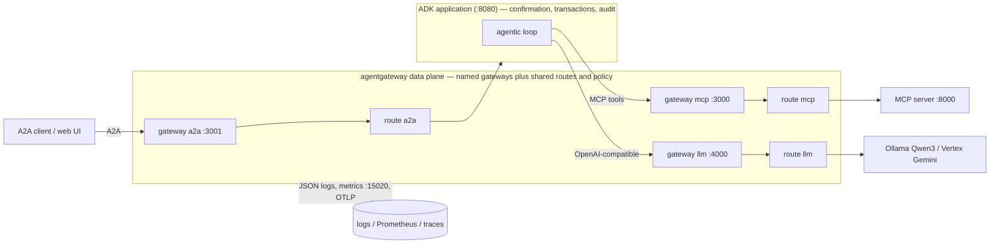
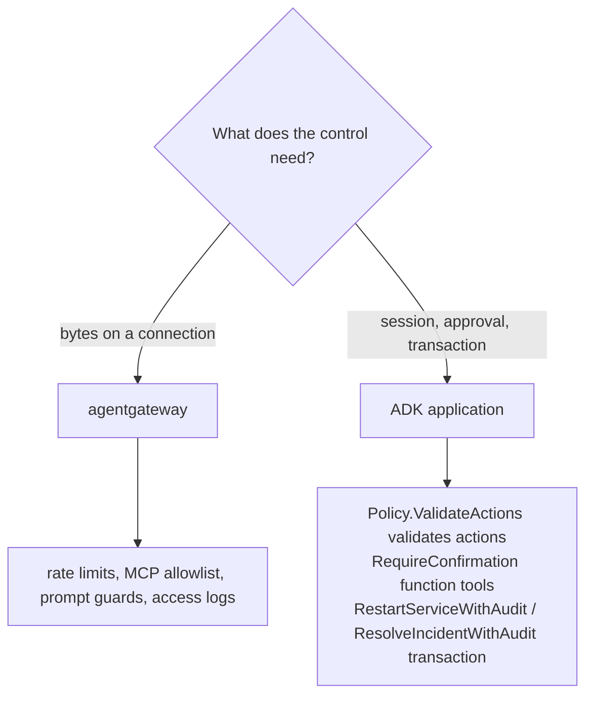

{}

- **You will:** Learn why the agent's model, tool, and client connections are worth routing through one proxy, which port carries which, and what must never move there.
- **You need:** `mise run install` and `mise run install:platform` done, plus Docker running for the closing `mise run check:infra`. No cluster, model, or account.
- **Time:** about 14 minutes, concept. {}

## Why route the agent's connections through one reverse proxy

A **gateway** here is a **reverse proxy**: one process in the request path, in front of shared backends. It holds the traffic decisions each connection would otherwise carry for itself — which model endpoint answers, which tools are callable, how fast a caller may push, what gets logged, and who is allowed in.

The agent from Chapters 2-4 opened those connections itself, so each decision lived in application code and was correct exactly once. The second process that talks to the same backends copies them, and the copy is where they drift. A control enforced once at a shared boundary cannot be forgotten by the next client — the same argument [5.5. Gateway Security]() makes for tool allowlists and rate limits.

This page maps each listener to its protocol and upstream, names the four configuration keys that produce them, checks that the security contract is identical in a laptop lab and on a cloud cluster, and draws the line at three controls that must not move to the gateway at any price.

The next page starts the agent with two variables that name gateway ports and no backend addresses:

```bash
AGENT_MCP_URL=http://127.0.0.1:3000/mcp
OPENAI_BASE_URL=http://127.0.0.1:4000/v1
```

The MCP server listens on `:8000`. Ollama listens on `:11434`. Neither number appears: the agent no longer knows where its tools or its model actually live, and something else decides what is behind those two ports.

A gateway does not replace the agent; it splits responsibilities. agentgateway owns **traffic**: transport, routing, per-listener rate limits, prompt guards, tool authorization, and structured access logs, metrics, and traces. ADK keeps owning **application logic**: sessions, the agentic loop, human confirmation, and the transaction that writes an action together with its audit record.

The diagram below labels agentgateway a **data plane** — the code on the request path that moves and inspects each call — as opposed to the **control plane**, the separate system that configures it.



**Diagram in words:** The A2A client enters the named `a2a` gateway and route. The ADK loop returns through separate named MCP and model gateways, whose routes apply traffic policy before their upstreams. Agentgateway emits traffic telemetry, while confirmation and writes stay inside ADK.

This course runs a data plane only. agentgateway reads a static, checked-in YAML file — `infra/agentgateway/host/config.yaml`, the secured `config-auth.yaml` beside it, and their two Kubernetes siblings — and serves it. There is no xDS stream, no dynamic service discovery, and no hot policy push: to change a route or a limit you edit the file and restart the process. Do not read "gateway" as "mesh"; the value here is a readable boundary and its policy, not dynamic fleet management. Any term on this page you do not recognize is defined in one line in [0.8. Glossary]().

{}

A control plane _configures_ the data plane out of band: it computes routes, pushes policy, and discovers backends, often dynamically over a protocol like xDS while the data plane keeps serving. Service meshes ship both; a mesh sidecar is a data-plane proxy fed by a control plane.

agentgateway is not the only choice for this job, and it is worth knowing the nearest neighbor:

| Choice                                                                                      | What it is strongest at                                                                      | What this course would lose or add                                                                       |
| ------------------------------------------------------------------------------------------- | -------------------------------------------------------------------------------------------- | -------------------------------------------------------------------------------------------------------- |
| agentgateway                                                                                | One static data plane for OpenAI-compatible model traffic, MCP, and A2A                      | The shipped route, policy, and telemetry examples stay unified.                                          |
| [Agent Router](https://theagentrouter.ai/docs/capabilities/mcp/), formerly Envoy AI Gateway | Kubernetes-native LLM and MCP routing on Envoy, including MCP authorization and multiplexing | It adds an Envoy Gateway control plane and still needs a separate A2A route for this three-protocol lab. |

This is a course-scope decision, not a universal ranking. Agent Router is a reasonable comparison when a platform already operates Envoy Gateway and needs its LLM and MCP capabilities. {}

## Which port carries which protocol, and what every profile shares

Each protocol gets its own listener, plus two operational ones the host wrapper injects:

| Listener | Protocol               | Host upstream             | Kubernetes upstream                             |
| -------- | ---------------------- | ------------------------- | ----------------------------------------------- |
| `:3000`  | MCP streamable HTTP    | `localhost:8000/mcp`      | `agentops-mcp:8000/mcp`                         |
| `:3001`  | A2A                    | `localhost:8080`          | `agentops-agent:8080`                           |
| `:4000`  | OpenAI Responses API   | Ollama `localhost:11434`  | Ollama through the k3d bridge, or Vertex on GKE |
| `:15020` | Internal metrics       | Compose Prometheus scrape | In-cluster collector scrape                     |
| `:15021` | Host gateway readiness | Local health check        | Pod-local probe, not a Kubernetes Service port  |

Two of those names matter later: **streamable HTTP** is MCP's HTTP transport, which lets the tool server be a separate process, and the **OpenAI Responses API** is the `/v1/responses` schema ADK's model adapter speaks.

Separate ports keep routing unambiguous, because a catch-all rule is exactly how one protocol ends up at the wrong backend. That is why the smoke test asserts each listener by speaking its protocol rather than by opening a TCP connection and calling it proof. The last two rows appear in no config file on the host: the wrapper's render step injects `statsAddr` and `readinessAddr` at start time, which [5.1. Gateway Setup]() takes apart line by line.

Those ports come from named gateways and top-level routes, and every later page in this chapter reuses that vocabulary. Reading the file's keys top to bottom: `gateways` are the named entry ports; `routes` are forwarding rules, each attached to one named gateway through its own `gateways` list; `policies` are the ordered controls on a route — rate limits, authorization, prompt guards, CORS; and `backends` is the upstream a route reaches once every policy has passed.

The named gateways and the head of the MCP route make that relationship concrete:



The `mcpAuthorization` and `backends` blocks continue under that same top-level route, and [5.2. MCP Gateway]() owns what they decide.

Three profiles ship that same shape: `host/` for local processes, `k3d/` for Kubernetes service DNS with a local Ollama upstream, and `gke/` for Vertex AI with ambient workload identity. Those three directories hold four checked-in files, because host carries the secured `config-auth.yaml` next to its default. What stays invariant is the security contract, and you can read it out of the files yourself rather than trusting this paragraph:

```bash
for profile in host k3d gke; do
  ports=$(yq -r '[.gateways[].port] | sort | join(",")' "infra/agentgateway/$profile/config.yaml")
  tools=$(yq -r '[.routes[] | select(.name == "mcp") | .policies.mcpAuthorization.rules[]] | length' "infra/agentgateway/$profile/config.yaml")
  mode=$(yq -r '.routes[] | select(.name == "mcp") | .backends[].mcp.failureMode' "infra/agentgateway/$profile/config.yaml")
  printf '%-4s ports=%s tools=%s failureMode=%s\n' "$profile" "$ports" "$tools" "$mode"
done
```

```text
host ports=3000,3001,4000 tools=6 failureMode=failClosed
k3d  ports=3000,3001,4000 tools=6 failureMode=failClosed
gke  ports=3000,3001,4000 tools=6 failureMode=failClosed
```

Same three ports, same six allowlisted tools, same fail-closed posture in a laptop lab and in a cloud cluster. **Fail closed** means the MCP backend denies a call whose policy or target check it cannot trust, rather than forwarding it. The per-listener request buckets (120/60s MCP, 60/60s A2A, 30/60s model) hold across profiles too. What _changes_ is only what the environment forces: the upstream addresses, the model identity, whether callers must authenticate to `:4000`, whether the gateway exports traces, how it authenticates to a cloud backend — and the shape of the model listener's prompt guard, which is the one control that could not be made identical.

The model route carries a second bucket, and on this one route the word "token" means two different things. Beside the 30-requests-per-minute limiter sits a `maxTokens: 100000` entry declaring `type: tokens`, which meters model tokens rather than calls — the most AI-native control agentgateway has. Its timing matters: agentgateway charges that bucket _after_ the call completes, so an oversized request is admitted and drains it, and the _next_ call is the one refused with `429`. A cap on spend is therefore a cap on the caller after the expensive turn, never on the expensive turn itself. [7.3b. Cost Governance]() owns that bucket, quotes it from this file, and has you set a per-caller budget and watch a refusal arrive.

{}

| Concern                   | Host                     | k3d                            | GKE                            |
| ------------------------- | ------------------------ | ------------------------------ | ------------------------------ |
| MCP / A2A upstream        | `localhost`              | `*.agentops.svc.cluster.local` | `*.agentops.svc.cluster.local` |
| Model upstream            | Ollama `localhost:11434` | Ollama via `host.k3d.internal` | Vertex                         |
| Model caller auth `:4000` | open                     | `apiKey: mode: strict`         | `apiKey: mode: strict`         |
| Model prompt guard        | reject, mask, webhook    | reject, mask, webhook          | reject only                    |
| Gateway OTLP tracing      | disabled                 | enabled                        | enabled                        |
| Cloud backend auth        | —                        | —                              | ambient Workload Identity      |

That guard row is the honest exception. Host and k3d reject two patterns, mask five builtin entity classes, and then ask a private Go webhook for named entities a regex cannot see. GKE does none of that: it rejects, and stops. The reason is topology rather than appetite — masking and the webhook both need a model the gateway can reach cheaply, and the GKE profile has no co-hosted Ollama beside it, so fail-closed there means refusing the request rather than rewriting it. `scripts/check-infra.sh` special-cases exactly that shape, so the difference is asserted rather than tolerated.

[5.5. Gateway Security]() owns the caller-auth details; [5.6. Gateway Observability]() explains why the host profile leaves gateway OTLP off. {}

A control belongs at this boundary when it is about traffic and applies to every caller uniformly: MCP tool authorization and a fail-closed backend, per-listener request rate limits, A2A protocol-aware forwarding, model request and response prompt guards, upstream model authentication at the deployment-identity boundary, and structured access logs, metrics, and tracing.

## Validation, confirmation, and audit stay in the agent

Argument validation, human confirmation, and the write-plus-audit transaction stay in the application, and the reason is not caution — it is capability.

The gateway sees bytes on a connection. It cannot reconstruct an authenticated ADK `agent.Context`, the object a tool reads its caller, session, and approval from. It cannot decide whether a specific write was approved by a specific human, and it cannot hold a database transaction open across an action and its audit row. Push those to the boundary and you have not moved a control, you have replaced it with a weaker one that looks the same in a config file.



**Diagram in words:** Connection-level controls belong to agentgateway; approval context, policy-plugin action validation, and atomic write-audit transactions remain in the application.

The rule generalizes past this chapter: a gateway is a policy point, not the only one. If a control's failure would let an unapproved write through, that control lives in the application, never in a regex or an allowlist at the edge. [4.5. Guardrails]() owns all three; this page only draws the line.

{}

The policy plugin's `BeforeToolCallback` is `Policy.ValidateActions` in `policy/guardrails.go`, and both mutating tools are built with `RequireConfirmation: true` in `tools/tools.go`, so ADK pauses for a person before a handler runs. A rate limit cannot express "a human said yes to this exact action."

The approval itself is read off the ADK context, and the type system is what stops a handler from skipping the check:



`Store.RestartServiceWithAudit` and `Store.ResolveIncidentWithAudit` in `data/write.go` then perform the mutation and record who approved, why, and what changed in the same transaction, so a crash cannot commit one without the other. {}

## Why the default profile is not a public security edge

The default course profile is not a public security edge. The honest list of what it lacks is short: end-user authentication, TLS termination, a distributed rate-limit store, multi-replica high availability, public ingress, and a trained content classifier. [5.5. Gateway Security]() adds an opt-in local JWT, API-key, and TLS profile while keeping the frictionless default, and it is equally blunt that the regex prompt guards are demonstrations rather than injection prevention. No profile in this repository creates an Ingress, a LoadBalancer, or a public endpoint; clients reach the gateway over loopback on the host and through `kubectl port-forward` in Kubernetes.

This chapter gives you a working mechanism rather than a hardened edge, a distinction [0.2. Evidence]() defines once for the whole course.

## What you can do now

Before starting any process, check the profile contract with a command rather than with your eyes. Predict first: this gate re-derives every claim on this page against every profile, so when it agrees, does it print nothing, one line, or dozens?

```bash
mise run check:infra
```

Dozens. Seven of those lines are the real `agentgateway` binary reading a configuration file and approving it — the four checked-in profiles, plus the three variants the host wrapper renders from them:

```text
Configuration is valid!
Configuration is valid!
Configuration is valid!
Configuration is valid!
Configuration is valid!
Configuration is valid!
Configuration is valid!
```

Around those, in the same run, scroll Kubernetes manifest validation, a backup-and-rollback drill, an `openssl` check on the lab certificate, and OpenTofu's thirteen `tftest` cases. A gate that narrates is easier to trust than a silent one, because you can see which of its parts actually ran instead of inferring it from an exit code.

What it asserts is everything this page claimed: the same three protocol ports, the same six MCP allowlist entries, the same fail-closed posture, the same token buckets and prompt guards, and an OTLP destination appropriate to each environment. The allowlist comparison is worth knowing in detail. It compiles and runs `compose.MCPReadToolNames()`, the allowlist the agent's own MCP client pins, and demands the gateway rules match it name for name; a separate Go test proves the server registers that same set. Gateway rules, client pin, server registration — three copies of one list, checked by machine, because an invariant a human re-checks by eye is one that drifts the week nobody looks.

- You can say which of `:3000`, `:3001`, and `:4000` carries MCP tools, A2A clients, and OpenAI-compatible model calls.
- You have traced `gateways` → a route's `gateways` attachment → `policies` → `backends` in `infra/agentgateway/host/config.yaml`.
- You can explain why a control enforced once at a shared boundary beats the same control copied into every client.
- You can name the three controls that stay in the agent, and say what the gateway would have to see in order to hold them.

Continue to [5.1. Gateway Setup]() when you can say what each of the three ports carries without looking it up — by way of [1.2. Container Engine]() if you deferred it, because the next page's first command runs the gateway in a container.
