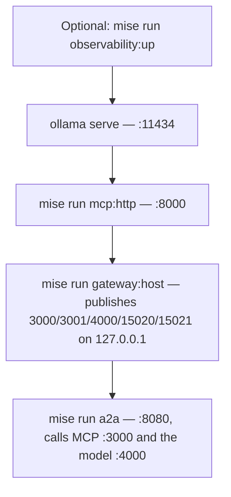

{}

- **You will:** Start Ollama, the MCP server, the gateway container, and the agent in the one order that works, then prove each listener answers and read what the wrapper did to your machine.
- **You need:** `mise run install` done, Docker running, and Ollama serving — the page installs the platform tier and pulls `qwen3:4b-instruct`. No cluster or account.
- **Time:** about 45 minutes, hands-on. {}

## Start four processes in the order that works

The chapter's **host data plane** is four processes. Ollama serves the model, the MCP server holds the agent's read tools, agentgateway runs in a container, and the A2A agent reaches both through it. Each process is the next one's upstream, so the start order is not a preference. Bring the gateway up before its upstreams and every request comes back `502`, a status that says a backend failed without saying which one.

This page installs the platform tier, proves the composition with one deterministic harness on ephemeral ports, starts the real stack in order, then reads the wrapper line by line, so nothing about the running container has to be taken on trust.

Install the tools first — the gateway, observability, Kubernetes, and GKE-plan binaries, none of which starts a service — then confirm your machine can run the stack:

```bash
mise run install:platform
ollama pull qwen3:4b-instruct
mise run doctor:model
mise run doctor:gateway
```

Ollama must already be running when you type that. If it is not managed as a service on your machine, leave `ollama serve` in its own terminal first — with the daemon down, `doctor:model` stops at `ollama     start Ollama: it is not answering on 127.0.0.1:11434` and never asks which models you have. The message naming `ollama pull qwen3:4b-instruct` is the next check along and means the opposite: the daemon answered and the tag is missing. `doctor:gateway` then checks the base tools plus `yq`, `docker`, and `openssl`, asks the Docker daemon whether it is alive, and confirms `docker compose` exists. That `yq` is not decoration: the wrapper rewrites the gateway config with it before every start.

Before you commit a terminal to a long-lived process, run the deterministic harness. It starts its own MCP, A2A, gateway, and **fake model** — a small OpenAI-compatible server returning one fixed reply, so no weights or GPU timing enter the result — on ephemeral ports it allocates itself, so it can run while your manual stack is up without colliding on `3000`:

```bash
mise run smoke:host
```

```text
[smoke:host] $ scripts/smoke-host.sh
Host smoke passed: fake model, MCP, A2A, agentgateway, CORS, readiness, host/container metrics, and teardown.
```

That single line stands for four verified gateway surfaces, a CORS preflight from an allowed origin and from a hostile one, and a teardown that leaves nothing behind. Two of its habits are worth stealing: it drives the real `infra/scripts/gateway-host.sh` rather than a reimplementation of it, and it compares the MCP allowlist by equality, so a tool leaking _in_ fails as loudly as one going missing. It does not touch the Ollama stack you are about to start by hand: it proves the composition, not your terminals, and keeping those two claims apart is what [0.2. Evidence]() is for. <a id="what-exactly-does-the-host-smoke-prove"></a>

Now the real thing, in this order:



**Diagram in words:** Optional observability starts first, then Ollama. The raw MCP server starts before agentgateway, which publishes five loopback listeners. The raw A2A server starts last and calls the governed MCP and model listeners.

Keep each process in its own terminal so its logs stay visible. First the MCP server:

```bash
cd agents/go
mise run mcp:http
```

Then the gateway, from the repository root:

```bash
mise run gateway:host
```

That runs a **digest-pinned** image — named by content hash rather than by tag, so every machine runs the same bytes — through a wrapper that publishes MCP `:3000`, A2A `:3001`, model `:4000`, metrics `:15020`, and readiness `:15021` on `127.0.0.1` only. Your gateway is not on the LAN. The pin has a named reason: advisory GHSA-mvgg-jvj2-4frq, rated high at CVSS 8.1 on 27 July 2026, let a stateful MCP session opened on one route be replayed on another under that route's authorization policy. Every release before v1.4.0 is affected; this digest is v1.4.1. To keep your terminal, use `mise run gateway:host:start`, inspect with `mise run gateway:host:status` and `mise run gateway:host:logs`; a detached start needs an explicit `mise run gateway:host:stop`.

Finally the agent, pointed at gateway ports and nothing else:

```bash
cd agents/go
AGENT_MODEL_PROVIDER=openai-compatible \
AGENT_MODEL=qwen3:4b-instruct \
AGENT_MCP_URL=http://127.0.0.1:3000/mcp \
OPENAI_BASE_URL=http://127.0.0.1:4000/v1 \
OPENAI_API_KEY=local-ollama \
mise run a2a
```

Nothing in that block names `:8000` or `:11434`. The agent can no longer address the MCP server or Ollama directly, only through gateway ports.

Do not substitute the raw `agentgateway -f ...` binary here. Its host listeners bind every interface, while the wrapper is the only path that publishes on loopback, drops the container's privileges, and mounts a rendered read-only config.

## Prove every listener answers

Three requests tell you whether the data plane is real. Predict each answer before you press enter, in particular the address the agent card will advertise, given that the agent behind it is bound to `:8080` and has never heard of the gateway:

```bash
curl -fsS http://127.0.0.1:15021/healthz/ready
curl -fsS http://localhost:3001/.well-known/agent-card.json | jq '{name, url: .supportedInterfaces[0].url}'
curl -fsS http://127.0.0.1:15020/metrics | head -3
```

```text
ready
{
  "name": "AgentOps Agent",
  "url": "http://localhost:3001/"
}
# HELP agentgateway_config_synchronized Whether the last configuration load/reload was successful or not, being synchronized with the on-disk configuration.
# TYPE agentgateway_config_synchronized gauge
agentgateway_config_synchronized 1
```

In the middle response, the A2A server published a card describing itself on `:8080`, and the gateway rewrote the callable interface to its own address on the way out, because a client that follows a card must reach the governed path rather than the raw one. Ask for the card's top-level `url` instead and you still see `http://localhost:8080/`: that field is the backend's own view of itself, which is why the smoke harness asserts `supportedInterfaces[0].url`.

The MCP and model listeners are missing on purpose — both need a protocol request rather than a connection, and [5.2. MCP Gateway]() and [5.4. Model Gateway]() make them talk. Two failures are worth telling apart now: `curl: (7)` means the gateway is not up, while `502` means it is up and an upstream is not. A third case is a bind that hangs rather than refusing, which usually means an earlier terminal still owns the port — [0.7. Troubleshooting]() names the usual squatters.

`:15021` appears nowhere in `infra/agentgateway/host/config.yaml`; the wrapper's render step injects `.config.readinessAddr`. The Kubernetes profiles declare it outright, and both probes call `httpGet /healthz/ready` against the named `readiness` port rather than a data port, because a data port answers TCP the moment the listener binds — before backends, policies, and JWKS load — so a `tcpSocket` probe would report Ready while every request still failed. `:15020` is absent from the host config for the same reason; in Kubernetes it _is_ a Service port, because the in-cluster collector scrapes it, while `15021` stays pod-local and the kubelet dials the pod IP directly.

**You are now running the same data plane the Kubernetes chapters deploy, on your own machine, with every listener bound to loopback and nothing on your network able to reach it.**

## What the host gateway wrapper does to your machine {#the-wrapper}

<a id="what-does-the-host-wrapper-actually-run"></a>

`mise run gateway:host` is one line of `mise.toml`: `infra/scripts/gateway-host.sh run`. Everything below is that script, worth reading once because a gateway is the one process in this lab that terminates traffic from clients you do not control. The more traffic a component sees, the fewer privileges it should hold.

It runs the same five steps every time: validate the inputs, refuse to start over an existing container, render a private read-only configuration, start the Linux-only loopback relay if this machine needs one, and launch the digest-pinned image with an `EXIT` trap already armed. Three of those are worth taking apart.

**The config is rendered, not used as-is.** The checked-in file names `localhost` upstreams, which is correct on the host and wrong inside a container, where `localhost` is the container. Diff what the wrapper mounts against the file in your tree:

```bash
diff <(infra/scripts/gateway-host.sh render) infra/agentgateway/host/config.yaml | grep -E '^[<>] .+'
```

```text
<   statsAddr: 0.0.0.0:15020
<   readinessAddr: 0.0.0.0:15021
<   adminAddr: off
<                 host: http://host.docker.internal:8000/mcp
>                 host: http://localhost:8000/mcp
<       - host: host.docker.internal:8080
>       - host: localhost:8080
<                   host: host.docker.internal:8080
>                   host: localhost:8080
<                   host: host.docker.internal:8080
>                   host: localhost:8080
<           hostOverride: host.docker.internal:11434
>           hostOverride: localhost:11434
```

Every rewritten line is an address; every added line is an operational listener. Nothing in the policy — no rule, no limit, no guard — is touched. The two `0.0.0.0` addresses are container-scoped and reachable only through the loopback publishes below, and `adminAddr = "off"` deletes the admin surface rather than protecting it. The rendered file lands read-only for everyone (`0444`) in a directory only your user may open (`0700`) under `$XDG_RUNTIME_DIR`, your session's private scratch area, and mounts read-only, so the container never sees your tree.

**The container runs with the privileges it needs and no others.** This is the hardening core, verbatim from `build_docker_args()`:



Those are the five options you ran against your own engine in [1.2. Container Engine](), applied here to a container you did not build. That block is only the hardening core; the same function then appends the network, the publishes, the read-only config mount, and the pinned image. `infra/scripts/gateway-host.sh args` prints the whole argv, one flag per line, and its last lines make the loopback boundary literal:

```text
--publish
127.0.0.1:15021:15021
--mount
type=bind,src=/tmp/agentops-gateway-args.8Ral7v/config.yaml,dst=/etc/agentgateway/config.yaml,readonly
--rm
cr.agentgateway.dev/agentgateway:v1.4.1@sha256:efd79355b89094a8225a9db465d9a01dc656b377f0bab458761b935a13231d29
-f
/etc/agentgateway/config.yaml
```

That `src` directory is a throwaway that `args` re-creates on every invocation; `run` and `start` mount from your session's private runtime directory instead.

The publish line explains the one override people get wrong: the **left** side moves when a port is taken, the **right** side is fixed at `3000`/`3001`/`4000` because the named gateways declare those ports. `AGENTOPS_GATEWAY_MCP_PORT=3100` still publishes the container's `3000`; you point `AGENT_MCP_URL` at `http://127.0.0.1:3100/mcp` and nothing else moves.

**The wrapper only ever touches its own container.** It labels what it starts with `dev.fmind.agentops.host-gateway=true`; `assert_container_absent()` then refuses to start over an existing name, and `stop_managed_container()` refuses to stop anything without that label. The rule generalises to your own lab scripts: a script may only destroy what it created. A helper that runs `docker rm -f agentgateway` unconditionally will delete a container of that name someone else started.

On native Linux the wrapper also starts a small relay, with nothing for you to run. The container reaches your machine through its Docker network's bridge address, which cannot reach services bound to `127.0.0.1`, where your MCP, A2A, and Ollama servers all sit. `tools/bin/loopback-relay` binds only the wrapper-owned bridge address and forwards to loopback, so no service has to leave `127.0.0.1` and only containers on that dedicated network can reach it. On Docker Desktop none of this applies, and the default `AGENTOPS_GATEWAY_LOOPBACK_RELAY=auto` starts nothing.

## How to read the wrapper's failure messages

The wrapper fails fast with a prefixed message instead of leaving half a stack running. Try the most common one on purpose — with the gateway already up, ask for a second one:

```bash
mise run gateway:host:start
```

```text
gateway-host: container 'agentops-host-gateway' already exists; choose another name or inspect it before removal
```

No container was touched and no port was taken. Most failures below carry that same `gateway-host:` prefix, added by the wrapper's own `die()`. The first row is the exception: it comes from the shared tool check that runs before the wrapper can speak.

| Message or symptom                                                                                    | Cause                                                      | Fix                                                                   |
| ----------------------------------------------------------------------------------------------------- | ---------------------------------------------------------- | --------------------------------------------------------------------- |
| `missing yq: run 'mise run install:platform', then 'mise run doctor:gateway' to check the whole tier` | `yq` is absent, so the render step cannot run              | The tier that ships `yq`                                              |
| `gateway-host: Docker daemon is unavailable`                                                          | Daemon not running or your user lacks socket access        | Start Docker; re-run `mise run doctor:gateway`                        |
| `gateway-host: canonical config must contain exactly one named MCP, A2A, and model gateway route`     | You edited a `3000`/`3001`/`4000` gateway or its route     | Restore the config; change the _published_ port instead (table below) |
| `gateway-host: container 'agentops-host-gateway' already exists`                                      | A previous `gateway:host:start` is still around            | `mise run gateway:host:status`, then `mise run gateway:host:stop`     |
| `gateway-host: refusing to stop unowned container ...`                                                | Something else already owns that container name            | Inspect it yourself; or set `AGENTOPS_GATEWAY_CONTAINER`              |
| `gateway-host: Linux loopback relay requires the installed Go helper; run 'mise run install' first`   | `tools/bin/loopback-relay` is absent                       | `mise run install` (or point `AGENTOPS_GATEWAY_RELAY` at the helper)  |
| `gateway-host: loopback relay did not become ready`                                                   | Bridge address already in use for one of the relayed ports | The last 40 relay log lines are printed above the error — read them   |
| `docker: ... address already in use`                                                                  | Something else holds `3000`/`3001`/`4000`/`15020`/`15021`  | Override the published port (table below)                             |
| Gateway starts, but requests return 502                                                               | An upstream is not up yet, or the relay is off             | Check the startup order diagram; MCP and Ollama come first            |

{}

| Variable                                                                                    | Default                                  | When you need it                                                                                                                |
| ------------------------------------------------------------------------------------------- | ---------------------------------------- | ------------------------------------------------------------------------------------------------------------------------------- |
| `AGENTOPS_GATEWAY_CONTAINER`                                                                | `agentops-host-gateway`                  | A second gateway alongside the first                                                                                            |
| `AGENTOPS_GATEWAY_NETWORK`                                                                  | `<container>-net`                        | The dedicated Docker network the container and the relay share                                                                  |
| `AGENTOPS_GATEWAY_MCP_PORT`, `_A2A_PORT`, `_MODEL_PORT`, `_METRICS_PORT`, `_READINESS_PORT` | `3000`, `3001`, `4000`, `15020`, `15021` | A published port is taken — update the agent's URLs to match                                                                    |
| `AGENTOPS_MCP_UPSTREAM_PORT`, `AGENTOPS_A2A_UPSTREAM_PORT`, `AGENTOPS_MODEL_UPSTREAM_PORT`  | `8000`, `8080`, `11434`                  | Your host processes listen somewhere else                                                                                       |
| `AGENTOPS_GATEWAY_CONFIG`                                                                   | `infra/agentgateway/host/config.yaml`    | A path, or a bare basename resolved in the host config directory                                                                |
| `AGENTOPS_GATEWAY_AUTH_DIR`                                                                 | the host `auth/` directory               | TLS/JWKS source for the secured profile ([5.5. Gateway Security]())        |
| `AGENTOPS_GATEWAY_LOOPBACK_RELAY`, `AGENTOPS_GATEWAY_RELAY`                                 | `auto`, `tools/bin/loopback-relay`       | Force the relay `on` or `off`, or point at another installed helper                                                             |
| `AGENTOPS_GATEWAY_RUNTIME_DIR`                                                              | under `$XDG_RUNTIME_DIR`                 | Rendered config and relay state live here                                                                                       |
| `AGENTOPS_GATEWAY_RESILIENCE_LAB`                                                           | `off`                                    | `timeout` injects a deterministic delay on the MCP route ([5.2. MCP Gateway]()) |

`infra/scripts/gateway-host.sh --help` prints its own copy of this list, minus `AGENTOPS_GATEWAY_RUNTIME_DIR`. It has a trap: `main()` validates its inputs before it looks at the subcommand, so on a machine with no `yq` even `--help` exits with the missing-tool message. {}

`mise run observability:up` starts the optional telemetry stack, best before the gateway if you want complete startup traces; give the agent `OTEL_EXPORTER_OTLP_ENDPOINT=http://127.0.0.1:4318`, `OTEL_EXPORTER_OTLP_PROTOCOL=http/protobuf`, and `OTEL_SERVICE_NAME=agentops-agent`, then read Grafana on `127.0.0.1:3002` and Prometheus on `127.0.0.1:9090`. When you are done, `Ctrl-C` the foreground processes and stop the rest explicitly:

```bash
mise run gateway:host:stop
mise run observability:down
```

A detached `start` deliberately has no `EXIT` trap, so `stop` is the only thing that removes the relay and rendered config a `start` left running. `observability:down` preserves its volumes; delete them only when [Chapter 7]() asks you to.

## Your turn: render, inspect, and validate the config before it runs

The most common gateway bug is not in the gateway: it is a policy edit that never reached the process. The file the gateway reads is not the file you edited. Three subcommands answer "what is this really going to run?" before anything starts.

Predict first: `validate` runs the pinned image with `--validate-only --network none`. Which of these can it catch — a typo in a policy key, an upstream that is down, or a rule that allows the wrong tool?

- **Mode**: `inspect` — every subcommand below prints or parses; none starts a container that survives the command.
- **Goal**: see what the wrapper hands the gateway for both the default and the secured profile, and learn which class of mistake each subcommand catches.
- **Files to touch**: none.
- **Preflight**: `mise run doctor:gateway` prints `gateway ready` and `docker ready`.
- **Steps**: run `infra/scripts/gateway-host.sh render`, then `infra/scripts/gateway-host.sh args`, then `infra/scripts/gateway-host.sh validate`. Repeat the first and last with `AGENTOPS_GATEWAY_CONFIG=config-auth.yaml` in front of them.
- **Gate that proves completion**: `validate` prints `Configuration is valid!` for both profiles, and the secured render shows `cert`, `key`, and `jwks.file` rewritten to paths under `/etc/agentgateway/auth/` rather than the repository paths in the checked-in file.
- **Final state**: nothing changed on disk. Write down which of the three mistakes above `validate` cannot see, and what would have caught it instead.

## What you can do now

- `mise run smoke:host` finishes green and deletes its work directory.
- `:15021/healthz/ready` prints `ready` and `:15020/metrics` returns Prometheus text on your machine.
- The agent card fetched through `:3001` advertises the governed address in `supportedInterfaces`, and you can say why its top-level `url` still names `:8080`.
- Your A2A process runs with `AGENT_MCP_URL` on `:3000` and `OPENAI_BASE_URL` on `:4000`, naming neither `:8000` nor `:11434`.

Before the container starts you can print the exact configuration it will read, the exact arguments it will run under, and the exact addresses it rewrites — the footing the next four pages build policy on.

Continue to [5.2. MCP Gateway]() when the agent reaches its tools and its model only through gateway ports.
