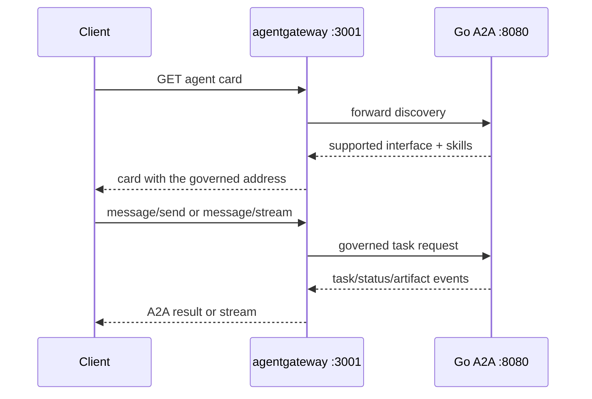

{}

- **You will:** Fetch the agent card through the gateway, find the address it rewrote, watch a browser origin be accepted and another silently refused, send a guarded write's approval from a real browser and watch it fail closed, and say what the gateway does not hold.
- **You need:** The stack [5.1. Gateway Setup]() left running — Ollama, the MCP server, the host gateway, and an A2A process started with the gateway environment — plus one free terminal for the web client.
- **Time:** about 45 minutes, hands-on — the browser walkthrough adds a model turn and an approval. {}

## Why the agent card decides which address clients dial

An **agent card** is the JSON discovery document an A2A service publishes at `/.well-known/agent-card.json`. It lists the agent's name, its skills, and the addresses a client should dial. Clients dial what the card tells them, so the card decides whether your policy is on the path. Advertise the backend's own address and every future client reaches the raw `:8080` port: no rate limit, no origin check, no logging.

Rewriting that address is this listener's main job. Here you find the field the gateway changed, learn why a hostile browser origin still gets a `200`, approve a guarded write from a browser and watch it fail closed on the one precondition this profile does not supply, and separate the bounds that apply to one task. Ask the gateway for the card:

```bash
curl -fsS http://localhost:3001/.well-known/agent-card.json \
  | jq '{name, url, interface: .supportedInterfaces[0].url}'
```

```text
{
  "name": "AgentOps Agent",
  "url": "http://localhost:8080/",
  "interface": "http://localhost:3001/"
}
```

Two addresses in one document. The `url` field is the backend describing itself: the Go server was started on `:8080` and has never heard of a gateway. The `supportedInterfaces` entry is what a client should actually dial, and agentgateway rewrote it to its own address on the way past. A mismatch here is a configuration failure rather than a cosmetic one.

MCP routes a catalog of small tools, each one a decision; A2A routes one agent that keeps the work while it happens, so there is no list to prune here. Who may ask, from where, and what they are told about reaching you again is the entire policy surface of this listener.



**Diagram in words:** A client reads the agent card through port 3001, then sends or streams a message through the same gateway. The gateway forwards the protocol to the Go service on port 8080 and returns task, status, and artifact events.

The card request costs nothing and reveals no model: another team's agent can learn what yours does, and how to reach it, before spending a token.

## How CORS preflight decides which browser origins may call

**CORS**, cross-origin resource sharing, is the browser's rule that a page may read a cross-origin response only when that response allows its origin. The **preflight** is the `OPTIONS` request that asks in advance. The course ships a single-file A2A web client on `http://localhost:8001` (`mise run client:web`), and that origin is the only one the A2A route will admit. Start with the origin that is allowed, so you know what success looks like:

```bash
curl -sS -i -X OPTIONS http://localhost:3001/ \
  -H 'Origin: http://localhost:8001' \
  -H 'Access-Control-Request-Method: POST' \
  -H 'Access-Control-Request-Headers: content-type' | head -4
```

```text
HTTP/1.1 200 OK
access-control-allow-origin: http://localhost:8001
access-control-allow-methods: GET,POST,OPTIONS
access-control-allow-headers: content-type
```

Now change one header value and run it again. Predict the status line before you press enter — a `403`, a connection error, or something else:

```bash
curl -sS -i -X OPTIONS http://localhost:3001/ \
  -H 'Origin: http://evil.invalid' \
  -H 'Access-Control-Request-Method: POST' \
  -H 'Access-Control-Request-Headers: content-type' | head -4
```

```text
HTTP/1.1 200 OK
content-length: 0
date: Mon, 10 Aug 2026 20:24:34 GMT
```

Also a `200`. The disallowed origin gets a perfectly ordinary response with **no** `Access-Control-Allow-Origin` header, and the browser is what refuses to hand the body to the page's JavaScript; the server rejected nothing. So testing only the allowed origin is worthless: a wildcard policy passes that test and fails this one, which is why the smoke harness asserts both directions.

**You can now tell a policy that is enforced from a policy that is merely advertised — on the one boundary where the difference is invisible from the server side.**

## Approve a guarded write from the web client

Now put a real browser on the allowed side of that boundary. The stack it needs is the one [5.1. Gateway Setup]() already has running. Leave those terminals exactly as they are and add one more for the client:

```bash
mise run client:web               # static client on :8001
```

If you stopped the A2A process in between, start it again the way 5.1 did, with every variable. A bare `mise run a2a` falls back to `OPENAI_BASE_URL=http://127.0.0.1:11434/v1` and in-process tools, so the agent reaches Ollama and its own tools directly and nothing on the model or tool path is governed — the arrangement this chapter took away:

```bash
cd agents/go
AGENT_MODEL_PROVIDER=openai-compatible \
AGENT_MODEL=qwen3:4b-instruct \
AGENT_MCP_URL=http://127.0.0.1:3000/mcp \
OPENAI_BASE_URL=http://127.0.0.1:4000/v1 \
OPENAI_API_KEY=local-ollama \
mise run a2a
```

Open `http://localhost:8001` and leave the base URL at its shipped default, `http://localhost:3001`. Retargeting it at `:8080` is the one mistake worth making on purpose here: the raw A2A server sends no `Access-Control-Allow-Origin` on any response, so the card fetch fails in the browser and the client never connects. Here the gateway is not a convenience; it is the only reason the page works.

Press **Connect**, then ask the agent to restart the inventory service. The task badge moves to `input-required` and stops there.


The client did not invent that pause. Both write tools are declared with `RequireConfirmation`, so the runtime stops before the handler runs and the protocol carries the request outward. [3.1. Tools]() makes confirmation, a named approver, and a bounded rationale structural preconditions of the write; an approval with no rationale is refused by the tool, not by the form.

Type a rationale and approve. [3.9. Incident Run]() never got this far: its developer UI runs with writes frozen, so the guarded call is refused before a confirmation is built and no rationale is ever asked for. Here the confirmation arrives and the rationale reaches the tool — and the write still refuses. The tool result carries the reason — `Refusing restart of "inventory": a network action requires an authenticated principal in addition to confirmation.` — and the model relays some version of it. Read the audit log in a free terminal at the repository root rather than trusting either wording:

```bash
sqlite3 -header -column agents/go/.state/incidents.db \
  'SELECT approved_by, rationale, session_id, invocation_id FROM audit_log ORDER BY id DESC LIMIT 1;'
```

No new row. The stack you are running carries no `AGENT_TRUSTED_IDENTITY_HEADER`, so `agents/go/a2aserver/identity.go` marks the request as network-originated and grants it no principal, and `agents/go/tools/action.go` refuses an approval it cannot attribute. That is the guard working: this listener admits any caller on loopback, a rationale typed into a browser names nobody, and the audit row exists to record who ordered a restart. A write that lands needs a boundary that validated the caller and set that header itself — [5.5. Gateway Security]() turns exactly that chain on, and `mise run eval` completes the loop end to end today by standing in for the gateway on its own transport. What the browser proves here is the half above the guard: the pause, the card, and the rationale field all reached the tool intact.

The startup sequence and the CORS reasoning behind it are documented in full in `clients/web/README.md`. If you change either, change both.

## The gateway forwards A2A tasks; the agent owns their state

[2.4. Sessions]() took the A2A task apart on disk. What matters at this hop is who holds it: the gateway is stateless with respect to tasks, and the Go backend persists both task and session data in SQLite.

Restart agentgateway and no task changes; restart the backend and it recovers its stores and can answer task queries after startup preflight. The lab stays single-replica, and gateway availability does not imply a second writer — that is a shared-database design decision, not a scaling flag.

Several bounds apply to one task, and confusing them is the fastest way to build a limit that does not limit what you meant:

- The gateway's token bucket bounds request rate per gateway instance — 60 requests per 60 seconds on this listener — which slows a caller hammering you.
- `AGENT_A2A_MAX_LLM_CALLS` bounds model calls within a single invocation, so one request cannot loop through the model indefinitely.
- Model, tool, and drain timeouts bound how long anything waits, drain being the window a shutdown gives in-flight work.
- Session token budgets bound accumulated generation work across a conversation, which no per-request cap can see.
- Cancellation reaches the Go runner's context, and the server persists the terminal state.

None of those is a distributed customer quota: each is enforced by one process reading its own memory.

Cancellation and streaming both travel the same listener. A caller sends the A2A cancellation method, agentgateway forwards it, the Go server cancels the task context and writes the terminal state; the tests prove that cancellation reaches the runner, that a cancelled stream terminates, and that action transactions stay atomic across it. When a stream fails mid-answer, partial output is provisional: the client re-reads the durable task and treats its terminal state as authority. The evaluation harness enforces that mechanically, never promoting a partial text frame into a completed answer.

To exercise that streaming path against a configured model, A2A is a flag on the one evaluation task rather than a task of its own:

```bash
mise run eval -- --transport a2a --output a2a-results.json
```

The name invites a wrong reading. The harness starts its own agent process for each case and dials `http://127.0.0.1:` plus a port it allocated for itself; agentgateway is not on that path at all. What it exercises is the A2A protocol fold — task events, streaming frames, cancellation — not your policy. The `--output` override keeps the artifact off the REST `results.json` from the previous run. The command that does drive this listener end to end is `mise run smoke:host`, which supplies a local fake model and sends one real `message/send` through `:3001`.

## In-process delegation versus a governed A2A hop

In-process delegation keeps a specialist inside the Go composition, sharing policy, session, model, and resource lifecycle. A2A adds a network trust boundary, and the cost lands in the application: a forwarded identity is only a claim until the application validates that header, and no write may name the actor before that check.

Use the governed A2A boundary for independently owned agents, durable protocol tasks, cross-language clients, or genuinely separate deployment and scaling needs. Keep specialists in-process when they share a release cadence and a trust domain. The gateway should not turn every internal delegation into a network hop, and the fact that it _can_ is not a reason.

The moment to split is when data authority, failure isolation, release ownership, or capacity requires it — and the new service then needs its own identity, authorization, compatibility, observability, load, recovery, and rollback evidence. An agent card is discovery metadata, not operational readiness, and telling those two apart is what [0.2. Evidence]() is for. If you write a client for such a service, `evals/client.go` is the black-box reference for what a caller can build without access to the server's internals: it uses the pinned Go A2A SDK types, normalizes every transport event into one typed result, and its tests prove completed-event folding, tool-call and usage capture, and separate partial output — without importing `agents/go` at all.

## Your turn: diff the agent card served on :8080 and on :3001

Predict before you fetch: which fields must be identical on both cards, and which must not.

- **Mode**: `inspect` — two read-only requests, nothing to revert.
- **Goal**: see exactly which field the gateway rewrites, and predict what breaks when a card advertises the ungoverned address.
- **Files to touch**: none.
- **Preflight**: both the A2A server and the host gateway are running, and `curl -fsS http://127.0.0.1:15021/healthz/ready` prints `ready`.
- **Steps**: fetch `/.well-known/agent-card.json` from `http://localhost:8080` and from `http://localhost:3001`, and diff the two documents field by field.
- **Gate that proves completion**: with `jq '{name, url, interfaces: [.supportedInterfaces[].url], skills: [.skills[].id]}'` the two cards agree on `name`, on `url`, and on the `incident-triage` and `remediation` skills, and every entry in `interfaces` moves from `http://localhost:8080/...` to `http://localhost:3001/...`. Then say, in one sentence, which policies a client would skip if it followed `url` instead.
- **Final state**: nothing changed. Keep both processes running for [5.4. Model Gateway]().

## What you can do now

- You can name the card field the gateway rewrites, `supportedInterfaces[].url`, and the `url` field it leaves alone.
- You can predict the `200` a disallowed origin gets, and name the missing `Access-Control-Allow-Origin` the browser refuses on.
- You watched an approval that carried a rationale still fail closed, and can name what it lacked: a caller identity this profile asks nobody to prove.
- You can separate a per-instance rate limit from per-invocation call caps, timeouts, and session token budgets.
- `cd agents/go && go test ./a2aserver` passes on your machine, with no gateway and no model running.

A proxy cannot make clients know about it; a card can, and you watched the gateway rewrite one. The browser policy holds only because the client agrees to honor it — worth remembering in any conversation about CORS as a security control.

Continue to [5.4. Model Gateway]() when the gateway preserves the durable A2A contract instead of replacing it.
