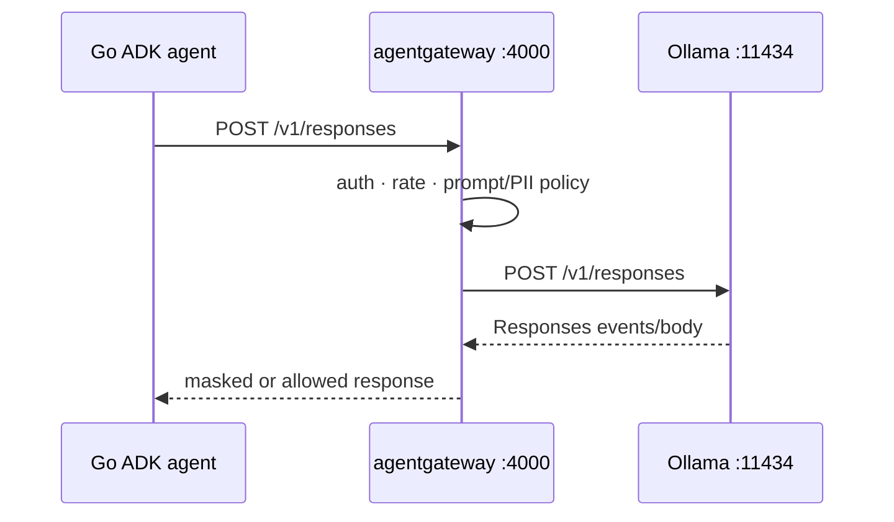

{}

- **You will:** Send one Responses request through the gateway, read the access-log fields it recorded, then route a second model alias and see which model name reaches Ollama.
- **You need:** Ollama serving `qwen3:4b-instruct`, the host gateway running, and the A2A process up, because it also serves the fail-closed PII webhook the model route calls.
- **Time:** about 30 minutes, hands-on, plus 20 minutes and a second model download if you take the optional traffic split. {}

## Route one Responses request through the gateway and read its log

A **model listener** is a gateway port that speaks one model API to the application and forwards to whatever provider its configuration names. Here the port is `:4000` and the API is the **Responses API**, OpenAI's contract for sending an input and reading back output and usage. Behind that listener, model choice, rate and token limits, prompt guards, and cost accounting stop being application code and become one file, and the same agent binary runs against local Ollama or hosted Vertex AI without a branch. The price is that the agent stops choosing the model.

This page moves one base URL, sends one Responses request through it, and settles who owns deadlines, retries, and fallback.

Moving the agent onto the gateway changed one line of its environment:

```bash
# Direct Ollama
OPENAI_BASE_URL=http://127.0.0.1:11434/v1

# Through host agentgateway
OPENAI_BASE_URL=http://127.0.0.1:4000/v1
```

No new client, no provider-translation layer, no branch in the agent. ADK takes a model instance rather than a name, so `model.Build` constructs the client from configuration validated at startup rather than leaving the runtime to resolve an endpoint per call. Only the base URL moves:



Send it the request the agent's adapter sends:

```bash
curl -sS http://localhost:4000/v1/responses \
  -H 'Content-Type: application/json' \
  -H 'Authorization: Bearer local-ollama' \
  -d '{"model":"qwen3:4b-instruct","input":"Reply with the word ready."}' \
  | jq -c '{status, model, output_tokens: .usage.output_tokens, total_tokens: .usage.total_tokens}'
```

```text
{"status":"completed","model":"qwen3:4b-instruct","output_tokens":62,"total_tokens":76}
```

A local model answered through a proxy. Here is the gateway's access log line for that request, trimmed of the connection fields you met in [5.1. Gateway Setup]():

```text
{"level":"info","time":"2026-08-13T05:59:57.239352Z","scope":"request","gateway":"default/default","listener":"llm","route":"default/llm","endpoint":"host.docker.internal:11434","http.method":"POST","http.path":"/v1/responses","http.status":200,"protocol":"llm","gen_ai.operation.name":"chat","gen_ai.provider.name":"openai","gen_ai.request.model":"qwen3:4b-instruct","gen_ai.response.model":"qwen3:4b-instruct","gen_ai.usage.input_tokens":14,"gen_ai.usage.cache_read.input_tokens":0,"gen_ai.usage.output_tokens":62,"agw.ai.usage.cost.total":"0","duration":"142534ms"}
```

**A model on your own hardware just answered through a policy-enforcing proxy, and the proxy counted the tokens and priced the call at zero — no account, no key, no bill.**

The `gen_ai.*` keys are OpenTelemetry's gen-ai semantic conventions; `agw.ai.usage.cost.total` is agentgateway's own field, priced from its model catalog. That zero is honest accounting, not a placeholder: the host profile's catalog declares zero input and output rates for a model you host yourself. `duration` really is milliseconds: the `curl` above took 2 minutes 23 seconds by the shell's own clock for the 142,534 the gateway logged, which is worth checking once because a number that large invites the suspicion that the unit is wrong. It is not wrong; sixty-two tokens is simply that slow on a CPU-only host. Read which fields exist, not how fast this one was.

Now the interesting field: `gen_ai.request.model`. Two settings on this path name a model. The agent reads `AGENT_MODEL=qwen3:4b-instruct`; the gateway's `llm` route ends in a backend that pins one too:

```yaml
backends:
  - ai:
      name: ollama
      hostOverride: localhost:11434
      provider:
        openAI:
          model: qwen3:4b-instruct
```

They agree today, so nobody notices. The exercise below makes them disagree, and the `404` names which one Ollama receives.

## What "OpenAI-compatible" standardizes, and what it does not

Compatibility standardizes the transport contract this adapter uses. It covers the base URL, the bearer marker, the model name field, the Responses payload, streaming events, function calls, and usage fields. ADK Go's OpenAI adapter sends only `POST /v1/responses` — there is no chat-completions branch anywhere in it, which is why the route declares `/v1/responses: responses`. Without that entry agentgateway assumes chat-completions and rejects the body as "missing field `messages`", and the response guard would then be inspecting a shape that never arrives. The route declares a second entry, `/v1/chat/completions: completions`, for a different caller: the evaluation judge of [4.4. Evaluations]() speaks chat-completions, and pointing `EVAL_JUDGE_BASE_URL` at `:4000` puts it behind the same buckets and guards as the agent instead of giving it a private door to the same model. Neither shape needs a `pathOverride`: agentgateway derives the upstream path from the route type it resolved, and a path the route does not declare is refused at the parse stage rather than proxied.



**Diagram in words:** The Go agent sends a Responses request to agentgateway on port 4000. The gateway applies caller, rate, prompt, and PII policy, forwards the same route to Ollama, then masks or returns the provider response to the agent.

What it does _not_ do is make providers behave alike. Tool selection, JSON fidelity, context limits, tokenization, latency, safety behavior, and error detail all still differ. One endpoint stabilizes application wiring and policy placement, not inference semantics: a green transport probe proves reachability, and quality is an observation you have to measure ([0.2. Evidence]()).

That is also why the GKE profile swaps the backend for Vertex AI without touching the agent. It configures a Vertex backend with the project, region, model, and `backendAuth.gcp` settings rendered from approved infrastructure outputs, and reaches Google with ambient Workload Identity Federation rather than a mounted key. The model name there is pinned to the one the gateway's conversion was tested against; a newer model can reject what that conversion emits, so do not move the pin. The application may alternatively select ADK's native Gemini provider, which is a separate client path behind the same interface — an explicit choice, never a hidden fallback.

## Which side owns deadlines, retries, and fallback {#how-does-the-agent-fail-over-when-the-primary-model-is-down}

Three failure behaviors live on this edge, and the application owns all three: the gateway adds no second retry loop.

`AGENT_MODEL_TIMEOUT_S` bounds each attempt; `AGENT_MAX_RETRIES` configures the SDK for transient failures. Stacking a gateway retry on an application retry multiplies both latency and tokens, which is how a slow provider becomes a self-inflicted outage, so the model route deliberately carries rate and guard policy only.

`AGENT_MODEL_FALLBACK` may name a second model on the same provider and endpoint, and `model.Fallback` engages it only when the primary fails **before yielding any response**. Never after partial output, and never after a function call — replaying that request could duplicate visible text or repeat tool work, and a duplicate tool call in this domain means restarting a service twice. If both models fail, the error keeps the primary's context so the log still names what actually broke.

Read that as availability, not portability. A fallback candidate is a second model with its own quality and cost profile, and shipping one you have never measured means your outages produce different answers instead of no answers. When the provider does fail, the adapter returns a wrapped Go error with provider context and the application exports a sanitized error record: gateway failure, timeout, rate limit, and guard rejection each need a different fix, and they stay distinguishable through status, structured logs, and traces, without copying prompt or response content anywhere. The agent does not invent a successful answer from an unavailable provider.

## Your turn: route a second model alias

A smaller triage model should not require touching the agent. Make the change at the gateway, and read which name reaches the provider.

Predict before you run this: you will point the gateway's backend at `qwen3:1.7b`, which is not pulled on your machine, and then send a request that explicitly names `qwen3:4b-instruct`, which is. Does the request succeed, fail, or silently use the model you named?

- **Mode**: `temporary experiment`.
- **Goal**: prove which of the two model names on this path reaches Ollama, and watch the repository's own gate refuse the change.
- **Files to touch**: `infra/agentgateway/host/config.yaml` only.
- **Preflight**: `git diff --quiet -- infra/agentgateway/host/config.yaml` must succeed, and the plain Responses request at the top of this page must return `"status":"completed"`.
- **Steps**: in the `llm` route's backend, change `provider.openAI.model` to `qwen3:1.7b`, and add the same alias beside `qwen3:4b-instruct` under `config.modelCatalog[0].inline.providers.openai.models` with zero input and output rates. Run `infra/scripts/gateway-host.sh validate`, then `mise run gateway:host:stop` and `mise run gateway:host`, then repeat the Responses request from the top of this page unchanged.
- **Gate that proves completion**: `validate` prints `Configuration is valid!` — the real binary is happy — and the same request, sent without the `jq` filter and with `-w '\nHTTP %{http_code}\n'`, comes back as the failure below. Then `mise run check:infra` exits non-zero, because the shipped profile contract pins the model catalog to exactly one entry — the alias you added to it is what the gate sees.
- **Final state**: run `git restore -- infra/agentgateway/host/config.yaml`, restart the gateway, and confirm the Responses request returns `"status":"completed"` and `mise run check:infra` is green again.

The failure is unambiguous:

```text
{"error":{"message":"model 'qwen3:1.7b' not found","type":"not_found_error","param":null,"code":null}}
HTTP 404
```

Ollama was never asked for the model the caller named. The gateway substituted its own, and the access log agrees — `"gen_ai.request.model":"qwen3:1.7b"` on a request whose body said `qwen3:4b-instruct`. Once the agent talks to a model listener, `AGENT_MODEL` stops being the model selector and becomes a label the agent reports about itself; the routing decision has moved to a file the agent cannot read. That is the same trade as the tool allowlist in [5.2. MCP Gateway](), and it is worth knowing before an evaluation run tells you a model got worse overnight.

## Your turn: send a tenth of the traffic to a second model

A model swap does not have to be all or nothing. If the gateway owns the routing decision, it can own a _split_ of it — which is progressive delivery, arriving as a config edit rather than as a deployment strategy. [6.7. Promotion and Rollback]() names the absence of a traffic-weighted stable and canary route as the missing rung between its promotion evidence and its rollback lever; this is that rung, at a scale you can run on a laptop.

Predict before you edit: you will weight two backends 90 and 10 and send twenty requests. How many of them do you expect to reach the canary — exactly two, roughly two, or something you cannot predict at all from the weights alone?

- **Mode**: `temporary experiment` — the shipped configuration is never edited; the split lives in the git-ignored lab file.
- **Goal**: watch one route divide traffic between two models, and count the split in evidence the course already collects.
- **Files to touch**: `infra/agentgateway/lab/config.yaml`, which does not exist yet.
- **Preflight**: `test ! -e infra/agentgateway/lab/config.yaml`, `mise run check:infra` green, and the plain Responses request at the top of this page returning `"status":"completed"`.
- **Steps**: pull the smaller model with `ollama pull qwen3:1.7b` so both names resolve. Copy the shipped config to the lab path. In the `llm` route, split the single `ai` backend into two — name them `ollama-stable` and `ollama-canary`, give them `weight: 90` and `weight: 10`, and set the canary's `provider.openAI.model` to `qwen3:1.7b` — then add that alias to the model catalog with zero rates, exactly as the previous exercise did. Validate, start the gateway on the lab config, and send the Responses request twenty times in a loop.
- **Gate that proves completion**: `validate` prints `Configuration is valid!`, and `mise run gateway:host:logs` filtered on `gen_ai.request.model` shows both model names, with the canary on a small minority of the twenty. `:15020/metrics` carries the same split per backend if you would rather count it in Prometheus.
- **Final state**: `mise run gateway:host:stop`, `rm -- infra/agentgateway/lab/config.yaml`, restart the ordinary gateway, and `mise run check:infra` is green against the untouched shipped profile.

```bash
AGENTOPS_GATEWAY_CONFIG=infra/agentgateway/lab/config.yaml infra/scripts/gateway-host.sh validate
AGENTOPS_GATEWAY_CONFIG=infra/agentgateway/lab/config.yaml infra/scripts/gateway-host.sh start
```

Answer to the prediction: roughly two, and that word is the lesson. Weights are a probability per request, not a quota, so twenty requests can land four on the canary without anything being wrong. A canary you read at this sample size tells you the routing works; it tells you nothing about whether the canary is _better_, which needs the evaluation evidence of [4.4. Evaluations]() and enough traffic for the difference to outrun the noise. The rung this adds to 6.7 is the traffic split. The rung above it — an online quality signal that decides whether to continue — is still absent, and still deliberately so.

## What you can do now

- You can send a Responses request to `:4000` and read the `gen_ai.*` token fields and zero cost the gateway logged for it.
- You can say which of `AGENT_MODEL` and the backend's `provider.openAI.model` reaches Ollama, and the `404` that proves it.
- `cd agents/go && go test ./model` passes offline, covering the single-method contract, explicit endpoints, timeouts, retries, and pre-output-only fallback.
- You can separate transport reachability from model-quality evidence, and name what the second one costs to obtain.

The gateway's silent model substitution is what to suspect when a cost figure stops matching a model name.

Continue to [5.5. Gateway Security]() when the Responses route is the only application-facing model contract.
