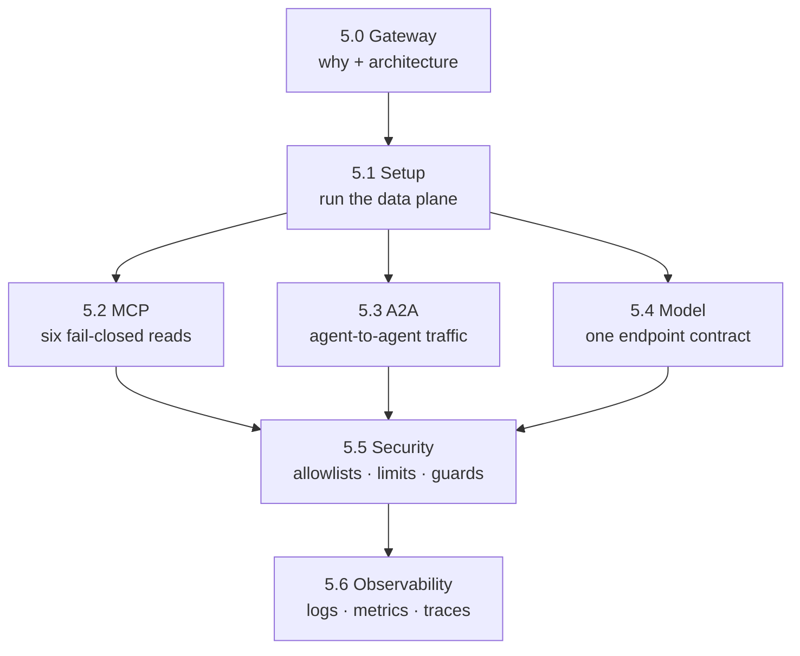

{}

- **You will:** See what the chapter governs, check that your machine can run it, and pick the page that owns each boundary.
- **You need:** `mise run install`, `mise run install:platform`, and Docker running; a model only from [5.1. Gateway Setup]() onward. No cluster or cloud account.
- **Time:** about 5 minutes, orientation. {}

## What the agent's traffic lacks: one place to apply policy

An **agent gateway** is a reverse proxy in front of everything an agent talks to. Model traffic, tool traffic, and inbound client traffic all terminate in one **data plane** — the process that carries the bytes and applies policy in passing. Each of those connections hides a policy decision: which model endpoint answers, which tools are callable, how fast a caller may push, which prompts are refused, what is logged, who may connect. Left inside one client, a decision holds for that client alone; the next service reaching those backends makes it again, differently.

This chapter moves those decisions into one open-source proxy — [agentgateway](https://agentgateway.dev/) — in the path of all three protocols. By the end of 5.6 you can follow one refused request through a log line, a counter, and a Prometheus query, and name what stays in the agent because a proxy cannot decide it.

The reference agent supplies the traffic: it reads INC-002 over **MCP**, answers **A2A** clients on a port any local process can post to, and calls a model endpoint named in an environment variable — three connections it opens itself, under no shared limit or log.

Check whether your machine can run the chapter. This probes and starts nothing:

```bash
mise run doctor:gateway
```

```text
[doctor:gateway] $ ./scripts/doctor.sh gateway
gateway    ready
env        optional .env is absent
docker     ready
```

`gateway ready` means every tool the host path needs is on `PATH`; `docker ready` means the daemon answered and `docker compose` exists. On a fresh clone it fails usefully instead: each line pairs a `missing:` tool with the `remedy:` that supplies it, which for `yq` is `mise run install:platform`. The doctor reports; it never installs. [5.1. Gateway Setup]() opens with that command.

Docker and a pulled Qwen3 are the hard requirements — the gateway ships as a digest-pinned container and its model listener forwards to your local Ollama. The host profile needs nothing else: no Kubernetes cluster, no cloud account, no provider key.

## Which page owns which gateway boundary

Read them in order; each takes one boundary and ends with something you can see on your own screen.

- **[5.0. Gateway]()** _(concept)_: Why an extra hop is worth it, which port carries which protocol, and the three controls that must never leave the agent.
- **[5.1. Gateway Setup]()** _(hands-on)_: Start the whole stack through a wrapper that keeps every listener on loopback, and read what it did to your machine.
- **[5.2. MCP Gateway]()** _(hands-on)_: Watch the gateway hand out six read tools, refuse a seventh, and fail closed when the tool server is gone.
- **[5.3. A2A Gateway]()** _(hands-on)_: Fetch the agent card through the gateway, see the address it rewrites, and find out which origins a browser may use.
- **[5.4. Model Gateway]()** _(hands-on)_: See that the gateway, not the agent, now chooses which model answers — then route a second alias yourself.
- **[5.5. Gateway Security]()** _(hands-on)_: Trip the prompt guard, turn on TLS and JWTs, and hand out a token that can see two tools instead of six.
- **[5.6. Gateway Observability]()** _(hands-on)_: Follow one rejected request through a log line, a counter, and a Prometheus query — and explain the trace that never appears.

## The order the gateway pages must run in



**Diagram in words:** The conceptual opener feeds the setup page. The three protocol pages depend on it and run in any order; security and observability come last, cutting across all three.

Policies attach per listener, so one rate-limit vocabulary and one log shape cover MCP, A2A, and model traffic alike. Security and observability are therefore not a fourth plane.

Not all of the chapter is required. The JWT/TLS profile in 5.5 is opt-in, the Vertex Gemini path in 5.4 is an optional proprietary comparison, and every Kubernetes mention is a preview of [Chapter 6]().

{}

agentgateway was created by Solo.io and donated to the Linux Foundation; it is now an **[Agentic AI Foundation (AAIF)](https://aaif.io/projects/agentgateway/)** project. This chapter uses it as the connectivity and traffic-policy layer while keeping application approval and transactions in the Go ADK application. {}

## What this chapter proved

Once the platform tier is installed, `mise run smoke:host` stands the whole composition up on temporary ports. It drives that stack against a deterministic fake model — same bytes every run, so a failure means the wiring broke and not the model — and tears it down again, without spending a model token. [5.1. Gateway Setup]() runs it as its first real step. When you reach the end of 5.6, four things will be true:

- `mise run smoke:host` finishes green and leaves no container, process, or work directory behind.
- You can name the page that owns the MCP, A2A, and model boundaries, and the two that cut across all three.
- You have taken one tool away at the gateway, watched `mise run check:infra` refuse the half-change, and can name the file under `agents/go/` that has to agree before the tool is really gone.
- You can say why a control that decides whether a specific human approved a specific write cannot live at a proxy at all.

Continue to [5.0. Gateway]() once `mise run doctor:gateway` is green, because every page after it assumes the gateway can start.
