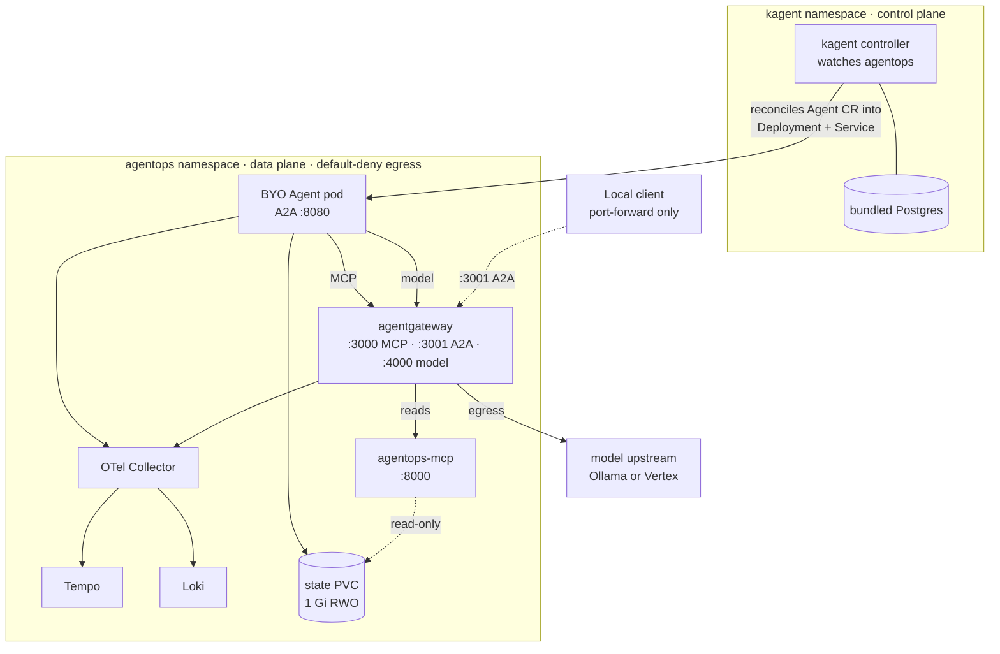

{}

- **You will:** Read the ownership handover from your terminal to a controller, then prove how a base edit and an overlay edit reach the rendered manifests.
- **You need:** `mise run doctor:platform` passing. No cluster is created on this page.
- **Time:** about 25 minutes, hands-on. {}

## A shell command versus a Kubernetes reconcile loop

A shell command is **imperative**: it makes exactly one thing happen, once, and then it is over. Kubernetes is **declarative**: you write down the end state you want, and a controller runs a continuous **reconcile loop** that drives the observed state toward it. The loop never stops, which buys two behaviors no command can offer. It **self-heals** — a killed pod comes back. And it **corrects drift** — an out-of-band edit is reverted to the declared spec.

That difference decides who is responsible when reality stops matching intent: with a command, a person notices late; with a declaration, a controller notices continuously.

This page reads the files that make that declaration: the ownership handover from your terminal to the cluster, what the kagent control plane adds over hand-written workload objects and what it costs, and where a base edit and an overlay edit actually land.

Start by proving the manifests are coherent before you read the architecture they describe:

```bash
mise run check:infra
```

That renders and validates both environments offline; nothing is applied and no cluster exists yet. If it is not green, fix that first, because every claim on this page is a claim about those files.

The code and protocol contracts survive the move untouched. You keep the same digest-pinned image, the same OpenAI-compatible model call, the same MCP read path, and the same A2A card on `:8080`. What changes is everything _around_ the process:

| Concern         | On your laptop, chapters 2–5                     | In the cluster, this chapter                                    |
| --------------- | ------------------------------------------------ | --------------------------------------------------------------- |
| Identity        | whichever user launched the shell                | a declared ServiceAccount with no API token mounted             |
| Configuration   | `.env` and exported variables                    | env and Secrets on the workload object                          |
| Restarts        | you                                              | the controller's reconcile loop                                 |
| Resource bounds | none; the model and the agent fight for the host | CPU and memory requests and limits, capped by a namespace quota |
| Health          | you notice it stopped answering                  | probes the kubelet calls on a schedule                          |
| Reachability    | whatever your host firewall allows               | default-deny ingress and egress, reopened one flow at a time    |
| Storage         | `agents/go/.state/`                              | a volume that outlives the pod using it                         |

You were the supervisor, the firewall, and the config manager; the right-hand column is where each of those roles lives now.

## What kagent owns, and what your image still owns

[kagent](https://kagent.dev/) extends the Kubernetes API with agent-shaped **custom resources** — object kinds the API server did not ship with. It also provides the controller that reconciles them. You apply an `Agent` object; kagent turns it into the running workload and keeps it matching:

```mermaid {ariaLabel="The kagent reconcile loop, from applied Agent resource to recreated pod"}
sequenceDiagram
    participant You as kubectl / Skaffold
    participant API as Kubernetes API
    participant Ctrl as kagent controller
    participant Wl as Deployment + Service
    You->>API: apply Agent CR (desired state)
    Ctrl->>API: watch Agent in agentops
    Ctrl->>Wl: create Deployment + Service
    Wl->>Wl: pull image, mount state PVC, serve A2A :8080
    Note over You,Wl: you delete the pod
    Ctrl->>Wl: observed ≠ desired → recreate the pod (self-healing)
```

**Diagram in words:** You — or Skaffold — apply an `Agent` custom resource to the Kubernetes API, stating the desired state. The kagent controller watches that kind in the `agentops` namespace, and creates a Deployment and Service from it; the workload pulls the image, mounts the state volume, and serves A2A on `:8080`. Then you delete the pod by hand. The controller observes that reality no longer matches the declaration and recreates it, which is the self-healing loop no shell command offers.

[6.3. Platform Agents]() makes you delete the pod yourself to watch that last step. The same loop is why you never patch the Deployment kagent generates: reconciliation overwrites your edit, so configuration changes go through the `Agent` resource or they do not survive.

kagent owns the _lifecycle_ of the workload and nothing inside the container. This course ships a **BYO Agent** — you bring the image, and kagent schedules it and fronts it on the cluster network. Model and tool composition, sessions, action confirmation, and audit transactions all stay in the Go application. kagent does not replace ADK.

A **CRD** teaches the API server a new kind of object; _established_ means it now serves that kind. Installing the pinned stable chart `0.10.1` establishes kagent's CRDs; three of those kinds carry this course, one per concern. They are the three you will query by name in [6.2. Platform Install](), and the three whose schemas are committed under `infra/kagent/schemas/` so that `check:infra` can assert they came from the chart digest the helmfile installs:

| Custom resource                                   | Declares                                                                  | Owning page                                                                   |
| ------------------------------------------------- | ------------------------------------------------------------------------- | ----------------------------------------------------------------------------- |
| `Agent` (`agents.kagent.dev`)                     | The BYO agent workload: image, replicas, env, security context, state PVC | [6.3. Platform Agents]() |
| `ModelConfig` (`modelconfigs.kagent.dev`)         | The OpenAI-compatible model endpoint kagent consumers use                 | [6.3. Platform Agents]() |
| `RemoteMCPServer` (`remotemcpservers.kagent.dev`) | The governed MCP endpoint, via agentgateway rather than the raw service   | [6.4. Platform Tools]()   |

The controller's blast radius is deliberately small: `infra/kagent/values.yaml` scopes its watch to one namespace, so it never reconciles a resource it should not.

```yaml
controller:
  watchNamespaces:
    - agentops
```

None of this is free. The honest question is what the extra control plane buys over a `Deployment` plus a `Service` plus a ConfigMap, which is already declarative, already self-healing, and already something your pipeline knows how to ship.

Four things the CRD, the controller, and `ModelConfig` add over hand-written workload objects:

1. **One object per agent instead of three.** The `Agent` carries image, replicas, env, security context, and state volume; the controller renders the Deployment and Service from it. `kubectl get agents -n agentops` is then an agent inventory, where a fleet of Deployments is indistinguishable from every other Deployment in the namespace.
1. **The model endpoint is a named object, not copied env.** `ModelConfig` is referenced by name, so an Ollama-to-Vertex swap is a patch on one object rather than an edit repeated in every workload that calls a model.
1. **The tool surface is declared too.** `RemoteMCPServer` makes "which MCP endpoint may this agent use" a reviewable cluster resource with an owner, instead of a URL buried in a container's environment.
1. **Reconciliation covers the agent-shaped fields.** A ReplicaSet already replaces a dead pod; nothing in a plain Deployment notices that someone edited the model binding or repointed the tool server. The controller reverts both.

Three costs come back the other way:

1. **Another control plane to install, patch, and defend.** The controller and its bundled Postgres run on the same lab node as your workloads.
1. **An alpha API.** `v1alpha2` from a CNCF Sandbox project can change between releases, and the pinned BYO schema exposes _fewer_ knobs than a Deployment: no probe fields, no termination grace period. The one readiness probe the controller wires cannot be retargeted, which is why the image ships its own `/livez` and `/healthz`.
1. **One more layer between manifest and pod when you debug.** You read the `Agent`, then the Deployment the controller generated from it.

So: run one agent, never swap model backends, already trust a Deployment pipeline — use the Deployment. Reach for kagent when you expect several agents sharing model and tool endpoints, want that fleet queryable as one kind, and accept an alpha API in exchange. This course uses it because the fleet-of-agents case is the one it is teaching you to build.

## How the base, the overlays, and the ports fit together

Two namespaces carry the whole picture. The **kagent** namespace is the control plane — the controller and its bundled Postgres. The **agentops** namespace is the data plane, where every workload serves traffic. Control flows one way: the controller reconciles _into_ agentops, and nothing in agentops reaches back.

`infra/k8s/base` holds the environment-independent truth: the `agentops` namespace, the service accounts and gateway-client Secret, the agent-state and state-backup volumes, agentgateway, the MCP server, Tempo, Loki, the OTel collector, the network policies, a resource quota, and the kagent custom resources. Two entries constrain everything else. The namespace label selects the `restricted` **Pod Security Standard**, the strictest of the three built-in profiles: privileged containers, host mounts, and running as root fail admission rather than starting. The resource quota caps the CPU, memory, and pod count the namespace may claim in total, so one runaway workload cannot starve the node.

The overlays change only environment-specific values on top of that. `k8s/overlays/local` includes the k3d gateway config and adds Prometheus, Alertmanager, and the host-Ollama egress exception; it patches no model name, because the base already declares the open-weight default. `k8s/overlays/gke` applies a Workload Identity patch, replaces the model name with `gemini-3.5-flash`, pins every persistent volume to the `agentops-standard` StorageClass, and includes the GKE gateway config with its Vertex egress exceptions. The patches are surgical JSON operations, not forked manifests: the local overlay's `patches:` block appends two egress rules and adds one environment variable, and nothing else. [6. Platform]() tabulates every row that differs.



**Diagram in words:** The kagent controller and its Postgres sit in the control-plane namespace and reconcile the BYO Agent into the `agentops` data plane. There the agent reaches its tools and model only through agentgateway, and writes to a state [PVC]() — a storage claim that outlives the pod using it, and `1 Gi RWO` means one gibibyte mounted by a single node at a time — which the MCP server reads back read-only. Agent and gateway both send telemetry to the collector, which fans it to Tempo and Loki. Only the gateway leaves the cluster, and only a port-forward comes in.

Two boundaries in that picture carry the platform's safety story, and [6.5. Platform Gateway]() owns both. Every pod in `agentops` runs under default-deny egress, reopened one declared flow at a time. And no Ingress or LoadBalancer exists at all — the k3d cluster even disables the service load balancer, so the only way in is a temporary `kubectl port-forward` you start yourself.

Ports are stable across the host and cluster profiles, so one map covers every forward and probe in this chapter and the next:

| Port    | Component      | Protocol / role         | Reached via                          |
| ------- | -------------- | ----------------------- | ------------------------------------ |
| `3000`  | agentgateway   | MCP                     | port-forward `svc/agentgateway`      |
| `3001`  | agentgateway   | A2A                     | port-forward `svc/agentgateway`      |
| `4000`  | agentgateway   | OpenAI-compatible model | port-forward `svc/agentgateway`      |
| `15020` | agentgateway   | internal metrics        | port-forward `svc/agentgateway`      |
| `8080`  | agentops-agent | A2A raw backend         | gateway; direct only for diagnostics |
| `8000`  | agentops-mcp   | raw MCP                 | gateway pods only                    |
| `3200`  | Tempo          | trace store query API   | port-forward `svc/tempo`             |

{}

The base deploys Tempo, Loki, and the OTel collector; the `local` overlay adds Prometheus and Alertmanager. Only Grafana and the host Compose profile belong to [Chapter 7](), which is why they are not in the table above.

| Port          | Component      | Protocol / role                      | Reached via                 |
| ------------- | -------------- | ------------------------------------ | --------------------------- |
| `3100`        | Loki           | log store (OTLP in, query out)       | via collector / Grafana     |
| `4317`/`4318` | OTel Collector | OTLP gRPC / HTTP                     | in-cluster emitters         |
| `8889`        | OTel Collector | span-metrics scrape target           | Prometheus scrape           |
| `9090`        | Prometheus     | metrics (local overlay / host)       | port-forward / host Compose |
| `9093`        | Alertmanager   | alert routing (local overlay / host) | port-forward / host Compose |
| `3002`        | Grafana        | dashboards (host profile)            | host Compose                |

The host profile also uses gateway readiness `:15021`. {}

Every published listener binds to loopback or a ClusterIP. This is a **production-shaped** lab, not a production platform: one node, no public endpoint, no TLS edge, no HA database, and a backup volume that sits in the same cluster as the thing it backs up. Two items people expect on that list are not on it any more — [6.9. Scale Out]() takes the read plane to two replicas behind an autoscaler and moves sessions onto PostgreSQL, then measures what each change actually bought. The rest of the list still stands: this demonstrates the mechanisms correctly and proves nothing about your scale, your data, or your failure modes — the distinction [0.2. Evidence]() owns.

## Your turn: prove a manifest change reaches the render

Two edits in the shared base, one of them the model name every environment inherits. Predict before you run: which render carries each edit, and will the offline gate care about either one?

- **Mode**: `temporary experiment`.
- **Goal**: watch one base edit reach both renders untouched and the other reach one of them changed, and read that off the rendered YAML rather than off the file you typed in.
- **Files to touch**: `infra/k8s/base/mcp.yaml`, raising the MCP container's memory limit from `512Mi` to `640Mi`; and `infra/kagent/modelconfig.yaml`, changing `spec.model` from `qwen3:4b-instruct` to `llama3.2:3b`.
- **Preflight**: require `git diff --quiet -- infra/k8s/base/mcp.yaml infra/kagent/modelconfig.yaml`; stop rather than discarding an existing manifest edit.
- **Steps**: make the memory edit first and render both overlays, then make the model edit and render both again, so you see each change arrive separately rather than reading one combined diff.
- **Gate that proves completion**: the three commands below print the results shown, and `mise run check:infra` exits non-zero on the model value alone.

```bash
kubectl kustomize infra/k8s/overlays/local | rg -e llama3.2 -e 640Mi
kubectl kustomize infra/k8s/overlays/gke | rg -e gemini -e 640Mi
mise run check:infra
```

```text
          memory: 640Mi
      value: llama3.2:3b
model: llama3.2:3b
```

```text
                model: google/gemini-3.5-flash
          memory: 640Mi
      value: gemini-3.5-flash
model: gemini-3.5-flash
```

Read the two blocks against each other. The memory bump is in both, because nothing overrides it. The model edit is in the local render twice — once as the `Agent`'s `AGENT_MODEL` and once as the `ModelConfig` field, because a kustomize `replacements` entry carries one into the other — and in the GKE render **not at all**: that overlay patches `spec.model` back to `gemini-3.5-flash`, so your base edit is overwritten there rather than inherited. A base value is a default, not a guarantee, and the only way to know which environments still hold it is to render them. The GKE block's extra first line is the gateway's own model catalog naming the Vertex model, which the patch does not touch. The gate then answers the second half of the prediction — the last two lines of a run whose schema and lint checks had all just passed:

```text
local agent model: got 'llama3.2:3b', want 'qwen3:4b-instruct'
[check:infra] ERROR task failed
```

Both objects are still valid YAML, and `kubeconform` and `kube-linter` both passed on the way to that line. What failed is an assertion in `scripts/check-infra.sh` that pins the local model identity in the `Agent` and in the `ModelConfig`. The `640Mi` bump sails through untouched because nothing pins it. Rendering tells you where a value goes; a gate decides which values are allowed to move at all, and the two questions have different answers.

- **Final state**: run `git restore -- infra/k8s/base/mcp.yaml infra/kagent/modelconfig.yaml`, repeat all three commands, and require the focused `git diff --quiet --` preflight to pass again.

## What you can do now

- `mise run check:infra` renders and validates every overlay on your machine with no cluster running.
- You can predict which render keeps a base edit: `640Mi` reaches both, the model name only the local one.
- You can say why a manifest `kubeconform` and `kube-linter` both pass still fails `check:infra`.
- You can name one project you would ship as a plain `Deployment` instead, and the kagent feature you would be giving up.

Continue to [1.3. Kubernetes]() when declaring the agent reads to you as a safer default than starting it yourself. That deferred prerequisite returns you to [6.1. Containers]().
