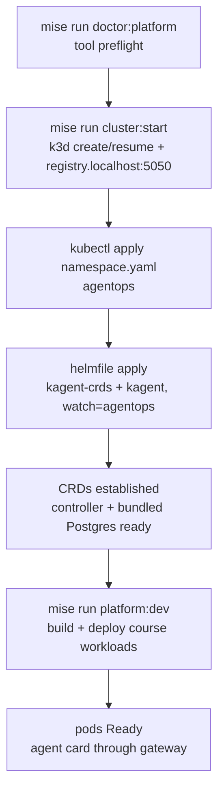
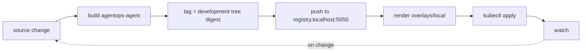

{}

- **You will:** Create the local k3d cluster, install the kagent control plane, and start the course workloads with Skaffold.
- **You need:** `mise run doctor:platform` passing, the Docker engine running, and Ollama installed — `doctor:platform` does not check for it, and the Skaffold step needs it serving on the k3d bridge address rather than on loopback.
- **Time:** about 55 minutes the first time, because the k3s node image, the kagent charts, and the pinned workload images have to download; about 30 once they are cached. Kind: hands-on. {}

## The install is a sequence of fail-fast gates

Installing this platform is an ordered sequence of **fail-fast gates**. Every step is a `mise` task backed by a checked-in config or a guarded script, and each one refuses to start until the gate behind it has finished. The topology comes from files under review rather than from remembered flags, so every learner ends up with the same cluster.

The gates exist because the expensive failure is not "the install did not work". It is "the install half worked": k3d has claimed Docker resources, a registry container exists, the CRDs are partly established, and now every later error you hit is a symptom of something you did twenty minutes ago. Backing out of that costs more than starting from nothing.

The previous page produced an inspected image; what is missing is a cluster to run it in. This page walks those gates in order, ending with the deployed agent answering its own card through the gateway.



**Diagram in words:** Six gates in one line, each refusing to start before the one behind it finished. `mise run doctor:platform` preflights the tools without starting anything. `mise run cluster:start` creates or resumes k3d together with `registry.localhost:5050`. `kubectl apply` creates the `agentops` namespace. `helmfile apply` installs the kagent CRDs and the controller, scoped to watch `agentops`. Then the CRDs are established — the API server now serves those kinds — and the controller and its bundled Postgres are ready. Only then does `mise run platform:dev` build and deploy the course workloads, ending with pods Ready and the agent card answering through the gateway.

The first gate is a preflight that starts nothing:

```bash
mise run doctor:platform
```

On a machine still running the older cgroup v1 hierarchy, it stops there — before k3d has created a single container:

```text
[doctor:platform] $ ./scripts/doctor.sh platform
platform   ready
env        optional .env is absent
docker     ready
cgroup v2 required for pinned Kubernetes; enable the unified cgroup hierarchy before running local k3d
[doctor:platform] ERROR task failed
```

The pinned k3s image needs the unified cgroup hierarchy, and the machine finds that out now rather than after `k3d cluster create` has half-built a node. `scripts/doctor.sh platform` checks the same way for a missing tool, a non-executable gateway wrapper, an unavailable Docker daemon, and the Helm diff plugin, which reports as `helm       helm-diff 3.15.10 ready` when it is installed.

A green run adds two `capacity` lines reporting this machine's RAM and free disk, and ends with a line about the cluster you have not created yet: `cluster    not created yet; run mise run cluster:start when needed`. The doctor only ever reports your kubectl context; it never creates anything. The exact tool inventory lives in [1.3. Kubernetes](); what matters here is that the doctor names two different remedies. For the host tier it tells you to install from a reviewed package source — `git`, `curl`, and a working C toolchain (`cc`, `make`, `install`, `tar`) at the base, plus Docker and `openssl` for the gateway profile and Ollama for the model one. For everything else, including every platform binary this chapter uses, the remedy is `mise run install:platform`.

The next gate creates the cluster from that reviewed config. `mise run cluster:start` runs `scripts/cluster-start.sh`, which creates or resumes cluster `local` from `infra/k3d.yaml`:

```bash
mise run cluster:start
```

On success it updates your kubeconfig, switches the current context to `k3d-local`, and prints `cluster: k3d-local is ready with registry.localhost:5050`.

That config turns off three pieces of convenience networking k3d and k3s enable by default: a Traefik ingress controller, the servicelb handler that fakes `LoadBalancer` services, and a load-balancer container fronting the API server. Those defaults serve people who want a public-ish cluster in one command; this course brings its own hardened agentgateway and publishes nothing, so those extras would be dead weight at best and a second, conflicting ingress path at worst.

```yaml
options:
  k3d:
    wait: true
    timeout: 120s
    disableLoadbalancer: true
  k3s:
    extraArgs:
      - arg: --disable=traefik,servicelb
        nodeFilters:
          - server:*
```

The same file binds the API server to loopback so it is unreachable from off the machine, and creates the registry the delivery loop pushes to:

```yaml
kubeAPI:
  hostIP: 127.0.0.1
registries:
  create:
    name: registry.localhost
    host: 127.0.0.1
    hostPort: "5050"
```

One choice looks like an omission and is not: the topology declares one server node and no agent node. The `Agent`, the MCP Deployment, and the backup Job all mount the same ReadWriteOnce claim with no affinity, and k3s's local-path provisioner pins the volume to whichever node created it — so a second schedulable node turns [6.3. Platform Agents]() into a coin flip between "runs" and "volume node affinity conflict". One node also frees a few hundred megabytes. This is a learning substrate: do not add an Ingress here expecting the manifests to publish it.

{}

`scripts/cluster-start.sh` checks that the Docker daemon is up, lists the existing clusters and registries as JSON, and branches on what it finds: a running cluster with its registry means nothing to do; a stopped one is resumed with `k3d cluster start local`; an absent one is created from the tracked config.

Two guards refuse the mismatched cases outright, because a leftover registry or a half-deleted cluster would otherwise leave you with a registry no cluster can pull from, or a cluster with no push target:

```text
k3d: cluster local exists without registry.localhost; reconcile it before continuing
k3d: registry.localhost exists without cluster local; reconcile it before continuing
```

A guard is a diagnosis, not permission to delete either shared resource. {}

{}

`local` is a shared k3d cluster name, so answer the ownership question with commands rather than from memory:

```bash
k3d cluster list
k3d registry list
kubectl get namespaces --show-labels
```

If `kubectl get namespaces` shows only the Kubernetes built-ins plus `agentops` and `kagent`, this cluster carries nothing but this course and you are free to repair or delete the leftover half. Any other namespace, or a cluster you do not remember creating, means someone else's work is on it — reconcile the pair instead of deleting either side. [6.6. Platform Delivery]() owns the dedicated-lab teardown. {}

## Install the kagent control plane without the demo fleet

With the cluster ready, install the **operator** — a controller that watches custom resources and keeps the cluster matching them:

```bash
mise run platform:install
```

Expect a few minutes on a first run, with no output while it pulls charts and waits. If it exits immediately instead, your current context is not `k3d-local`; the task asserts that before anything else, then applies `infra/k8s/base/namespace.yaml`, then runs `helmfile --file infra/helmfile.yaml apply --skip-diff-on-install`.

The namespace goes first on purpose. kagent's own chart creates the `kagent` namespace for the controller and its bundled Postgres, but every course workload lives in `agentops`, and the chart's RBAC and watch scope both name it. Creating it explicitly first means the guarantees on that namespace — the `pod-security.kubernetes.io/enforce: restricted` label above all — exist before anything can land in it.

**helmfile** declares which Helm charts a cluster should have and applies them in order. Its `helmDefaults` block is what makes the later verification meaningful: apply blocks until the CRDs are established and the pods are genuinely ready, rather than returning the moment Helm accepts the release.



The `kagent` release declares `needs: [kagent/kagent-crds]`, so the CRDs land before the controller that reconciles them, and it consumes `infra/kagent/values.yaml`. Both charts are addressed by immutable OCI manifest digest, with the reviewed chart version `0.10.1` recorded in a comment beside them — the digest is the identity, and the version is there so a human can tell which release it is. `--skip-diff-on-install` applies only to a release's first installation, which is what lets the CRD chart establish `ModelConfig` before Helm validates the dependent controller chart; later updates still show their normal diff. The `helm 4.3.0` and `helmfile 1.7.4` versions in `mise.toml` are pins, not suggestions.

`infra/kagent/values.yaml` switches the extras that chart ships off one flag at a time.

{}

The upstream kagent chart is a demo distribution: a fleet of built-in agents (`k8s`, `kgateway`, `istio`, `promql`, `observability`, `argo-rollouts`, `helm`, and several `cilium` agents), the `kmcp` and `kagent-tools` add-ons, `grafana-mcp`, `querydoc`, and a web UI. On a shared cluster every extra Deployment is footprint you must schedule, patch, and defend for no course value — it is attack surface, not capability. The values file also sets `ui.replicas: 0` and gives the controller and bundled Postgres explicit CPU and memory requests and limits so they fit a one-server lab node.

That `ui.replicas: 0` is worth naming rather than passing over. kagent ships a dashboard: a browser view of the agents, model configs, and tool servers the controller knows about, with a chat pane for talking to any of them. It is the fastest way to see the control plane, and this course scales it to zero anyway — a UI is one more Deployment to schedule and patch, and every object it would show is one `kubectl get` away, which is the form a learner can put in a runbook. Chapter 6 substitutes two reviewed dependency-free clients for the chat pane instead. Scale it to 1 for a port-forwarded session if you want to see it; nothing here depends on it either way. {}

**RBAC** is the rule set naming which Kubernetes API objects a component may touch. The values narrow both it and the controller's watch to the two namespaces the course uses:

```yaml
rbac:
  namespaces:
    - kagent
    - agentops

controller:
  watchNamespaces:
    - agentops
```

Because `helmDefaults` waits, a clean apply already implies readiness — but verify it rather than trusting an exit code:

```bash
kubectl -n kagent get pods
kubectl get crd \
  agents.kagent.dev \
  modelconfigs.kagent.dev \
  remotemcpservers.kagent.dev
helmfile -f infra/helmfile.yaml list
```

The controller and its Postgres should be Ready in `kagent`, the three CRDs should exist, and no demo agent or UI pod should be running anywhere. The last command shows what the digests actually resolve to — trimmed here to three of its seven columns:

```text
NAME         NAMESPACE   CHART
kagent       kagent      oci://ghcr.io/kagent-dev/kagent/helm/kagent@sha256:dc7fc61090725fd9f860d630a0ca66a1bd2a86d15e3fe267c0467c11cb198403
kagent-crds  kagent      oci://ghcr.io/kagent-dev/kagent/helm/kagent-crds@sha256:0b8eacbdc85e21ccad6c008e69ef623428db0be8e45c59492b40f3faff6dcf67
```

Notice the `VERSION` column is not there, because it is empty: a digest-addressed release has no version string for helmfile to print, which is precisely why the reviewed chart version `0.10.1` lives in a comment and the digest lives in the release. That listing also reads the local state file rather than the cluster, so it proves what you declared, not what is running; `kubectl -n kagent get pods` proves the second thing. If a CRD is missing, the `kagent-crds` release did not apply before the controller; re-run `mise run platform:install`, which is safe to repeat.

Install deliberately stops here: it does not deploy the agent, so the controller has nothing to reconcile in `agentops` yet, which is the expected post-install state.

## How a CRD schema refuses a misspelled field offline

Establishing a CRD teaches the API server a shape, and the cheapest way to see what that buys is to hand it something almost right. `infra/kagent/fixtures/invalid-modelconfig-field.yaml` is a committed `ModelConfig` with `provider` misspelled as `provder`, and validating it needs no cluster at all — this is an offline command:

```bash
kubeconform -strict -kubernetes-version 1.36.0 \
  -schema-location default \
  -schema-location 'infra/kagent/schemas/{{.ResourceKind}}_{{.ResourceAPIVersion}}.json' \
  infra/kagent/fixtures/invalid-modelconfig-field.yaml
```

`-strict` turns an unknown field into an error instead of a warning, and the second `-schema-location` reads CRD schemas checked into the repository, which keeps the check offline. It exits 1 and the useful fragment is `at '/spec': additional properties 'provder' not allowed`. The full line is quoted inline rather than captured because it embeds a non-reproducible `file://` URI carrying your own checkout path. Note what the refusal is _not_: not a typo check, not a linter. `additionalProperties: false` in the schema means the API server has an exhaustive list of what a `ModelConfig` may contain, so a field it does not know is a field it rejects — which is the same guarantee whether it arrives from your editor, from a generator, or from a controller.

An exhaustive schema also lets you read what you are _not_ using. Keep three sets apart: the course `Agent` sets `description`, `type`, and `byo`; the exercise fixture sets seven fields under `declarative`; the six below belong to neither, being on the API surface and deliberately unused here:

| Field                                | What kagent does with it                                                                                                  | When you would reach for it                                                                              |
| ------------------------------------ | ------------------------------------------------------------------------------------------------------------------------- | -------------------------------------------------------------------------------------------------------- |
| `spec.allowedNamespaces`             | Lets Agents outside this namespace reference it as a tool, on the Gateway API cross-namespace pattern; defaults to `Same` | Another team's agent must call yours without moving into `agentops`                                      |
| `spec.sandbox`                       | Sandboxed execution shared across runtimes, and consumable by BYO agents                                                  | You grant an agent code execution and want the platform, not the image, to bound it                      |
| `spec.skills`                        | Pulls skills from container images and mounts them under `/skills`                                                        | You want skill text versioned as an OCI artifact instead of the repository tree `3.2. Skills` loads from |
| `spec.declarative.context`           | Event compaction and context caching                                                                                      | You want the controller to compact history instead of the ADK policy plugin                              |
| `spec.declarative.memory`            | Memory configuration for a declarative agent                                                                              | Cross-session recall belongs to the platform rather than the SQLite store `3.4. Memory` owns             |
| `spec.declarative.executeCodeBlocks` | Auto-executes Python blocks in model responses — the schema records that an ADK bug makes it ignored for now              | Never here: this agent holds no code-execution authority                                                 |

Derive that list rather than trusting it, with `jq -r '.properties.spec.properties | keys[]' infra/kagent/schemas/agent_v1alpha2.json` and the same query one level down under `.declarative`. A field you can name and have decided against is a different thing from a field you never knew existed.

## Skaffold builds one image and applies one overlay

**Skaffold** is a development loop: it watches your source and, on every change, rebuilds the image, pushes it, renders the manifests, and applies them. `mise run platform:dev` runs that watch loop; `mise run platform:run` instead makes one clean release-tagged pass and exits, which is the promotion path later in this chapter.

One dependency comes before the workloads: pods must reach your model, and Ollama's default loopback listener is unreachable from inside k3d. Publish it on the gateway address of the `k3d-local` Docker bridge instead, which every pod can route to. Two terminals, in this order.

First, serve the model on the bridge address:

```bash
export OLLAMA_HOST="$(docker network inspect k3d-local --format '{{(index .IPAM.Config 0).Gateway}}'):11434"
ollama serve
```

If that command fails with `bind: address already in use`, or you are on macOS where the engine runs inside a VM, stop here and read [6.8. Platform Operations](), which owns both fixes and the security trade they carry. Second, in another terminal, export the same address so the pull lands in that listener, then start the loop:

```bash
export OLLAMA_HOST="$(docker network inspect k3d-local --format '{{(index .IPAM.Config 0).Gateway}}'):11434"
ollama pull qwen3:4b-instruct
mise run platform:dev
```

Everything else in the stack — the gateway, Tempo, Loki, the collector — runs an upstream image pinned by digest, so the only thing your source edits rebuild is the agent:



**Diagram in words:** A source change rebuilds the agent image, tags it with a development tree digest, and pushes it to the local registry. Skaffold then renders the local overlay, applies it, and watches for the next change, closing the loop.

`infra/skaffold.yaml` uses an `envTemplate` tag policy reading `{{.AGENT_IMAGE_TAG}}`, and `mise run platform:dev` resolves the working tree through the source-identity tool and sets it to `development-<tree-digest>`. So a dirty tree gets a valid, unique image tag that cannot be mistaken for a commit, matching the `unknown+dirty.<digest>` identity inside the binary from [6.1. Containers](). The task also passes `--cleanup=false`, so `Ctrl-C` stops the watcher but leaves the workloads and their volumes for an explicit teardown later.

In a third terminal, check the baseline before studying individual resources:

```bash
kubectl -n agentops get pods,pvc,svc
kubectl -n agentops wait --for=condition=Ready pod --all --timeout=180s
kubectl -n agentops port-forward svc/agentgateway 3001:3001
```

Leave the forward running, and from a fourth terminal ask the deployed agent to introduce itself:

```bash
curl -fsS http://localhost:3001/.well-known/agent-card.json | jq .name
```

The card's `name` field comes back as `AgentOps Agent` — the same discovery document you read in [2.4. Sessions](), now served by a pod, through a gateway, over a port-forward you started yourself.

A controller now owns that pod's lifetime, with one limit: the pinned BYO schema declares no kubelet probes, so a process wedged while still holding its socket is a failure nothing in this cluster notices. [6.3. Platform Agents]() opens by making you delete the pod to watch the replacement arrive. Keep Skaffold running: the next three pages explain and verify the resources you just deployed.

## Your turn: run the install against an empty kubeconfig

`mise run platform:install` is three commands in a row. In order: an assertion about your current context, a `kubectl apply` of the namespace, and the helmfile apply. Predict what happens if the first one cannot answer: does the task create the namespace and fail later on the chart, or stop before it touches anything?

- **Mode**: `inspect` — nothing on disk and nothing in the cluster changes, because the task never reaches a command that could change either.
- **Goal**: see that the install's first act is a question about which cluster you are talking to, not a change to it.
- **Files to touch**: none. `KUBECONFIG` is set for exactly one command and your real kubeconfig is never opened.
- **Preflight**: `kubectl config current-context` prints `k3d-local`, and `kubectl get namespace agentops` prints the namespace the real install created, with its age.
- **Steps**: run `KUBECONFIG=/dev/null mise run platform:install`.
- **Gate that proves completion**: the task exits non-zero on its first line, and the namespace's age afterwards is unchanged — it was never re-applied.

```text
[platform:install] $ test "$(kubectl config current-context)" = k3d-local
error: current-context is not set
[platform:install] ERROR task failed
```

- **Final state**: nothing to undo. Run `mise run platform:install` again without the override and it is the same idempotent install it was before.

The failing line is printed above the error, so you can see it was the assertion and not the chart: there is no half-installed release to reason about.

## What you can do now

- `mise run doctor:platform` ends with a `cluster` line naming `k3d-local` instead of refusing at a missing tool or the cgroup hierarchy.
- `kubectl -n kagent get pods` shows the controller and its Postgres Ready with no demo agent or UI pod, the three `kagent.dev` CRDs exist, and `helmfile list` resolves both releases to the reviewed OCI digests.
- The agent card request through gateway `:3001` prints `AgentOps Agent`, with the workloads Ready and their claims Bound.
- Pointed at an empty kubeconfig, the install refused on its first line and left the namespace it had already created untouched.

Every piece of the cluster you now have came from a file you can read, and the agent inside it answers on a port nothing else can reach.

Continue to [6.3. Platform Agents]() with Skaffold still running, because the next page takes apart the agent resource you can now inspect.
