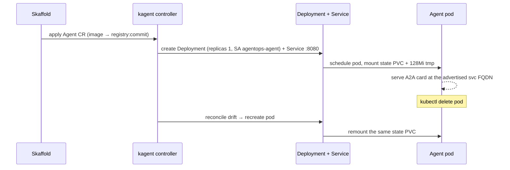
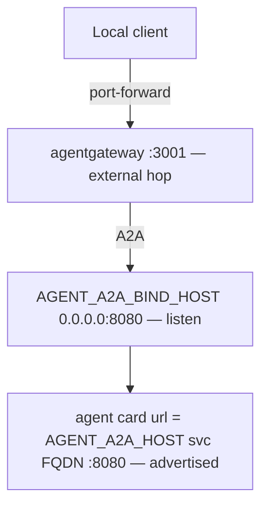

{}

- **You will:** Delete the agent's pod and measure what comes back, read the one file that declares it as a Kubernetes workload, and change its resource envelope for one environment only.
- **You need:** The Skaffold loop from [6.2. Platform Install]() still running.
- **Time:** about 30 minutes, hands-on. {}

## Delete the agent pod and watch the controller replace it

An **`Agent` custom resource** — an object type kagent added to the Kubernetes API — is declared intent, not a running process. One YAML object names the image, replicas, service account, security contexts, environment, and volumes; kagent's controller renders it into the Deployment and Service that actually run, then keeps them matching. Without it those properties live in commands nobody re-runs, nothing recreates a dead pod, and an edit made out of band survives indefinitely.

This page tests that from both sides. You delete the only pod serving the agent and measure what comes back, then read the file that decides what the replacement is — its environment, its hardening, the gap its schema cannot close — and patch a resource limit for one environment.

Predict two things first: whether the pod stays deleted, and whether a replacement mounts the same 1 Gi state volume — the one holding sessions and audit rows — or starts on an empty one.

Write down what the pod is called and who it is, then delete it:

```bash
kubectl -n agentops get pod -l app.kubernetes.io/name=agentops-agent \
  -o jsonpath='{.items[0].metadata.name} {.items[0].metadata.uid}{"\n"}'
kubectl -n agentops delete pod -l app.kubernetes.io/name=agentops-agent
kubectl -n agentops get pods,pvc -w
```

Your pod's name and UID are yours alone, which is why this page prints no transcript. Watch the `-w` stream until a pod reports `Running` and `1/1`, interrupt it, and ask again:

```bash
kubectl -n agentops get pod -l app.kubernetes.io/name=agentops-agent \
  -o jsonpath='{.items[0].metadata.name} {.items[0].metadata.uid}{"\n"}'
```

A different name and a different UID: this is not your pod resurrected, it is a new one. In the `pvc` half of that watch, `agentops-agent-state` never left `Bound` — the claim outlived the pod using it, which answers the second prediction and is why a session survives a crash. Ask the agent card through gateway `:3001` once it is ready and it answers as if nothing happened.

You typed no command to bring that pod back; the controller did. For a **BYO** Agent — one where you ship the image and kagent only schedules it — the controller owns `spec.byo.deployment`, turning that block into a `Deployment` plus a `Service` on port `8080`, carrying one replica, the named ServiceAccount, the security contexts, the env, and the volume mounts. You never author those objects, and hand-editing the generated `Deployment` is worse than useless: reconciliation converges it back and your change disappears without an error.



**Diagram in words:** Skaffold applies the `Agent`; the controller renders it into a Deployment and a Service on `:8080`; the Deployment schedules a pod that mounts the state volume and a small `/tmp` and serves its card at the advertised service FQDN. Deleting that pod is drift — a difference between the declared object and the running one — so the controller recreates it and the replacement remounts the same claim.

## How one Agent resource declares the whole workload

One object holds everything the cluster knows about the agent — image, replicas, model endpoint, volume, user id, whether it may restart a service:

```bash
kubectl -n agentops get agents.kagent.dev
kubectl -n agentops describe agent.kagent.dev/agentops-agent
```

A `describe` shows one object. To see the whole surface the API will accept — every field, set here or not — ask the API server, then ask the committed schema the same question offline:

```bash
kubectl explain agents.kagent.dev.spec.byo.deployment --recursive | head -30
jq -r '.properties.spec.properties.byo.properties.deployment.properties | keys[]' \
  infra/kagent/schemas/agent_v1alpha2.json
```

The difference between them is the point: the first asks a live API server what it will accept, the second asks the schema `check:infra` pins to the chart digest the helmfile installs. A divergence means the cluster is not running the chart this repository declares — worth knowing before you spend an afternoon on a field the controller ignores.

kagent accepts two shapes of `Agent`. A **declarative** Agent hands it a model, a system prompt, and a tool list, and kagent composes and runs the loop in its own container. A BYO ("bring your own") Agent inverts that: you ship the image and own the agent contract, and kagent narrows to scheduling the workload and fronting it on the cluster network. The first four lines of [`infra/kagent/agent.yaml`](https://github.com/MLOps-Courses/agentops-open-course/blob/main/infra/kagent/agent.yaml) decide which shape owns the agent's behavior:

```yaml
apiVersion: kagent.dev/v1alpha2
kind: Agent
metadata:
  name: agentops-agent
  namespace: agentops
spec:
  type: BYO
  byo:
    deployment:
      image: agentops-agent:dev
      imagePullPolicy: IfNotPresent
      replicas: 1
      serviceAccountName: agentops-agent
```

Chapters 2 through 5 built a complete ADK application — persistent sessions and tasks, guarded writes, PII and injection guardrails, audit transactions, spans. A declarative Agent would discard all of it and re-express something thinner in kagent's vocabulary. `spec.type: BYO` keeps the validated application intact: the exact image that ran on the host in Chapter 5 runs unchanged in the cluster, still serving its own A2A card, still driving its own ADK `Runner`. Choose BYO when you already have a working agent whose runtime and protocol surface you want preserved, and accept the cost: kagent cannot introspect a prompt or a tool list it never composed.

The same file carries the container `env`, the compute `resources`, both security contexts, and the `volumeMounts` for the state volume and a small writable `/tmp`.

<a id="which-environment-variables-preserve-the-data-plane"></a>The `env` block is where the move to Kubernetes narrows the application's authority rather than preserving it, and its most important property is an absence: no upstream provider credential enters the agent pod. Read it out of the render, not the file, because the render is what the cluster receives:

```bash
kubectl kustomize infra/k8s/overlays/local |
  yq -N -r 'select(.kind == "Agent") | .spec.byo.deployment.env[] | .name + "=" + .value'
```

```text
AGENT_MODEL=qwen3:4b-instruct
AGENT_MODEL_PROVIDER=openai-compatible
AGENT_MCP_URL=http://agentgateway:3000/mcp
AGENT_DATA_DIR=/app/data
AGENT_STATE_DIR=/app/state
AGENT_A2A_HOST=agentops-agent.agentops.svc.cluster.local
AGENT_A2A_BIND_HOST=0.0.0.0
AGENT_A2A_PORT=8080
AGENT_A2A_PROTOCOL=http
AGENT_A2A_MAX_LLM_CALLS=4
AGENT_WRITES_DISABLED=true
OPENAI_BASE_URL=http://agentgateway:4000/v1
OPENAI_API_KEY=agentgateway
OTEL_EXPORTER_OTLP_ENDPOINT=http://otel-collector:4318
ADK_CAPTURE_MESSAGE_CONTENT_IN_SPANS=false
OTEL_TRACES_SAMPLER=always_off
OTEL_SERVICE_NAME=agentops-agent
OTEL_RESOURCE_ATTRIBUTES=service.namespace=agentops,deployment.environment=kubernetes
AGENT_PII_MODEL_BASE_URL=http://host.k3d.internal:11434/v1
```

`OPENAI_API_KEY` is the literal marker `agentgateway`, which is what the gateway's own auth check expects — the gateway holds the real credential, and the agent holds a demo token worthless anywhere else. Model traffic goes to `agentgateway:4000` and tool traffic to `agentgateway:3000`, so the application code from Chapter 2.2 is unchanged whichever model sits behind that endpoint. Only the last line is local: GKE carries `AGENT_PII_MODEL_ENABLED=false` in its place.

Four of those variables are refusals rather than addresses. `AGENT_WRITES_DISABLED=true` freezes guarded operational actions, because neither shipped Kubernetes gateway authenticates callers and an unauthenticated restart of a real service is not a feature. `ADK_CAPTURE_MESSAGE_CONTENT_IN_SPANS=false` keeps the pinned ADK's content-bearing model and tool spans off, and `OTEL_TRACES_SAMPLER=always_off` keeps in-process tracing off with it, while sanitized logs and content-free metrics still leave the pod. `AGENT_A2A_MAX_LLM_CALLS=4` caps how many model calls one A2A turn may make, which keeps the optional cloud smoke's worst-case bill reviewable.

Those four, plus `AGENT_MODEL`, `AGENT_MODEL_PROVIDER`, and `AGENT_A2A_BIND_HOST`, are what `mise run check:infra` asserts by value in both profiles. It asserts nothing about the addresses, and the asymmetry is deliberate: a wrong address announces itself on the first turn, while a refusal someone has quietly relaxed announces nothing at all. `AGENT_STATE_DIR=/app/state` names the one writable persistent path, and it is guarded from the other side — `infra/scripts/check-state.sh` asserts the shared claim name, the `fsGroup`, and the read-only MCP mount.

Three lines carry a distinction every network server has and most configuration formats blur: where it **listens**, and where clients should **call** it.

<a id="why-does-the-agent-advertise-a-different-a2a-host-than-it-binds"></a>`AGENT_A2A_BIND_HOST=0.0.0.0` is the listen address, binding all interfaces so the gateway and the **kubelet** — the Kubernetes agent on each node — can reach the pod, where the host default is loopback-only. `AGENT_A2A_HOST` is the advertised host `agents/go/a2aserver/a2aserver.go` builds the card URL from. `config.Config` keeps them as distinct validated fields and rejects a wildcard advertised host outright, because `0.0.0.0` is a listener and not an endpoint.



**Diagram in words:** A local client reaches the gateway's A2A listener `:3001` through a port-forward; the gateway speaks A2A to the pod, which listens on `0.0.0.0:8080` and advertises a card URL built from the service FQDN. Confuse the two — advertise `0.0.0.0`, or leave the loopback default — and card resolution fails for every client while the pod stays perfectly healthy: the one symptom here that looks like a network fault and is not.

Two rewrites reach that manifest before the controller sees it, and both are easy to get subtly wrong.

**Skaffold rewrites the image reference inside the custom resource.** Plain kustomize does not know a custom resource contains an image field, so [`infra/skaffold.yaml`](https://github.com/MLOps-Courses/agentops-open-course/blob/main/infra/skaffold.yaml) declares a `resourceSelector` pointing at that exact path — `groupKind: Agent.kagent.dev`, `image: [.spec.byo.deployment.image]` — and replaces the placeholder `agentops-agent:dev` with the pushed registry reference. The tag comes from an `envTemplate` policy reading `AGENT_IMAGE_TAG`, which `mise run platform:dev` sets to `development-<tree-digest>` and `mise run platform:run` sets to the clean source revision.

**The overlay resolves the model name by name, never by position.** Neither overlay reaches into the agent's `env` list with an index; both declare a kustomize `replacements` entry copying `ModelConfig/agentgateway`'s `spec.model` into the `Agent` at `spec.byo.deployment.env.[name=^AGENT_MODEL$].value`, so reordering the manifest cannot redirect the override onto a neighbouring variable and a renamed variable fails the render instead of quietly setting the wrong one. `AGENT_MODEL` sits first in the render you just read, which is what makes an index dangerous: it would keep working until someone added a variable above it.

{}

`ModelConfig/agentgateway` in [`infra/kagent/modelconfig.yaml`](https://github.com/MLOps-Courses/agentops-open-course/blob/main/infra/kagent/modelconfig.yaml) is kagent's declarative model contract: provider `OpenAI`, a model name, an `apiKeySecret` naming the `agentgateway-client` Secret, and a `baseUrl` pointing at agentgateway `:4000`. The BYO pod never reads it at runtime — it brings its own `OPENAI_BASE_URL` and `OPENAI_API_KEY`. What it supplies is the model name, copied into `AGENT_MODEL` at render time so the two can never disagree, and its one real runtime consumer is the optional specialist below. {}

**Optional exercise:** run the declarative path beside the BYO one, for an answer with no image of your own, delivered through the controller's API on `:8083` rather than the agent's port.

<a id="how-can-you-compare-declarative-ownership-without-replacing-byo"></a>[`infra/kagent/exercises/incident-reader.yaml`](https://github.com/MLOps-Courses/agentops-open-course/blob/main/infra/kagent/exercises/incident-reader.yaml) declares one `runtime: go` specialist that runs beside the required agent instead of replacing it. It references `ModelConfig/agentgateway`, selects the six read tools from `RemoteMCPServer/agentops-tools`, declares no memory, skills, sandbox, or write tool, and carries three NetworkPolicies of its own. It also declares both security contexts, because kagent copies them into the generated pod unchanged and supplies no default, and the `agentops` namespace enforces the restricted Pod Security Standard, which rejects a pod that declares neither.

- **Mode**: `keep` — the objects you apply stay until you remove them with the command in Final state.
- **Goal**: see kagent's declarative runtime answer a real question through the controller's API.
- **Files to touch**: none. Everything here is a committed fixture.
- **Preflight**: the platform, the gateway, the MCP server, and Ollama all up — it calls a real model — and `kubectl -n agentops get agent.kagent.dev/agentops-agent` showing the required agent still Ready.
- **Steps**: apply the fixture, wait for it, and open a forward to the controller. Then invoke it and read the reply.

```bash
kubectl apply --filename infra/kagent/exercises/incident-reader.yaml
kubectl -n agentops wait \
  --for=condition=Ready agent.kagent.dev/incident-reader --timeout=3m
```

Then open the forward in a second terminal and leave it running — it does not return:

```bash
kubectl -n kagent port-forward svc/kagent-controller 8083:8083
```

The project ships a CLI for this — `kagent`, which installs the control plane, lists and describes its objects, and invokes an agent from a terminal. This course substitutes a client it can read instead: `cmd/kagent-invoke` is one command you can read end to end — `main.go` and the `kagentinterop` client it calls — which refuses to invoke anything except the one agent this exercise created and needs no tool outside the pinned table in `mise.toml`. Reach for the official CLI when you operate kagent for real; here, the point is which HTTP call a session is, not which binary makes it.

With that forward open, run it: it lists the controller's agents and invokes only the accepted and ready `agentops/incident-reader`.

```bash
cd agents/go
go run ./cmd/kagent-invoke \
  --task "Investigate INC-002 and cite log and runbook evidence."
```

- **Gate that proves completion**: the client returns an answer citing log and runbook evidence, and passing the reply's opaque `context_id` back with `--context-id` continues the same kagent-owned session rather than starting a new one.
- **Final state**: `kubectl delete --filename infra/kagent/exercises/incident-reader.yaml`. Removal is scoped: it takes the optional Agent and its three policies, and leaves the required agent, its volume, the shared objects, and the control plane exactly as they were.

The specialist cannot export OTLP at all: the pinned ADK's `execute_tool` spans carry tool arguments and results even with model-message capture disabled, so its egress policy omits the collector entirely.

## How the pod is hardened, and which probes it lacks {#how-is-the-pod-hardened}

Ask the shell question from [6.1. Containers]() about the pod rather than the image. An attacker with code execution here would not be root, could write only to `/app/state` and a 128 MiB `/tmp`, would hold no Kubernetes API token, and could reach nothing except the gateway and the collector.

Each clause is a declared field. UID, GID, and `fsGroup` 10001 with `runAsNonRoot`, `fsGroup` being what lets a non-root process write to the mounted volume. The RuntimeDefault seccomp profile, the container runtime's own filter on system calls. No privilege escalation, all Linux capabilities dropped, and a read-only root filesystem with one writable 1 Gi [RWO]() state volume and one `emptyDir` for `/tmp`. And `automountServiceAccountToken: false`, because the agent never calls the Kubernetes API. That setting does not reach kagent's own projected token at `/var/run/secrets/tokens`, which the API server refuses because its audience is `kagent`.

The compute envelope is concrete:

```yaml
resources:
  requests:
    cpu: 250m
    memory: 512Mi
  limits:
    cpu: "1"
    memory: 1536Mi
```

Those numbers, plus the 128 MiB `/tmp` and the 1 Gi volume, are what the namespace `ResourceQuota` and `LimitRange` are sized against — a quota caps what a whole namespace may request, and a `LimitRange` supplies defaults and ceilings for pods. [6.5. Platform Gateway]() owns that arithmetic.

<a id="how-does-kubernetes-know-the-processes-are-actually-ready"></a>One piece of that hardening is missing. Kubernetes checks a container's health by having the kubelet call an HTTP endpoint on a schedule. The agent image exposes two: `/livez` proves the event loop can answer a trivial request, and `/healthz` opens the runtime database read-only to verify its integrity, required tables, audit version, and idempotency index, then confirms the writable state directory and the task store. Health polling never creates or migrates state, and readiness stays false through a failed migration rather than repairing one.

Both workloads publish those endpoints. Only one has them wired as probes:

| Workload               | Exposes `/livez`, `/healthz`? | Wired as k8s probe?                                                                                                              | What restarts it on failure                                       |
| ---------------------- | ----------------------------- | -------------------------------------------------------------------------------------------------------------------------------- | ----------------------------------------------------------------- |
| `agentops-agent` (A2A) | Yes                           | Neither — BYO `v1alpha2` exposes no probe fields; the controller wires its own readiness check on `/.well-known/agent-card.json` | Nothing on a failed check; reconcile still replaces a deleted pod |
| `agentops-mcp`         | Yes                           | Yes — `startupProbe`, `readinessProbe`, `livenessProbe`                                                                          | The kubelet, via the wired probes (restart / drop from endpoints) |

The top row is the honest edge of the demonstration you ran at the top of this page. Something does poll the pod: the controller renders a `readinessProbe` on `GET /.well-known/agent-card.json` into every pod it builds, and an `Agent` reports `Ready` only once that probe passes. What the BYO schema gives up is the rest of that contract. You cannot retarget the probe at `/healthz`, and no `livenessProbe` or `startupProbe` exists, so a pod that exits comes back while a pod wedged holding its socket leaves the Service endpoints and is never restarted. You can call both endpoints yourself with `kubectl -n agentops port-forward svc/agentops-agent 8080:8080` and a `curl` from another terminal.

## Your turn: patch a resource limit through the overlay

The agent's memory limit is `1536Mi` in the base, and the local environment needs more headroom without changing what GKE gets. Predict two things: which render changes, and whether any offline gate has an opinion about the new value.

- **Mode**: `temporary experiment`.
- **Goal**: author an overlay patch that raises the memory limit for the local environment only, and find out which check would refuse an unreasonable one.
- **Files to touch**: `infra/k8s/overlays/local/kustomization.yaml` only. The base `infra/kagent/agent.yaml` stays untouched, which is the whole point of an overlay.
- **Preflight**: require `git diff --quiet -- infra/k8s/overlays/local/kustomization.yaml`; stop rather than discarding an existing edit.
- **Steps**: add this entry as the last item of the existing `patches:` list, immediately above the `replacements:` block, then run the three commands below. The block is written flush left; that list's items are indented two spaces in the file, so shift the whole thing right by two when you paste it.

```yaml
- target:
    group: kagent.dev
    version: v1alpha2
    kind: Agent
    name: agentops-agent
  patch: |-
    - op: replace
      path: /spec/byo/deployment/resources/limits/memory
      value: 2Gi
```

```bash
kubectl kustomize infra/k8s/overlays/local | yq 'select(.kind == "Agent") | .spec.byo.deployment.resources.limits'
kubectl kustomize infra/k8s/overlays/gke | yq 'select(.kind == "Agent") | .spec.byo.deployment.resources.limits'
mise run check:infra
```

- **Gate that proves completion**: the local render reports the new limit, the GKE render still reports the base value, and `mise run check:infra` exits zero.

```text
cpu: "1"
memory: 2Gi
```

```text
cpu: "1"
memory: 1536Mi
```

Now the half that is easy to predict wrongly. `check:infra` stayed green, because nothing in it does quota arithmetic: kustomize renders, `kubeconform` checks schemas, `kube-linter` checks practices, and none of the three knows how much memory your node has. The object that would refuse `4Gi` is the `LimitRange`, in the same render you just read:

```bash
kubectl kustomize infra/k8s/overlays/local | yq 'select(.kind == "LimitRange") | .spec.limits[0].max'
```

```text
cpu: "1"
memory: 2Gi
```

`2Gi` is the per-container ceiling, enforced at admission by the API server rather than by anything on your laptop. That is the honest boundary of an offline render: it proves what the manifests say, and the cluster still decides what it will accept — the distinction [0.2. Evidence]() owns.

- **Final state**: run `git restore -- infra/k8s/overlays/local/kustomization.yaml`, re-render both overlays to confirm both report `1536Mi` again, and require the focused `git diff --quiet --` preflight to pass.

## What you can do now

- You can say what deleting the agent's pod changes and what it does not: a new name and UID, the same `Bound` state claim.
- `kubectl -n agentops get agents.kagent.dev` lists `agentops-agent`, and you can read its rendered environment out of the overlay rather than out of the file.
- You can raise the memory limit in `overlays/local` alone: `2Gi` there, `1536Mi` in GKE, `check:infra` green either way.
- You can name the object that would refuse a limit no offline gate objects to, and where it is enforced.

One file says what the agent is allowed to be, and you can change one environment's copy without touching the other — the difference between a deployed container and a declared workload.

Continue to [6.4. Platform Tools]() once the pod you deleted has come back on the same state claim.
