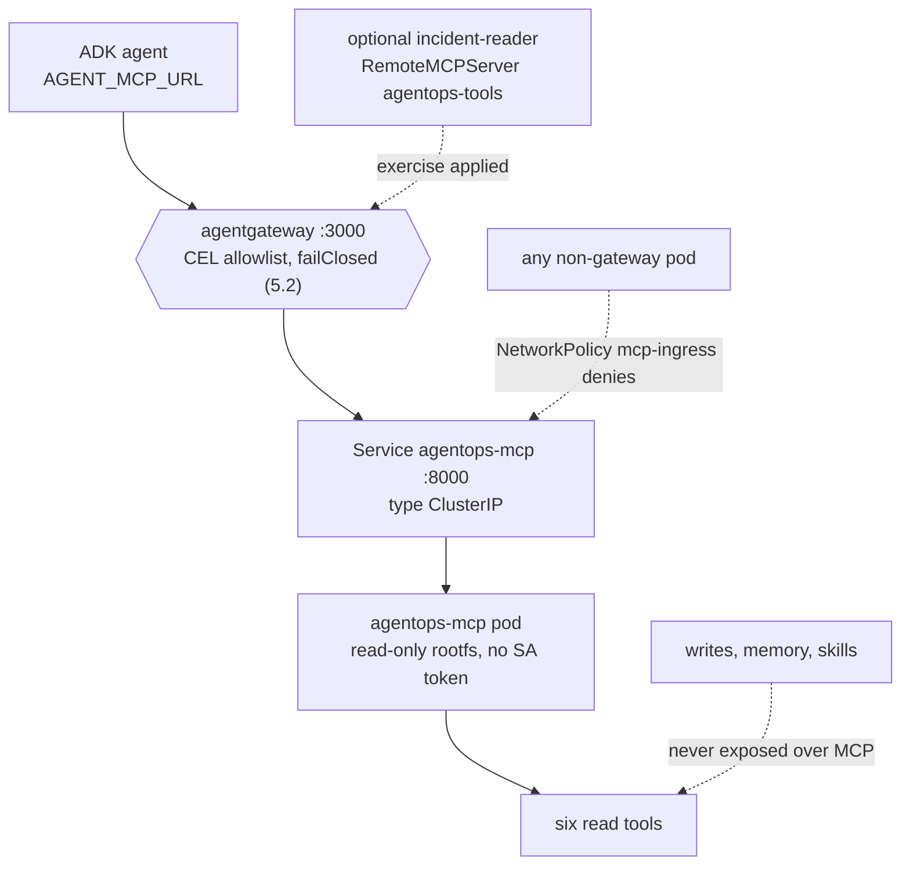
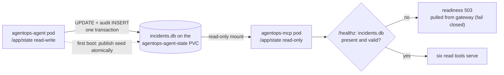

{}

- **You will:** See the six read-only tools become their own service, read the declaration that leaves the agent no route to it, and watch the gateway fail closed when the tool server disappears.
- **You need:** The Skaffold loop from [6.2. Platform Install]() still running.
- **Time:** about 18 minutes, reference. {}

## Why the tool server runs as a separate workload

The six read-only tools stop being functions inside the agent's process and become an **in-cluster MCP deployment**. It is the same image, a different entrypoint argument, its own pod. A subprocess and its parent share one lifecycle, one filesystem authority, and one network identity, so nothing outside that process can grant the read path less power than the agent that started it.

This page reads that separation out of the rendered manifests and tests it: the egress rule that leaves the agent no route to the tool server, the check that pins the served tool list to six names, the three controls that keep every other caller off port 8000, the read-only mount over the agent's database, and the gateway refusing outright when the tool server is gone. The tools read the same incidents, service status, logs, and runbooks; only who may call them changes.

Start with the missing route: read the agent's egress rules out of the rendered overlay and count them:

```bash
kubectl kustomize infra/k8s/overlays/local |
  yq 'select(.kind == "NetworkPolicy" and .metadata.name == "agent-egress") |
      .spec.egress[].to[] | .podSelector.matchLabels."app.kubernetes.io/name" // .ipBlock.cidr'
```

```text
agentgateway
otel-collector
0.0.0.0/0
```

Three destinations: the gateway, the collector, and a port-scoped exception for the co-hosted PII webhook. `agentops-mcp` is not on that list, and no fourth rule hides elsewhere — in a default-deny namespace the absence _is_ the rule. The agent reaches its tools through agentgateway or not at all.

No code changed to make that true. `infra/k8s/base/mcp.yaml` runs the same `agentops-agent:dev` image with a different entrypoint argument, so tool code and agent code ship as one artifact and run as two workloads:

```yaml
args: ["mcp"]
env:
  - name: MCP_HOST
    value: 0.0.0.0
  - name: MCP_PORT
    value: "8000"
  - name: MCP_TRANSPORT
    value: streamable-http
```

`MCP_HOST=0.0.0.0` binds all interfaces, `MCP_PORT=8000` matches the Service, and `streamable-http` selects the same transport [3.3. MCP]() already built — its in-cluster form, not a new one. A single [ClusterIP]() Service exposes port 8000 inside the namespace, and no `LoadBalancer`, `NodePort`, or Ingress exists.

Promoting the tools out of the agent's process buys four things the in-process form cannot. The tool pod restarts, drains, and rolls without touching the agent. It mounts the state volume `readOnly: true`, so the read service physically cannot write the database the agent owns. A distinct pod is a distinct NetworkPolicy subject, which is what makes the rule above expressible. And one shared MCP surface serves the ADK agent and any other MCP client at once, which is the reuse [3.3. MCP]() argues for in general; the optional kagent specialist below is one such client.

## What the six read-only tools are, and what pins that list

Naming the tools turns "read-only" from a slogan into a checkable claim. Four operational reads come from `agents/go/tools/read.go`: `list_incidents` for incidents on the platform, `get_incident` for one incident by id, `get_service_status` for a service and its open incidents, and `search_service_logs` for deterministic sample logs. Two knowledge reads come from `agents/go/memory/knowledge.go`: `get_runbook` by exact slug, and `search_runbooks` by free text.

That list is not a comment. `compose.MCPReadToolNames()` owns it, and `agents/go/mcpserver/mcpserver.go` compares what the server serves against it in both directions at startup — an extra tool widens the surface for no caller, and a missing one silently disappears the moment `AGENT_MCP_URL` is set, because the agent then stops binding its local equivalent. Both failures are invisible at runtime, and both fail here instead:

```bash
cd agents/go
go test ./mcpserver -run TestServerExposesExactlyTheAllowlistedReadTools -v -count=1
```

```text
=== RUN   TestServerExposesExactlyTheAllowlistedReadTools
=== PAUSE TestServerExposesExactlyTheAllowlistedReadTools
=== CONT  TestServerExposesExactlyTheAllowlistedReadTools
2026/08/10 23:10:56 INFO server connecting
2026/08/10 23:10:56 INFO server session connected session_id=""
2026/08/10 23:10:56 INFO client log level set level=""
2026/08/10 23:10:56 INFO server session disconnected session_id=""
2026/08/10 23:10:56 INFO server connecting
2026/08/10 23:10:56 INFO server session connected session_id=""
2026/08/10 23:10:56 INFO client log level set level=""
2026/08/10 23:10:56 INFO server session disconnected session_id=""
--- PASS: TestServerExposesExactlyTheAllowlistedReadTools (0.01s)
PASS
ok  	github.com/MLOps-Courses/agentops-open-course/agents/go/mcpserver	0.018s
```

Those `INFO` lines are the real MCP server logging, in-process: the test stands up the same streamable-HTTP surface the cluster deploys, connects a client, asks for the tool list over the wire, and compares it with the allowlist in both directions. One hundredth of a second, and no cluster.

What the surface omits matters as much. `restart_service` and `resolve_incident`, the long-term memory tools, and the instruction-only skills all stay inside the agent process, because they depend on ADK confirmation context and audit identity that do not survive translation into stateless protocol messages ([4.5. Guardrails]()). The MCP surface is therefore idempotent by construction: a compromised client can read incident state but holds no verb that changes it. These six are also the exact set the gateway allowlist re-lists in [5.2. MCP Gateway]() — two independent allowlists, checked against each other by `mise run check:infra`.

## How three layers keep every non-gateway caller off port 8000

Steering consumers through the gateway is half the control. The other half makes the raw service unreachable by anything else, and none of its three layers is the tool allowlist.

The first is addressing. The Service is `type: ClusterIP`, so port 8000 exists only inside the cluster and there is no external address to dial. The second is the `mcp-ingress` NetworkPolicy, which selects that pod and admits agentgateway alone, so a connection from any other pod is refused before the server sees it:

```bash
kubectl kustomize infra/k8s/overlays/local |
  yq 'select(.kind == "NetworkPolicy" and .metadata.name == "mcp-ingress") | .spec.ingress'
```

```text
- from:
    - podSelector:
        matchLabels:
          app.kubernetes.io/name: agentgateway
  ports:
    - port: 8000
      protocol: TCP
```

The third sits above the network: a caller that reaches port 8000 anyway must still present an expected `Host` authority. This closes **DNS rebinding**: a hostile page pointing a name it controls at an internal address. `mcpserver.OptionsFromEnv` parses `MCP_ALLOWED_HOSTS` and `Options.resolve` refuses a global `*` entry outright, so an empty or wildcard override is a startup error rather than an open door. The deployment supplies the short and fully qualified names of `agentgateway` and `agentops-mcp`, each with and without a port wildcard, and nothing else. Any other `Host` is answered `421 Misdirected Request` — the HTTP status for a request sent to the wrong server — before a tool runs. [5.2. MCP Gateway]() shows that same rejection from the gateway's side.

You will meet that `421` yourself, and it is worth knowing before it looks like a bug. `kubectl -n agentops port-forward svc/agentops-mcp 8000:8000` goes around the ClusterIP Service and around `mcp-ingress`, so the `Host` allowlist is the only layer still standing — and a client dialling `http://localhost:8000` presents `localhost:8000`, which is not on the list, so the server refuses it. That is the guard doing its job. To reach the raw server anyway, present an authority the list already carries: map `agentops-mcp` to loopback in your hosts file and point the tool at `http://agentops-mcp:8000`, which the `agentops-mcp:*` entry matches. Widening `MCP_ALLOWED_HOSTS` so the default URL works instead would trade this chapter's security property for one less variable, and `infra/k8s/base/mcp.yaml` says so at the setting.

One property of the pod belongs under a different heading. Its ServiceAccount sets `automountServiceAccountToken: false`, and it runs `runAsNonRoot` as UID/GID 10001 with a read-only root filesystem, all Linux capabilities dropped, and the RuntimeDefault seccomp profile, the same posture [6.3. Platform Agents]() applies to every workload that never calls the Kubernetes API. None of that stops anybody reaching port 8000; it bounds what an attacker who already has code execution _inside_ this pod can do next: no Kubernetes credential to spend, no writable filesystem to stage in, no root. Two different questions, two different controls — counting them together is how a threat model claims four defences where it has three.

Consumers arrive through one route and wire it two ways. A **`RemoteMCPServer`** is the kagent object that names where a tool catalog lives, so an agent referencing it inherits that address instead of carrying client configuration of its own. You will still see it called a `ToolServer` in older kagent material — that was the resource's previous name, and the file here is named for the kind it actually declares. `infra/kagent/remotemcpserver.yaml` points one at `agentgateway…:3000/mcp` rather than `agentops-mcp:8000`, which puts every declarative kagent consumer _through_ the policy point — the CEL allowlist, rate limit, and fail-closed backend of [5.2. MCP Gateway]() — instead of around it. The required BYO agent does not reference that object at all: it reaches the same route through `AGENT_MCP_URL` ([6.3. Platform Agents]()) and filters the remote catalog back to the same six names in Go.



**Diagram in words:** The BYO agent always reaches the six reads through agentgateway; the optional specialist from [6.3. Platform Agents]() follows the same route only while installed. Every other pod is refused by `mcp-ingress`, and every write capability stays outside the MCP surface.

## How one volume serves one writer and one read-only reader

The two workloads share one file. This section reads the mount split, follows a governed read through it, then removes the reader to see what the gateway returns.

Both pods mount the same [RWO volume](), `agentops-agent-state`, at `/app/state`, and `fsGroup: 10001` makes its files writable by the non-root id both run as. The agent owns the writable mount; the MCP container asks for the same claim read-only:

```yaml
volumeMounts:
  - name: state
    mountPath: /app/state
    readOnly: true
```

So a confirmed restart or resolution updates the very database later MCP calls read, without the read service ever holding filesystem write authority. Three steps, in order: on a fresh volume the agent initializes `/app/state/incidents.db` from the immutable image seed at `/app/data/incidents.db`; the MCP container mounts that published claim read-only, so it can neither change the file nor create it; and its `/healthz` probe stays `503` until the file exists and passes an integrity check. That last step is what **failing closed** means here: the gateway drops the pod from its backends and answers callers with an error instead of letting it serve, or invent, state of its own.



**Diagram in words:** One writer, one reader, one file. The `agentops-agent` pod mounts `/app/state` read-write, publishes the image seed into `incidents.db` on the `agentops-agent-state` claim at first boot, and commits each confirmed change as an `UPDATE` plus an audit `INSERT` in one transaction. The `agentops-mcp` pod mounts the same path read-only, and its `/healthz` probe gates the six read tools on that file being present and valid; otherwise readiness returns `503` and the gateway pulls the pod from its backends.

This is deliberately a single-node, single-replica SQLite design: an RWO claim binds to one node, and the read/write split is filesystem permissions rather than a database protocol. A horizontal deployment needs a network database with a migration and concurrency plan, not a multi-writer filesystem. `infra/scripts/check-state.sh` renders both overlays and asserts the shared claim name, the fsGroup, and the read-only MCP mount, so the split cannot quietly become a second writer.

To watch the governed path work, forward only the gateway — never the raw MCP service — and run the list-tools script from [5.2. MCP Gateway]() against `http://127.0.0.1:3000/mcp`. Start the forward in one terminal and leave it open; it runs until you stop it:

```bash
kubectl -n agentops port-forward svc/agentgateway 3000:3000
```

Run the handshake in a second terminal, then read both logs in a third:

```bash
kubectl -n agentops logs deploy/agentgateway --tail=50
kubectl -n agentops logs deploy/agentops-mcp --tail=50
```

The gateway log records the routed `tools/call`; the MCP log records the read reaching the server. A request that errors at the gateway and never appears in the MCP log is a policy decision — allowlist, rate limit, or fail-closed backend — rather than a server fault. Which log stays silent tells the two apart.

One question decides whether a missing tool server is loud or silent: does the gateway return an empty tool list, or an error? Scale the deployment to zero — the Service keeps its address and loses its only endpoint, and the last command on this page puts the replica back.

```bash
kubectl -n agentops scale deploy/agentops-mcp --replicas=0
```

Repeat the handshake through the same forward and the refusal you get is worded to your own cluster. The capture below comes from somewhere everyone can reproduce byte for byte: the host gateway from Chapter 5 runs the same `v1.4.1` image with the same `failureMode: failClosed` on the same MCP route, only a different backend address. Start it with `mise run gateway:host:start` while nothing is listening on `:8000`, then send the first request of the handshake:

```bash
curl -sS -i http://localhost:3000/mcp \
  -H 'Content-Type: application/json' -H 'Accept: application/json, text/event-stream' \
  -d '{"jsonrpc":"2.0","id":1,"method":"initialize","params":{"protocolVersion":"2025-06-18","capabilities":{},"clientInfo":{"name":"curl","version":"1"}}}'
```

```text
HTTP/1.1 500 Internal Server Error
content-type: application/json
content-length: 219
date: Mon, 10 Aug 2026 21:13:11 GMT

{"jsonrpc":"2.0","id":1,"error":{"code":-32603,"message":"failed to send message: http upstream error: http request failed: upstream call failed: SendRequest: connection error: Connection reset by peer (os error 104)"}}
```

Read where that failed. Not at the list-tools request — at `initialize`, the first message of the handshake. No session id is ever issued, so there is no state in which a client could be handed an empty catalogue. The transport detail at the end names your missing backend and reads differently in the cluster; the `500` and the JSON-RPC error code are the parts that transfer.

An empty list would be the quiet failure: a model told "you have no tools" answers from memory and sounds just as confident. Failing closed turns that into an error the agent surfaces — the behavior [5.2. MCP Gateway]() configured and this deployment inherits. Stop the host gateway with `mise run gateway:host:stop`, then restore the cluster replica; `/healthz` stays `503` until it re-opens the agent-published database:

```bash
kubectl -n agentops scale deploy/agentops-mcp --replicas=1
```

## What you can do now

- From the rendered YAML alone, you can say why nothing declares a route from the agent to the tool server.
- The offline test names the six read tools and fails on a seventh, in either direction, without a cluster or a model.
- With the MCP backend gone, the gateway refused at `initialize` with a `500` and a JSON-RPC error, so no client is ever told it has no tools.
- You can name the three things that stop a non-gateway caller — the ClusterIP Service, `mcp-ingress`, and the `Host` allowlist — and say why the missing service-account token is not one of them.

The render declares all of it; the cluster is what enforces it.

Continue to [6.5. Platform Gateway]() once the only way you can reach the six tools is through the gateway.
