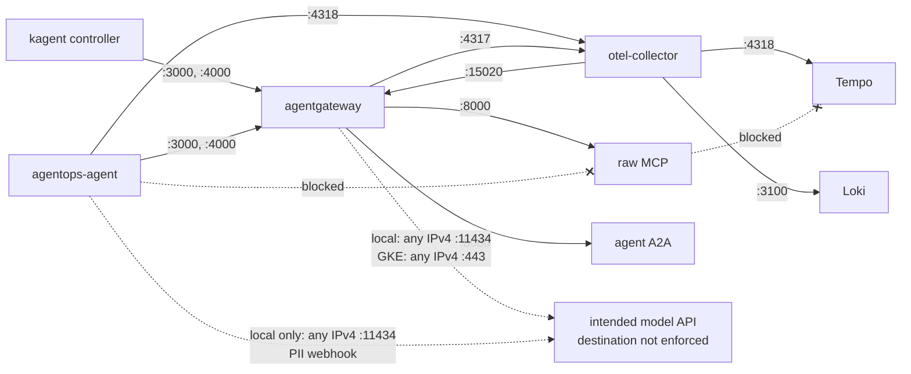

{}

- **You will:** Put the gateway in front of every in-cluster hop, read the declarations that leave undeclared traffic nowhere to go, and see how a credential you do not yet hold would live in git as ciphertext.
- **You need:** The Skaffold loop from [6.2. Platform Install]() still running.
- **Time:** about 25 minutes, reference. {}

## No Service in the namespace is reachable from outside

This page owns the **network layer of defence in depth**: the declarations that decide where traffic may go, underneath the application guardrails [4.6. Security]() built. A second layer earns its cost because the first one can lose — prompt injection turns a tool-using agent into a _confused deputy_, a trusted process made to act for an attacker, and the hostile text arrives inside ordinary data: an incident, a log line, a runbook. So the platform is built on the assumption that the application layer has already failed, and every declaration below answers one question you can check without a cluster: whether the attempt has anywhere to go, including the one path that stays open.

Start from outside. The `agentops` namespace runs a gateway, a tool server, a telemetry collector, two stores, and two monitoring workloads. Predict how many of them a machine outside the cluster can dial, then ask the render what kind of Services exist at all:

```bash
kubectl kustomize infra/k8s/overlays/local | yq -N -r 'select(.kind == "Service") | .metadata.name + "  " + .spec.type'
```

```text
agentgateway  ClusterIP
agentops-mcp  ClusterIP
alertmanager  ClusterIP
loki  ClusterIP
otel-collector  ClusterIP
prometheus  ClusterIP
tempo  ClusterIP
```

Zero. Seven Services, all of them `ClusterIP`, which is an address that exists only inside the cluster: no `LoadBalancer`, no `NodePort`, and no Ingress object anywhere. The agent's own Service is not even in that list, because kagent's controller creates it rather than the overlay. Every route in this chapter is a port-forward you started yourself:

```bash
kubectl -n agentops port-forward svc/agentgateway \
  3000:3000 3001:3001 4000:4000 15020:15020
```

**Close that terminal and the platform has no front door at all.** With the forward open, `http://localhost:3001` speaks A2A, `http://localhost:4000` speaks the OpenAI-compatible model API and requires `-H "Authorization: Bearer agentgateway"` from the `agentgateway-client` Secret, and `http://localhost:15020/metrics` prints Prometheus lines. Treat that route as a single-user capability surface rather than a confidentiality boundary: opaque task and context identifiers are not caller credentials. Neither Kubernetes profile configures JWT caller authentication on A2A, which is why the application ships with `AGENT_WRITES_DISABLED=true`: task and session persistence work, guarded actions refuse before approval.

The pod behind that forward is the same gateway and the same three listeners as Chapter 5, now scheduled instead of started. The base pins agentgateway `v1.4.1` by image digest, runs it as UID/GID 65532 with a read-only root and dropped capabilities, and mounts the selected config read-only:

```text
agentgateway:3000   MCP
agentgateway:3001   A2A
agentgateway:4000   OpenAI-compatible model
agentgateway:15020  internal metrics
```

Readiness and liveness probes both `GET /healthz/ready` on the pod-local readiness port `:15021`, never a data port. A listener accepts TCP the moment it binds, before backends, policies, and JWKS are loaded, so a probe against `:3000` would mark the pod Ready while every real request still failed. That port is deliberately absent from the Service, because the kubelet dials the pod IP directly and nothing in the cluster needs to reach it.

Which upstream the gateway talks to is a data-plane choice, not an application change. The base hard-codes no gateway ConfigMap; each overlay adds one. Local includes `agentgateway/k3d` and reaches Ollama at `host.k3d.internal:11434`. GKE includes `agentgateway/gke` and reaches Vertex with `backendAuth.gcp`, which signs that upstream call with the pod's ambient Google credentials rather than a key in the request. The Go agent points at `agentgateway:3000` and `agentgateway:4000` in both.

## How default-deny NetworkPolicy reopens one flow at a time

Being unpublished only answers the question from outside, and a hijacked pod is already inside. A **NetworkPolicy** names which pods may talk to which, on which ports ([0.8. Glossary]()). Both directions start closed, held shut by a pair of policies whose empty `podSelector` selects every pod in the namespace. Below is the egress half; the ingress twin differs only in `policyTypes: [Ingress]`:

```yaml
spec:
  podSelector: {}
  policyTypes: [Egress]
```

The policies that reopen it are all declared, and you can list them without a cluster:

```bash
kubectl kustomize infra/k8s/overlays/local | yq -N -r 'select(.kind == "NetworkPolicy") | .metadata.name'
```

```text
agent-a2a-ingress
agent-egress
agentgateway-egress
agentgateway-ingress
alertmanager-ingress
default-deny-egress
default-deny-ingress
dns-egress
loki-ingress
mcp-ingress
otel-collector-egress
otel-collector-ingress
otel-collector-metrics-ingress
prometheus-egress
prometheus-ingress
tempo-ingress
```

Two of those are the default-deny pair, one is a namespace-wide DNS allowance to `kube-system`, and every remaining name is one workload's declared reachability. Because the namespace denies by default, a flow works only when the source's egress policy and the destination's ingress policy both allow it. The gateway admits three named peers and no one else: `agentops-agent` on MCP `:3000` and model `:4000`; `otel-collector` on metrics `:15020`; and the `kagent` controller on `:3000` and `:4000`, that last one demanding both the namespace label `kubernetes.io/metadata.name: kagent` _and_ the pod labels `app.kubernetes.io/instance: kagent` and `app.kubernetes.io/component: controller`, so an unrelated pod in either namespace stays denied. Nothing is admitted to A2A `:3001`: you reach it with a port-forward, which the kubelet serves rather than a pod, so no ingress rule governs it.

Solid edges are the only internal flows; dashed edges are the residual public reach:



**Diagram in words:** The kagent controller and the agent reach the gateway on MCP `:3000` and model `:4000` only. The gateway alone reaches the raw MCP server, the agent's A2A port, and the collector; the collector alone writes to Tempo and Loki and scrapes gateway metrics. The two dashed edges are port-scoped model exceptions: the gateway's in both profiles, the agent's on the local profile only, for its PII webhook. The two crossed edges are refused — the agent cannot bypass the gateway to the MCP server, and the MCP server cannot reach the trace store.

The precise source-to-destination allow-matrix, mirroring [`network-policies.yaml`](https://github.com/MLOps-Courses/agentops-open-course/blob/main/infra/k8s/base/network-policies.yaml):

| Source pod       | Allowed egress (port)                                        | Ingress admitted from (port)                                                                                    |
| ---------------- | ------------------------------------------------------------ | --------------------------------------------------------------------------------------------------------------- |
| `agentgateway`   | raw MCP `:8000`, agent `:8080`, collector `:4317`, model\*   | `agentops-agent` `:3000/:4000`; `otel-collector` `:15020`; `kagent` controller `:3000/:4000`; nobody on `:3001` |
| `agentops-agent` | gateway `:3000/:4000`, collector `:4318`, local-only model\* | gateway `:8080`                                                                                                 |
| `agentops-mcp`   | DNS only                                                     | gateway pods `:8000`                                                                                            |
| `otel-collector` | Tempo `:4318`, Loki `:3100`, gateway `:15020`                | gateway `:4317`; agent `:4318`; `kagent` controller `:4317`; local overlay `prometheus` `:8889`                 |
| `tempo`          | DNS only                                                     | collector `:4318`                                                                                               |
| `loki`           | DNS only                                                     | collector `:3100`                                                                                               |

\* Vanilla NetworkPolicy scopes a model exception by port rather than hostname: any IPv4 `:11434` locally, or any IPv4 `:443` on GKE, plus WIF `:987/:988`. GKE grants exactly one, to the gateway. The local profile grants two, because the agent's PII webhook calls Ollama directly and must not recurse through the gateway it is filtering for. Both telemetry stores are file-backed and hold no such rule. Every pod also keeps the namespace-wide DNS allowance.

That footnote is the honest limit of the design: a hijacked agent pod can still send data over its allowed model, tool, telemetry, and DNS routes; on GKE it cannot open a direct connection to an arbitrary host, and on the local profile it can reach any IPv4 address but only on TCP `11434`. The broad HTTPS rule on GKE is a residual exfiltration path, not destination allowlisting — Workload Identity limits which Google operations accept the pod identity, and cannot stop a compromised process from sending ordinary HTTPS elsewhere. Production needs an egress proxy, a firewall, or an FQDN-aware policy. What the port scoping buys is one port on one pod per exception, so a compromised workload inherits nothing from its neighbours. These policies also need a network-policy-capable cluster: k3s enforces them out of the box, and the OpenTofu module enables Calico on GKE.

Compute has the same guardrail shape. `infra/k8s/base/resource-quota.yaml` caps what the whole `agentops` namespace may claim — `requests.cpu: "2"`, `requests.memory: 4Gi`, `limits.cpu: "8"`, `limits.memory: 9Gi`, `pods: "13"` — sized as the declared per-container requests and limits of the deployed workloads plus one surge pod per rolling deployment: a `RollingUpdate` starts the replacement before terminating the pod it replaces, so a ceiling sized for steady state alone would reject that replacement at admission and deadlock the Skaffold rollout. A runaway or duplicated workload is rejected at admission instead of starving a neighbour namespace. Because a compute quota also rejects any pod declaring no resources at all, the `LimitRange` supplies bounded defaults so ad-hoc diagnostic pods stay schedulable; `kubectl -n agentops describe resourcequota agentops-compute` shows live consumption against it.

When a lockout happens, start from the rendered policy and the pod selectors rather than from a shell inside a pod: the production image is distroless and contains no shell or interpreter. Work in this order:

1. Confirm which policies select the failing pod, and whether they govern ingress, egress, or both.
1. Resolve the destination with `kubectl -n agentops get service,endpointslice`, because a policy matches the pod IPs behind a Service, not the Service name.
1. Match caller labels, destination labels, protocol, and port against every additive allow policy; all four must line up inside one rule.
1. Diff the live objects against `kubectl kustomize infra/k8s/overlays/local` and restore drift through the normal Skaffold path.

A missing policy is a delivery problem; a present policy with no matching peer or port is a policy problem. Do not debug by deleting `dns-egress`, which would interrupt name resolution for the whole namespace and teach you nothing the render could not.

**Optional exercise:** diagnose why the quarantined collector-ingress fixture is broader than the completed reference. An over-broad policy fails nothing: traffic flows, so the extra senders it admits show up only in its selectors.

- **Mode**: `inspect`.
- **Goal**: explain why namespace-only selectors plus ports `4317`, `4318`, and `8889` admit more senders than the source-and-port-specific completed policy.
- **Files to touch**: none. Read `infra/k8s/exercises/otel-ingress-broad.yaml`, `infra/k8s/base/network-policies.yaml`, and `infra/k8s/overlays/local/network-policies.yaml`.
- **Preflight**: require `git diff --quiet -- infra/k8s/exercises/otel-ingress-broad.yaml infra/k8s/base/network-policies.yaml infra/k8s/overlays/local/network-policies.yaml` so the comparison uses the reviewed fixtures.
- **Steps**: read the broad fixture's `from:` and `ports:` blocks, then the completed policy's, and write down for each of the three ports which senders the first admits that the second refuses.
- **Gate that proves completion**: `mise run check:infra` exits zero. It verifies the broad fixture's exact unsafe shape, proves neither overlay includes it, and asserts that the completed base permits only named OTLP emitters while only local Prometheus reaches `8889`.
- **Final state**: no file or cluster changes; the focused `git diff --quiet --` command still exits zero.

## Where credentials live: Workload Identity, and ciphertext in git

On GKE, no key file exists anywhere. The gateway pod borrows a Google identity with two project-level roles instead. OpenTofu creates a service account with `roles/aiplatform.user` and `roles/serviceusage.serviceUsageConsumer` binds `agentops/agentgateway` to it through [Workload Identity Federation](), and the overlay annotates the Kubernetes service account. Under that binding the pod trades a service-account assertion for short-lived tokens from GKE's metadata server, so no JSON key is created, mounted, or rotated. The gateway is the only workload in the namespace with a Google identity at all: Tempo and Loki write to volumes rather than object storage, and `scripts/check-infra.sh` asserts that exactly one rendered ServiceAccount carries the `iam.gke.io/gcp-service-account` annotation, so a second one cannot appear unnoticed. That identity authenticates the gateway's outbound Vertex call and nothing else: it does not authenticate A2A callers, create tenant isolation, or justify enabling guarded writes.

Neither role is narrow, and the first one least of all. `roles/aiplatform.user` grants project-wide use of Vertex AI — training jobs, endpoints, tuning, batch predictions, all of them billable — where the shipped route does one thing, `generateContent` against a publisher model. Anything executing in the gateway pod inherits that gap, and the overlay deliberately allows that pod both the metadata server and outbound `:443`, so an injection that reached code execution would reach this role too. The lab accepts it because the alternative is a custom role every learner would have to create, name, and clean up before this chapter runs at all; the spend ceiling sits one layer up in the model route's request and token buckets, and the project is meant to be disposable. `infra/gcp/iam.tf` records that trade at the binding itself, together with the single permission — `aiplatform.endpoints.predict` — a real deployment should replace it with.

<a id="how-do-you-keep-secrets-in-git-safely"></a>The course platform holds no real credential today — the `agentgateway-client` Secret carries the non-secret `agentgateway` marker, and the GKE path has no static key to store. Every real platform eventually holds one, and the answer to "how do I commit configuration without committing credentials" is to commit ciphertext.

{}

[SOPS](https://github.com/getsops/sops) (MPL-2.0) with [age](https://github.com/FiloSottile/age) (BSD-3-Clause) is the minimal open-source pattern: encrypted values live in git, and the decryption key stays local. [`.sops.yaml`](https://github.com/MLOps-Courses/agentops-open-course/blob/main/.sops.yaml) declares one creation rule — files under `infra/**/secrets/` are encrypted to an age recipient, and `encrypted_regex: ^(data|stringData)$` keeps `kind`, `metadata`, and comments reviewable in diffs so only the secret values become ciphertext. `infra/k8s/base/secrets/agentgateway-client.enc.yaml` is a committed encrypted Secret holding a fake demo value. `infra/scripts/secrets.sh` wraps the lifecycle:

```bash
infra/scripts/secrets.sh keygen
infra/scripts/secrets.sh encrypt infra/k8s/base/secrets/my-secret.enc.yaml
infra/scripts/secrets.sh decrypt infra/k8s/base/secrets/my-secret.enc.yaml
```

`keygen` writes the age key to the gitignored `infra/secrets/age.agekey` and prints the public recipient you put in `.sops.yaml`; `sops` then finds the key through `SOPS_AGE_KEY_FILE`, which the script defaults for you. At deploy time, decrypt to stdout and pipe into `kubectl apply -f -` — never onto disk. The encrypted manifest is deliberately absent from `kustomization.yaml`, because plain `kubectl kustomize` cannot decrypt SOPS files and wiring it in would either break `scripts/check-infra.sh` for anyone without the private key or require the `ksops` exec plugin on every render.

Be honest about the scope: a lab pattern, not a KMS. Whoever holds the age private key holds every secret encrypted to it, there is no access audit, and rotation means a new key, re-encrypting every file, and re-issuing every credential the old key protected. Production platforms back SOPS with a cloud KMS or an external secrets operator; the git-holds-ciphertext discipline transfers unchanged. The committed recipient's private half is not published, so the example ciphertext is readable and not decryptable. {}

One rule holds whether or not you use SOPS: never commit the age private key. Publishing it does not expose one secret, it retroactively decrypts every ciphertext in the history — including values you believed you had rotated away years earlier, because the old objects are still there. That is why `infra/secrets/`, `**/*.agekey`, and any decrypted `**/*.dec.yaml` output are gitignored, and why a leak is answered by rotating the credentials themselves rather than only the key.

Two consequences follow. A plaintext Secret manifest is caught by a gate: `scripts/check-infra.sh` fails if any file under `infra/**/secrets/` lacks SOPS metadata or carries a `data`/`stringData` value that is not `ENC[...]` ciphertext. And a real value parked as a "temporary" placeholder is indistinguishable from a leak the moment it is committed, which is why the only plaintext key-like value in this platform is the `agentgateway` demo marker.

## What you can do now

- The rendered Service list is `ClusterIP` all the way down, and you can say why the agent's Service is not even in it.
- You reached A2A, the model API, and `:15020/metrics` through a port-forward you started, and can name the two in-cluster peers the allow-matrix lets near `:3000` and `:4000` — plus the listener, `:3001`, that admits nobody.
- You can name, for any arrow in the allow-matrix diagram, the policy that permits it — and for the two crossed edges, the policy that does not.
- You can state the residual exfiltration path the port-scoped model exception leaves open, without softening it.

Continue to [6.6. Platform Delivery]() when the only way you reached any of those ports was a port-forward you opened yourself.
