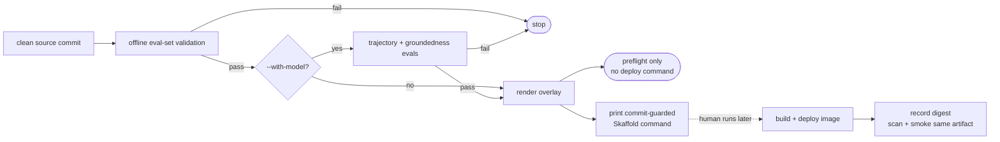

{}

- **You will:** Run a preflight that deploys nothing, break one evaluation case to watch it stop, and separate that evidence from the image built afterwards.
- **You need:** [4.4. Evaluations]() finished and `mise run install:platform` completed. No cluster required.
- **Time:** about 20 minutes, hands-on. {}

## Why a green rollout does not prove agent behavior

**Promotion evidence** is behavior measured on one clean source revision, collected before anything is built or applied. It exists because a readiness probe proves the server starts and nothing more: not that the composition still calls the right tools, stays grounded, or follows the operating contract you evaluated. Those are release properties, so a rollout can be green in every way a probe understands and still leave a worse agent serving. The failure class is a small edit with behavioral reach: rephrase when to consult a runbook, and the agent may stop citing runbooks for `INC-002` and answer from the incident summary alone, with every test and both probes green.

You can already create and destroy this environment; what is left is deciding what earns the right to deploy into it. This page runs a preflight that builds and applies nothing, refuses to print a deployment command until a model has measured the candidate, and stops on one invalid evaluation reference — then names the artifact a real rollback needs on file.

`mise run promote` is that preflight:

```bash
mise run promote
```

```text
[promote] $ ./scripts/promote.sh
Promotion preflight → overlay local

[1/3] Offline eval-set validation (eval:validate)...
[eval:validate] $ go run ./cmd/agentops-eval validate
{
  "evalsets": 3,
  "cases": 22,
  "calibration_cases": 12
}

[2/3] Skipping model-backed behavior gate (pass --with-model to run it).

[3/3] Rendering the local overlay...
The local overlay renders cleanly.

Offline preflight passed, but no promotion command was emitted because candidate
behavior was not evaluated. Re-run with --with-model when a model is configured.
```

That closing paragraph is the design: everything passed, and the script still refuses to print a command. The counts name what step 1 read — three evalset files, twenty-two behavioral cases inside them, and twelve labeled examples used to calibrate the judge — proving that the committed cases and the seed dataset agree and that the manifests render, and measuring nothing about how the candidate behaves. A tool that emitted a deploy command here would teach you that "the checks passed" and "safe to deploy" are the same sentence.



**Diagram in words:** A clean source commit enters offline eval-set validation; a failure stops there. On success the path forks on `--with-model`. Without it, the overlay renders and the run ends as a preflight with no deployment command. With it, the trajectory and groundedness evaluations run against a real model, a failure stops the same way, and only a pass reaches the render and then a printed, commit-guarded Skaffold command. A human runs that later to build and deploy the image, and the recorded digest is what the scan and the smoke test examine.

## Only a model-backed run prints a deploy command

Add the model and the middle step becomes real:

```bash
mise run promote -- --with-model
```

Step 2 runs the model-backed evaluation from the standalone Go harness. The diagram's `trajectory + groundedness evals` names two of its deterministic scores: **trajectory** (required tool calls, in order) and **groundedness** (every recognized entity in the answer present in the question or that turn's tool evidence). The result records the source revision and dirty state, model identity, evalset digest, transport, deterministic scores, content-free usage, and the pass rate against the requested minimum and the required cases.

A failing run stops there, and so does a source change made after the evidence was collected: when the evaluation finishes the script re-reads the source identity and refuses to print anything if the commit or the tree digest moved — that is what **commit-guarded** means. Only a green model-backed run plus a clean render prints the command, and even then prints rather than runs it.

That flag calls a real model. The default course path uses local Ollama and costs nothing but time; a hosted endpoint spends tokens. Read what it produced rather than only its exit code — a pass rate is an observation about one run, the distinction [0.2. Evidence]() keeps sharp.

Select exactly one overlay, `local` by default or `gke`, and the printed command's image repository follows: `registry.localhost:5050` for the local k3d registry, or `tofu output -raw artifact_registry_repository` from `infra/gcp` for GKE.

```bash
mise run promote -- gke --with-model
```

Unknown flags, unknown overlays, and a second overlay fail fast. The GKE path prints a command only: no `tofu apply`, no cluster, no deployment.

That printed handoff is the seam a **GitOps** controller occupies: one that continuously reconciles the cluster against manifests committed in Git. Skaffold is a development loop by design: `mise run platform:dev` runs `skaffold dev` and `mise run platform:run` runs `skaffold run`, both against `--profile local`. Underneath, `infra/skaffold.yaml` deploys through `manifests.kustomize.paths: [k8s/overlays/local]`, with a `gke` profile that replaces that one path — and an Argo CD `Application` or a Flux `Kustomization` reconciles that same kustomize tree unchanged. Adopting either means replacing the `skaffold` invocation with a repository pointer plus a target revision.

One thing is not free in that swap: Skaffold rewrites the image reference inside the custom resource at apply time, through the `resourceSelector` and `AGENT_IMAGE_TAG` mechanism [6.3. Platform Agents]() owns. A GitOps controller reconciles committed YAML and does none of that, so the image reference has to be committed by the promotion step or written by an image-automation controller — the placeholder `agentops-agent:dev` in `infra/kagent/agent.yaml` is where that gap lands.

Committing a `Kustomization` fixture here was considered on 13 August 2026 and declined, which is worth stating rather than leaving as an absence. This repository already carries two quarantined fixtures nobody applies, and both earn their place by being validated: `mise run check:infra` runs them through kubeconform against the pinned Kubernetes version, so a fixture cannot rot silently. A Flux fixture could not have that. Its kinds are custom resources, so validating it would mean vendoring and maintaining a second CRD schema set for a file no profile installs a controller for — and validating it with missing schemas ignored would leave a file that passes a check which reads nothing. The paragraphs above are the honest version: they name where the object goes, which field it replaces, and the one thing it cannot do.

## Why rollback needs an image digest, not a source revision

This preflight evaluates one clean source identity, and a source identity is not an artifact. The serving image contains the instruction from the evaluated Git revision, and Git is the prompt-version authority here: the runtime has no separate prompt registry and no mutable prompt URI. When choosing between two wordings, use `mise run eval:ab` with sanitized artifacts from two Git-pinned revisions and read the comparison before picking one; [7.0. Reproducibility]() owns the isolated-worktree capture that makes them trustworthy.

Only after the build does an image digest exist. Source evaluation alone does not prove that artifact starts, is clean, or contains the code you evaluated, so for a real release, scan and smoke the exact immutable digest you will deploy, then record it beside its validated source tuple. If a release regresses, redeploy the previous known-good digest: rollback becomes a lookup instead of an archaeology project, which is why [6.1. Containers]() insists on recording the digest rather than the tag. This lab stops at the explicit handoff rather than pretending to ship that pipeline.

It also does not claim an automated canary, because there is none: the agent still runs a single replica for the two bindings [6.9. Scale Out]() names and demonstrates, there is no traffic-weighted stable and canary route, and no online scorer is present that could make a safe automatic rollback decision. A production progressive rollout needs a second agent instance, weighted routing, an online quality signal, and an automated rollback policy — each adding real operational state. Pre-deployment evidence still comes first even then, because sending live traffic to a candidate that already fails its reviewed floors is not a canary, it is an outage with a smaller blast radius.

## Your turn: break one evaluation case and watch promotion stop

Predict first: you are about to point one evaluation case at an incident absent from the seed. Does the preflight catch that offline, or does it need the model?

- **Mode**: `temporary experiment`.
- **Goal**: make an invalid evaluation reference stop the preflight before it renders anything, then put it back.
- **Files to touch**: `evals/ops.evalset.json` only. No cluster, no image, and no model are involved.
- **Preflight**: run `mise run promote` and confirm all three steps pass and no command is emitted; require `git diff --quiet -- evals/ops.evalset.json` before editing.
- **Steps**: in the `incident-detail` case, change the expected `get_incident` argument from `INC-001` to the absent id `INC-042`, then run `mise run promote` again. Do not use `INC-999` for this: the eval set deliberately uses it as a negative case, and the validator knows it is supposed to be absent.
- **Gate that proves completion**: the run stops inside `[1/3]`, names the case and the unknown incident, and emits no deployment command. From the first step onward it reads:

```text
[1/3] Offline eval-set validation (eval:validate)...
[eval:validate] $ go run ./cmd/agentops-eval validate
agentops-eval: validate evalset domain ops.evalset.json: case "incident-detail" references unknown incident "INC-042"
exit status 1
[eval:validate] ERROR task failed
[promote] ERROR task failed
```

No model was needed: the validator cross-checks every case against the committed seed, so a case that can never pass is caught by reading two files — and the overlay was never rendered, because a preflight that continues past a known-bad input is just a slower way to deploy it.

- **Final state**: run `git restore -- evals/ops.evalset.json`, confirm the focused `git diff --quiet --` preflight passes again, and run `mise run promote` once more to see it green.

If a model is configured, finish with `mise run doctor:model` and `mise run promote -- --with-model`, then read the printed command without executing it. Clean behavior evidence makes a build-and-deploy command _eligible_ for human review; it authorises no rollout and says nothing about the image it will build.

## Your turn: put a bad version into the cluster and take it back out

Everything above is the argument for rollback. This is the act, and it needs a running cluster — [1.3. Kubernetes]() and [6.2. Platform Install]() own getting one. A rollback nobody has performed is a plan, and a plan is what fails at 02:00.

Predict before you start: after you redeploy the earlier image, which output would convince you the _running binary_ went back — the pod's name, its image reference, or something the process says about itself?

- **Mode**: `keep` — the cluster ends on the version you rolled back to, which is the honest final state of a rollback.
- **Goal**: deploy two versions, redeploy the first by digest, and prove from the running process that its identity is the one you asked for.
- **Files to touch**: one line of `agents/go/compose/composition.go` — a wording change in the instruction, which is enough to make a second, distinguishable build.
- **Preflight**: `mise run doctor:platform` green, `git diff --quiet -- agents/go/compose/composition.go`, and a deployed agent answering, per [6.6. Platform Delivery]().
- **Steps**: with the tree clean, run `mise run platform:dev` and record two things — the image digest Skaffold built, and what `kubectl -n agentops exec deploy/agentops-agent -- /app/agent version` reports for revision and tree digest. Call that A. Now change one sentence in the root instruction, deploy again the same way, and record B; the tree digest must differ, because it is derived from content rather than from a tag. Then redeploy A **by its digest** rather than by rebuilding: edit the image reference in the deployed resource to A's digest and apply it, so nothing recompiles and nothing depends on your working tree still holding A's source.
- **Gate that proves completion**: `/app/agent version` inside the running pod reports A's tree digest again — the binary at the image's own entrypoint path, since the image is distroless and holds no shell to hunt for it with. Do not reach for the agent card as a second opinion: the only build field it publishes is the version string, and A and B carry the same one — `development` on these builds, the `VERSION` semver on a release — so the card answers identically whichever image is running. A pod name and an image reference prove that Kubernetes did what you asked; only the binary's own answer proves what is executing.
- **Final state**: `git restore -- agents/go/compose/composition.go`, and leave the cluster on A. Note the digest of B somewhere before you stop: an image you cannot name is an image you cannot roll forward to.

This is the payoff of the linker-owned build identity from [6.1. Containers](). Because mode, version, revision, tree digest, and dirty state are stamped in at link time and cannot be relabelled by an environment variable, "which code is running right now?" is a question with one answer, and rolling back is something you can _check_ rather than something you assume worked because the deploy command exited zero.

## What you can do now

- `mise run promote` passes without a model and emits no deployment command, and you can say why that is correct.
- A single invalid evaluation reference stopped the preflight inside `[1/3]`, before any render, and named the case that caused it.
- The eval set is restored, `git diff` shows no drill residue, and the preflight is green again.
- You can name the handoff in order: evaluated source tuple, then build, scan, smoke, deploy, and record one immutable image digest.

Continue to [6.8. Platform Operations](), which fixes the four laptop-cluster failures underneath this one: an unreachable model, exhausted memory, pausing between sessions, and removing kagent.
