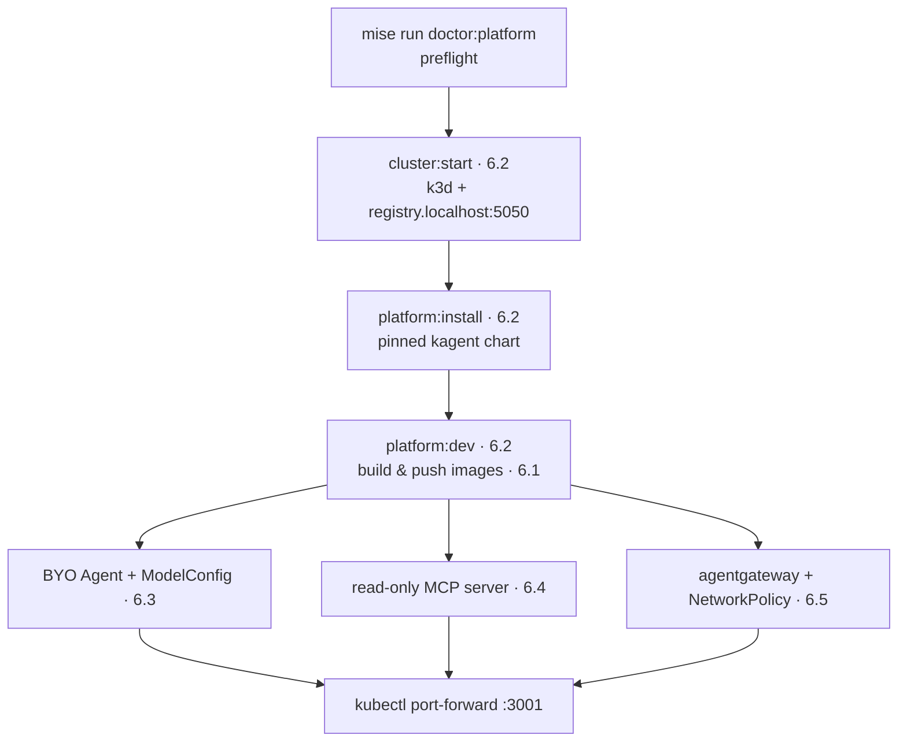

{}

- **You will:** See which page owns which manifest, and prove both environments render before you install anything.
- **You need:** `mise run install` and `mise run install:platform` done, plus the `docker` CLI. No cluster, GCP project, or model. Assumed, not required: agentgateway from [5. Gateway]().
- **Time:** about 10 minutes, orientation. {}

## Why a deployed agent needs a controller, not a terminal

Until now the agent has been a process you start and watch: `mise run a2a`, alive only as long as its terminal. This chapter declares it as a **workload** instead — the same program written as manifests a controller reads and keeps true. A bare process has no identity, no resource bounds, no health probes, no network policy, no persistent storage, and no restarter; every one of those six stays a person's job for as long as the process runs.

The application, protocol, and model-endpoint contracts do not change: the same image that served A2A on your machine in Chapter 5 serves it in a pod. The reference agent still answers questions about seeded incidents such as `INC-002` — now whenever a request arrives, not only while a terminal is open. This page is the map: one owning manifest per concern, one base rendered into two environments, both renders validated before anything is installed.

The install is a short, ordered path, each step owned by one page. Two names recur through it: **kagent** manages agents as Kubernetes custom resources, and **Skaffold** builds the image, pushes it, and applies the selected overlay in one command.



**Diagram in words:** Run the platform doctor, start k3d and its local registry, install kagent, then let Skaffold build and push the images. That build creates the BYO Agent, read-only MCP server, and agentgateway/NetworkPolicy path. A temporary port-forward to agentgateway `:3001` is the only host entry point.

Nothing on this page creates a cluster. [6.2. Platform Install]() does that, and the pages after it explain the workloads it starts.

## What changes between the local and GKE overlays {#what-changes-between-the-local-and-gke-overlays}

**Kustomize** renders YAML from a shared `base/` folder plus a small per-environment `overlays/` folder of patches; `kubectl kustomize <dir>` prints the result. Both environments in this course layer onto the same `infra/k8s/base`, so ports, the MCP read route, the A2A image contract, and the OTel pipeline are byte-identical across them. Skaffold selects one overlay with `-p local` or `-p gke` and never mixes the two.

Six concerns differ, and the table below is the whole of them. Two smaller asymmetries ride along: the local overlay also adds Prometheus and Alertmanager as workloads of their own, and GKE trims each pod's CPU _request_ to fit a two-core node. [6.0. Platform]() lists the local additions in full.

| Concern          | `overlays/local`                        | `overlays/gke`                                               |
| ---------------- | --------------------------------------- | ------------------------------------------------------------ |
| Gateway config   | `agentgateway/k3d`                      | `agentgateway/gke`                                           |
| Model backend    | `qwen3:4b-instruct` (host Ollama)       | `gemini-3.5-flash` (Vertex)                                  |
| Image registry   | `registry.localhost:5050`               | Artifact Registry (`…-docker.pkg.dev`)                       |
| Identity         | in-cluster ServiceAccounts              | GKE Workload Identity annotations (`workload-identity.yaml`) |
| Volume storage   | k3d's default local-path provisioner    | `agentops-standard` StorageClass on every claim              |
| Egress exception | any IPv4 TCP `:11434` (intended Ollama) | any IPv4 `:443` (intended Vertex) plus WIF `:987`/`:988`     |

Two of those rows live in one overlay only. The model-backend override sits only in `overlays/gke`, because the base `infra/kagent/modelconfig.yaml` declares `qwen3:4b-instruct`, the open-weight default the course requires; the substrate that needs an account is the one that has to ask for it. The `agentops-standard` storage-class patch sits only in `overlays/gke`, where it selects a persistent disk for every claim carrying the course label; `overlays/local` adds nothing and inherits k3d's default provisioner. [6.5. Platform Gateway]() explains the two egress rows, which `scripts/check-infra.sh` asserts.

## Every platform concern has one owning manifest

A broken rollout has one place to look:

| Page                                                                                        | What it adds                                                     | Owning manifest(s)                                                  |
| ------------------------------------------------------------------------------------------- | ---------------------------------------------------------------- | ------------------------------------------------------------------- |
| [6.0. Platform]()                             | Agents as Kubernetes workloads; the shared base and its overlays | `infra/k8s/base/kustomization.yaml`                                 |
| [6.1. Containers]()                         | The multi-stage, digest-pinned agent image                       | `agents/go/Dockerfile`                                              |
| [6.2. Platform Install]()             | Cluster, registry, kagent, and the Skaffold development loop     | `infra/k3d.yaml`, `infra/helmfile.yaml`, `infra/skaffold.yaml`      |
| [6.3. Platform Agents]()               | The hardened BYO `Agent` and the gateway `ModelConfig`           | `infra/kagent/agent.yaml`, `infra/kagent/modelconfig.yaml`          |
| [6.4. Platform Tools]()                 | The read-only MCP server and its governed `RemoteMCPServer`      | `infra/k8s/base/mcp.yaml`, `infra/kagent/remotemcpserver.yaml`      |
| [6.5. Platform Gateway]()             | The private data plane, network policy, and workload identity    | `infra/k8s/base/network-policies.yaml` and both overlays            |
| [6.6. Platform Delivery]()           | State backup, the restore drill, teardown, the GKE plan          | `infra/scripts/`, `infra/gcp/`                                      |
| [6.7. Promotion and Rollback]() | Source evidence before the build-and-deploy handoff              | `scripts/promote.sh`                                                |
| [6.8. Platform Operations]()       | Keeping the local cluster fed, stopped, and removable            | `infra/k3d.yaml`, `infra/helmfile.yaml`                             |
| [6.9. Scale Out]()                           | Shared sessions and a scaled read plane                          | `infra/k8s/overlays/scale/`, `agents/go/cmd/agent/session_store.go` |

Read them in order; each marker gives the page's kind:

- **[6.0. Platform]()** _(hands-on)_: Why a running agent belongs in a custom resource, and proof that a base edit and an overlay edit land where you predicted.
- **[6.1. Containers]()** _(hands-on)_: Build the non-root image, then scan the exact artifact you built.
- **[6.2. Platform Install]()** _(hands-on)_: Create the tracked cluster, install kagent, and start the workloads with Skaffold.
- **[6.3. Platform Agents]()** _(hands-on)_: Read the one file that declares the agent, then patch a resource limit through the overlay.
- **[6.4. Platform Tools]()** _(reference)_: Move the six read-only tools into their own deployment that only the gateway may call.
- **[6.5. Platform Gateway]()** _(reference)_: Keep the data plane private behind network policy, and keep credentials in git as ciphertext.
- **[6.6. Platform Delivery]()** _(hands-on)_: Back up the state, drill a restore, tear down safely, and plan the optional GKE lab.
- **[6.7. Promotion and Rollback]()** _(hands-on)_: Make a broken evaluation stop a rollout before any image is built.
- **[6.8. Platform Operations]()** _(reference)_: The four things that go wrong on a laptop cluster, and what to run when they do.
- **[6.9. Scale Out]()** _(hands-on)_: Move sessions to PostgreSQL, run one conversation across two processes, and scale the read plane behind an autoscaler.

## Run `check:infra` to render and validate both overlays offline

Run this gate before the pages above; a manifest that cannot render fails here, not mid-install — no cluster, no GCP project, no model:

```bash
mise run check:infra
```

`scripts/check-infra.sh` builds each overlay with `kubectl kustomize`, then validates every object with `kubeconform` and `kube-linter` — a schema checker and a best-practice linter. It also diagnoses both Skaffold profiles, lints the helmfile, runs the offline state drill, and runs `tofu validate` plus `tflint` against the GKE plan. A green run ends in the OpenTofu module's own tests:

```text
tests/course_profile.tftest.hcl... pass
  run "valid_disposable_profile"... pass
  run "zone_must_match_region"... pass
  run "machine_type_cannot_amplify_cost"... pass

Success! 13 passed, 0 failed.
```

That is trimmed — the real run prints every one of the thirteen. It needs two binaries `mise run doctor:platform` does not check: `opentofu` and `tflint`, both from `mise run install:platform`, so this gate can fail on a machine whose doctor is green.

The chapter's required outcome is entirely local: GCP stops at `tofu plan`, and no cloud resource is created without a later, explicit approval.

## What this chapter proved

Only the first item is true when you finish this page; come back to the rest at the end of [6.9. Scale Out]().

- `mise run check:infra` exits 0, having rendered and validated both the `local` and the `gke` overlay without a cluster.
- You can name, for any symptom in this chapter, the single manifest and page that own it.
- Your base edit in [6.0. Platform]() reached both renders, your overlay edit reached one, and `check:infra` refused the value that was pinned.
- Without reopening Chapter 5, you can name the three protocols agentgateway fronts and say why no cluster Service publishes any of them.

A workload a controller keeps running still reports nothing about its own turns — how long one took, what it spent, who approved its writes — which is where [7. Observability]() starts.

Continue to [6.0. Platform]() once `check:infra` passes without a cluster, a GCP project, or a model.
