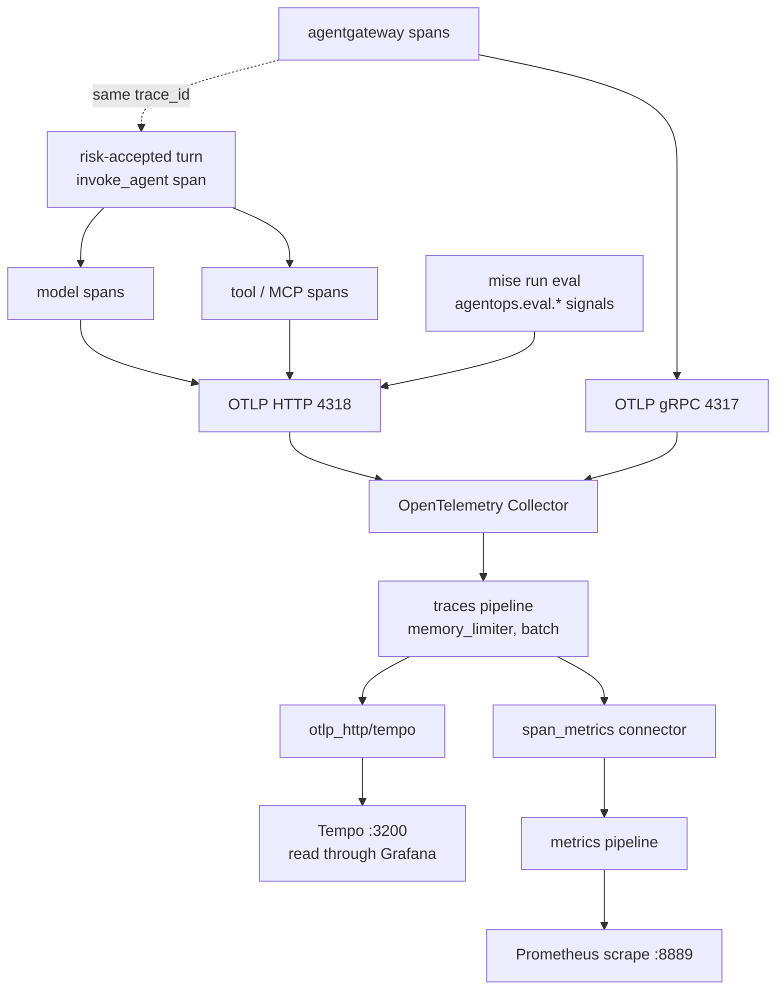

{}

- **You will:** Keep ADK traces off by default, accept their content risk for one synthetic turn, read that turn span by span in Tempo, and open the two-run evaluation dashboard.
- **You need:** Docker running, `mise run observability:up` serving Tempo on `http://localhost:3200` and Grafana on `http://localhost:3002`, and Ollama serving `qwen3:4b-instruct`.
- **Time:** about 40 minutes, hands-on, plus model time — the drill asks for four turns, and the ones captured on this page took between thirty seconds and five minutes each. {}

## Why one turn needs a trace, not a log line

A **trace** records how one request's work was structured in time. Every unit of work becomes a **span** with a start time, an end time, a status, and a parent, and every span in one request shares one **trace id**. The result is a tree you read top-down — the turn, the model calls under it, the tool calls under those, the MCP round trip under a tool.

A log line records only that something happened. When a turn takes far longer than it should, the log line of the final answer cannot say whether the model, a tool, or the gateway spent the time, so the latency argument stays unresolvable. This page reads one real turn span by span, names the hop that spent the time, and explains why ADK's spans ship switched off until you accept a content risk explicitly.

Here is one real turn on a CPU-only laptop, pulled out of Tempo by trace id and flattened into start offset, duration, status, and span name, with both times in milliseconds. The pipeline sorts by start offset rather than by duration, because a child that starts late tells you what it waited for:

```bash
curl -s "http://localhost:3200/api/traces/<trace id>" | jq -r '
  [.batches[].scopeSpans[].spans[]]
  | (map(.startTimeUnixNano | tonumber) | min) as $t0
  | sort_by(.startTimeUnixNano | tonumber)[]
  | [ (((.startTimeUnixNano | tonumber) - $t0) / 1000000 | floor),
      (((.endTimeUnixNano | tonumber) - (.startTimeUnixNano | tonumber)) / 1000000 | floor),
      (.status.code // "UNSET"),
      .name ]
  | @tsv'
```

```text
0	333925	UNSET	invoke_agent agentops_agent
0	152539	UNSET	generate_content qwen3:4b-instruct
152568	5	UNSET	execute_tool get_service_status
152598	181288	STATUS_CODE_ERROR	generate_content qwen3:4b-instruct
```

The question was "what is the status of the checkout service?", and yours will be far faster. Read the shape rather than the numbers, starting with the statuses: `UNSET` means success, because ADK sets `ERROR` only where it records one, so a quiet span is healthy rather than silent. The tool call, the part everyone blames first, took **five milliseconds** out of five and a half minutes. Two model calls took everything else, and the second never returned, so its span carries `STATUS_CODE_ERROR`.

Shape changes with the entrypoint, too: `mise run workflow` shows `plan`, `investigate`, `evidence_review`, and `recommend` as four separate bars instead of one opaque stage.

## Read the turn span by span

Grafana draws that flat list as a waterfall. Open `http://localhost:3002`, go to **Explore**, select the **Tempo** datasource, and either search by service name `agentops-agent` or paste a trace id into the **TraceQL** box. Tempo ships no UI of its own — it stores spans and answers queries on `:3200`, and Grafana renders them, which is why traces sit beside metrics and logs.


That is a different turn from the flat listing above — a shorter question on the same laptop — and it makes the same point in one picture. Four spans, one of which is the tool everybody blames: `execute_tool get_service_status` is 2.97 milliseconds, drawn as a sliver you have to look for. The two `generate_content` bars are the turn. Read the second one's start offset rather than its length to see why: it could not begin until the tool it was waiting for had returned.

Predict first: which of those four rows carries the token counts for the whole turn?

**Row 1, `invoke_agent agentops_agent`, 333,925 ms.** This is the turn itself: ADK opens it once per invocation under its `gcp.vertex.agent` scope, and every other span hangs off it. Its attributes answer "which agent, which conversation, at what cost":

```bash
curl -s "http://localhost:3200/api/traces/<trace id>" | jq -r '
  .batches[].scopeSpans[].spans[]
  | select(.name | startswith("invoke_agent"))
  | .attributes[] | .key + " = " + ((.value.stringValue // .value.intValue) | tostring)'
```

```text
gcp.vertex.agent.invocation_id = e-62104bd3-2892-4b55-8176-0e9d920163ec
gen_ai.operation.name = invoke_agent
gen_ai.agent.name = agentops_agent
gen_ai.conversation.id = eea19e8c-fdcf-4039-99fc-eed1f17d2c42
agentops.tokens.session.input = 2687
agentops.tokens.session.output = 21
agentops.tokens.session.total = 2708
agentops.cost.session.estimate = 0
```

The `gen_ai.*` and `gcp.vertex.agent.*` keys are ADK's, following the OpenTelemetry GenAI conventions. Adopt them, pin the schema you validated against, and expect churn: they moved to their own `semantic-conventions-genai` repository on 5 May 2026 and every document there is still marked Development. The Go side churns too: `go.opentelemetry.io/otel/log` v0.21.0, on 3 August 2026, deleted the `Value` and `KeyValue` types ADK Go v2.2.0 called; v2.3.0 moved to `attribute.Value` and `attribute.KeyValue`, and `agents/go/telemetry/export.go` moved with it. The four `agentops.*` keys are this repository's own: `RecordTokenUsage` stamps the session's running totals onto whichever span is active, because a Prometheus counter could only answer "what did this conversation cost" by making the session id a label — and a session id as a label is an unbounded series. The root span is where the totals live, and [7.3. Costs]() gives them a budget.

**Row 2, the first `generate_content`, 0 → 152,539 ms.** It starts at the same instant as its parent, so nothing happened before the model was asked. It carries `gen_ai.usage.input_tokens = 2687` and `gen_ai.usage.output_tokens = 21`: the model read the whole instruction plus the session history and replied with a single tool call.

**Row 3, `execute_tool get_service_status`, starting at 152,568 ms and lasting 5 ms.** The interesting number is the start offset, not the duration: the tool was neither slow nor blocked, it simply could not run until the model decided to call it. Two attributes carry its payload:

```text
gcp.vertex.agent.tool_call_args = {"name":"checkout"}
gcp.vertex.agent.tool_response = {"open_incidents":[{"id":"INC-009",...,"title":"<<<TOOL_DATA data-
```

Look inside that response: the tool result reaches the trace already wrapped in the `TOOL_DATA` fence from [4.5. Guardrails](), so you can watch the untrusted-content boundary do its job. It also reaches the trace whole: whatever the tool returned is serialized onto that span, which is why the next section is about keeping these spans off by default.

**Row 4, the second `generate_content`, 152,598 → 333,886 ms, `STATUS_CODE_ERROR`.** A failing span records an exception event, and the event body is where the reason lives:

```bash
curl -s "http://localhost:3200/api/traces/<trace id>" | jq -r '
  .batches[].scopeSpans[].spans[].events[]?
  | .name + ": " + (.attributes[] | select(.key == "exception.message") | .value.stringValue)'
```

```text
exception: openai: call failed: Post "http://127.0.0.1:11434/v1/responses": context deadline exceeded (Client.Timeout exceeded while awaiting headers)
```

**Four rows, one verdict: the agent's code and its tool spent five milliseconds, the model provider spent the rest and then timed out.**

## Why ADK spans stay off until you accept the risk

You will not find that tree in Tempo yet, by design. Every `agent` entrypoint applies a privacy rule before dispatch, and runtime assembly reapplies it before either provider-ownership path constructs an ADK provider. Those are the last moments before a span could be recorded; a check any later would leave a window in which content-bearing spans already exist:



That function rewrites the environment before anything else reads it. Anything other than the exact literal `true` in `ADK_CAPTURE_MESSAGE_CONTENT_IN_SPANS` — unset, `false`, or a typo — pins the switch to `false` _and_ pins `OTEL_TRACES_SAMPLER` to `always_off`, overriding whatever sampler the operator exported. A typo also returns an error, after the boundary has already closed, so a misspelled risk acceptance stops startup instead of silently opening it. The same rule covers `adk web`'s built-in trace view: a missing trace before you opt in is the intended privacy state, not an exporter fault.

{}

ADK Go v2.3.0 serializes tool arguments and results on every `execute_tool` span and can record raw error text in exception events — you read both in the previous section. Neither capture switch filters those fields, and the SDK exposes no stable mutable end-of-span filter. Use explicit `true` only with this repository's fictional seed data; never with real incidents, people, credentials, or provider bodies. {}

Logs and spans are not defended the same way. Structured logs are _actively_ defended: before a record reaches the console or OTLP, independent handlers redact personal-data and credential patterns, cap every string at 2048 characters, and keep only sanitized error evidence. **Spans get no such filter.** Their defense is that they are non-recording by default. Turning them on is a risk decision, not a verbosity setting.

Prompts, responses, and eval verdicts still need a home, and this course deliberately does not ship one. **Langfuse** and **Arize Phoenix** are the open-source category that owns exactly it: prompt, response, and evaluation storage with its own retention window and access model, rather than a general-purpose trace store the whole team can already read. The OTel collector is the seam such a backend attaches to; adding one is a decision about who may read a prompt, not a configuration change.

Three variables sit near that decision and their names do not match their jobs. The pinned Go ADK never reads the first one at all: this repository owns it as the **risk gate**, the value that decides whether the sampler may record anything.

| Variable                                             | Repository meaning                                                                 | Durable destination                     |
| ---------------------------------------------------- | ---------------------------------------------------------------------------------- | --------------------------------------- |
| `ADK_CAPTURE_MESSAGE_CONTENT_IN_SPANS`               | Exact `true` accepts known content-bearing ADK spans; anything else shuts them off | the trace store (Tempo `:3200`)         |
| `OTEL_TRACES_SAMPLER`                                | Forced to `always_off` until that risk is accepted                                 | controls whether ADK spans are recorded |
| `OTEL_INSTRUMENTATION_GENAI_CAPTURE_MESSAGE_CONTENT` | Enables GenAI model-message log events                                             | the log store (Loki, via the collector) |

The PII callbacks in [4.5. Guardrails]() do not make those spans safe: raw session ingestion and framework error capture happen outside that boundary.

## How one collector serves runtime traces and evaluation runs

Accept the risk for one synthetic request and point the agent at the collector. This is a **live-model, content-bearing lab step**, valid only because every incident, service, and runbook in this repository is fictional:

```bash
export ADK_CAPTURE_MESSAGE_CONTENT_IN_SPANS=true
export OTEL_TRACES_SAMPLER=always_on
export OTEL_EXPORTER_OTLP_ENDPOINT=http://localhost:4318
export OTEL_EXPORTER_OTLP_PROTOCOL=http/protobuf
export OTEL_SERVICE_NAME=agentops-agent
```

Two emitters reach one collector on different ports, and each port accepts one protocol only: the host agent speaks `http/protobuf` on `4318`, agentgateway speaks gRPC on `4317`. Mix them up and you get silence rather than an error. When both record they land in **one** trace, joined by **trace context propagation** — the gateway injects the `trace_id` and current `span_id` into the outbound request, and the agent's SDK parents its spans under the gateway's. The host gateway ships no `tracing:` block, so this opt-in produces agent spans only.

Inside, the traces pipeline is three steps and a fan-out:

```yaml
traces:
  receivers: [otlp]
  processors: [memory_limiter, batch]
  exporters: [otlp_http/tempo, span_metrics]
```

Read those three keys as three roles: a **receiver** takes telemetry in, a **processor** shapes it in flight, an **exporter** sends it on. Every span then goes two places at once. `otlp_http/tempo` forwards it to `http://tempo:4318`, and the `_http` suffix is load-bearing: Tempo's receiver speaks OTLP over HTTP only, so the plain `otlp` exporter would speak gRPC at it and silently fail every export. The `span_metrics` **connector** never leaves the collector — it turns spans into request-count and duration metrics sliced by `gen_ai.operation.name` and `gen_ai.request.model`, then re-injects them into the metrics pipeline. Your spans become RED metrics — Rate, Errors, Duration — with no instrumentation in the application, and [7.2. Monitoring]() takes it from there.



**Diagram in words:** One `invoke_agent` span contains model and tool spans, a gateway span can share its trace id, and an evaluation run pushes its own signals to the same endpoint. The collector batches spans, writes them to Tempo, and feeds bounded span metrics to Prometheus.

Tempo has no notion of an experiment or a project: a trace is addressed by its `trace_id` and nothing else, so there is no name to keep in sync and no header that can silently reroute your spans.

`mise run eval` writes `results.json`, and that file is the gate. Export `EVAL_OTEL_EXPORTER_OTLP_ENDPOINT=http://localhost:4318` first, though, and the same run pushes an `agentops.eval.run` span tree and five gauges through the same collector. Grafana already has the dashboard that reads them:

```bash
curl -s "http://localhost:3002/api/search?query=AgentOps&type=dash-db" | jq -r '.[] | "\(.uid)\t\(.title)"'
```

```text
agentops-evaluation-comparison	AgentOps evaluation comparison
agentops-overview	AgentOps overview
```

That is `evals/grafana-dashboard.json`, mounted into Grafana by the observability Compose file. Its two controls, **Reviewed baseline run** and **Candidate run**, are populated from the `eval_run_id` label, and both stay empty until your first exported run — so name your runs or you will be choosing between two uuids: `mise run eval -- --run-id baseline-tone`, then `--run-id candidate-tone` after you change the instruction.

The dashboard's panels do not query the names the harness emits. The harness declares `agentops.eval.score` as a **gauge with unit `1`**, and the collector's Prometheus exporter renames every instrument on the way out: dots become underscores, a gauge whose unit is `1` gains a `_ratio` suffix, and a unit in braces such as `{token}` is dropped as an annotation. Guess wrong and Grafana says "No data" while every component is healthy, so the table below quotes the exporter's names.

| Panel            | The question it answers                        | What it computes                                                |
| ---------------- | ---------------------------------------------- | --------------------------------------------------------------- |
| Score comparison | Which scorer moved, and in which direction?    | `avg` of `agentops_eval_score_ratio` per run **and scorer**     |
| Case pass rate   | Did the whole run improve, or only one scorer? | `avg` of the 0-or-1 `agentops_eval_case_passed_ratio`           |
| Cost evidence    | What did the improvement cost?                 | `sum` of `agentops_eval_tokens` and `agentops_eval_model_calls` |

Read them in that order. A score that rose while the pass rate stayed flat means one scorer moved, not the agent; a pass rate that rose while tokens doubled means you bought it with retries. What these numbers can and cannot prove belongs to [4.4. Evaluations]().

**Optional exercise:** settle the renaming in twenty seconds, before you spend twenty minutes on a run. Predict first — under what name does `agentops.probe.score`, a gauge with unit `1`, reach Prometheus?

- **Mode**: `inspect` — two throwaway data points, posted and read back.
- **Goal**: see the renaming rule instead of trusting a paragraph about it.
- **Files to touch**: none.
- **Preflight**: `curl -fsS http://localhost:9090/-/healthy` answers.
- **Steps**: post one unit-`1` gauge and one `{token}` gauge, then list what Prometheus learned.

  ```bash
  NOW="$(date +%s)000000000"
  curl -s -X POST http://localhost:4318/v1/metrics -H 'content-type: application/json' -d '
  {"resourceMetrics":[{"resource":{"attributes":[{"key":"service.name","value":{"stringValue":"suffix-probe"}}]},
   "scopeMetrics":[{"metrics":[
     {"name":"agentops.probe.score","unit":"1","gauge":{"dataPoints":[{"asDouble":0.5,"timeUnixNano":"'"$NOW"'"}]}},
     {"name":"agentops.probe.tokens","unit":"{token}","gauge":{"dataPoints":[{"asInt":"42","timeUnixNano":"'"$NOW"'"}]}}
   ]}]}]}'
  curl -s http://localhost:9090/api/v1/label/__name__/values |
    jq -r '.data[] | select(startswith("agentops_probe"))'
  ```

- **Gate that proves completion**: within two scrape intervals the second command prints `agentops_probe_score_ratio` and `agentops_probe_tokens` — the suffix lands on the unit-`1` gauge only.
- **Final state**: nothing to undo; both probe series age out with Prometheus's seven-day retention and neither name collides with a shipped panel.

## Your turn: accept the risk for exactly one request

Predict before you run this: you have already exported `OTEL_TRACES_SAMPLER=always_on`. Start the agent with the shipped default in place — does that sampler win?

- **Mode**: `inspect` — the drill changes only environment variables in one shell, and ends by putting them back.
- **Goal**: watch the shipped default beat the sampler, then produce one synthetic trace tree and find the field that makes this a lab-only setting.
- **Files to touch**: none. No tracked file and no `.env` entry changes; every variable lives in your shell.
- **Preflight**: `curl -fsS http://localhost:3200/ready` answers. Then take back only the risk acceptance, leaving the sampler and exporter variables as you set them: `unset ADK_CAPTURE_MESSAGE_CONTENT_IN_SPANS`, and confirm `env | grep ADK_CAPTURE_MESSAGE_CONTENT_IN_SPANS` prints nothing while `echo $OTEL_TRACES_SAMPLER` still prints `always_on`.
- **Steps**: start the agent in that shell and send one read-only question; look for its trace in Grafana. Then `export ADK_CAPTURE_MESSAGE_CONTENT_IN_SPANS=true`, restart the agent, ask the same question, and open the new trace.
- **Gate that proves completion**: the first run leaves Tempo with no ADK span even though `always_on` is exported in that very shell; the second produces one tree you can walk with the commands above — root, model, tool, exception — and read a serialized argument off its `execute_tool` span.
- **Final state**: run `unset ADK_CAPTURE_MESSAGE_CONTENT_IN_SPANS OTEL_TRACES_SAMPLER`, restart the agent, ask one more question, and confirm no new ADK trace appears.

While that risk is accepted, take one more step and make the gateway hop visible, because the diagram above claims something no shipped profile can show you. No profile in this repository configures gateway tracing: the host config has no `tracing:` block, and the k3d and GKE profiles pin the agent to `always_off`. So "a gateway span can share its trace id" has been a design claim rather than an observation. One opt-in flag on the wrapper turns it into evidence:

```bash
mise run gateway:host:stop
AGENTOPS_GATEWAY_TRACING_LAB=on infra/scripts/gateway-host.sh start
```

That renders a single `config.tracing.otlpEndpoint` pointing at the collector through the same bridge alias every other upstream uses; with the flag off, `infra/scripts/gateway-host.sh render` is byte-identical to the shipped config, which is the property that lets this exist at all. Point the agent's `OPENAI_BASE_URL` at `:4000` as [5.4. Model Gateway]() did, ask one question, and search Tempo for the trace: one `trace_id` should now carry two `service.name` values — the gateway's and the agent's — with the gateway's span as the parent of the model call. That is the whole distributed-tracing lesson in one query, and it is the reason context propagation is a header contract rather than a logging convention. Stop the gateway and start it again without the flag when you are done; the shipped profile stays untraced on purpose, because a proxy that exports spans by default exports them to somebody's collector by default.

That last step is not housekeeping. The field you read off the `execute_tool` span was a fictional incident; on a real system it would be whatever a tool returned about a real person, written to a store with its own retention rules. The default is off because that is the only setting that is safe without a conversation first. Why the course separates a setting like this from the checks that prove behavior is spelled out once in [0.2. Evidence]().

{}

The collector is the other place traces get shed: a `memory_limiter` (400 MiB soft cap, 100 MiB spike) sits ahead of the `batch` processor and refuses batches under memory pressure rather than letting the collector OOM. That is a deliberate trade — dropped telemetry over a dead collector — and it is why `ObservabilityCollectorDown` pages in [7.2b. Alerting]().

Nothing in the application knows about any of this. The agent imports only OpenTelemetry and the sole mention of Tempo is the collector exporter above, which is what makes swapping the backend an operational decision rather than a code change. {}

## What you can do now

- You can walk a turn span by span and name the hop that spent the time, from the root's token totals down to an exception message.
- You can explain why startup forces `OTEL_TRACES_SAMPLER=always_off` whatever the operator exported, and name the fields that make an ADK span lab-only.
- You can open `AgentOps evaluation comparison`, pick two named runs, and say which scorer moved and what it cost.
- The switch is false again, and a restarted agent records no new ADK spans.

Continue to [7.2. Monitoring](), where those same spans become the metrics that tell you whether the last thousand turns were healthy.
