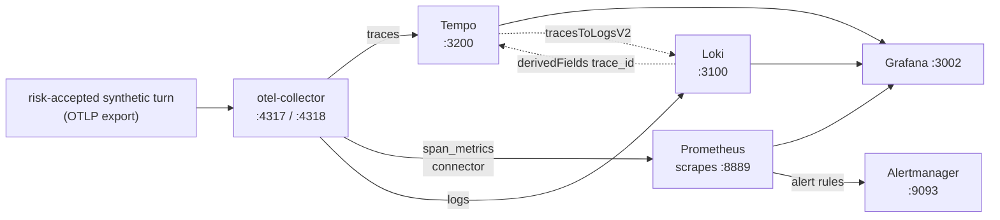

{}

- **You will:** Watch traffic appear as metrics and sanitized logs, follow one trace id across all three stores, measure the platform under k6 load, and add a panel to the shipped dashboard.
- **You need:** [7.1. Tracing]() finished and the host Compose stack running; the k6 half also needs MCP on `:8000`, A2A on `:8080`, and agentgateway on `:3000`/`:3001`/`:4000`.
- **Time:** about 50 minutes, hands-on. {}

## Ask Prometheus which series exist before reading a panel

A **metric** is a bounded aggregate: a count and a duration per operation, carried by a small fixed set of labels. A trace answers _what happened in this turn_; it cannot answer _were the last thousand turns healthy_ without reading a thousand traces. A metric answers that in one query, and stays affordable only while its label set stays small.

This page reads the dashboard's six panel queries, follows one trace id into a **sanitized** log record — one stripped of anything that could carry a credential, an endpoint, or customer data — and measures each layer under load.

Open `http://localhost:3002/d/agentops-overview` and look at **Agent request rate**: it is flat, and two explanations fit equally well — nobody is using the agent, or the telemetry path is broken and everybody is. A dashboard cannot tell you which.


That is this dashboard after two turns and nothing else, and the honest reading of it needs a different sentence per panel. **Agent request rate** has data because turns really occurred. **Gateway request rate** is a flat zero line, which means Prometheus is scraping the gateway and the gateway has served nothing — a measured zero. **Agent error ratio** and the two right-hand panels say `No data`, which is not a zero at all: no series exists to divide, so the panel has nothing to plot. A flat line and an empty panel look similar and mean opposite things, and telling them apart is the skill this page is about.

**Agent p95 latency** gets the sentence that misleads. Its bar sits at the histogram's ceiling: `30s` is the last bucket the collector defines below, so slower turns land in `+Inf` and `histogram_quantile` returns no boundary past the last finite one. A 30s reading therefore covers a 31-second turn and the five-and-a-half-minute one on the previous page alike, on this class of machine. Raise that top bucket past your slowest honest turn before trusting this panel or the `AgentTurnLatencyP95High` alert on the same series.

So do not read the graph; ask Prometheus what series exist at all:

```bash
curl -fsS 'http://localhost:9090/api/v1/query?query=agentops_calls_total' \
  | jq -c '.data.result[] | [.metric.span_name, .metric.status_code, .value[1]]'
```

```text
["observability-check","STATUS_CODE_UNSET","1"]
["invoke_agent agentops_agent","STATUS_CODE_UNSET","3"]
["generate_content qwen3:4b-instruct","STATUS_CODE_ERROR","2"]
["execute_tool get_service_status","STATUS_CODE_UNSET","1"]
["generate_content qwen3:4b-instruct","STATUS_CODE_UNSET","2"]
```

Three turns, four model calls of which two failed, one tool call, and the synthetic span `mise run observability:up` pushed through to prove the path works. The `span_metrics` connector manufactured every one of those rows from spans, which is why the three agent panels stay empty until you accept the ADK trace risk again:

```bash
export ADK_CAPTURE_MESSAGE_CONTENT_IN_SPANS=true
export OTEL_TRACES_SAMPLER=always_on
```

Fictional course data only. The remaining hands-on pages in this chapter read spans too, so leave it accepted until [7.7. Incident Response]() closes it in its teardown. The gateway panels and the agent's own native counters keep working either way.

The shipped `AgentOps overview` dashboard has six metric panels and one logs panel. Read the six queries once, because you write the seventh yourself:

```promql
sum(rate(agentops_calls_total[5m]))
histogram_quantile(0.95, sum by (le) (rate(agentops_duration_seconds_bucket[5m])))
agentops:calls:error_ratio_rate5m
sum(rate(agentgateway_requests_total[5m]))
histogram_quantile(0.95, sum by (le) (rate(agentgateway_request_duration_seconds_bucket[5m])))
sum(rate(agentgateway_guardrail_checks_total{action="Reject"}[5m]))
```

The third one is not an expression at all. `agentops:calls:error_ratio_rate5m` is a recording rule from `infra/observability/prometheus-rules.yml`, and the panel plots it by name so that the number you watch and the number `AgentErrorBudgetBurn` pages on are one series that cannot disagree. It used to be an inline ratio with `clamp_min(denominator, 1)`, and that floor is worth understanding rather than copying: the denominator is a `rate()`, which is calls per **second**, so flooring it at one divides the ratio by up to a hundred at this lab's own 0.01 requests per second — a panel reading a healthy 1% while the alert, on the unfloored expression, pages at 100%. The rule leaves the denominator alone: `0/0` is NaN, so an idle lab fires nothing and the panel renders "No data" instead of a confident wrong number. The `Agent logs` panel below them queries Loki for `agentops-agent` lines, filtered by an optional `trace id` textbox.

### Which dimensions the connector carries, and which it refuses {#why-avoid-session-or-prompt-labels}

The connector's whole configuration is short, and its bucket list is what decided the p95 panel above:

```yaml
connectors:
  span_metrics:
    namespace: agentops
    metrics_flush_interval: 5s
    histogram:
      unit: s
      explicit:
        buckets: [100ms, 250ms, 500ms, 1s, 2s, 5s, 10s, 30s]
    dimensions:
      - name: gen_ai.operation.name
      - name: gen_ai.request.model
```

Two custom dimensions, plus `status_code`, `span_name`, and `span_kind` which the connector supplies itself. Here is one complete series as Prometheus stores it:

```json
{
  "__name__": "agentops_calls_total",
  "exported_job": "agentops-agent",
  "gen_ai_operation_name": "generate_content",
  "gen_ai_request_model": "qwen3:4b-instruct",
  "instance": "otel-collector:8889",
  "job": "otel-collector",
  "otel_scope_name": "spanmetricsconnector",
  "service_name": "agentops-agent",
  "span_kind": "SPAN_KIND_INTERNAL",
  "span_name": "generate_content qwen3:4b-instruct",
  "status_code": "STATUS_CODE_ERROR"
}
```

Every one of those values comes from a small, known set, and that is the rule keeping a metrics store alive: **never label a metric with a user id, a session id, an incident id, a prompt, or a trace id.** Each distinct combination of label values is one more time series to index and hold in memory — that count is called **cardinality** — so a session-id label turns one series into one per conversation forever, and a prompt label writes user text into a store that has no redaction and no erasure story. Correlation identifiers belong in traces and logs, which are addressed by id rather than aggregated by it.

Because `status_code` is the connector's own dimension, the error-ratio panel and every alert that reads it work without depending on an ADK-specific error attribute or instrumentation-scope name, which matters the first time you swap frameworks.

The scraper and UI differ by deployment profile; use the canonical host/local/GKE matrix in [7. Observability]() before picking a dashboard or an external scraper. This page follows the host Compose path.

## How the trace id joins a sanitized log to its span

Metrics say _something is failing_. Logs say _what the failure was_. Here is the record the agent writes when a model call fails, exactly as it reaches the console:

```text
time=2026-08-10T22:11:41.337+02:00 level=ERROR msg="Model request failed" error_type=*fmt.wrapError trace_id=7488083813448af2ab00db9c0649e1ee span_id=711feda7b2b8c2fa
```

Read what is _not_ there: no provider response body, no endpoint URL, no stack. The handler in `agents/go/policy/guardrails.go` logs the error's Go type and nothing else, because a provider error can carry a credential, a URL, or a customer's request back to you. What _is_ there is a `trace_id` and a `span_id`, stamped because the record was written inside a recorded span — the thread through all three stores.

The same record goes to Loki when an OTLP endpoint is configured, redacted independently a second time. After ADK builds its providers, the application installs exactly one OTel logging handler on the `agent` logger when `OTEL_EXPORTER_OTLP_ENDPOINT` or `OTEL_EXPORTER_OTLP_LOGS_ENDPOINT` is set; a trace-only endpoint, no endpoint, or `OTEL_SDK_DISABLED=true` installs none. Before export it redacts concrete PII and obvious credential and token patterns, caps every string and body at 2048 characters, and removes exception messages, tracebacks, and stack bodies while retaining `exception.type`. Console and OTLP handlers sanitize independent copies of each record — defense in depth, not permission to log secrets.

Ask Loki what it received:

```bash
curl -fsS -G 'http://localhost:3100/loki/api/v1/query_range' \
  --data-urlencode 'query={service_name="agentops-agent"}' \
  | jq -r '.data.result[].values[][1]'
```

```text
serving A2A
```

One line, from an agent that has done little but start up. Its stream labels carry `service_name`, `service_version`, and — because the resource is built once for every signal — `agentops_source_identity` and `agentops_build_mode`, so a log line names the build that wrote it with no correlation step. Loki runs pinned in single-binary mode with filesystem storage and 7-day retention, matching Prometheus: a Compose service on the host and a PVC-backed Deployment in Kubernetes, where only the `loki:3100` ClusterIP is exposed.

Grafana turns the shared `trace_id` into two provisioned links, each written around a failure the naive version hits:

- The **Tempo** datasource carries `tracesToLogsV2` pointing at Loki, with the window widened five minutes either side of the span. A zero-width window finds nothing, because a log record is written _before_ the span that contains it is exported.
- The **Loki** datasource carries a `derivedFields` entry matching the `trace_id` field rather than a pattern in the log text, so the link survives any change to the agent's log formatting.

Neither link resolves unless the identifiers are on the record, and that part the application still owns. A line written outside any span, or through a path that loses the context, arrives in Loki with no ids, and both links go dead while every store still looks healthy. Walk the correlation once by hand: send a request, open its trace on the **Tempo** datasource, follow a span's logs link into Loki, then follow that line's `TraceID` link back. Landing where you started proves the wiring works. The equivalent query, if you would rather type it:

```logql
{service_name="agentops-agent"} | trace_id="<trace id from the Tempo view>"
```

The in-cluster equivalent needs the ClusterIPs forwarded first: `kubectl -n agentops port-forward svc/loki 3100:3100` and `kubectl -n agentops port-forward svc/tempo 3200:3200`. That overlay ships no Grafana, so it ships neither link: query the forwarded APIs directly, or point an externally operated Grafana at both and re-create the two datasource entries there.



**Diagram in words:** One risk-accepted synthetic turn supplies spans to Tempo, sanitized logs to Loki, and connector-derived metrics to Prometheus. Grafana reads all three, and the dotted links connect the trace and its logs by trace id.

## Measure each layer's latency with k6 load tests

Knowing the agent is healthy is not knowing how much it can take. **k6** drives scripted HTTP traffic and fails the run when a stated latency budget is breached; it counts concurrency in **VUs**, one simulated client each. Three scripts live under `load/`, each isolating one layer of the host quickstart. `load/health.js` hits raw `/healthz` on MCP `:8000` and A2A `:8080` plus a low-rate hop through agentgateway `:3001`. `load/mcp-read.js` runs an MCP `tools/call` loop through the gateway `:3000`, exercising the Go MCP server and SQLite with no model call. `load/a2a-send.js` sends a bounded A2A conversation through `:3001` — a full turn, model included, capped at 1 VU and 3 iterations.

Each script targets a fixed port written into it, so those exact servers must be listening before the first run. Four processes, one terminal each because each blocks — and only the gateway launches from the repository root rather than the agent module, the detail that catches people out:

```bash
cd agents/go && mise run mcp:http   # MCP on :8000
cd agents/go && mise run a2a        # A2A on :8080
mise run gateway:host               # agentgateway on :3000/:3001/:4000, from the repository root
```

The fourth is Ollama serving `qwen3:4b-instruct`, because `a2a-send.js` calls a real model. Do not reach for `mise run smoke:host` here: it allocates ephemeral ports and starts a private copy of the stack, so it says nothing about the fixed-port servers these scripts target. Then, from the repository root:

```bash
mise x k6@2.1.0 -- k6 run load/health.js
mise x k6@2.1.0 -- k6 run load/mcp-read.js
mise x k6@2.1.0 -- k6 run load/a2a-send.js # spends real model time — keep 1 VU
```

`mise run load:health`, `mise run load:mcp`, and `mise run load:a2a` wrap exactly those three commands; the long form is spelled out once so you can see what a task runs. k6 is AGPL-3.0 and deliberately absent from `[tools]`, so nothing permanent gets installed.

Here is what `load:health` printed on a laptop: thirty seconds against the three servers it targets, threshold block complete, results block cut to the check total and three latency lines.

```text
  █ THRESHOLDS

    http_req_duration{op:gateway_health}
    ✓ 'p(95)<100' p(95)=10.4ms

    http_req_duration{op:raw_health}
    ✓ 'p(95)<50' p(95)=7.13ms

    http_req_failed
    ✓ 'rate<0.01' rate=0.00%

  █ TOTAL RESULTS

    checks_succeeded...: 100.00% 617 out of 617

    HTTP
    http_req_duration..............: avg=3.78ms min=1.21ms med=3.5ms  max=11.2ms  p(90)=6.29ms  p(95)=7.24ms
      { op:gateway_health }........: avg=7.56ms min=4.52ms med=6.7ms  max=11.2ms  p(90)=9.99ms  p(95)=10.4ms
      { op:raw_health }............: avg=3.68ms min=1.21ms med=3.43ms max=10.18ms p(90)=6.07ms  p(95)=7.13ms
```

Three ticks, and one number that pays for the run: the gateway hop's p95 is 10.4 ms against a raw p95 of 7.13 ms, so agentgateway costs about three milliseconds per request here. Subtract one layer from the next and the difference is attributed.

A **latency budget** is a pass/fail number agreed _before_ the test — this path answers within X ms at percentile Y. Deciding afterwards that a dashboard looked fine is not a budget. k6 encodes budgets as `thresholds`, so a breach fails the run with a non-zero exit code, exactly like a failing unit test.

The third entry below guards a different hazard: the gateway caps throughput on purpose — 120 MCP, 60 A2A, and 30 model requests per minute per instance — and `mcp-read.js` counts every HTTP 429 in an `mcp_rate_limited` metric.

```javascript
thresholds: {
  // Latency budget — a starting point for localhost, tune to your hardware.
  http_req_failed: ['rate<0.01'],
  'http_req_duration{op:tools_call}': ['p(95)<250'],
  mcp_rate_limited: ['count==0'], // any 429 means the gateway budget, not the platform, was measured
},
```

The shipped starting points are p95 under 50 ms for raw health, 100 ms for the gateway hop, 250 ms for the MCP read, and 15 s for a full A2A turn. That last number is not a coincidence: it matches the `AgentTurnLatencyP95High` alert threshold in [7.2b. Alerting](), so the load test and the alert rules cannot disagree about what "too slow" means. Read `p(95)` from the end-of-run summary rather than the average: averages hide the tail a waiting user feels. If your hardware cannot hold 15 s, raise the threshold in `load/a2a-send.js` and the `AgentTurnLatencyP95High` rule to the same new number; deleting either leaves an alert no run has ever tested.

The A2A checks validate protocol state, not just transport: a `Task` must reach `completed`, carry text in its status message or artifacts, and have no `metadata.adk_error_code`, so a failed task wrapped in a successful JSON-RPC response fails the sample instead of producing a false latency result.

{}

A load test aimed at a shared or third-party endpoint is a denial-of-service attempt, not a lab. {}

{}

The rest of the ladder works identically: raw `/healthz` is the floor — process, loopback, HTTP parsing — the MCP `tools/call` p95 minus that floor is Go protocol handling plus the SQLite read, in the tens of milliseconds, and the A2A `message/send` p95 is all of it plus the model, which is seconds.

To measure inference instead of assuming it, hold the request constant and replace only the model. Stop Ollama so `:11434` is free, run `mise run model:fake`, keep `AGENT_A2A_STREAMING=false`, restart A2A with `AGENT_MODEL_PROVIDER=openai-compatible` and `OPENAI_BASE_URL=http://127.0.0.1:4000/v1`, and run the same script again:

```bash
mise x k6@2.1.0 -- k6 run load/a2a-send.js
```

Both host and k3d gateway profiles already target the host's `:11434`, so no route or script changes between samples. Subtract the fake-model p95 from the Ollama p95 and you have measured inference. On a local Qwen3-4B that gap dwarfs the gateway and MCP layers, so many VUs through the real model mostly saturate inference. Load-test the fake-backed platform path with rate; sample the real model path at 1 VU; restore Ollama before any evaluation exercise. {}

With `mise run observability:up` running during a load run, the dashboard splits the blame: the gateway panels (`agentgateway_request_duration_seconds`) show the hop the gateway sees, and the agent panels (`agentops_duration_seconds`) show time inside the process. A flat-fast gateway with a slow agent puts the problem behind the proxy — open the slowest turn in Tempo and read which span dominates, as on the previous page.

## Your turn: add a token-throughput panel in PromQL

Six panels answer six questions. The seventh is yours: nothing on the dashboard graphs tokens, even though `agentops_tokens_token_total` is scraped the whole time.

Predict before you build it: the counter carries a `direction` label with values `input` and `output`. If you graph `rate(agentops_tokens_token_total[5m])` without aggregating, how many lines appear — and what happens to them when you restart the agent?

- **Mode**: `temporary experiment`.
- **Goal**: add one working token-throughput panel to the shipped dashboard, driven by a query you verified against the API first.
- **Files to touch**: only `infra/observability/grafana/dashboards/agentops.json`. No rule file, no collector config.
- **Preflight**: from the repository root, require a clean start with `git diff --quiet -- infra/observability/grafana/dashboards/agentops.json`, and confirm the series exists with `curl -fsS 'http://localhost:9090/api/v1/query?query=agentops_tokens_token_total' | jq '.data.result | length'` returning a non-zero count. If it returns `0`, send one agent turn first.
- **Steps**: build the expression in Grafana's Explore view against the Prometheus datasource until it plots — `sum by (direction) (rate(agentops_tokens_token_total[5m]))` is one defensible answer. Then copy the `Agent request rate` panel object in the dashboard JSON, give it a new `id` and title, paste your expression into its target, and restart Grafana with `docker compose -f infra/observability/compose.yaml restart grafana`.
- **Gate that proves completion**: your panel appears on `http://localhost:3002/d/agentops-overview` and plots a line for each direction after you send a turn, and its label set contains no session id, user id, or prompt.
- **Final state**: run `git restore -- infra/observability/grafana/dashboards/agentops.json` and restart Grafana once more, or keep it deliberately and say in one sentence which question it answers that the other six do not.

A panel nobody can name a question for is a panel that will be ignored during the incident it was built for.

## What you can do now

- You can tell an empty panel from a dead pipeline by asking Prometheus which series exist.
- You can explain why every dimension on `agentops_calls_total` is bounded, and what a session-id label would cost.
- You can name both provisioned links behind the Tempo → Loki → Tempo walk, and the failure case you saw here: a Loki line with no ids while all three stores still look healthy.
- You can read a k6 `p(95)` line, subtract one layer from the next, and price the gateway hop.

Continue to [7.2b. Alerting](), where these same series become the rules that decide whether anyone gets woken up.
