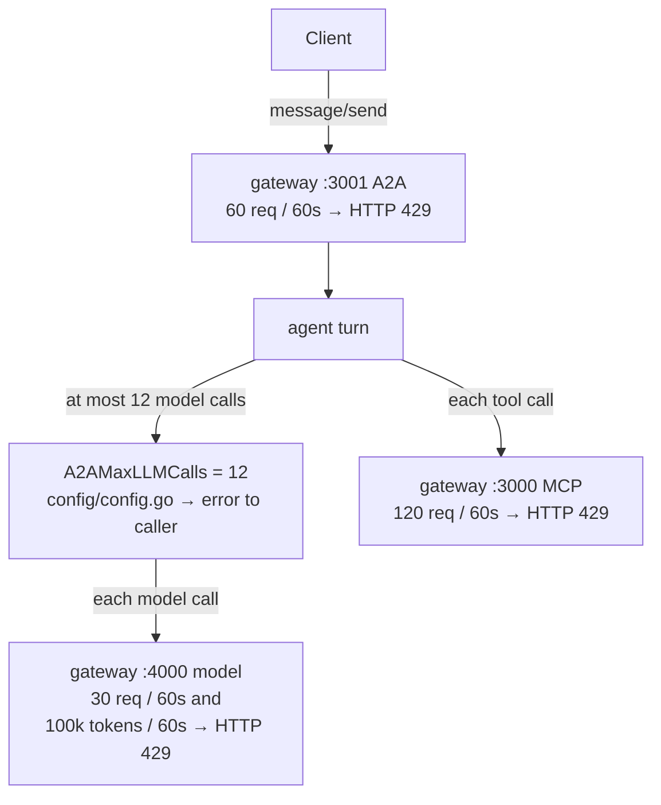
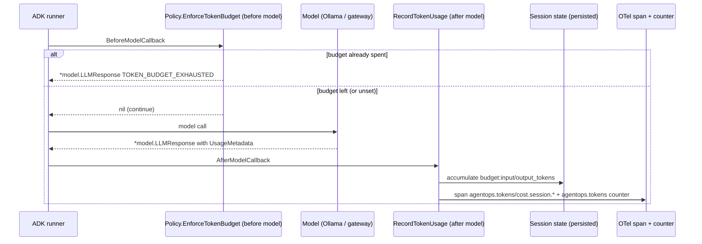

{}

- **You will:** Read the tokens one session actually spent, put a defensible price on them, then set a budget low enough to watch the agent refuse the next call.
- **You need:** [7.1. Tracing]() finished, and its risk-accepted trace switch turned back on for this page — the session cost estimate is a span attribute, so a non-recording span hides it entirely.
- **Time:** about 30 minutes, hands-on. {}

## Cost is a function of the loop, not of the request

A **token** is the unit a provider bills and a model reports. Measuring what an agent costs means counting tokens per turn and per session before applying any price. A CRUD endpoint costs the same on every call. An agent does not, because it decides at runtime how much work to do: how many tool round trips, how much session history to carry, how many runbook documents to paste into a prompt. So the change that doubles a bill is rarely a decision anyone made: a slightly longer instruction, one more tool, or `search_runbooks` returning whole markdown files that then live in the history for the rest of the conversation. This page measures both counts, names the two bounds that stop the loop today, and prices one session against a rate you can cite.

You cannot argue about cost without a number, so get the number first. Restore all five exports below so the agent's spans reach the collector again. `ADK_CAPTURE_MESSAGE_CONTENT_IN_SPANS` is the risk acceptance from [7.1. Tracing](): without the exact literal `true`, ADK spans are shut off, `trace.SpanFromContext` hands the recorder a non-recording span, and the per-session running total — written onto a **span** rather than into a metric — goes nowhere. Course seed data only. It stays on for the rest of the chapter; [7.7. Incident Response]() turns it off again in its teardown:

```bash
export ADK_CAPTURE_MESSAGE_CONTENT_IN_SPANS=true
export OTEL_TRACES_SAMPLER=always_on
export OTEL_EXPORTER_OTLP_ENDPOINT=http://localhost:4318
export OTEL_EXPORTER_OTLP_PROTOCOL=http/protobuf
export OTEL_SERVICE_NAME=agentops-agent
```

Now send one question — `cd agents/go`, `mise run run`, then ask `What is the status of the checkout service?` — and ask Prometheus what it counted:

```bash
curl -fsS 'http://localhost:9090/api/v1/query?query=agentops_tokens_token_total' \
  | jq -c '.data.result[] | [.metric.direction, .value[1]]'
```

```text
["input","2687"]
["output","21"]
```

Two series, one per direction, and nothing else — no session id, no prompt, no user. Look at the asymmetry: 2,687 tokens in against 21 out, for a six-word question. Every tool's schema rides in the prompt on every call, the instruction rides with it, and anything the session already read rides along too, so you pay almost entirely for what you send. Your own numbers will differ; the ratio will not.

The dashboard graphs this series and the `AgentTokenTelemetryMissing` alert watches it: if it comes back empty while spans are still flowing, the accounting is broken rather than free.

The per-conversation running total is not in that metric, because a session id cannot be a metric label without destroying the metric store. It rides on the agent span instead, readable in Grafana's Tempo view or from the API:

```bash
curl -s "http://localhost:3200/api/traces/<trace id>" | jq -r '
  .batches[].scopeSpans[].spans[] | select(.name | startswith("invoke_agent"))
  | .attributes[] | select(.key | startswith("agentops.")) | "\(.key)\t\(.value | to_entries[0].value)"'
```

```text
agentops.tokens.session.input	2687
agentops.tokens.session.output	21
agentops.tokens.session.total	2708
agentops.cost.session.estimate	0
```

Three counts you can trust, and one number that is theatre: the estimate stays `0` however much you spend, because both per-1k prices resolve to zero — `mise run config:check` prints `AGENT_INPUT_PRICE_PER_1K = 0` — so the fourth line proves nothing about the arithmetic behind it.

**You have just measured an agent turn in the only unit anybody bills for, on hardware that bills you nothing.**

## Two bounds that stop the loop, and neither counts money

Before you price the work, know what stops it growing. Two mechanisms bound it today, and both bound _work_ rather than _spend_, fitting a default path that runs on your own hardware and produces no invoice.

The **A2A model-call cap** limits how much reasoning one request may do. `AGENT_A2A_MAX_LLM_CALLS` defaults to 12 and the A2A server passes it to the ADK runner; exceeding it fails the turn back to the caller instead of silently truncating the work. Validation admits 1 through 100: the floor is one call, because a turn that never reaches the model cannot answer, and the ceiling stops a mistyped value authorizing a runaway loop.

The **gateway rate limits** cap how fast any client may hit each surface: each route gets a `localRateLimit` **token bucket** per gateway instance — an allowance that refills on a fixed interval and returns HTTP 429 once drained — with 30 requests per 60s on the model route `:4000`, 120 on the MCP route `:3000`, and 60 on the A2A route `:3001`. The model route carries a second bucket counting LLM tokens rather than requests; [7.3b. Cost Governance]() is where you watch it refuse a call.



**Diagram in words:** A client request first consumes the A2A gateway allowance. The agent then stays within its model-call cap, and each model or tool request consumes the separate model or MCP allowance — on the model route, both a request and a token allowance.

Only the model route's token bucket is denominated in the unit a bill is made of; the other three bounds are safety rails rather than a monetary budget. No billing export exists in this repository, so nothing here reconciles against an invoice. Latency usually shares its cause with spend: unnecessary loop steps and oversized context make a turn both slow and expensive at once.

### Where the tokens are counted, and where the count stops

Counting has to happen where the number is authoritative — in the model's own response — not estimated from character length afterwards. One app-wide policy plugin does it, so token accounting cannot go missing from a sub-agent someone adds later:



One plugin, one function per **ADK callback** — a hook the runtime invokes at a fixed point in the turn, `BeforeModelCallback` before each model call and `AfterModelCallback` after each response. `AfterModelCallback` points at `Policy.AfterModel`, which runs the after-model guards in a fixed order. Accounting is one of them: `Policy.RecordTokenUsage` reads `UsageMetadata` off each response — input covers prompt and tool-result prompt tokens, output covers candidates and reasoning tokens — and accumulates it into persisted session state:



Three decisions in that function matter. It returns early when `response.UsageMetadata` is nil, because a response with no reported usage cannot honestly be counted. When a compatible provider reports only a total, the unclassified remainder goes into the output bucket, so enforcement fails closed instead of recording zero. And it takes a per-session lock around the read-modify-write, so two overlapping callbacks over the same in-memory state cannot lose an increment. Only at the end does it hand the totals to the configured recorder, which emits the `agentops.tokens` counter and the span attributes you read in Tempo; the callback knows nothing about OpenTelemetry.

That callback lock cannot repair two detached session snapshots, so the A2A server also serializes overlapping turns for one session: it takes a per-session gate before ADK loads state and holds it until the event stream and **compaction** — the guard that replaces older history with one short note — have finished, so the next turn reads the persisted total. Different users and sessions still run concurrently. Both locks are process-local: the shipped single-replica runtime has one process and one SQLite writer, while a multi-replica deployment would need atomic accounting or a distributed per-session gate in its shared session store.

Attribution is measurement; enforcement is a decision to stop. `Policy.EnforceTokenBudget` runs _before_ each model call and short-circuits it once the session total reaches `AGENT_MAX_TOKENS_PER_SESSION`, returning an ADK response carrying `TOKEN_BUDGET_EXHAUSTED` and an actionable message rather than an obscure failure. The counters are ordinary persisted session values under the keys `budget:input_tokens` and `budget:output_tokens`, with two consequences: the budget is **per conversation** rather than per turn, and a new session starts at zero — the intended reset, and the easy bypass, since a client that opens a fresh session per request never reaches the threshold. Left unset, enforcement is off and only measurement runs.

Know the remaining edges before you rely on the number:

- **An admitted call can overshoot.** The check reads accumulated usage _before_ a call and records that call afterwards, so a call that starts below the threshold may finish above it; only the next one is refused. Neither gate reserves tokens or sets a per-call output cap.
- **A usage-less response defeats it.** The gateway streaming path reports usage only on the final aggregate, and any provider or path that omits usage escapes both the counter and the budget, so those calls spend without appearing in your number.
- **It counts the agent's model calls only.** The standalone evaluation judge and semantic retrieval call their configured endpoints outside these callbacks, so a session total is the agent's spend rather than the project's; budget those separately and use the harness's sanitized per-case usage for release comparisons.



**Diagram in words:** ADK checks the session budget before the model call. If it is spent, ADK returns `TOKEN_BUDGET_EXHAUSTED`; otherwise the model runs and reports usage. The after-model callback adds those tokens to persisted session state, then sends the running token and cost attributes to OpenTelemetry.

Tokens are attributed per session and only per session: the model reports one usage figure per call rather than one per tool, and no callback splits a turn's tokens across the tools it invoked. You can investigate component weight by **ablation** — hold the model, question, state, and settings constant, change one toolset or docstring, and compare repeated first-turn input tokens — but this repository has not recorded that ablation and claims no per-tool number. Why an unrecorded comparison is not evidence is spelled out once in [0.2. Evidence]().

## What does the GKE lab cost per month? {#what-does-the-gke-lab-cost-per-month}

Tokens are only the variable half of a bill. The optional GKE lab adds a fixed half that accrues whether or not anyone sends a turn, and this is the one page in the course that states currency.

At prices checked on 31 July 2026, the lab's starting fixed resources cost about USD 28.13 monthly when the billing account's GKE, disk, and registry allowances remain available. They cost about USD 29.33 with only the GKE credit, plus at most USD 0.04 of registry storage for the one published image; retained image history can add more. [6.6. Platform Delivery](), which plans the lab, links here rather than restating those figures.

Three cloud-side bounds keep the figure that low: one small single-replica lab replaces a production HA topology, the GKE overlay right-sizes idle CPU requests for the two-core node while preserving each workload's burst limit, and Artifact Registry deletes image versions older than 30 days while keeping the five most recent. That cleanup is not a storage cap — versions younger than 30 days still accumulate.

{}

The official `europe-west1` Spot SKUs list USD 0.01162 per vCPU-hour and USD 0.001558 per GiB-hour. The `e2-standard-2` node has two vCPUs and 8 GiB, so `2 × 0.01162 + 8 × 0.001558 = 0.035704` per hour. A 730-hour month is USD 26.06.

The module assigns that Spot node an external IPv4 address instead of provisioning Cloud NAT. Its USD 0.0025 hourly Spot-address charge adds USD 1.83 monthly.

The 30 GiB boot disk plus 6 GiB of PVCs — 2 GiB each for Tempo and Loki, 1 GiB each for agent state and its backups — provision 36 GiB. The first 30 GiB of standard persistent disk is free per billing account, so the remaining 6 GiB costs about USD 0.24 at USD 0.04 per GiB-month. If another project has consumed that allowance, all 36 GiB cost USD 1.44. The lab provisions no object storage, so there is no bucket line item: the telemetry stores keep their blocks on those same persistent disks.

One image is published per release and fits inside Artifact Registry's 0.5 GiB free allowance; without that allowance it costs at most USD 0.04 monthly. With every allowance available, starting fixed resources total about USD 28.13 before variable network, Vertex, and retained registry use. With only the GKE credit, about USD 29.33 plus at most USD 0.04 of registry storage. Without that credit, add USD 73 for a 730-hour month: about USD 101.13 to at most USD 102.37.

The GKE credit, persistent-disk allowance, and Artifact Registry allowance are per billing account, so another project may already consume them. Spot prices change; refresh [Spot VM pricing](https://cloud.google.com/spot-vms/pricing), [external IPv4 pricing](https://cloud.google.com/vpc/network-pricing), [disk pricing](https://cloud.google.com/compute/disks-image-pricing), [Artifact Registry pricing](https://cloud.google.com/artifact-registry/pricing), and [GKE pricing](https://cloud.google.com/kubernetes-engine/pricing). {}

Prefer local development, because the control plane, node, disks, and registry keep billing while the lab sits idle. Label the resources, review the plan, set an external billing budget alert, record the start time, and tear down immediately after the lab.

{}

Persistent disks hold the agent state, its backups, and the Tempo and Loki blocks, and OpenTofu never created them: GKE's CSI driver did, in response to the workloads' claims, so no state file names them. Destroying the module removes the cluster and with it the controller that releases them, which orphans every one of those disks — still billable, no longer attached to anything, and invisible to a later `tofu destroy`. Delete the workloads and wait until each PersistentVolume is gone before you plan the destroy; `infra/gcp/README.md` carries that teardown in order, with the inventory that proves the disks are actually absent. Record whatever data you need before any of it. {}

## Your turn: put a real price on one of your own sessions

The shipped estimate is `0` on the local path, which is honest and useless. Turn it into a number you could defend.

Predict before you start: with published rates set, does `agentops.cost.session.estimate` describe what this turn _did_ cost, or what it _would have_ cost somewhere else?

- **Mode**: `inspect` — no file changes.
- **Goal**: produce a non-zero, hand-checkable session cost estimate from a rate you can cite, then prove the budget refuses the next call once the session total is spent.
- **Files to touch**: none. Set the variables inline on the command; do not edit the root `.env`.
- **Preflight**: confirm the five exports at the top of this page are still live with `echo $ADK_CAPTURE_MESSAGE_CONTENT_IN_SPANS` printing `true`, and confirm the counter exists with `curl -fsS 'http://localhost:9090/api/v1/query?query=agentops_tokens_token_total' | jq '.data.result | length'` returning a non-zero count, sending one turn first if it does not.
- **Steps**: look up the published per-1k input and output rates of one hosted model you would realistically use, and note the page and the date. Then, from `agents/go`, run `AGENT_INPUT_PRICE_PER_1K=<input rate> AGENT_OUTPUT_PRICE_PER_1K=<output rate> mise run run`, ask the same question, and reopen the new trace. Finally restart with `AGENT_MAX_TOKENS_PER_SESSION=1 mise run run` and send two turns in the same session.
- **Gate that proves completion**: the new trace's `agentops.cost.session.estimate` is non-zero and equals `session.input / 1000 × your input rate + session.output / 1000 × your output rate`, recomputed by hand; and with the budget at `1`, the second turn returns `ErrorCode: "TOKEN_BUDGET_EXHAUSTED"` before any model call while the first turn answered normally.
- **Final state**: no file changed and no price left in `.env` or the parent shell. Write down the four numbers you would put in a capacity plan: model calls, input and output tokens, total latency, and the price source with its date.

If your hand calculation and the span disagree, you are reading a stale span rather than a broken formula: the estimate is written per session, so re-open the trace of the turn you just sent. Whatever it says, the number is a **stated assumption** — what this turn would have cost on the provider whose published rate you entered. Local Ollama bills nothing, so reconcile against a provider invoice before anyone treats the figure as money.

## What you can do now

- You can read the tokens one turn spent out of Prometheus, and the running session total off its trace.
- You can name the two bounds that stop an agent loop growing, and say why neither of them counts money.
- You can put a cited per-1k rate behind `agentops.cost.session.estimate` and hand-check the number it returns.
- You can make `TOKEN_BUDGET_EXHAUSTED` refuse a model call, and name the session-rotation bypass that gets around it.

"What does this agent cost?" now has a three-part answer: a count you measured, a rate you can cite, and a limit you watched refuse a call. Only the count is a measurement; the price on it stays an assumption until an invoice confirms it.

Continue to [7.3b. Cost Governance](), which asks the same question of fifty agents sharing one endpoint, where a per-session budget stops being enough.
