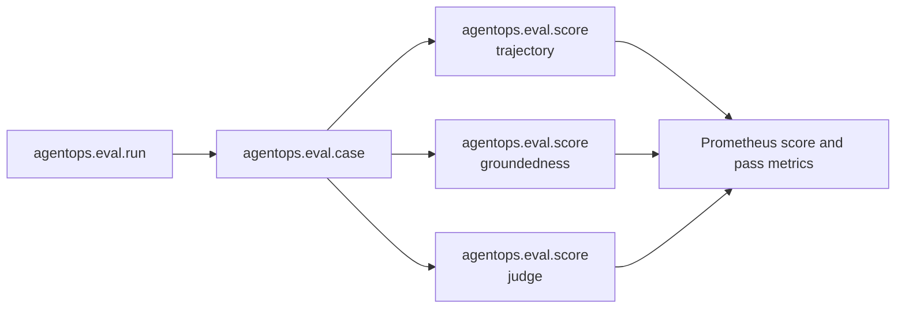

{}

- **You will:** Trace a verdict back to one case and sample, see what an evaluation artifact is forbidden from carrying, and promote a review finding into a committed regression case.
- **You need:** [4.4. Evaluations]() finished; the observability stack only for optional runtime visibility.
- **Time:** about 25 minutes, hands-on. {}

## What a free-text complaint leaves out: candidate, input, scorer

An **evaluation case** is a committed input, the response you accept for it, and the tool calls you expect. It is the durable form a quality report must take before anyone can reproduce it, fix it with confidence, or prove it stayed fixed.

Observations do not arrive in that form. They arrive as a sentence: _the agent did something unsafe yesterday_. That is the most important sentence anyone will say about your system this week, and it is unactionable as written. Which candidate? Which input? Which of three samples? Scored by what — a human, a deterministic check, or a model with an opinion? A verdict missing those is not evidence about a release.

This page turns such a sentence into a committed check. Start with what already exists, offline and without a model:

```bash
cd evals
mise run eval:validate
```

```text
[eval:validate] $ go run ./cmd/agentops-eval validate
{
  "evalsets": 3,
  "cases": 22,
  "calibration_cases": 12
}
```

An **evalset** is a committed file of cases run together; a **scorer** turns one case's result into a named numeric score. Twenty-two committed cases across three evalsets — `agentops_agent_core` holds sixteen of them, with the structured-report and workflow sets holding three each — plus twelve **calibration cases**, each holding a human pass-or-fail label, for the **judge**, a model that scores another model's answer. A report becomes a **sanitized** case — customer, credential, and incident-specific detail removed — and that case becomes a check that outlives the person who noticed.

**You just counted, offline and in under a second, every behavior this agent is contractually required to keep.**

## What a verdict must carry to be reproducible

A score means nothing without the thing it scored attached. The minimum useful key is a tuple:

```text
run id + source identity + tree digest + evalset digest + transport + case id + sample + score name
```

That key separates two stochastic samples of the same case, two transports, and two revisions — without storing a single prompt or answer in a metric label. It is the bounded-dimension discipline of [7.2. Monitoring](), applied to quality instead of health.

Stable attributes therefore carry identifiers and outcomes only: run id, source revision and dirty flag, model name, evalset id, transport, case id, repeat sample number, score name, numeric value, pass state, and token and model-call counts. They exclude prompts, answers, references, tool arguments, tool results, judge rationales, endpoint URLs, credentials, provider errors, and reviewer notes. The exclusion bounds **cardinality**, the number of distinct label combinations a metric store must hold, and makes the artifact safe to attach to a release other people will read.

The same structure exists as telemetry when an evaluation exporter is explicitly configured:



**Diagram in words:** One evaluation run contains case spans; each case contains named score spans. The same outcomes become bounded Prometheus metrics for comparison in Grafana.

The judge sits in that tree as a _sibling_ of the deterministic scorers, not a layer above them. A calibrated model verdict becomes an `agentops.eval.score` span like any other score, and the deterministic scores stay authoritative. `mise run eval:judge-calibration` writes a sanitized artifact holding the source identity, the typed judge provider, name, and digest, the calibration digest, and the per-case matches — then reports agreement and exits zero. Deciding what agreement your risk tolerance requires is a human judgement, not a field in a file, for the reasons collected in [0.2. Evidence](). Rationales help you diagnose a local run and never cross into a release artifact.

## Turn a review finding into a committed regression case

The course deliberately does not ship two things. There is no public thumbs-up endpoint, no reviewer database, and no automatic online scorer; the A2A application serves messages, tasks, streaming updates, cancellation, and history, with no feedback route and no stored review. If someone asks whether user feedback is being collected, the answer is no.

You also cannot append a human note to an ended trace: OpenTelemetry spans are _emitted evidence_, not a reviewer database, and nothing in this repository can write an assessment onto a trace already sitting in Tempo. A real feedback service would need an authenticated write API, a sanitized schema, a span-link strategy, retention, access control, deduplication, and an accountable owner — seven controls that make a stored opinion attributable and safe to keep, none implemented here.

So the durable artifact is a new case and a new run. The loop has seven steps:

1. Confirm the finding against the authorized system of record, not against a recollection of it.
1. Remove customer, credential, and incident-specific detail, because the evalset is public.
1. Add the smallest representative case to the correct evalset, using the course's fictional domain vocabulary.
1. Validate the case and its scorer offline.
1. Reproduce the failure on the current candidate — a case that never failed cannot prove the fix worked.
1. Fix the underlying instruction, tool, policy, or model seam.
1. Re-run that case and the full set.

One anecdote justifies investigation. Repeated or high-severity findings justify a regression case. Neither justifies quietly moving a threshold. If a finding cannot be sanitized without losing its meaning, it stays in the authorized incident system and never enters this public repository.

Retention depends on the store that owns each record, and the course configures no universal policy: local JSON artifacts live until you delete them, evaluation traces and metrics follow Tempo's and Prometheus's configured retention, and hosted workflow artifacts are transient handoffs. Do not copy raw traces into long-lived attachments to extend retention; that defeats the content minimization that made them safe to keep.

## Your turn: promote a finding into a regression case

Your finding, sanitized: _asked which engineer resolved INC-002, the agent named one — and the seed data contains no engineer names anywhere._ Turn it into a case.

Predict before you run the validator: `eval:validate` needs no model. What can it possibly check about a case whose answer only a model can produce?

- **Mode**: `temporary experiment`.
- **Goal**: add one representative case to a committed evalset, watch it validate offline, and see the case count move.
- **Files to touch**: only `evals/ops.evalset.json`.
- **Preflight**: from the repository root, require a clean start with `git diff --quiet -- evals/ops.evalset.json`, and record the current counts by running `mise run eval:validate` from `evals`.
- **Steps**: copy the shape of an existing entry in `eval_cases` — a unique `eval_id`, one conversation turn with `user_content`, the `final_response` you would accept, and the `intermediate_data.tool_uses` you expect the agent to call. Your case asks about the engineer who resolved INC-002, and the response you accept is a refusal that names no person. Then re-run `mise run eval:validate`.
- **Gate that proves completion**: `mise run eval:validate` exits zero and reports one more case than you recorded in the preflight; it never contacts a model.
- **Final state**: run `git restore -- evals/ops.evalset.json` and confirm `mise run eval:validate` reports the original counts again. Keep the case instead if you intend to carry it into your capstone.

The tests below pin the artifact contract itself — schema, sanitization, output shape — without a model or a collector:

```bash
cd evals
go test ./... -run 'Evidence|Artifact|Calibration' -count=1
```

```text
ok  	github.com/MLOps-Courses/agentops-open-course/evals	0.177s
ok  	github.com/MLOps-Courses/agentops-open-course/evals/cmd/agentops-eval	0.005s
```

## What you can do now

- You can name the tuple a verdict must carry, and reject one that arrives without it.
- You can list what an evaluation artifact must never contain, and say why that limit protects cardinality and privacy at once.
- You can add a case to `ops.evalset.json` and say what `eval:validate` checks: shape, not answers.
- You can explain why a review finding becomes a new case and a new run instead of a note appended to a trace.

A sentence in a chat channel decays; a committed case with an id does not. Every future candidate must pass it before anybody may call that candidate better.

Continue to [7.5. Online Evaluation](), which asks the same question of live traffic, where content-free telemetry bounds what can be scored.
