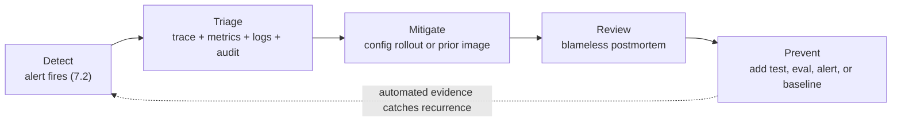
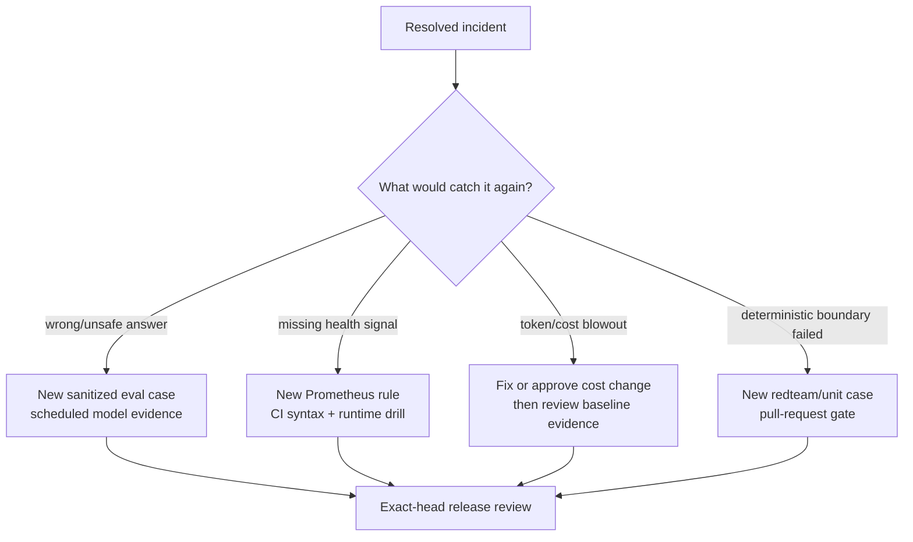

{}

- **You will:** Cause one incident the agent refuses and one a shipped alert catches, walk the four signals in order, write the postmortem, and add the cheapest automated check that catches it again.
- **You need:** The host observability stack from `mise run observability:up` still running, and Ollama serving `qwen3:4b-instruct` — the drill's first turn is a real model call, and without it the second turn is admitted rather than refused. Assumed, not required: the alert lifecycle from [7.2b. Alerting]() and the session budget from [7.3. Costs]().
- **Time:** about 35 minutes, hands-on. {}

## The agent is a workload with incidents of its own

An **agent-platform incident** is one where the failing workload is the agent itself rather than the service it was investigating. The operational answer to it is a fixed loop: **detect → triage → mitigate → review → prevent**. The agent has needed that loop since Chapter 5, when it became a workload of its own — a host process behind the gateway, or a Kubernetes deployment after Chapter 6. The signals the previous pages built make the agent's own outages legible, including the one where it answers perfectly and your ability to see it is gone.

This page runs that loop once: cause two failures deliberately, watch one refuse itself and one get detected, walk the four triage signals, pull one mitigation lever, then turn the incident into a check that catches the next one without you.

Cause one now; the walk below reads better against a live symptom. Stop the collector for three and a half minutes:

```bash
CHAOS_HOLD_SECONDS=200 mise run chaos:collector
```

```text
[chaos:collector] $ ./scripts/chaos-drill.sh collector
 Container agentops-observability-otel-collector-1 Stopping
 Container agentops-observability-otel-collector-1 Stopped
otel-collector stopped for 200s; watch ObservabilityCollectorDown move pending -> firing
```

That terminal now holds. Two minutes later, ask Alertmanager what it has:

```bash
curl -s 'http://localhost:9093/api/v2/alerts' \
  | jq -r '.[] | "\(.labels.alertname) \(.labels.severity) \(.status.state)"'
```

```text
ObservabilityCollectorDown page active
```

Keep sending the agent questions while that holds and it answers every one. Nothing is wrong with the agent; what is wrong is that you have stopped being able to see it. The severity on that line is `page`, the label reserved for symptoms that interrupt whoever is on call instead of filing a ticket. The workload you were using to run the loop has moved inside the loop.

Nine shipped rules watch for symptoms that mean the agent itself is misbehaving rather than the platform it watches. Each previous page owns one of those signals; this page joins them into the loop.



**Diagram in words:** An alert starts the loop; triage joins the trace, metrics, logs, and audit row; mitigation is a configuration rollout or a prior image; review produces a **blameless** postmortem, one that accounts for what the system did rather than assigning fault to whoever shipped the change; prevention adds the check that closes the loop by catching the next occurrence automatically.

The last step is the one people skip. An incident is not closed when service is restored. It closes when the cheapest appropriate layer would expose it again — CI for deterministic behavior, a scheduled model run for generative behavior, a runtime drill for an alert. That is what keeps the [AgentOps loop]() from leaking.

Every one of those rules maps to a first signal and the page that owns it:

| Fired alert                      | What it means                                                                    | Read first                                                                           |
| -------------------------------- | -------------------------------------------------------------------------------- | ------------------------------------------------------------------------------------ |
| `AgentErrorBudgetBurn`           | Spans are failing faster than the 99% budget allows                              | [7.2b. Alerting]() → the trace   |
| `AgentTurnLatencyP95High`        | Span p95 exceeds 15s — model, tool, or hardware                                  | [7.1. Tracing]() span breakdown    |
| `AgentInjectionNeutralizedSpike` | Guardrails neutralized an unusual burst of injections                            | [4.6. Security]()                       |
| `AgentTriageSchemaFailures`      | Structured reports are failing `TriageReport` schema                             | [4.0. Type Safety]()                 |
| `AgentTokenTelemetryMissing`     | Spans flow but no token counters — broken cost signal                            | [7.3. Costs]()                       |
| `ObservabilityCollectorDown`     | Prometheus cannot scrape the collector — you are blind                           | [7.2b. Alerting]()               |
| `AgentModelSpendBudgetBurn`      | Gateway spend is burning the stated monthly budget about four times too fast     | [7.3b. Cost Governance]() |
| `AgentModelUnpriced`             | The catalog priced a served model at nothing, so every dollar figure undercounts | [7.3b. Cost Governance]() |
| `AgentModelBudgetRefusals`       | The model route is returning 429 against its own request or token bucket         | [7.3b. Cost Governance]() |

Only two of the nine carry `severity: page`. The three cost rules file tickets on purpose, because a bill is a working-hours decision rather than an outage. One class has no rule at all: a **quality** incident — a cluster of thumbs-down [feedback]() or judge disagreement on answers that are wrong rather than merely terse — is a judgement no threshold expresses. Treat it as a first-class incident anyway, because nothing will raise it for you.

## Your turn: induce two failures and time the recovery

You have already run half of this. Do it again with a clock, because the times you write down become the postmortem's timeline. The first failure is **fail-closed**: a limit that refuses the call rather than letting it through once it cannot be satisfied, enforced by the agent on itself. The second is an outage a shipped detector finds without you. You will send two turns under that limit; predict which one it refuses.

- **Mode**: `inspect`.
- **Goal**: observe one fail-closed application limit and one real alert lifecycle, then return every process and setting to its starting state.
- **Files to touch**: none. The token limit is scoped to one foreground command; do not edit the root `.env`.
- **Preflight**: from the repository root, require `docker compose -f infra/observability/compose.yaml ps --status running --services | grep -Fx otel-collector` to succeed before stopping anything.
- **Steps**: induce the application symptom first, noting the wall-clock time of the refusal, then induce the pipeline outage and note when the alert changes state. The two paragraphs below walk each one; the next section reads the signals they produce, and the one after it turns your two times into a postmortem timeline.
- **Gate that proves completion**: the second agent turn returns `TOKEN_BUDGET_EXHAUSTED`, and `ObservabilityCollectorDown` moves through pending, firing, and resolved.
- **Final state**: stop the foreground agent, verify `otel-collector` is running again, then run `unset ADK_CAPTURE_MESSAGE_CONTENT_IN_SPANS OTEL_TRACES_SAMPLER` to close the trace switch you accepted back in [7.1. Tracing](), and use the page teardown to stop the stack. No environment or tracked-file change remains.

**The application symptom.** Scope `AGENT_MAX_TOKENS_PER_SESSION=1` to one foreground process, then start a session and send two turns:

```bash
cd agents/go
AGENT_MAX_TOKENS_PER_SESSION=1 mise run run
```

The first turn still calls the model and answers, because a fresh session has spent nothing yet. The second is refused before any model call, with `ErrorCode: "TOKEN_BUDGET_EXHAUSTED"` and a message naming the variable to raise. That refusal is your induced capacity incident, exactly as [7.3. Costs]() describes it.

**The detected outage.** Nothing pages you for that refusal: a budget refusal is an application decision, not an outage, and the three shipped cost rules watch the gateway's spend rather than one session's cap — they file tickets when they fire, as [7.3b. Cost Governance]() sets out. An incident you notice only because you happened to be watching is not a detection story, so run the collector drill again and watch the whole arc. Open `http://localhost:9090/alerts` and note the wall-clock minute the rule crosses from `pending` to `firing`. When the hold expires the task restarts the collector, interrupting it runs the same restore trap, and the alert clears by itself a scrape or two later — note that minute too. Traces, metrics, and logs for the window in between are gone permanently, because nothing backfills them.

The other chaos drills isolate different seams:

```bash
mise run chaos:database # corrupt and reject a temporary SQLite copy
mise run chaos:runbook  # poison and neutralize a temporary runbook copy
CHAOS_HOLD_SECONDS=30 mise run chaos:mcp # k3d-local only; restores the exact replica count
```

The database and runbook modes never alter committed seed or runtime state. The MCP mode refuses every context except `k3d-local`, records the existing replica count, and restores it on exit; it exercises the gateway's fail-closed tool path and claims no shipped MCP-down alert.

{}

- **Sending only one turn.** `Policy.EnforceTokenBudget` refuses once the session's spent tokens reach the limit, and a fresh session starts at zero, so the first turn always reaches the model. Send two.
- **Setting the variable on a different command.** Keep the inline assignment on `mise run run`; a value exported in another terminal never reaches this process. Run `AGENT_MAX_TOKENS_PER_SESSION=1 mise run config:check` from `agents/go` to print the configuration the agent actually resolves.
- **Expecting the alert immediately.** Prometheus needs one scrape to mark the target down, then the whole `for:` window before `pending` becomes `firing`. An alert stuck in `pending` usually means you restarted the collector too early. {}

## Triage across the four signals, then pull one lever

Triage is a fixed walk across four signals — the three pillars plus the audit trail — not a hunt. They join on the trace id, so each step narrows the next. Start with the **metric** to confirm the alert is real and scope it: is the error ratio or p95 rising for every turn or one tool? Then open one failing turn's **trace** in Grafana's Tempo view and read the span tree — which model or tool span failed, retried, or ran long, and what were its token counts? Follow that span's logs link into **Loki** for the error text the span only summarizes; under pressure, a provisioned link beats a copied identifier. Finally, if a guarded remediation changed state, read the append-only **audit** row: who approved which action, with what rationale, against which incident.

While you walk, the blast radius is already bounded. Every guarded remediation required human approval. Durable memory notes are a separate PII-redacted write that the kill switch also freezes, and they do not mutate the mock service or incident tables. That limit is owned by [4.5. Guardrails]().

Most agent incidents are then mitigated with existing configuration or a prior image. None of these flags hot-reloads: `config.Load()` reads the environment once at startup, so changing one means restarting the host process or rolling out the workload configuration.

| Symptom                                                                                           | Lever                                                                                                                                                                 | Setting                                                      | Read more                                                                                                                            |
| ------------------------------------------------------------------------------------------------- | --------------------------------------------------------------------------------------------------------------------------------------------------------------------- | ------------------------------------------------------------ | ------------------------------------------------------------------------------------------------------------------------------------ |
| Bad state changes: a compromised session, a prompt gone wrong, a change window you must not touch | **Freeze every agent write.** After rollout, guarded actions and durable note writes refuse while reads keep working.                                                 | `AGENT_WRITES_DISABLED=true`                                 | [4.5. Guardrails]()                                        |
| Runaway cost, or a conversation that keeps growing                                                | **Cap the resource envelope.** After restart, sessions end with an actionable message; long conversations are trimmed rather than silently truncated.                 | `AGENT_MAX_TOKENS_PER_SESSION`, `AGENT_MAX_HISTORY_MESSAGES` | [3.4. Memory]()                                          |
| An opt-in path is misbehaving                                                                     | **Narrow the surface.** Disable semantic retrieval or unset the failing MCP route, then restart the process.                                                          | `AGENT_SEMANTIC_RETRIEVAL=false`, unset `AGENT_MCP_URL`      | [3.3. MCP]()                                   |
| A read dependency is hard down                                                                    | **Stop paying the full retry budget** on every doomed call.                                                                                                           | `AGENT_CIRCUIT_BREAKER_ENABLED=true`                         | [3.1. Tools]()              |
| The model endpoint is down and you have a validated smaller model                                 | **Fail over to it.**                                                                                                                                                  | `AGENT_MODEL_FALLBACK`                                       | [5.4. Model Gateway]() |
| The cause is committed code or prompt text                                                        | **Roll back the release.** The immutable image lineage makes redeploying the previous digest the last, cleanest lever. Production does not load prompt-registry URIs. | the previous image digest                                    | [7.0. Reproducibility]()                                                   |

Freezing every write is the fastest application-level blast-radius cut, which is why it is first. The last row is the exception: its Setting names a deployment you perform, not a flag you set. Record the configuration change and the moment the replacement process became ready, because those two timestamps start the postmortem. Note what is _not_ in the table: there is no mutable prompt-registry seam, so a prompt rollback means redeploying the prior evaluated image digest and its matching Git revision, which is the instruction authority.

## Write the postmortem, then add the check that catches it

Keep the postmortem short, factual, and blameless. Five sections carry it: **impact** (what degraded, for how long, for whom), **timeline** (the alert, the trace, the lever, each with a time), **root cause** (the one change or condition, tied to a trace id or an audit row), **what caught it and what didn't**, and **actions** (one owner and one check per line).

The fourth section is the one that matters. An incident a cheaper layer _should_ have caught is really a gap in that layer, and naming it is how the layer improves.

{}

```markdown
# Postmortem: <short title> (<date>)

## Impact

What degraded, for how long, and for whom.

## Timeline

- HH:MM AgentTriageSchemaFailures fired
- HH:MM Trace <id> showed the model omitting a required field
- HH:MM Redeployed the previous known-good image digest; alert cleared

## Root cause

The one change or condition that produced the impact, tied to something checkable: trace ids, the audit row, the fired alert, the release version.

## What caught it, and what didn't

Which signal surfaced it, and which check should have exposed it earlier but did not.

## Actions (owner, check)

- [ ] New eval case reproducing the failure on seed data — <owner>
- [ ] Alert / test / token-drift observation that would catch a recurrence — <owner>
```

A real one, from the gap the repository's structured-report evaluation now covers: prompt version 5 reworded the report section and dropped the sentence naming every required field, so the model stopped emitting severity. `domain.ParseTriageReport` decodes with `DisallowUnknownFields` and severity has no default, so every report failed validation. `AgentTriageSchemaFailures` fired at 09:12, trace `4f9c1e` showed the omission at 09:20, the previous image digest was redeployed at 09:26, and the alert cleared at 09:34. Caught it: the alert, minutes after the first failed turn. Did not catch it: scheduled evaluation, which had no case asserting a complete `TriageReport`. That case exists now. {}

Then pick the cheapest layer that would have caught the failure, reusing machinery from earlier chapters:



**Diagram in words:** A resolved incident routes to one of four preventions by class — a sanitized eval case for a bad answer, a Prometheus rule for a missing health signal, an explained cost change for a token blowout, and a red-team or unit case for a deterministic boundary — and each one feeds an **exact-head release review**, which counts a check only when it is green on the exact commit being shipped.

A quality incident becomes a sanitized eval case: CI validates its structure, and a scheduled model run supplies the behavioral half. A missing health signal becomes a Prometheus rule: CI validates the manifest, and a runtime drill shows the rule firing. A cost incident is explained before it is accepted — an eval run compares its token total with the previous run of the same evalset and model and only warns when drift passes 25%, so the fix is an account of what changed rather than a quiet re-run that makes the warning stop. A deterministic failure becomes a unit or red-team case that blocks pull requests.

Reproduce the behavior on the committed seed with `cd agents/go && mise run data:reset`, an agent-module task that errors from the repository root. Never paste a real production conversation into the repository; transcribe the _behavior_ onto sanitized seed data, exactly as the [feedback loop]() prescribes. Close the incident only when the relevant check is green on the exact `main` commit, and do not call a scheduled eval or a runtime alert a pull-request check when CI only validates its source.

Stop any foreground agent with `Ctrl-C`, put the ADK trace switch back where the repository ships it with `unset ADK_CAPTURE_MESSAGE_CONTENT_IN_SPANS OTEL_TRACES_SAMPLER`, then stop the stack without deleting its volumes:

```bash
mise run observability:down
```

## What you can do now

- You can tell a refusal from a _detection_: `TOKEN_BUDGET_EXHAUSTED` is the agent policing itself, `ObservabilityCollectorDown` is a detector finding an outage without you.
- You can walk metric → trace → log → audit row for any of the nine shipped alerts, and pull one configuration lever without writing code.
- You can write a five-section postmortem, and read its fourth section as a gap in a cheaper layer.
- You can route a resolved incident to its cheapest check, and close it only when that check is green on exact `main`.

That last bullet is the chapter's point: a check that never gets tired is the difference between running an agent and operating one.

Continue to [8.7. Capstone](), which replaces the reference domain with one of your own, one vertical slice at a time, so this loop runs on a system you operate.
