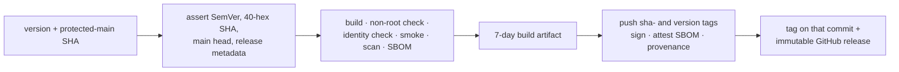

{}

- **You will:** Follow one commit from version metadata through a preflighted image to a signed, attested, immutable release.
- **You need:** A clone and the maintainer tools; you will not tag or publish this repository.
- **Time:** about 14 minutes, reference. {}

## What a release binds: one revision, its artifacts, its records

A **release** binds one immutable source revision, every artifact built from that revision, and the records tying them together. Here that means a `v`-prefixed Git tag on a specific commit, version metadata and a changelog entry that agree with it, a GitHub release carrying those records, and an image addressed by digest with an **SBOM** listing its contents, a **keyless signature** naming the workflow that built it without any long-lived key, and a **provenance attestation** recording how it was built.

Without that binding, a version names a moment rather than a set of bytes: a Git tag can be deleted and repointed at another commit. A user reporting that `v1.2.0` hangs on startup may have run an image rebuilt from a branch that briefly carried the tag; the tag will not reproduce it.

Four mechanisms hold the binding: the metadata agreement, the dispatch, the two-job split, and the pins that move as one set. Start with the agreement, which needs nothing tagged or published:

```bash
mise run check:release-metadata
```

```text
release metadata: v0.10.0 (2026-09-11) is consistent
```

`VERSION` is the language-neutral authority; `CITATION.cff` and the newest dated `CHANGELOG.md` section must match it. Versions follow [Semantic Versioning](https://semver.org/) for supported software contracts: MAJOR for incompatible changes after 1.0, MINOR for backward-compatible capabilities and for deliberate pre-1.0 breaks with migration notes, PATCH for compatible fixes and clarifications.

`CHANGELOG.md` follows Keep a Changelog: user-visible changes accumulate under `Unreleased`, and a release moves reviewed entries under one dated heading. Nothing derives those entries from commit subjects, because a commit subject describes a diff and a changelog entry describes a consequence.

**Three files that drift apart in most repositories just agreed, on your clone.**

A version cannot freeze an external model service; it names the reviewed bytes and the contracts they implement, nothing more.

## Why the dispatch takes a SHA and starts with no permissions

The release workflow's authority is settled above its first job:



Two required string inputs and nothing else: the `v`-prefixed version already recorded in the metadata you just checked, and the full commit SHA to build. There is no tag input, because that label moves. The `permissions: {}` line is the other half: the workflow starts with no token authority, and each job requests only the scopes it needs.

The build job's first step enforces the rest by hand: the SHA must be forty hex characters, refusing a tag name and an abbreviated SHA; the version must match a strict SemVer pattern, refusing `latest`, a branch name, and a pre-release suffix; the dispatch must come from `main`, and `main`'s current head must be the SHA requested. So a release can only name the protected bytes, never a side branch that happened to be checked out.

## Your turn: ask the checker for a version the source lacks

Predict before you run it. The checker reads `VERSION`, `CITATION.cff`, and `CHANGELOG.md`; hand it a tag none of them mention, and does it warn, invent the tag, or refuse?

- **Mode**: `inspect` — nothing is written, so nothing needs reverting.
- **Goal**: watch the release workflow's own check refuse a version the source does not carry.
- **Files to touch**: none; those three files stay exactly as they are.
- **Preflight**: `mise run check:release-metadata` prints the consistent line above and exits 0.
- **Steps**: run `tools/bin/conventions release-metadata v9.9.9` from the repository root, then run it again with the version the previous command reported.
- **Gate that proves completion**: the first run exits non-zero with `release metadata: tag v9.9.9 does not match source version` followed by the version your clone's `VERSION` holds — naming both the tag you asked for and the version the source actually carries — and the second run, given that version, prints the consistent line and exits 0. The gate names no version on purpose: one pinned to a literal string would fail on the next release, and what you are proving is that the checker reads the source, not that the source still says what it said the day this page was written.
- **Final state**: no files changed; `git status --short` is unchanged from before you started.

That is the same command the build job runs against the dispatched commit, so a wrong version fails before an image is built, let alone pushed.

## What the build job proves and the publish job signs

`build` holds `contents: read` and no registry authority. It re-runs the metadata check at the requested revision, resolves a source-identity tree digest — a deterministic hash of the committed tree — and builds the image with that identity compiled in.

The rest of the job tries to disprove that image. It asserts the image runs as a non-root user; it runs the binary's `version` subcommand and compares the reported revision, tree digest, version, build timestamp, and `dirty == false` against the inputs, proving the shipped binary came from the dispatched commit; and it runs a `config:check` smoke inside a read-only root with tmpfs mounts, without a shell, because the image is **distroless**: no shell, no package manager. Finally it scans the image and generates an SPDX SBOM.

The handoff between jobs is a build artifact retained for **7 days**, deliberately not the archive: Actions artifacts expire; the durable copies hang off the release and the digest.

`publish` runs in a protected `release` environment with narrow write scopes. It loads the tar the build job produced rather than rebuilding, so the pushed bytes are the smoked bytes, and tags that one manifest twice: `sha-<commit>` as the permanent source address and the version as the human one. It then signs the digest keylessly with **cosign**, the Sigstore CLI that certifies a digest against the workflow's own identity, attaches the SBOM as an attestation, creates signed SLSA build provenance pushed to the registry, and only then creates the tag and the release. The notes are that version's curated changelog section, verbatim; `--target` pins the tag to the qualified commit so it cannot name other bytes.

Anyone can re-derive that chain from the registry and the public transparency log. `cosign` is not pinned here; the workflow installs it and a consumer installs their own:

```bash
cosign verify \
  --certificate-identity "https://github.com/MLOps-Courses/agentops-open-course/.github/workflows/release.yml@refs/heads/main" \
  --certificate-oidc-issuer "https://token.actions.githubusercontent.com" \
  ghcr.io/mlops-courses/agentops-open-course/agent:v0.9.1
```

```text
Verification for ghcr.io/mlops-courses/agentops-open-course/agent:v0.9.1 --
The following checks were performed on each of these signatures:
  - The cosign claims were validated
  - Existence of the claims in the transparency log was verified offline
  - The code-signing certificate was verified using trusted certificate authority certificates
```

Both flags carry the security meaning — cosign refuses to run without an identity, and widening either to a loose pattern is how a verification stops proving anything. The identity is the workflow file and the ref it ran from; the issuer is GitHub's OIDC provider. Trimmed below the summary is a JSON array — one entry each for the signature, the SPDX attestation, and the SLSA provenance on that digest. It proves that nobody swapped the image after that workflow signed it, not that the code is correct, the scan clean, or the SBOM complete.



**Diagram in words:** A dispatch supplies a version and a protected-main commit SHA. The build job asserts both plus the release metadata, then builds, checks, smokes, scans, and SBOMs the image without registry authority, passing a short-lived artifact forward. The protected publish job pushes both tags for one manifest, signs and attests it, and creates the tag and the immutable GitHub release last.

Publication belongs to an authorized maintainer; merging to `main` publishes nothing. The maintainer reads the SemVer change off the diff of stable contracts, updates `VERSION`, citation metadata, changelog, and affected locks, and runs the local checks the change requires. Then the reviewed merge, the wait for the hosted workflows on that exact SHA, and only then the Release dispatch with the same SHA — the one link here that no check enforces, since the build job verifies the version and the commit but not whether CI passed on them.

A behavior change carries one more requirement: a model-backed evaluation run whose `results.json` names the candidate commit and the evalset digest, clears the minimum pass rate the command asked for, and passes every required case — with a current judge-calibration artifact beside it, reporting how often the judge matched a human label rather than granting a pass.

## Why some upstream pins must be upgraded as one set

Some upstream contracts have more than one owner in this tree. Upgrading them file by file therefore produces a build that compiles and a runtime that lies. The Go toolchain must agree across mise, all Go modules, and the agent Docker build stage. Where one module decides another module's version, a `// compatibility hold:` comment records that constraint in the manifest rather than in someone's memory:

```bash
rg -o --glob '**/go.mod' 'owner=\S+ constraint=\S+' | sort -u
```

```text
tools/go.mod:owner=chromedp@v0.16.0 constraint=dc233986426f
```

One held dependency across the four Go modules: `cdproto` stays at the revision `chromedp` v0.16.0 was built against, and the rest of that comment names the validator — a real Chrome accessibility run — that must pass before a newer revision is safe. `agents/go/go.mod` held four more until ADK Go v2.3.0 shipped the OpenTelemetry family its own logs had been holding back. A hold that ends is what a hold is for; a transitive version is not supported merely because the module graph resolves it.

The same rule applies elsewhere. The gateway's tool pin, container digest, profiles, routes, and smoke tests move as one unit; kagent chart pins move with their `v1alpha2` resources; the Tempo, Loki, Collector, Prometheus, Alertmanager, and Grafana images must not drift apart between host and cluster; Hugo moves with the Hextra module, the strict site build, and the rendered accessibility checks. `SUPPORT.md` records each current ceiling and its validator.

Dependabot proposes updates for the ecosystems it can observe directly — GitHub Actions, Go modules, and Dockerfile bases — and cannot see a mise tool pin, a Helm chart, or an embedded image digest. Treat a proposal as a suggestion: refresh one family's lock, read the diff, run that module's tasks, then the root `format`, `check`, `test`, and `scan` after each coherent group. Batching families hides which one broke the suite, and the revert discards the upgrades that were fine. Rollback means reverting the group, restoring its locks, and re-running the same commands; a deployed image rolls back to a previously verified digest.

## Why evaluation is not a gate here, and what teams do instead

Everything above gates. `mise run eval` does not, and that asymmetry is a decision worth reading, because the industry pattern is the opposite one.

The pattern teams adopt is an **evaluation gate**: a CI job that runs an evalset against every pull request and fails the build below a threshold, the same way a coverage floor does. It is popular for a good reason — a model-backed system regresses through prose rather than through a compiler error, so the only thing standing between a reworded instruction and a worse agent is a scored run.

Three properties of a model-backed run make it a poor fit for the gate this repository can offer. It is **slow**: forty-eight samples on a CPU host is hours, and a check that a contributor cannot run is a check they route around. It is **stochastic**: a threshold tight enough to catch a regression is loose enough to fail an innocent pull request, and the first flaky failure teaches everyone to re-run rather than to read. And it **needs a model**, which turns the offline gate this course keeps free of accounts into one that needs an endpoint, a credential, and a bill.

So the counterpart is split in two. What runs on every change is `mise run eval:offline`, which proves the harness, the transports, and the scorers against a scripted fixture with no model at all — fast, deterministic, and free. What produces the judgment is a **workflow-dispatch evidence run at a frozen SHA**: a human asks for it against one exact revision, reads the artifact, and decides. The gate answers "is the machinery sound?"; the dispatched run answers "is this candidate good?", and only the second question needs a model to have an opinion. Map that onto your own repository, and never let a merge wait on the scored run unless your traffic makes its threshold mean something.

## What you can do now

- You can check that `VERSION`, `CITATION.cff`, and the newest dated changelog entry agree, creating nothing.
- You can predict how `conventions release-metadata v9.9.9` fails: it names the tag asked and the `VERSION` held.
- You can explain why the workflow accepts a commit SHA and refuses a tag, and why it starts with no permissions.
- You can name what a released **OCI image** carries — a digest, a scan, an SBOM, a keyless signature, and provenance — and verify one against the identity that signed it.

A version is traceable from `VERSION` to a signed digest, and you can say at which step the tag stops being able to move.

Return to [8. Community](), or to [8.7. Capstone]() if you still owe this chapter its one required page.
