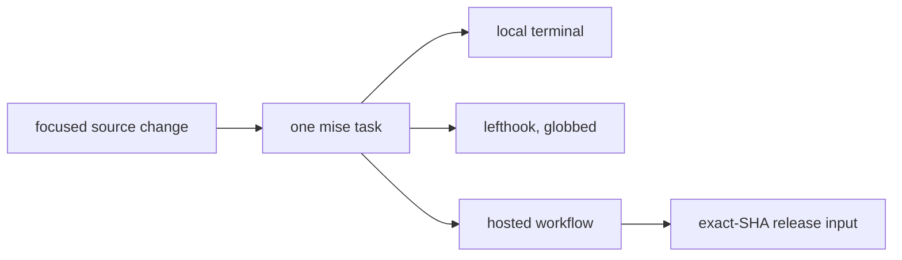

{}

- **You will:** Run the same task a hook and a hosted workflow run, break one assertion, and watch both runs report it identically.
- **You need:** A clean clone with the contributor tools installed.
- **Time:** about 15 minutes, hands-on. {}

## How one task definition backs hooks, local runs, and CI

This repository keeps **one definition of every check**, and every caller invokes it. `mise.toml` owns the root aggregates, each Go module owns its focused tasks, and the git hooks and GitHub workflows delegate to that vocabulary instead of restating it.

Without it, "tests pass" names three different amounts of assurance: a hook that checked only the staged files, a full local run over three Go modules on one machine, or a hosted run of the same commands on a clean runner with no local cache. Accepting the weakest of the three is how a repository acquires a green history and a broken `main`. One definition does not make them equivalent; it makes them differ in scope and environment, never in logic.

This page runs the full test surface, breaks one assertion so the focused task and the root aggregate report the same failure, and states what no local run touches. All three modules answer through one root task:

```bash
mise run test
```

```text
[test:tools] DONE 392 tests in 21.897s
[test:go] DONE 1828 tests, 1 skipped in 18.886s
[test:go] agents/go meets the 80% per-package coverage floor
[test:evals] DONE 425 tests in 16.064s
[test:evals] evals meets the 80% per-package coverage floor
```

That is the module summary lines, trimmed of each package's individual result. Two modules enforce an 80% per-package line-coverage floor. `tools` deliberately sits outside it, because repository tooling that mostly shells out to other programs would be measuring its own harness. The floor is per package rather than per module on purpose: a module total lets a large well-tested package pay for a small untested one, which is exactly the package you care about.

**lefthook**, the git-hook runner this clone configures, calls those same tasks behind narrower globs, on one rule: a check runs only when a file it owns is staged. Pre-commit formats staged Markdown, configuration, and Go, runs whichever checks matched — `check:go` for `agents/go/**`, `check:docs` for content and layout changes, `check:data` for the seed, `check:links` for Markdown — and finishes with a staged secret scan. That rule keeps a commit fast and gives up cross-boundary coverage: staging Go never triggers `check:docs`, so a break outside the globs that matched waits for pre-push. Pre-push drops the globs entirely: `check:core` and then `test`, so nothing reaches a remote unchecked.

## What the complete local run covers, and where it stops

```bash
mise run install:maintainer
mise run format
mise run check
mise run test
mise run scan
mise run build:docs
```

Those six commands compile and test the Go agent, the standalone evaluation harness, and the repository tools. They validate course structure, links, includes, accessibility contracts, security, licences, and infrastructure renders, then build the strict Hugo site. Scanner databases and dependency resolution may reach the network. Nothing else does.

What the run cannot tell you matters as much: no live model answered a question, no cluster scheduled a Pod, no cloud project was touched, and nothing was published.

**When these six pass, a reviewer can reproduce every deterministic claim in your change from one source revision.**

A green run is a claim about deterministic source behavior on one machine; [0.2. Evidence]() keeps that separation honest for the rest of the course.

## Your turn: break one assertion and watch the same failure twice

Predict before you edit: you are about to make one test expect the wrong string. Will the focused package run and the root aggregate report two different failures, or the same one twice?

- **Mode**: `temporary experiment`.
- **Goal**: watch one broken assertion produce the same failure through the focused module task and through the root aggregate that lefthook and CI both call.
- **Files to touch**: only `agents/go/tools/read_test.go`, restored at the end.
- **Preflight**: `git diff --quiet -- agents/go/tools/read_test.go` must exit 0, and `cd agents/go && go test ./tools` must pass.
- **Steps**: in the `well formed but unknown` case, change the expected `INC-999` inside `want` to `INC-998`, run `cd agents/go && go test ./tools`, then run `mise run test` from the repository root.
- **Gate that proves completion**: the focused run fails on `TestGetIncidentReturnsTheFullRecordOrSaysWhyNot/well_formed_but_unknown`, quoting both the string the tool returned and the one you asked for, and `mise run test` exits non-zero with the same package red — the root task pre-push runs, so a push would stop here too.
- **Final state**: run `git restore -- agents/go/tools/read_test.go`, then confirm `cd agents/go && go test ./tools` is green and `git status --short` reports nothing for that file.

The red looks like this, at whatever line that assertion sits on in your checkout:

```text
--- FAIL: TestGetIncidentReturnsTheFullRecordOrSaysWhyNot (0.04s)
    --- FAIL: TestGetIncidentReturnsTheFullRecordOrSaysWhyNot/well_formed_but_unknown (0.00s)
        read_test.go:208: Error = "No incident found with id \"INC-999\".", want "No incident found with id \"INC-998\"."
FAIL
FAIL	github.com/MLOps-Courses/agentops-open-course/agents/go/tools	0.397s
```

Two lines name the subtest, the file, the value the tool produced, and the value you claimed — not "something is wrong", but a sentence a reviewer can act on.

## What the six hosted workflows add beyond a local run



**Diagram in words:** A source change reaches one mise task definition. The local terminal, the globbed lefthook hooks, and the hosted workflows all invoke that same task rather than their own variant, and a release later consumes successful hosted runs for one exact revision.

Six workflows split the same contracts by responsibility. **CI** starts with `mise run install:validation`, the account-free tier: every dependency the checks need, minus the cloud and release administration tools that `install:maintainer` adds on top. It then runs `mise run doctor` (the learner's toolchain check), format, check, test, `mise run smoke:host` (the account-free host model, MCP, A2A, CORS, and metrics path), `mise run redteam` (offline adversarial guardrail regressions), and `mise run eval:validate`. Separate jobs cover browser accessibility and repeat the critical offline regressions without retries.

**Scan** covers repository and image security reporting and the scheduled freshness review. **Platform** exercises the disposable cluster path on a schedule or on demand. **Eval** runs model-backed behavioral runs by explicit dispatch only. **Portability qualification** and **Release** are dispatch-only too, and Release consumes results rather than re-running a weaker private approximation.

`mise run eval:validate` belongs in CI because it needs no model: it parses and cross-checks every committed evaluation asset against the seed. `mise run eval` and `mise run eval:judge-calibration` stay out of the merge path, because each starts the Go agent and calls a configured model, so both are dispatch-triggered instead. Every other evaluation surface — the A2A transport, the workflow and report evalsets, groundedness, schema checks — is a flag on that same `mise run eval`, documented in `evals/README.md`.

Likewise, k3d creation, host observability, model downloads, and GKE planning run only where they materially exercise the affected surface, and a GKE apply or destroy needs explicit approval because it mutates billable resources.

The coverage floor, by contrast, _does_ block a merge: code added without tests fails `mise run test` instead of quietly nudging an average down. A test that merely executes a function clears the floor and shows nothing, which is the one way to satisfy this requirement while defeating it: assert the value returned or the error text, not that the call happened.

## Take one focused change from edit to pull request

Start from a single observable problem and the smallest owner that can solve it. Read `README.md`, `AGENTS.md`, `CONTRIBUTING.md`, and the relevant support contract, then inspect the current source and tests before editing — never translate an upstream API from memory, because the signature you remember is usually from the release before the version `go.mod` pins. Keep unrelated working-tree changes intact, and keep generated state, model outputs, credentials, absolute workstation paths, and publication changes out of the patch.

A documentation-only fix carries five habits. Preserve the front matter, explicit slug, glance block, and closing checkpoint, and never add a shadowing `url`. Update a named include region when the excerpt moved, rather than retyping source into Markdown. Keep every command executable from the directory the page states, labelling model, cluster, cloud, cost, and destructive steps. Run the formatting, conventions, link, freshness, skills, Hugo, and accessibility checks. Then read the rendered page with keyboard and diagram alternatives in mind; [8.4. Documentation]() owns that loop.

Then write the change up so it can be checked rather than trusted: keep each commit coherent, describe behavior rather than implementation trivia, and use a Conventional Commits subject. A pull request explains What changed, Why the existing behavior was insufficient, How the change preserves contracts, and which exact commands you ran — with local runs separated from the hosted, model-backed, deployed, and published ones that were never executed.

Two routes stay off the public tracker. Vulnerabilities follow the private route in `SECURITY.md`, and conduct matters follow `CODE_OF_CONDUCT.md`; accessibility barriers follow `ACCESSIBILITY.md`, while ordinary reproducible bugs and documentation gaps use the structured issue forms. A public issue is world-readable and indexed within minutes, so exploit details, credentials, personal data, and private infrastructure go through the private route, where a fix can land before the description does.

## What you can do now

- You can say why `agents/go` and `evals` carry the 80% floor, why `tools` does not, and why it is per package.
- You can predict one broken `want` failing the same subtest in the focused run and the root aggregate.
- You can say which checks a hook ran, which ones the complete local run ran, and what neither touched.
- You can name the dispatch-only workflows and explain why model-backed evaluation never blocks a merge.

"Tests pass" now resolves to a named run, a red you can reproduce from one edit, and a pull request a reviewer checks instead of trusts.

Return to [8. Community]() when a reviewer can reproduce both your change and the runs behind it without asking you a question.
