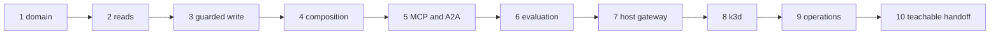

{}

- **You will:** Replace the reference domain one vertical slice at a time, then show the result reproduces from a clean clone.
- **You need:** Chapters 1–7 finished, the deterministic checks green, and one bounded problem you already understand well.
- **Time:** about 60 minutes to design and measure; the build itself is open-ended, hands-on. {}

## What the capstone asks: your domain, the same machinery

The **capstone** replaces the reference agent's seeded incident domain with a bounded problem you already understand. It keeps every mechanism underneath: typed Go seams, a local Qwen3 model through Ollama, MCP reads, A2A serving, guarded writes, OpenTelemetry, private deployment, and black-box evaluation. Build it as **vertical slices** — one capability at a time, each crossing data, trusted types, tools, protocol policy, evaluation, and documentation — rather than as a rename pass.

It exists because every guarantee this course built was demonstrated on a domain chosen for you. A domain the repository has never seen is the only thing that shows those seams are real rather than fitted to one seed.

**Provenance** is the source a returned row names for itself, so an answer built from it can cite a record instead of asserting a fact. The **governed remote reads** are the six reads the MCP server exposes under policy.

One slice for a support-desk pivot uses both:

1. Replace the incident seed rows with sanitized support tickets.
1. Add a typed `get_ticket` read that returns provenance with every row.
1. Publish it through the governed remote reads, or deliberately replace one existing read.
1. Add an eval case whose required trajectory names `get_ticket`.

Write the design brief first — nine answers, one page:

- **User and outcome** — who makes which bounded decision with the result?
- **Deterministic core** — which rules stay typed software rather than model judgment?
- **Data authority** — which input is immutable, mutable, sensitive, or kept from model context?
- **Write authority** — which actions change state, who confirms them, and what audit records it?
- **Model path** — why is the local default enough, and which eval would justify another model?
- **Tool placement** — which reads cross MCP, and which writes stay in-process?
- **Second agent** — does one have a measurable ownership benefit, or is it decoration?
- **Failure policy** — which deadlines, retries, budgets, breakers, and fail-closed cases apply?
- **How you will know** — which test, eval score, trace, metric, and audit row backs each claim?

## Record the baseline runs before you change the domain

The number you cannot recover later is the one you never wrote down, so record the baseline first:

```bash
mise run install
mise run doctor
mise run format:core
mise run check:core
mise run test
git status --short
```

Before that last `mise run test` finishes, predict which package is the weakest tested. The per-package lines answer that after the suite:

```text
[test:go] DONE 1828 tests, 1 skipped in 1.843s
[test:go]   ok      84.2%  agents/go/a2aserver
[test:go]   ok      91.7%  agents/go/compose
[test:go]   ok      82.7%  agents/go/data
[test:go]   ok      99.4%  agents/go/domain
[test:go]   ok      87.7%  agents/go/memory
[test:go]   ok      90.9%  agents/go/policy
[test:go]   ok      82.7%  agents/go/state
[test:go]   ok      98.5%  agents/go/tools
[test:go] agents/go meets the 80% per-package coverage floor
```

Those are the `agents/go` lines, trimmed to eight of the twenty-two packages the task reports, with the `evals` and `tools` sections cut; the floor line is the last thing that module prints. The thin ones are the storage layers, both still above the floor. Copy the table into your brief: the percentages go stale the moment you edit.

Then take one model-backed reading, which is a different kind of claim:

```bash
mise run doctor:model
cd agents/go
mise run build
mise run web
```

Ask one read-only question at `http://localhost:8002`, record the source revision, model identity, tool trajectory, and answer, then stop the process. Keep it beside the deterministic results, never mixed in; [0.2. Evidence]() owns that distinction.

**That dated pair is the only thing that can tell you later whether your pivot improved the system or quietly broke it.**

## Where the domain lives, and how far its identifiers leak

The seam that makes the swap possible is source-owned rather than aspirational. `agents/go/domain/vocabulary.go` exposes `Reference()`, returning one `Vocabulary` that holds `Incidents`, `Services`, `Runbooks`, and `DependencyEdges`. Every other package reads a service name or incident id from that value rather than spelling it as a literal. Beside it, `domain/pivot_test.go` supplies a second, unrelated vocabulary — different identifiers, different services, same shape — so any property holding for both does not depend on the seed. In your own design, name the two sides `Reference` and `Pivot` and keep the pairing visible.

A test enforces that seam. It parses every Go file, counts the seed identifiers in string literals, and fails the file that exceeds its declared budget:

```bash
cd agents/go
go test ./domain -run 'TestEveryDomainIsWellFormed|TestPivotIsReachableThroughOneAdapterSurface|TestDomainLiteralsCannotSpreadOutsideTheRatchetedContract' -v -count=1
```

```text
--- PASS: TestEveryDomainIsWellFormed (0.00s)
    --- PASS: TestEveryDomainIsWellFormed/reference (0.00s)
    --- PASS: TestEveryDomainIsWellFormed/pivot (0.00s)
--- PASS: TestPivotIsReachableThroughOneAdapterSurface (0.00s)
--- PASS: TestDomainLiteralsCannotSpreadOutsideTheRatchetedContract (0.23s)
PASS
ok  	github.com/MLOps-Courses/agentops-open-course/agents/go/domain	0.234s
```

Those three tests run in parallel, so the fifteen interleaved `=== RUN`, `=== PAUSE`, and `=== CONT` lines are cut above and your result order will differ. The `reference` and `pivot` subtests are the same assertions applied to two unrelated domains. If your replacement vocabulary passes both, the adapter can reach it. A dataset-rewrite helper maps reference rows onto your own vocabulary; `AdaptDataset` is a reasonable name for it. Keep it in migration or test tooling, never on the request path, so no live request can rewrite the domain underneath itself.

Tests are the other half, coupled on purpose. Ask the repository how far:

```bash
cd agents/go
rg -l -e 'INC-[0-9]' -e '\b(checkout|payments|inventory|api-gateway|search)\b' --glob '*_test.go'
```

```text
a2aserver/protocol_test.go
data/read_test.go
data/write_test.go
domain/pivot_test.go
memory/retrieval_test.go
policy/pii_test.go
tools/action_test.go
tools/read_test.go
```

Twenty-seven test files match; the eight above are the ones worth reading first, and `rg` prints them in whatever order its workers finish, so yours will differ. Every hit is one of two things, and telling them apart is the actual work: a **fixture**, where the identifier is scenery, or a **contract**, where it is the point — a redaction test that must see a real service name, a trajectory assertion naming the tool it expects. Fixtures get replaced; contracts get rewritten to make the same promise about your domain. Neither gets deleted to make a suite go green.

Port into the existing owners rather than inventing a utilities layer:

| Layer                     | Typical owners                                                 |
| ------------------------- | -------------------------------------------------------------- |
| immutable domain input    | `agents/data/sql`, `runbooks`, `logs`, runtime `skills`        |
| trusted types and storage | `agents/go/domain`, `agents/go/data`, `agents/go/state`        |
| reads and retrieval       | `agents/go/tools`, `agents/go/memory`, `compose`               |
| confirmed writes          | `agents/go/tools`, `agents/go/policy`, audit schema, tests     |
| composition and model     | `agents/go/compose`, `agents/go/model`, `agents/go/config`     |
| protocol surfaces         | `agents/go/mcpserver`, `agents/go/a2aserver`, gateway profiles |
| behavior checks           | package tests, `evals`, `load`                                 |
| delivery and telemetry    | `infra/k8s`, `infra/kagent`, `infra/observability`             |
| learner/operator contract | `README.md`, `AGENTS.md`, `SUPPORT.md`, `content` pages        |

`agents/data` is immutable seed, not runtime state: `sql/schema.sql` owns tables and audit triggers, `sql/seed.sql` owns deterministic rows, and `incidents.db` is rebuilt from both, with runbooks, logs, and skills agreeing with those rows. Running processes copy the seed into their state directory and never write the committed database. One command rebuilds it from the SQL and compares byte for byte, which catches a stale `incidents.db` and nothing else:

```bash
mise run check:data
```

Your derivative may replace every table and identifier, but it must keep that deterministic rebuild, the typed validation, the schema-version handling, and the seed/state split. Port in dependency order: seed and runbooks, then domain types and storage, then read and write tools with their failure and idempotency tests, then composition and protocol fixtures, then the three evalsets. Re-run the package race tests after every slice.

## Your turn: rename one incident id and map which layers fail

Do this before milestone one: the map it produces sizes every slice that follows. Predict first and write the number down: change one incident id in the seed, rebuild, run the suite — how many packages go red?

- **Mode**: `temporary experiment`.
- **Goal**: turn "the domain is coupled to the code" into a map of which layers notice a single identifier, and confirm the tree comes back clean.
- **Files to touch**: only `agents/data/sql/seed.sql` and `agents/data/incidents.db`, both restored at the end. No Go file changes.
- **Preflight**: `git diff --quiet -- agents/data/sql/seed.sql agents/data/incidents.db` must exit 0, and `mise run check:data` must pass before you break anything.
- **Steps**: rename one incident id throughout `agents/data/sql/seed.sql`, rebuild with `cd agents/data && mise run build`, then run `cd agents/go && go test ./...` and record each failure with its layer — data, tool, retrieval, policy, protocol, or evaluation. Run `mise run check:data` again afterwards and notice what it says.
- **Gate that proves completion**: the rebuild succeeds, at least one Go package fails naming the renamed identifier, `mise run check:data` stays green because you rebuilt the database from the seed you edited, and everything is green again after the restore below.
- **Final state**: run `git restore -- agents/data/sql/seed.sql agents/data/incidents.db`, rebuild with `cd agents/data && mise run build`, and confirm `git status --short` shows no residue from the drill.

The Go suite answered the coupling question; that green `check:data` only ever proved the database matches the seed. What you end up with is a coupling map, not a target of zero literals — tests that never mention a domain value never asserted anything about one.

## Ten capstone milestones, each with the run that proves it

They come in three tiers, and **Bronze is a finished capstone rather than a partial one**: milestones 1 to 4 are the complete vertical slice. **Silver** adds 5 and 6, which put the agent on open protocols and prove its behavior. **Gold** adds 7 to 10, which govern, deploy, operate, and hand it off. Stop at the tier you have time for and claim it by name; a Bronze derivative that works beats a Gold one that is half-wired.

Deliver in this order; each milestone earns exactly what it claims and no more:

1. **Bound the domain.** Replacement seed, types, validators, tests, and eval assets agree.
1. **Implement provenance-backed reads.** One typed read returns provenance and rejects invalid identifiers.
1. **Implement one guarded write.** Unconfirmed calls fail; confirmed state and audit commit atomically; replay is idempotent.
1. **Compose the agent.** Local Ollama answers the domain question through a bounded trajectory.
1. **Expose open interfaces.** MCP lists only the intended reads; the A2A card advertises the private service.
1. **Prove behavior.** Deterministic scorers and adversarial cases pass against a recorded model.
1. **Govern the host path.** The loopback gateway smoke passes MCP, A2A, Responses, metrics, PII policy.
1. **Deliver on k3d.** Workloads become Ready, persist state, and expose no public application service.
1. **Close operations.** One request produces a correlated trace, a metric, a sanitized eval verdict, and an audit row.
1. **Make it teachable.** A clean-clone reviewer installs, succeeds, diagnoses, and cleans up unaided.



**Diagram in words:** The capstone runs from domain and typed reads through one guarded write and composition, then protocols and evaluation, then host governance, local Kubernetes, operations telemetry, and finally a clean-clone handoff.

Each layer has one owning run, and re-running the deterministic checks after every milestone keeps the later readings meaningful:

| Layer              | Minimum backing run                                                       |
| ------------------ | ------------------------------------------------------------------------- |
| deterministic repo | root `format`, `check`, `test`, `scan`, and the strict docs build         |
| Go agent           | module check plus `gotestsum --format testname -- -race ./...`            |
| eval assets        | `cd evals && mise run eval:validate`                                      |
| model behavior     | an eval artifact bound to source, model, evalset, and transport           |
| host data plane    | `mise run doctor:gateway` and `mise run smoke:host`                       |
| Kubernetes         | both renders plus disposable deployment, readiness, state, network checks |
| observability      | one correlated trace/log path and metrics someone would alert on          |
| optional cloud     | a reviewed `tofu plan`; apply and destroy only with explicit approval     |

A screenshot can support a claim. It cannot replace a command, a test, a trace, or a digest.

Four contracts are worth carrying through unchanged, because each is a promise most agent projects cannot make:

- The account-free Qwen3 and Ollama path, with loopback or private exposure by default.
- Immutable seed against writable state, and confirmed, validated, atomic, audited writes with a kill switch.
- Six governed remote reads, or a reviewed replacement surface, with content capture off and in-process redaction always on.
- A standalone eval module that cannot import the agent, and offline checks needing no model, cluster, or cloud.

Move one only when the user outcome forces it, and write down the incompatibility, migration, rollback, new tests, and learner impact. Renaming a protocol or task contract to look new is not such a reason.

Your handoff is one document that fits on a page:

- The user outcome and non-goals, plus the starting and final revisions.
- The check results, the coverage floor they cleared, and the percentages marked as a dated reading.
- One sanitized evaluation result naming model, source, evalset digest, minimum pass rate, and required cases.
- One trace identifier, one metric query, and one audit identity, carrying no prompt or response content.
- Gateway policies, the image digest, Kubernetes readiness and private-service checks, how you cleaned up, and every known failure, residual risk, and missing production control.

It will be forwarded into a ticket, a chat channel, and someone's inbox, which is why `.env`, credentials, raw prompts and answers, tool bodies, private logs, runtime databases, and key material stay out of it.

## Generate an evidence manifest a reviewer can verify

Once the tracked work is committed and the tree is clean, make the offline half checkable by others with one command:

```bash
mise run course:evidence
```

```text
course evidence: wrote .agents/tmp/course-completion.json
course evidence: wrote .agents/tmp/course-completion.md
```

The JSON is the machine artifact; the Markdown is the twin you paste into a pull request. Both land in gitignored `.agents/tmp/`, so `git status` stays empty afterwards — confirm with `git check-ignore -v .agents/tmp/course-completion.json`.

The tool reruns the deterministic learner checks and records the exact Git revision plus SHA-256 digests of every artifact listed in `tools/internal/courseevidence/artifacts.txt`. That inventory is a committed file rather than a compiled list, so changing what a manifest covers is a reviewable diff. It records no environment values, command output, model content, credentials, or runtime state.

A reviewer at that revision runs the second half; it needs no argument, though passing a path checks someone else's manifest instead:

```bash
mise run course:evidence:verify
```

It rejects a changed revision, a dirty tree, a changed digest, or a changed inventory, then prints `course evidence: verified <revision>`. That covers local reproducibility — not identity, hosted CI, model behavior, or publication.

## Render the manifest into a certificate you can share

A manifest is what a reviewer verifies; it is not what you put in a profile or a README. The last step draws the same facts once, as a single SVG:

```bash
mise run course:certificate --name "Ada Lovelace" --tier gold
```

```text
course certificate: wrote .agents/tmp/course-completion-certificate.svg
course certificate: manifest sha256 2dc5930f673d45487911a2b743b8f94c3afdd62ed2860607a8d699e3c945b008
```

That run rendered the committed fixture at `tools/internal/coursecertificate/testdata/manifest.json`, so `sha256sum` over it reproduces that digest; your own run prints your own manifest's. The file embeds no font, script, or image, and takes its date from the manifest rather than from the clock, so it renders with the network off and reproduces byte for byte.

The certificate states what nobody checked, because that is the part a reader cannot see: nobody issued, graded, or signed it, the gates ran on your machine, and the tier is your claim against the milestones above rather than a measurement. Beside that it prints what a stranger can still check — the manifest digest, and the verify command that re-runs those gates at that revision.

## How the capstone is assessed, before you start

Score bounded outcomes and what backs them, never tool count. Clearing the 80% floor is the entry price; credit goes to tests that would fail if the behavior regressed. The nine criteria sum to 100.

| Criterion                    | Points | What backs it                                               |
| ---------------------------- | ------ | ----------------------------------------------------------- |
| Problem and architecture     | 10     | A bounded outcome, stated non-goals, simple ownership.      |
| Account-free path            | 10     | The required path with no account and no usage fee.         |
| Data and tools               | 15     | Types, provenance, least privilege, the seed/state split.   |
| Authority and privacy        | 15     | A confirmed atomic write, audit, redaction, secret hygiene. |
| Deterministic quality        | 15     | Race tests, adversarial regressions, honest coverage.       |
| Evaluation                   | 10     | Trajectories, grounding, schema and cost checks, lineage.   |
| Gateway and interoperability | 10     | MCP, A2A, Responses, fail-closed policy.                    |
| Platform and operations      | 10     | Reproducible private k3d delivery and telemetry.            |
| Documentation and cleanup    | 5      | A clean-clone path, diagnosis, limits, teardown.            |

{}

Shut the host services down with `mise run gateway:host:stop`, `mise run observability:down`, and `cd agents/go && mise run data:reset`. For the cluster, confirm the context first — `test "$(kubectl config current-context)" = k3d-local` — then `cd infra` and `skaffold delete --filename skaffold.yaml --profile local`.

Everything there is disposable and yours. Shared clusters, cloud resources, and retained artifacts are not, so check who owns one before deleting it — whoever created it may be mid-run. The optional GCP plan creates nothing; an approved apply needs a reviewed destroy and a cost record. {}

Milestone ten is the one check you cannot run yourself. Hand a clean authorized clone to another person, give them only the documented commands, and watch where they stall.

## What you can do now

- You can record a dated baseline — check results, per-package coverage against the 80% floor, and one model-backed reading kept separate from it.
- You can say which layers a renamed incident id breaks, and why `check:data` stays green anyway.
- You can name, for any milestone you claim, the single command, test, trace, or digest that owns it.
- You can hand a reviewer a manifest that `mise run course:evidence:verify` accepts only at the exact clean revision you built.
- You can render that manifest into one offline certificate that names both what a machine checked and what nobody did.

Seven chapters ago an agent was something you ran. It is now something you can bound, ground, govern, deploy, watch, and hand to someone else — on a domain that is yours, with the receipts to show for it.

Then tell someone. Open a showcase issue with the tier you reached, what your agent does and for whom, and the manifest revision behind it; attach the certificate if you want the same facts in one picture. Reading what other people bounded shows what a second domain looks like.

The course path ends here. The optional appendix at [8. Community]() is waiting whenever you decide to publish, license, release, or maintain what you just built.
