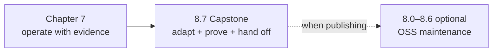

{}

- **You will:** Go straight to the capstone, and learn which appendix page to open only if you later publish what you built.
- **You need:** Chapters 1–7 finished with the deterministic checks — `mise run check:core` and `mise run test` — green.
- **Time:** about 5 minutes, orientation. {}

## The capstone is the only required page in this chapter

The **capstone** replaces the reference agent's seeded incident domain with a bounded problem of your own, one vertical slice at a time. Chapters 1–7 built the guarantees it exercises — typed seams, guarded writes, evaluation, private deployment, traces, metrics, and an audit trail — all on a domain you did not choose. Keeping them true on a problem you chose is the exercise this chapter requires.

The chapter has three parts. The capstone builds your **derivative**: the copy of this reference you adapt and keep. Pages 8.0 through 8.6 are an optional appendix on publishing and maintaining an open-source project. [8.8. From Python]() _(reference)_ is a lookup that needs no earlier chapter: every concept you brought from LangGraph or the Python course gets an address in this repository. Open it the first time a Go construct looks unfamiliar.

A domain swap is not a seed-file edit. The evaluation assets, the Go suite, the runbooks, the logs, and the gateway policies all encode the seeded incidents and services, so each one moves when the domain does. The evaluation assets report their own count, so start there:

```bash
cd evals
mise run eval:validate
```

```text
{
  "evalsets": 3,
  "cases": 22,
  "calibration_cases": 12
}
```

Twenty-one behavioral cases and twelve calibration examples currently assert things about incidents, services, and runbooks that stop being true the moment you change the seed. The capstone orders that work into milestones instead of leaving you to discover it mid-swap.

Write two lines down now, somewhere you will still have them next week: the bounded problem your derivative solves, and the one person who acts on its answer. The capstone's design brief starts from those two lines, and every milestone after it narrows them.

Open [8.7. Capstone]() next. It records your baseline, maps how tightly the reference is wired to its own domain, walks ten milestones each carrying the one command or test that backs it, and ends with a manifest a reviewer can verify from a clean clone.

## What the 8.0–8.6 appendix covers, and when to open it

These seven pages are maintenance references for open-source projects. Nothing in the capstone depends on them, and reading them first is the most common way learners stall three pages short of finishing. Open one when a publishing question actually arrives — and only that one.



**Diagram in words:** Chapter 7's operating work feeds directly into the 8.7 capstone, where you adapt the reference, prove it, and hand it off. Only if you then decide to publish does the optional 8.0–8.6 maintenance appendix become relevant, shown as a dashed side path rather than a next step.

| Appendix page                                                                           | Open it when you need to…                                                       |
| --------------------------------------------------------------------------------------- | ------------------------------------------------------------------------------- |
| [8.0. Repository]() _(reference)_      | Find the exact file that owns a claim, a check, or a deployed behavior.         |
| [8.1. License]() _(reference)_            | Reuse or redistribute prose and code with the right grant attached.             |
| [8.2. Releases]() _(reference)_          | Turn one reviewed commit into a signed, attested, immutable release.            |
| [8.3. Templates]() _(concept)_          | Decide between forking once and maintaining a project generator.                |
| [8.4. Documentation]() _(hands-on)_ | Build the docs so prose, quoted source, and rendered routes cannot drift apart. |
| [8.5. Contributions]() _(hands-on)_ | Take a contributed change through the hooks, the complete local run, and CI.    |
| [8.6. AAIF]() _(reference)_                  | Route an upstream failure to the narrow project that owns the broken contract.  |

## What this chapter proved

- You know the required path continues to the capstone and stops there; the appendix is a lookup, not a syllabus.
- You measured how much committed evaluation surface a domain swap moves: twenty-two cases and twelve calibration examples across three evalsets.
- You wrote down the bounded problem and the person who acts on its answer, which is where the capstone brief begins.

Continue to [8.7. Capstone]() as soon as those two lines are written down.
