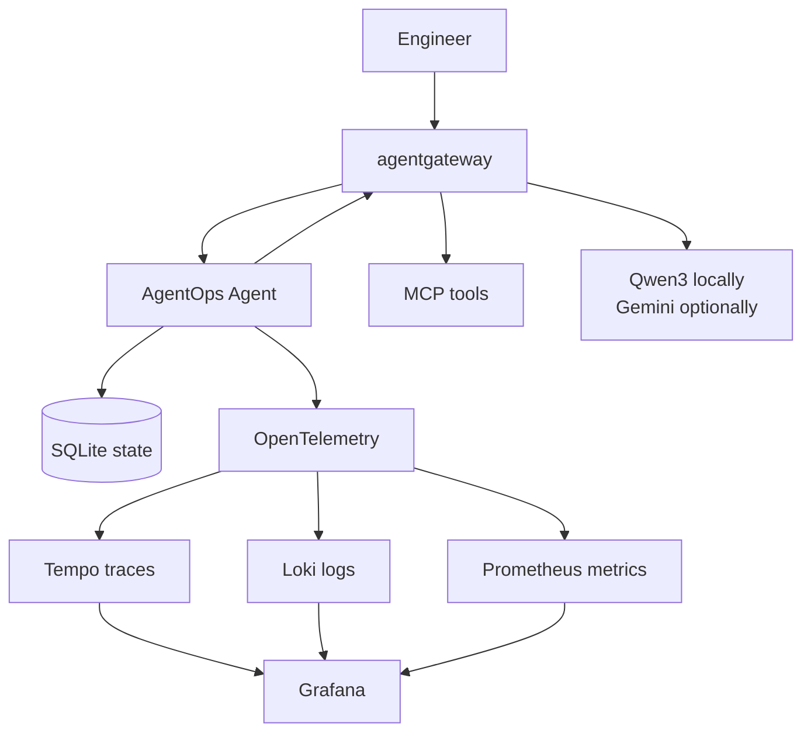
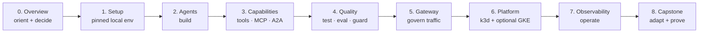

**AgentOps** is the practice of building, evaluating, securing, deploying, and operating AI agents as production software. It exists because a model that can call your functions may take a different route on the same input and change real state: a clean build and a good demo stop proving the system works. This course teaches it through one finished reference, the **AgentOps Agent**, which you inspect and run in every chapter, from its first local model call to an observable Kubernetes workload, before a capstone replaces its domain with your own.

Incident response is the worked example, not the subject. The agent answers questions from a committed incident dataset, and a fixed dataset makes a **grounded** answer — every identifier traceable to a tool result — checkable rather than plausible.

{}

- **You will:** Build, test, secure, deploy, and operate one production-shaped AI agent, then replace its domain with your own.
- **You need:** Linux x86_64 with cgroup v2, Git, and basic Go for the fully supported path. Linux arm64, macOS, and WSL2 are best-effort. No account, API key, or cloud project is required.
- **Time:** about 12 to 19 focused hours to read the course, or about 32 hours to also run every command in it, including the optional ones. {}

## Choose the entry point that matches your experience

- **Want to see it work before you read anything?** Take the six commands below. They end in a real agent turn on your own hardware, in about the time the model takes to download.
- **New to agents or AgentOps?** Begin with [0.0. Course](). Chapter 0 is read-only and helps you decide whether an agent fits your problem.
- **Already building agents in Python?** Start at [8.8. From Python](), which maps every concept you already hold — node, checkpointer, interrupt, retriever, tracing integration — onto the Go file that owns it here.
- **Ready to prepare your machine?** Go to [1.0. System](). Chapter 1 owns installation, local checks, and model setup.
- **Already have the repository and local model ready?** Start the first conversation at [2.1. First Agent]().

The order is deliberate: you make the architecture and provider decisions before downloading tools, prove the code offline before adding a model, then run the agent where the course can explain what happened.

Keep [0.8. Glossary]() open when a term is unfamiliar. Use [0.7. Troubleshooting]() only when a command later fails.

## Six commands reach the first agent turn

You need [mise](https://mise.jdx.dev/), the task runner and tool-version manager that owns every command in this course, and [Ollama](https://ollama.com/download) on a Unix-like shell. You also need a C compiler, because `mise run install` rebuilds the SQLite CLI from a checksum-verified source archive rather than trusting the host's own build: `sudo apt install build-essential` on Debian and Ubuntu, `sudo dnf group install development-tools` on Fedora, `xcode-select --install` on macOS. No account, no API key, no `.env`:

<!-- quickstart: unverified-preview -->

{}

This shortest path omits the five `mise trust` commands, `mise run doctor`, `mise run check:core`, and `mise run test`. Use the guarded sequence in [1.0. System]() when any command fails or before trusting the checkout. {}

```bash
git clone https://github.com/MLOps-Courses/agentops-open-course.git
cd agentops-open-course
mise run install
ollama pull qwen3:4b-instruct
cd agents/go
AGENT_MODEL_TIMEOUT_S=300 mise run web
```

Open `http://localhost:8002`, select `agentops_agent`, and ask `List the open incidents`. Read the Events pane before you read the answer: a `functionCall` row naming `list_incidents(status="open")`, the rows it returned, then a final answer naming exactly **INC-002, INC-005, and INC-010**. Watching the model ask for a tool is the whole point — those incidents live in a seed database on your disk, and no model can have memorised them.

`AGENT_MODEL_TIMEOUT_S=300` is a deadline sized for a CPU. The shipped sixty seconds is this course's most common first failure, and [1.4. Providers]() has you measure your own machine rather than guess. The first turn is the slowest, because the model loads before it answers; [0.7. Troubleshooting]() tells a slow turn from an unreachable one.

[2.1. First Agent]() runs this properly — doctor first, and the difference between an answer that matches and an answer that is grounded spelled out.

## What you will be able to build, prove, and operate

You are not expected to recognize the technologies named below; each belongs to the chapter that introduces it.

- Design an agent only where model autonomy is worth its latency and risk.
- Build typed ADK agents with tools, Agent Skills, MCP, memory, workflows, and A2A.
- Test behavior offline, evaluate model-backed trajectories, redact PII, and require human approval for writes.
- Route model, tool, and agent traffic through agentgateway with one stable application contract.
- Run the same container on local k3d or a small GKE lab managed by kagent.
- Trace, log, and monitor the system with OpenTelemetry into self-hosted Tempo, Loki, and Prometheus, all read through one Grafana.
- Prove the finished result reproduces, and render that proof into a shareable certificate.

## The reference agent you will inspect and extend



**Diagram in words:** An engineer reaches the AgentOps Agent through agentgateway. The gateway brokers the agent's MCP tool and model calls. The agent stores state in SQLite and sends OpenTelemetry to three stores — Tempo for traces, Loki for logs, Prometheus for metrics — which Grafana reads together.

The bundled incident, log, runbook, and skill data is immutable. A runtime copy receives mock state changes and append-only audit records, which keeps each exercise resettable and safe.

You do not reconstruct this system file by file. `main` is the working reference, and each checkpoint asks you to understand, verify, or deliberately change one boundary.

## The chapter order is the AgentOps lifecycle

You build the agent, prove it, govern its traffic, deploy it, operate it, then sustain it. Each stage unlocks a heavier prerequisite tier, so nothing forces a model, gateway, cluster, or cloud on you before the chapter that needs it.



**Diagram in words:** One straight line through nine chapters, each feeding the next: 0. Overview orients and decides, 1. Setup pins a local environment, 2. Agents builds, 3. Capabilities adds tools, MCP, and A2A, 4. Quality tests, evaluates, and guards, 5. Gateway governs traffic, 6. Platform deploys to k3d and optionally GKE, 7. Observability operates it, and 8. Capstone adapts the whole thing to a domain of your own and proves it.

## Each chapter, and the outcome it leaves you with

Read the chapters in order if agent systems are new to you. Or use the outcomes below as a map if you already ship LLM applications.

Coming from LangGraph or another Python agent framework, none of this is conceptually new: you have written nodes, a checkpointer, an interrupt, a retriever, and a tracing integration. What changes is where each of them lives. Go pushes them out of decorators and dictionaries into a struct, a package, or a process boundary you can point at — an inconvenience while you are prototyping, a relief when you are on call. [8.8. From Python]() maps every concept you already hold onto the file that owns it here.

| Chapter                                                          | You will leave with                                                      |
| ---------------------------------------------------------------- | ------------------------------------------------------------------------ |
| [0. Overview]()           | A clear AgentOps lifecycle, architecture, and provider choice.           |
| [1. Setup]()                 | A pinned local workspace and a model-free verification checkpoint.       |
| [2. Agents]()               | A first ADK agent with explicit configuration and session semantics.     |
| [3. Capabilities]()   | Typed tools, least-privilege skills, MCP, retrieval, workflows, and A2A. |
| [4. Quality]()             | Branch-covered tests, evaluations, guardrails, and security regressions. |
| [5. Gateway]()             | Governed MCP, A2A, and model traffic through agentgateway.               |
| [6. Platform]()           | Reproducible k3d and optional GKE deployments with kagent.               |
| [7. Observability]() | Self-hosted tracing, metrics, evaluation, feedback, and audit evidence.  |
| [8. Capstone]()          | An evidence-backed agent platform of your own, plus optional OSS upkeep. |

Every page opens with the same "In one glance" block you just read, ends with a checkpoint you can verify, and contributes its own time to the 32 hours above. Skim that block and skip a page when it is not for you today.

## What "open source" means here

Google ADK, agentgateway, kagent, OpenTelemetry, Tempo, Loki, Prometheus, Alertmanager, Grafana, Ollama, the Apache-2.0 open-weight Qwen3 model, and the course code form the required open-source path. The optional Gemini API, Vertex AI, GKE, and repository/site hosting are proprietary services. They are integrations, not hidden requirements.

## Where to start: 0.0. Course, or your current stage

Start at [0.0. Course](), or at the later stage your setup already matches. Every chapter ends with a checkpoint, and Chapters 5-7 add explicit verification and teardown steps, because those stages leave processes and clusters running once you stop reading. Finish by adapting the reference through [8.7. Capstone]().

The source repository is public at [MLOps-Courses/agentops-open-course](https://github.com/MLOps-Courses/agentops-open-course). To preview documentation changes locally, run `mise run serve` at `http://127.0.0.1:8003`.
