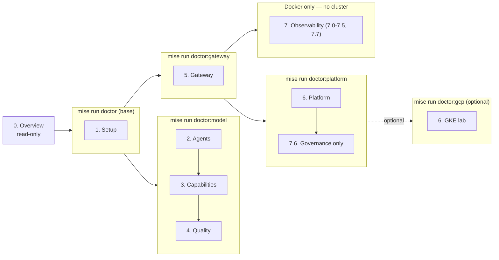

# 0.0. Course

!!! abstract "In one glance"

    - **You will:** Understand the course contract and pick the learning path you will follow.
    - **You need:** Nothing beyond this course page.
    - **Time:** about 20 minutes, orientation.

## What will this course teach you?

This course teaches the engineering discipline around an AI agent, not only the model call. You are not expected to recognize the names in the list below yet: each gets its own chapter, and [0.7. Glossary](./0.7.%20Glossary.md) defines the course's key terms one line at a time.

You will inspect, run, and extend one completed **AgentOps Agent** through the AgentOps lifecycle — the loop from building an agent to observing it in production:

- Design an agentic loop and choose where deterministic code is better.
- Add typed tools, least-privilege Agent Skills, MCP, retrieval, workflows, and A2A.
- Enforce tests, behavioral evaluations, PII redaction, human approval, and append-only auditing.
- Put agentgateway in front of model, tool, and agent traffic.
- Package the application once and run it on local k3d or an optional GKE lab with kagent.
- Export telemetry through OpenTelemetry to self-hosted MLflow, Prometheus, and Grafana.

The result is production-shaped: it uses real boundaries and operational tools, while every action and dataset remains deliberately local and fictional. `main` is the finished reference, not an empty scaffold. The final capstone asks you to preserve its platform contracts while replacing the example domain with your own.

Chapter 0 stays read-only. [1.0. System](../1.%20Setup/1.0.%20System.md) owns cloning the repository and installing its learner toolchain when you are ready.

## Who is this course for?

This course is written for four kinds of reader:

- **Software engineers** who can write Python and want more than a chatbot tutorial.
- **AI and ML engineers** who need repeatable evaluation, security, and delivery practices.
- **Platform and SRE teams** who will operate agent workloads and their data plane.
- **Technical leaders** who need to evaluate where agent autonomy creates value or risk.

You do not need prior ADK, Kubernetes, MCP, A2A, or GCP experience. You should be comfortable with Git, a terminal, and basic Python.

That single sentence is honest for Chapters 2-4 and an understatement for 5-7, so the course states two tiers rather than one:

| Tier                         | What you need to be comfortable with                                                                                       | Where it binds                                                |
| ---------------------------- | -------------------------------------------------------------------------------------------------------------------------- | ------------------------------------------------------------- |
| Chapters 0-4 and 8           | Git, a terminal, basic Python, reading a stack trace                                                                       | Every checkpoint is a `mise run` task and a file you can open |
| Chapters 5-7 and the GKE lab | Reading YAML you did not write, HTTP status codes and headers, and a shell that stays open while a background service runs | Their checkpoints ask for more than running a command         |

Concretely, the second tier's checkpoints ask you to read a `kubectl kustomize` render and say which overlay patched a field, name the NetworkPolicy that denies a call, read a `p(95)` off a Grafana panel, write a Prometheus query, follow a CEL authorization expression, and review a `tofu plan` before approving it. None of that is prerequisite _knowledge_ — every one of those is taught on the page that asks for it — but each is a new notation, and Chapters 5-7 introduce six of them in a row. Budget accordingly, and expect to reread more there than in Chapters 2-4.

## What reference will you use?

The AgentOps Agent helps an on-call engineer investigate incidents for a fictional service. It can inspect an immutable SQLite seed, search logs and Markdown runbooks, load scoped instructions from Agent Skills, and propose or execute mock remediation.

State-changing tools require human approval. A write updates a disposable runtime database and appends an audit record in one transaction. The committed seed is never modified, so `mise run data:reset` (from `agents/python`) always returns the lab to a known state.

## What evidence will each outcome leave?

Each substantive chapter turns an idea into an observable result. The final row packages the deterministic evidence without uploading learner data or trusting a hosted grader.

| Outcome                          | Lesson and learner action                                                                                                      | Observable evidence                                                                                     |
| -------------------------------- | ------------------------------------------------------------------------------------------------------------------------------ | ------------------------------------------------------------------------------------------------------- |
| Prepare a reproducible checkout  | [1.0. System](../1.%20Setup/1.0.%20System.md): install, diagnose, and run the offline gates                                    | `doctor`, `check:core`, and `test` exit zero                                                            |
| Bound an agent's behavior        | [2.3. Instructions](../2.%20Agents/2.3.%20Instructions.md): break one instruction and prove the trajectory contract catches it | The deterministic instruction regression changes red → green; the live comparison is observational only |
| Add a least-privilege capability | [3.1. Tools](../3.%20Capabilities/3.1.%20Tools.md): prototype one local read capability                                        | Focused tests pass and the public six-read MCP surface remains unchanged                                |
| Evaluate a behavioral boundary   | [4.4. Evaluations](../4.%20Quality/4.4.%20Evaluations.md): add one adversarial case and its deterministic validator            | Offline evaluation validation and the focused regression test exit zero                                 |
| Prove gateway policy             | [5.2. MCP Gateway](../5.%20Gateway/5.2.%20MCP%20Gateway.md): compare direct and governed tool discovery                        | The direct surface has six reads and the governed surface exposes only the documented allowlist         |
| Diagnose a platform boundary     | [6.5. Platform Gateway](../6.%20Platform/6.5.%20Platform%20Gateway.md): inspect the deliberately broad ingress fixture         | The infrastructure gate rejects or explains the unsafe boundary without changing the deployed baseline  |
| Turn telemetry into an incident  | [7.7. Incident Response](../7.%20Observability/7.7.%20Incident%20Response.md): follow one alert from signal to runbook         | A query, trace, and runbook point to the same fictional incident                                        |
| Transfer the system              | [8.7. Capstone](../8.%20Community/8.7.%20Capstone.md): adapt the domain through the shipped seam and create local evidence     | A matching clean clone verifies the completion manifest with one command                                |

## Which learning path should you use?

Take the Required OSS path unless you already know you want another one. It runs the model on your own machine through **Ollama**, a local model server.

| Path                  | Requires a model?    | Requires cloud? | Purpose                                                                                                             |
| --------------------- | -------------------- | --------------- | ------------------------------------------------------------------------------------------------------------------- |
| Offline engineering   | No                   | No              | Install, inspect data, run static checks, and execute the deterministic test suite.                                 |
| **Required OSS path** | Qwen3 through Ollama | No              | Complete the agent, gateway, local platform, and observability outcomes account-free. **← take this one if unsure** |
| Optional provider     | Gemini               | Optional        | Compare ADK's native provider adapter after the local path works.                                                   |
| Optional cloud lab    | Gemini on Vertex AI  | Yes             | Practise GKE, Workload Identity Federation, GCS artifacts, and immutable delivery.                                  |

The required path uses the Apache-2.0 open-weight Qwen3 model. It needs no account, no mandatory SaaS, and no usage fee; it does use your machine's compute, storage, and electricity. Chapter 2 connects directly to Ollama. Chapter 5 changes only the OpenAI-compatible base URL to route the same model through agentgateway.

## Which prerequisite tier does each chapter need?

Each chapter admits exactly the tools it needs. A matching **`doctor` profile** — the `mise` task that checks one scoped set of prerequisites — verifies that boundary before you start. Profiles are diagnostics for a path, not one additive ladder; Chapter 5, for example, needs both the model and gateway profiles.

Note where Chapter 7 sits. Seven of its eight pages need only Docker and the host observability stack, so they do not wait on a Kubernetes cluster — only 7.6 Governance does, because its audit drill reads from the deployed platform. Tracing, cost attribution, monitoring, and incident response are the highest-transfer skills here; they should not be gated behind the heaviest chapter.

Chapter 8 starts from the base tier and adds profiles milestone by milestone. The optional GKE lab is the one path that adds `doctor:gcp` on top of the platform tier.

## How long should the course take?

That depends on which course you take. Reading the pages and clearing each chapter's checkpoint is roughly **12 to 19 focused hours**. Running every command on every page is closer to **29 hours** — that is what the per-page **Time** lines add up to, and the right-hand column below.

| Stage                           | Read + checkpoints | Every command on every page |
| ------------------------------- | ------------------ | --------------------------- |
| Overview and setup              | 1-2 hours          | 4.5 hours                   |
| Agent and capabilities          | 4-6 hours          | 5 hours                     |
| Quality and gateway             | 3-4 hours          | 7.5 hours                   |
| Platform and observability      | 3-5 hours          | 9 hours                     |
| Community and capstone planning | 1-2 hours          | 3 hours                     |

Neither column is a target. Take the left one if you want the ideas and the evidence, the right one if you want every boundary in your own hands.

Installation, image pulls, local model speed, and prior Kubernetes experience can change that substantially. A complete capstone implementation is intentionally open-ended and usually adds several focused sessions. The optional GKE lab adds provisioning time and should be completed separately.

## How much does it cost?

The course content and code are free to use under their respective licenses. The offline and local Qwen3 paths have no model API fee, but they use your own compute and electricity.

Gemini and GCP usage can be billed. Check the current [GKE pricing](https://cloud.google.com/kubernetes-engine/pricing) and the OpenTofu plan before creating anything.

[7.3. Costs](../7.%20Observability/7.3.%20Costs.md) exclusively owns the dated GKE estimate, its calculation, and the inputs to refresh immediately before an approved apply.

!!! danger "A lab is not a production topology"

    One Spot node is interruptible and not highly available. The cloud chapter teaches identity, packaging, routing, persistence, and teardown. It does not claim to satisfy a production SLO.

## Is the whole stack open source?

Every required piece is; the optional integrations are not.

The required software stack is open source: Google ADK, agentgateway, kagent, MLflow, OpenTelemetry, Prometheus, Grafana, Ollama, the Apache-2.0 open-weight Qwen3 model, and this repository.

??? note "Deeper: which parts are proprietary, and what 'open-source course' claims"

    Gemini, Vertex AI, GKE, and GitHub hosting are proprietary services. They are optional integrations and are named as such. "Open-source course" means the course implementation is inspectable, modifiable, and self-hostable; it does not relabel a hosted model or cloud as open source.

## How should you work through each page?

Every page is organized around practical questions. Four conventions hold everywhere:

- Run commands from the repository root unless a block says otherwise.
- Critical Python excerpts are included directly from source and checked during the site build.
- Complete each checkpoint before enabling the next prerequisite tier.
- For infrastructure chapters, verify the result and run the scoped teardown when you finish.

## What proves this page worked?

There is nothing to run. Summarize your choices before Setup adds tools.

**You are done when:**

- You can state the course outcome and one case where deterministic software is better than an agent.
- You know the audience, expected time, local resource trade-offs, and optional costs.
- You can name the two prerequisite tiers and one notation Chapters 5-7 expect you to read that Chapters 2-4 never mention.
- You can name which of the four learning paths you are taking, and what it requires.
- You know that [1.0. System](../1.%20Setup/1.0.%20System.md) begins the installation.

Continue to [0.1. Agents](./0.1.%20Agents.md) when you can explain the outcome you want from the course.
