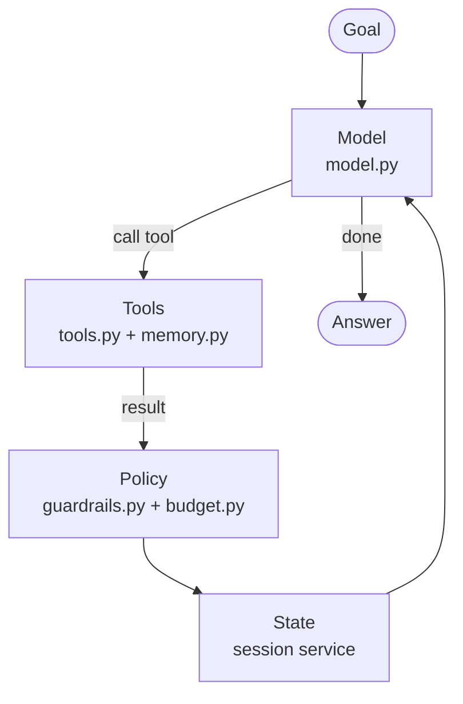
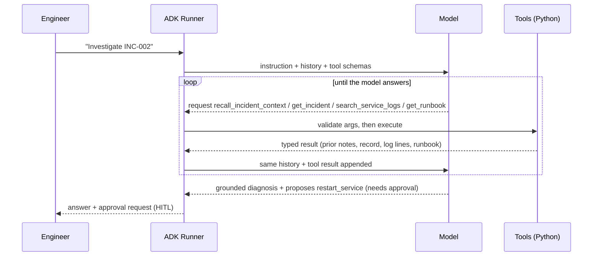
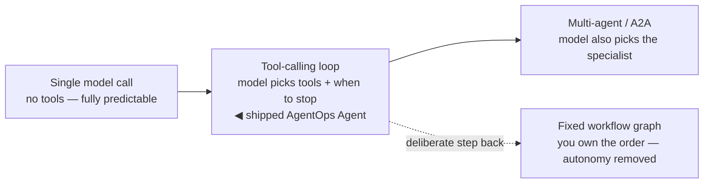

# 0.1. Agents

## What is an AI agent?

An **AI agent** is a program that uses a language model to decide, step by step, how to reach a goal and can take actions through **tools**. Unlike a fixed script, an agent chooses _which_ allowed action to take next from the goal, the conversation so far, its policy, and the results of previous actions.

A useful working definition: an agent is a **model** inside a controlled **loop** that may call tools and read their results until a stop condition is reached. The rest of this page — and most of this course — is about that loop and the machinery that keeps it cheap, safe, and observable.

Make it concrete with the agent you will actually run. The reference **AgentOps Agent** ([2.1. First Agent](../2. Agents/2.1. First Agent.md)) is an on-call assistant for a fictional platform. Its persona and operating rules are not implied by a diagram; they live verbatim in the `INSTRUCTION` string in `agent.py`, kept explicit "so behavior is reproducible and evaluable". Those rules bind the loop to a specific job — ground every claim in a tool, never invent an incident, service, or status — and to a specific toolbox:

1. **Read tools** to observe: `list_incidents`, `get_incident`, `get_service_status`, `search_service_logs`.
1. **Knowledge tools** to retrieve procedure: `get_runbook` (by an incident's exact `runbook` slug) and `search_runbooks` (by symptom).
1. **Memory tools** to carry findings across conversations: `recall_incident_context` at the start of an investigation, `save_incident_note` when something durable is learned ([3.4. Memory](../3. Capabilities/3.4. Memory.md)).
1. **Guarded actions** to change state: `restart_service` and `resolve_incident`, which the instruction requires the agent to _propose_ with evidence and only call after a human approves ([4.5. Guardrails](../4. Quality/4.5. Guardrails.md)).

Given "investigate INC-002", that agent can recall prior notes, look up the incident, read the affected service's logs and its runbook, and propose a guarded fix — each step a real tool call, never a claim it invented. [2.1. First Agent](../2. Agents/2.1. First Agent.md) walks the code that wires those tools onto the agent; this page stays at the level of _why_ the shape looks like this.

## What is the agentic loop?

The agentic loop is the cycle at the heart of every agent. Four ingredients drive it, and in this repository each has one clear owner — the loop is not one big function but four seams you can open independently:

1. **Model** — the LLM that proposes the next response or tool call. Selected by `build_model()` in `model.py`; local Ollama by default ([2.2. Models](../2. Agents/2.2. Models.md)).
1. **Tools** — the typed capabilities the runtime may let the model invoke. `ALL_TOOLS` (reads) in `tools.py`, `KNOWLEDGE_TOOLS` in `memory.py`, plus `MEMORY_TOOLS` and the guarded `ACTION_TOOLS` in their own modules ([3.1. Tools](../3. Capabilities/3.1. Tools.md)).
1. **State** — conversation, retrieved context, and running counters carried between steps. ADK's session service holds it between turns; the standalone server backs that with SQLite under the disposable `.state` directory ([2.4. Sessions](../2. Agents/2.4. Sessions.md)).
1. **Policy** — the validation, redaction, budget, and error handling wrapped around the loop. ADK callbacks from `guardrails.py` plus `enforce_token_budget` from `budget.py`, attached to the agent at the runtime boundary rather than buried in the prompt ([4.5. Guardrails](../4. Quality/4.5. Guardrails.md)).

Each turn, the model reads the current state, decides whether to answer or call a tool, receives the tool result, and loops again until it produces a final answer.

The framework — Google ADK, in this course — owns this loop for you: it manages sessions, serializes your tool signatures into the JSON schema the model reads, runs the tools, and feeds results back.

**A loop needs a brake.** "Until a stop condition is reached" carries a lot of weight in that definition. The ordinary stop is the model emitting a final answer with no further tool call. The dangerous case is a model that keeps calling tools once a turn can fan out across many reads. This repository's real brake is `enforce_token_budget`, a `before_model_callback` that refuses the next model call once a session has spent `AGENT_MAX_TOKENS_PER_SESSION` tokens and returns an actionable message instead of an open-ended bill ([7.3. Costs](../7. Observability/7.3. Costs.md), [4.5. Guardrails](../4. Quality/4.5. Guardrails.md)). Non-determinism makes this ceiling non-negotiable: the same prompt can produce a longer trajectory on the next run, so the guard is a property of the system, not of any one input.

## How does the reference agent run one investigation?

The abstract loop becomes concrete the moment you follow a single turn. Here is "investigate INC-002" driven by the operating rules in `INSTRUCTION` — the model decides each tool call, ADK executes it and returns the result, and the loop repeats until the model has enough to answer:

Two things this makes visible. First, **the model never runs anything** — it only asks for a tool by name, and ADK decides whether to obey, validate, or (for a guarded write) pause for a human approval; [2.2. Models](../2. Agents/2.2. Models.md) covers that mechanism in full. Second, the trajectory is _emergent_, not scripted: the instruction nudges the order — recall first, read logs before recommending, cite the runbook — but nothing forces it. On another run the model might skip `search_service_logs`, or call `search_runbooks` instead of `get_runbook`. That flexibility is the point of an agent, and it is exactly why Chapter 4 judges behavior with evaluations rather than string equality ([4.4. Evaluations](../4. Quality/4.4. Evaluations.md)).

## What are the common agentic patterns?

Agents are built from a small set of reusable patterns. The honest split for this course is _which ones the shipped agent actually runs_ versus which are general-purpose techniques you will meet elsewhere.

The interactive AgentOps Agent runs two:

1. **Tool use** — the model requests typed functions to observe and act; the runtime validates and executes them. This is the whole of the loop above, and the pattern every other capability builds on ([3.1. Tools](../3. Capabilities/3.1. Tools.md)).
1. **Memory** — the agent reads and writes durable notes across sessions through explicit tools rather than silent context stuffing, so every recall and save is visible in the trace, per-user isolated, and redacted before it persists ([3.4. Memory](../3. Capabilities/3.4. Memory.md)).

Two more patterns live in the codebase as demonstrations exercised by tests, not on the default interactive path — be precise about this, because it is easy to assume an agent does more than it does:

1. **Fixed workflow graph** — `triage → diagnose → recommend` as an explicit ADK `Workflow`, where _you_ own the order and the model only fills each step. It is deliberately _less_ autonomous than the loop. It ships in `workflow.py` but is wired to no entrypoint ([3.5. Workflows](../3. Capabilities/3.5. Workflows.md)).
1. **Multi-agent delegation** — a coordinator that hands work to least-privilege specialists, in-process ([3.7. Multi-Agent](../3. Capabilities/3.7. Multi-Agent.md)) or across a network boundary over [3.6. A2A](../3. Capabilities/3.6. A2A.md). Also test-only today.

Note what is _absent_. Two patterns you will read about constantly — **reflection** (an agent critiques and revises its own output in a loop) and **planning** (an agent writes an ordered plan before executing) — the reference agent does **not** implement. There is no self-review loop and no planner in `agent.py`; the ordering you see emerges from the instruction and the model, not from a plan-then-act structure. Know them as general techniques, but do not attribute them to this agent.

## What are the levels of agent autonomy?

"Agent" is not a binary; it is a dial for _how much the model gets to decide_. Turning it up buys flexibility and pays in predictability, latency, and money. Placing your system on this dial — and knowing where the reference agent sits — is one of the most useful design judgments in the course.

1. **Single model call** — one prompt, one answer, no tools. Fully predictable, one round trip. If this answers the task, you do not have an agent problem ([2.2. Models](../2. Agents/2.2. Models.md)).
1. **Tool-calling loop** — the model chooses which tools to call and when to stop. **This is where the shipped AgentOps Agent sits.** The order is emergent, so you gain the ability to handle open-ended requests and pay with non-determinism.
1. **Fixed workflow graph** — a deliberate step _back_ toward determinism: the model still fills each node, but you own the order ([3.5. Workflows](../3. Capabilities/3.5. Workflows.md)). Reach for it when the sequence is known procedure and deviation is a defect.
1. **Multi-agent / A2A delegation** — the model also decides _who_ does the work, routing to specialists in-process or across a network ([3.7. Multi-Agent](../3. Capabilities/3.7. Multi-Agent.md), [3.6. A2A](../3. Capabilities/3.6. A2A.md)). Maximum flexibility, and maximum surface to secure, debug, and fund.

The rule the whole course argues: **take the lowest level that solves your problem.** Every level up is another model call to pay for, another source of variance to evaluate, and another boundary to guard.

## What is the difference between an agent and a workflow?

A **workflow** runs a fixed, predefined sequence of steps — you decide the control flow. An **agent** decides the control flow itself, at run time, using the model. Workflows are predictable and cheap; agents are flexible, non-deterministic, and more expensive. They are the tool-calling-loop and fixed-graph rows of the autonomy dial above.

The two are not mutually exclusive. The ADK version this repository pins provides a graph-based `Workflow` runtime, and the course expresses `triage → diagnose → recommend` as an explicit linear graph so an evaluation can say _which_ stage failed instead of "the agent was wrong". [3.5. Workflows](../3. Capabilities/3.5. Workflows.md) owns that trade-off in depth, down to when a node should be plain Python instead of a model call. Reach for model autonomy only where the flexibility pays for its latency, cost, and risk.

## When should you not use an agent?

Agents add latency, cost, and unpredictability. Prefer a simpler solution when:

1. **The steps are known and fixed** — a script, a workflow, or plain code re-derives nothing and cannot wander. A fixed graph ([3.5. Workflows](../3. Capabilities/3.5. Workflows.md)) is the middle ground when only _some_ steps need judgment.
1. **Correctness is non-negotiable and mechanical** — for deterministic transforms, validation, or math, call the function directly instead of hoping the model routes to it.
1. **A single model call suffices** — if one prompt answers the question, you do not need a loop of tool calls.
1. **The cost of a wrong action is high and unguarded** — never let an agent take irreversible actions without validation and human approval ([4.5. Guardrails](../4. Quality/4.5. Guardrails.md)).

This is not only advice the course gives; it is advice the course _takes_, inside the agent itself. Where a job is mechanical, the reference agent uses plain code, not the model:

1. **Input validation is deterministic.** `normalize_slug` and `normalize_incident_id` (`models.py`) parse and canonicalize a service name or incident id at the boundary — turning `inc-002` into `INC-002` — rather than trusting the model to judge what is well-formed. The guardrail layer re-runs the same functions before any write ([4.5. Guardrails](../4. Quality/4.5. Guardrails.md)).
1. **Runbook retrieval is deterministic by default.** `search_runbooks` in `memory.py` ranks runbooks with a plain TF-IDF-style keyword scorer — rarer terms weigh more, a slug match gets a strong boost, ties break on slug so evals stay reproducible — with no model call at all. Semantic embeddings are opt-in, not the default.

Both are places the course could have asked the model to decide and deliberately did not, because a function is cheaper, faster, and testable.

The pragmatic rule: use an agent when the task genuinely requires _deciding_ what to do next from context. Otherwise, write the simpler thing — and keep the deciding part as small as the problem allows.
