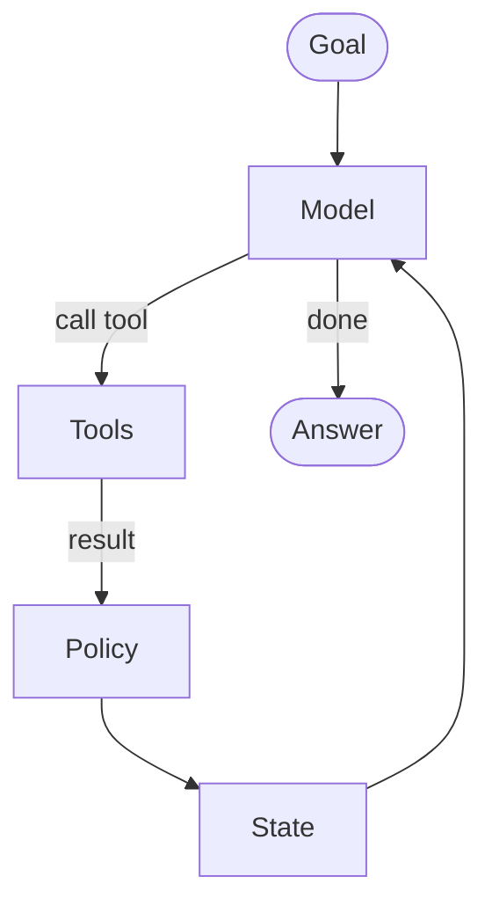

# 0.1. Agents

## What is an AI agent?

An **AI agent** is a program that uses a language model to decide, step by step, how to reach a goal and can take actions through **tools**. Unlike a fixed script, an agent chooses _which_ allowed action to take next from the goal, conversation, policy, and previous results.

A useful working definition: an agent is a **model** inside a controlled **loop** that may call tools and read their results until a stop condition is reached. Given "investigate INC-002", the Ops Copilot can look up the incident, search logs and runbooks, check service state, and propose a guarded action.

## What is the agentic loop?

The agentic loop is the cycle at the heart of every agent. Four ingredients drive it:

1. **Model**: the LLM that proposes the next response or tool call.
1. **Tools**: typed capabilities the runtime may allow the model to invoke.
1. **State**: conversation, retrieved context, and application data carried between steps.
1. **Policy**: validation, authorization, approval, budgets, and stop conditions around the loop.

Each turn, the model reads the current context, decides whether to answer or call a tool, receives the tool result, and loops again until it produces a final answer.

The framework — Google ADK, in this course — owns this loop for you: it manages sessions, formats tool calls, runs the tools, and feeds results back to the model.

## What are the common agentic patterns?

Most agents are built from a few reusable patterns, which the course teaches one at a time:

- **Tool use**: the model requests functions to fetch data or act; the runtime validates and executes them. Covered in [3.1. Tools](../3. Capabilities/3.1. Tools.md).
- **Reflection**: the agent reviews its own output and revises it, often in a loop until a quality bar is met. Useful for drafting, checking, and self-correction.
- **Planning**: the agent breaks a goal into ordered sub-steps before executing, rather than reacting one step at a time. Helpful for multi-stage tasks such as `triage -> diagnose -> recommend`.
- **Multi-agent**: several specialized agents collaborate, one delegating to another. In the Ops Copilot, a triage agent delegates to a diagnosis agent over [A2A](../3. Capabilities/3.6. A2A.md).

These patterns compose. A capable agent typically uses tools, reflects on results, and may delegate parts of the work to sub-agents.

## What is the difference between an agent and a workflow?

A **workflow** runs a fixed, predefined sequence of steps — you decide the control flow. An **agent** decides the control flow itself, at run time, using the model. Workflows are predictable and cheap; agents are flexible but non-deterministic and more expensive.

The two are not mutually exclusive. The ADK version locked by this repository provides a graph-based `Workflow` runtime as well as classic workflow agents. The course expresses `triage -> diagnose -> recommend` as an explicit linear graph; see [3.5. Workflows](../3. Capabilities/3.5. Workflows.md). Reach for model autonomy only where the flexibility pays for its latency, cost, and risk.

## When should you not use an agent?

Agents add latency, cost, and unpredictability. Prefer a simpler solution when:

- **The steps are known and fixed**: a script, a workflow, or plain code is cheaper and more reliable than asking a model to re-derive the plan every time.
- **Correctness is non-negotiable and mechanical**: for deterministic transforms, validation, or math, call the function directly instead of hoping the model routes to it.
- **A single model call suffices**: if one prompt answers the question, you do not need a loop of tool calls.
- **The cost of a wrong action is high and unguarded**: never let an agent take irreversible actions without validation and human approval — see [4.5. Guardrails](../4. Quality/4.5. Guardrails.md).

The pragmatic rule: use an agent when the task genuinely requires _deciding_ what to do next from context. Otherwise, write the simpler thing.
