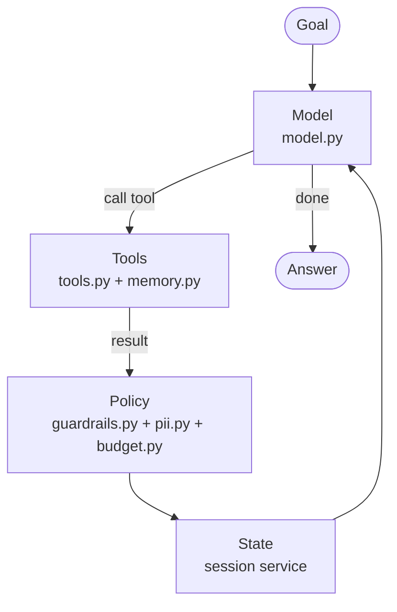
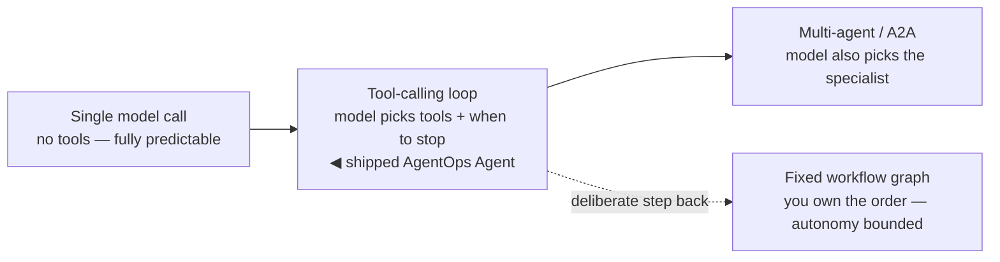

# 0.1. Agents

!!! abstract "In one glance"

    - **You will:** Tell an agent apart from a workflow, and decide when a plain function is the better answer.
    - **You need:** Nothing beyond a terminal.
    - **Time:** about 16 minutes, concept.

## What is an AI agent?

An **AI agent** is a program that uses a language model to decide, step by step, how to reach a goal. It can take actions through **tools** — typed functions the runtime runs when the model asks for one. Unlike a fixed script, an agent chooses _which_ allowed action to take next from the goal, the conversation so far, its policy, and the results of previous actions.

Here is one grounded turn over the committed seed (incidents `INC-001`..`INC-010`). It makes the guarded-action boundary concrete:

```text
> Investigate INC-002. If the evidence supports it, initiate a guarded inventory restart.

  → get_incident(incident_id="INC-002")
      INC-002 · inventory · SEV1 · open · runbook: service-down
  → get_service_status(name="inventory")
      inventory: down
  → search_service_logs(service="inventory", limit=6)
      nil-pointer panic · repeated restarts · readiness refused · stock lookup 503
  → get_runbook(slug="service-down")

  Agent:
  INC-002 is a SEV1: inventory is down, and its logs show a nil-pointer panic,
  repeated restarts, failed readiness, and HTTP 503 stock lookups. The
  service-down runbook says to diagnose the cause before remediation; it lists
  a restart for a transient crash loop once that cause is understood.
  → restart_service(name="inventory")
      ADK requests confirmation; the function has not run.
  [awaiting human approval + rationale · no state change]
```

Every claim traces to a tool result, and the diagnosis cites the runbook slug it read — `service-down` is that runbook's short id. The runbook does not make restarting the service its first step: diagnosis comes first. Calling `restart_service` creates the confirmation pause; the function does not execute until a human approves with a rationale.

A wrong run looks different: it invents an id the seed never had (say `INC-042`), or skips the `get_incident` call and asserts a severity or status it never read. Both are ungrounded, and both are exactly what the `INSTRUCTION` forbids.

A useful working definition: an agent is a **model** inside a controlled **loop** that may call tools and read their results until a stop condition is reached. The rest of this page — and most of this course — is about that loop and the machinery that keeps it cheap, safe, and observable.

The agent in that transcript is the reference **AgentOps Agent**, an on-call assistant for a fictional platform. Its persona and operating rules are not implied by a diagram; they live verbatim in the `INSTRUCTION` string in `composition.py`, kept explicit "so behavior is reproducible and evaluable".

Those rules bind the loop to a specific job: ground every claim in a tool, never invent an incident, service, or status. They also bind it to a specific toolbox. Read tools like `get_incident` only observe. When an engineer asks to initiate a guarded action, the instruction requires evidence first, then a guarded tool call so ADK can create the confirmation pause ([4.5. Guardrails](../4. Quality/4.5. Guardrails.md)).

??? note "Deeper: the reference agent's full toolbox"

    1. **Read tools** to observe: `list_incidents`, `get_incident`, `get_service_status`, `search_service_logs`.
    1. **Knowledge tools** to retrieve procedure: `get_runbook` (by an incident's exact `runbook` slug) and `search_runbooks` (by symptom).
    1. **Memory tools** to carry findings across conversations: `recall_incident_context` at the start of an investigation, `save_incident_note` when something durable is learned ([3.4. Memory](../3. Capabilities/3.4. Memory.md)).
    1. **Guarded actions** to change state: `restart_service` and `resolve_incident`. The agent gathers evidence and calls one only when asked to initiate it; ADK pauses before execution and asks the human to approve with a rationale ([4.5. Guardrails](../4. Quality/4.5. Guardrails.md)).

Given "investigate INC-002", that agent can recall prior notes, look up the incident, read the affected service's logs and its runbook, and propose a guarded fix. Each step is a real tool call, never a claim it invented. [2.1. First Agent](../2. Agents/2.1. First Agent.md) walks the code that wires those tools onto the agent; this page stays at the level of _why_ the shape looks like this.

## What is the agentic loop?

The agentic loop is the cycle at the heart of every agent. Four ingredients drive it:

1. **Model** — the LLM that proposes the next response or tool call ([2.2. Models](../2. Agents/2.2. Models.md)).
1. **Tools** — the typed capabilities the runtime may let the model invoke ([3.1. Tools](../3. Capabilities/3.1. Tools.md)).
1. **State** — conversation, retrieved context, and running counters carried between steps ([2.4. Sessions](../2. Agents/2.4. Sessions.md)).
1. **Policy** — the validation, redaction, budget, and error handling wrapped around the loop ([4.5. Guardrails](../4. Quality/4.5. Guardrails.md)).

In this repository each ingredient has one clear owner. The loop is not one big function but four seams you can open independently.

??? note "Deeper: where each ingredient lives in this repository"

    1. **Model** — selected by `build_model()` in `model.py`; Gemini by default, or explicitly selected Ollama.
    1. **Tools** — `ALL_TOOLS` (reads) in `tools.py`, `KNOWLEDGE_TOOLS` in `memory.py`, plus `MEMORY_TOOLS` and the guarded `ACTION_TOOLS` in their own modules.
    1. **State** — ADK's session service holds it between turns; the standalone server backs that with SQLite under the disposable `.state` directory.
    1. **Policy** — ADK hooks: validation and error handling from `guardrails.py`, PII redaction from `pii.py`, and the token budget from `budget.py` — composed once by `AgentOpsPolicyPlugin` at the app boundary rather than buried in the prompt.

Each turn, the model reads the current state, decides whether to answer or call a tool, receives the tool result, and loops again until it produces a final answer.


```mermaid
flowchart TD
    Goal([Goal]) --> Model["Model<br/>model.py"]
    Model -->|call tool| Tools["Tools<br/>tools.py + memory.py"]
    Tools -->|result| Policy["Policy<br/>guardrails.py + pii.py + budget.py"]
    Policy --> State["State<br/>session service"]
    State --> Model
    Model -->|done| Answer([Answer])
```

A framework owns this loop for you. In this course that framework is **ADK**, Google's Agent Development Kit: it manages sessions, serializes your tool signatures into the JSON schema the model reads, runs the tools, and feeds results back. Any term you do not recognize is defined in one line in [0.7. Glossary](./0.7.%20Glossary.md).

**A loop needs a brake.** "Until a stop condition is reached" carries a lot of weight in that definition. The ordinary stop is the model emitting a final answer with no further tool call. The dangerous case is a model that keeps calling tools once a turn can fan out across many reads.

This repository provides an enforceable brake in `enforce_token_budget`, called by the app plugin's `before_model_callback` hook before every model call. Set `AGENT_MAX_TOKENS_PER_SESSION` to a positive limit and it refuses the next model call once a session has spent that budget, returning an actionable message instead of an open-ended bill.

The course leaves that setting unset by default; configure it before a longer hosted run, so the policy records usage without enforcing a ceiling. A deployed system should choose a finite limit from measured traffic because the loop is non-deterministic: the same prompt can produce a longer **trajectory** — the sequence of tool calls the agent makes — on the next run.

Owned by [7.3. Costs](../7. Observability/7.3. Costs.md) and [4.5. Guardrails](../4. Quality/4.5. Guardrails.md).

## How does the reference agent run one investigation?

You have seen the answer; this is the machinery that produced it. Below is the same guarded-restart turn, driven by the operating rules in `INSTRUCTION`. The model decides each evidence call, then asks ADK to run the guarded tool.

```mermaid
sequenceDiagram
    participant Eng as Engineer
    participant R as ADK Runner
    participant M as Model
    participant T as Tools (Python)
    Eng->>R: "Investigate INC-002; initiate a guarded restart if supported"
    R->>M: instruction + history + tool schemas
    loop until the model has enough evidence
        M-->>R: request recall_incident_context / get_incident / search_service_logs / get_runbook
        R->>T: validate args, then execute
        T-->>R: typed result (prior notes, record, log lines, runbook)
        R->>M: same history + tool result appended
    end
    M-->>R: grounded diagnosis + request restart_service
    R-->>Eng: ADK confirmation request (HITL)
    Note over R,T: restart function has not run
    Eng-->>R: approve with rationale, or reject
    alt approved
        R->>T: execute restart_service
        T-->>R: result + audit evidence
        R->>M: action result
        M-->>R: request fresh incident + service reads
        R->>T: execute read tools
        T-->>R: post-action evidence
        R-->>Eng: report observed outcome
    else rejected
        R-->>Eng: no state change
    end
```

Three things this makes visible.

First, **the model never runs anything.** It only asks for a tool by name. ADK decides whether to validate and execute a read or pause a guarded write for the HITL (human-in-the-loop) confirmation in the diagram. [2.2. Models](../2. Agents/2.2. Models.md) covers that mechanism in full.

Second, the trajectory is not scripted: the model chooses it. The instruction nudges the order — recall first, read logs before recommending, cite the runbook — but nothing forces it. On another run the model might skip `search_service_logs`, or call `search_runbooks` instead of `get_runbook`. That flexibility is the point of an agent, and it is exactly why Chapter 4 judges behavior with evaluations rather than string equality ([4.4. Evaluations](../4. Quality/4.4. Evaluations.md)).

Third, approval proves authorization, not recovery. After an approved write, the instruction requires fresh incident and service reads before the agent reports an outcome. The action response alone cannot prove the service recovered.

## What are the common agentic patterns?

Agents are built from a small set of reusable patterns. This repository makes each important pattern runnable, but keeps the default path lean.

| Pattern                          | Where learners run it             | Where it lives                                                                                                                            |
| -------------------------------- | --------------------------------- | ----------------------------------------------------------------------------------------------------------------------------------------- |
| Tool use                         | Default interactive agent         | The tool-calling loop; `ALL_TOOLS` in `tools.py` plus the knowledge tools in `memory.py` ([3.1. Tools](../3. Capabilities/3.1. Tools.md)) |
| Memory / long-term notes         | Default interactive agent         | `MEMORY_TOOLS` (`recall_incident_context`, `save_incident_note`) in `longterm.py` ([3.4. Memory](../3. Capabilities/3.4. Memory.md))      |
| Instruction-led planning         | Default, for multi-step work only | The observable-plan rule in `composition.py` ([2.3. Instructions](../2. Agents/2.3. Instructions.md))                                     |
| Fixed workflow + evidence review | `mise run workflow`               | `plan → investigate → evidence_review → recommend` in `workflow.py` ([3.5. Workflows](../3. Capabilities/3.5. Workflows.md))              |
| Multi-agent delegation           | `mise run coordinator`            | The least-privilege specialists in `delegation.py` ([3.7. Multi-Agent](../3. Capabilities/3.7. Multi-Agent.md))                           |
| A2A                              | Default agent over the network    | The persistent server in `server.py` ([3.6. A2A](../3. Capabilities/3.6. A2A.md))                                                         |

??? note "Deeper: how planning and reflection stay bounded"

    The default agent plans only multi-step investigations. Its instruction asks for a target, the next checks, expected recovery evidence, and a stopping or escalation condition. The model still chooses its tools, so this is **instruction-led planning**, not a separate planner that controls the loop.

    The deep-investigation entrypoint makes both patterns explicit:

    1. **Planning** — `plan` emits at most four checks before any evidence is gathered.
    1. **Evidence review** — `evidence_review` challenges the collected support once and returns `supported`, `insufficient`, or `conflicting`.

    That review is a bounded form of reflection. The course deliberately avoids an open “critique yourself until satisfied” loop: it has no clear stopping condition and can multiply tokens without finding new evidence. After a human-approved action, the default agent's instruction asks for a second bounded review: re-read the incident and service, compare the result with the expected evidence, then save a factual outcome. That interactive rule remains advisory; the fixed workflow is the structurally enforced review path.

    Both optional orchestration paths are real ADK compositions selected through the same package:

    ```bash
    cd agents/python
    mise run workflow
    mise run coordinator
    ```

## What are the levels of agent autonomy?

"Agent" is not a binary; it is a dial for _how much the model gets to decide_. Turning it up buys flexibility and pays in predictability, latency, and money. Placing your system on this dial — and knowing where the reference agent sits — is one of the most useful design judgments in the course.


```mermaid
flowchart LR
    L0["Single model call<br/>no tools — fully predictable"]
    L1["Tool-calling loop<br/>model picks tools + when to stop<br/>◀ shipped AgentOps Agent"]
    L2["Multi-agent / A2A<br/>model also picks the specialist"]
    L0 --> L1 --> L2
    WF["Fixed workflow graph<br/>you own the order — autonomy bounded"]
    L1 -. deliberate step back .-> WF
```

1. **Single model call** — one prompt, one answer, no tools. Fully predictable, one round trip. If this answers the task, you do not have an agent problem ([2.2. Models](../2. Agents/2.2. Models.md)).
1. **Tool-calling loop** — the model chooses which tools to call and when to stop. **This is where the shipped AgentOps Agent sits.** The order is not scripted: the model chooses it. You gain the ability to handle open-ended requests and pay with non-determinism.
1. **Fixed workflow graph** — a deliberate step _back_ toward determinism: the model still fills each node, but you own the order ([3.5. Workflows](../3. Capabilities/3.5. Workflows.md)). The runnable deep-investigation path fixes `plan → investigate → evidence_review → recommend`.
1. **Multi-agent / A2A delegation** — the model also decides _who_ does the work, routing to specialists in-process or across a network ([3.7. Multi-Agent](../3. Capabilities/3.7. Multi-Agent.md), [3.6. A2A](../3. Capabilities/3.6. A2A.md)). Maximum flexibility, and maximum surface to secure, debug, and fund.

The rule the whole course argues: **take the lowest level that solves your problem.** Every level up is another model call to pay for, another source of variance to evaluate, and another boundary to guard.

Two rows of that dial also answer the question people ask most: agent or workflow? A **workflow** runs a fixed, predefined sequence of steps — you decide the control flow. An **agent** decides the control flow itself, at run time, using the model. Workflows are predictable and cheap; agents are flexible, non-deterministic, and more expensive.

The two are not mutually exclusive. The ADK version this repository pins provides a graph-based `Workflow` runtime. The course expresses `plan → investigate → evidence_review → recommend` as an explicit linear graph, so a trace or test can say _which_ stage failed instead of “the agent was wrong”. Reach for model autonomy only where the flexibility pays for its latency, cost, and risk.

Owned by [3.5. Workflows](../3. Capabilities/3.5. Workflows.md), down to when a node should be plain Python instead of a model call.

## When should you not use an agent?

Agents add latency, cost, and unpredictability. Prefer a simpler solution when:

1. **The steps are known and fixed** — a script, a workflow, or plain code re-derives nothing and cannot wander. A fixed graph ([3.5. Workflows](../3. Capabilities/3.5. Workflows.md)) is the middle ground when only _some_ steps need judgment.
1. **Correctness is non-negotiable and mechanical** — for deterministic transforms, validation, or math, call the function directly instead of hoping the model routes to it.
1. **A single model call suffices** — if one prompt answers the question, you do not need a loop of tool calls.
1. **The cost of a wrong action is high and unguarded** — never let an agent take irreversible actions without validation and human approval ([4.5. Guardrails](../4. Quality/4.5. Guardrails.md)).

This is not only advice the course gives; it is advice the course _takes_, inside the agent itself. Where a job is mechanical, the reference agent uses plain code, not the model:

1. **Input validation is deterministic.** `normalize_slug` and `normalize_incident_id` (`models.py`) parse and canonicalize a service name or incident id at the boundary — turning `inc-002` into `INC-002` — rather than trusting the model to judge what is well-formed. The guardrail layer re-runs the same functions before any write ([4.5. Guardrails](../4. Quality/4.5. Guardrails.md)).
1. **Runbook retrieval is deterministic by default.** `search_runbooks` in `memory.py` ranks runbooks with a plain keyword scorer — no model call at all. Semantic embeddings are opt-in, not the default.

Both are places the course could have asked the model to decide and deliberately did not, because a function is cheaper, faster, and testable. The keyword scorer is TF-IDF-style: rarer terms weigh more, a slug match gets a strong boost, and ties break on slug so evals stay reproducible.

The pragmatic rule: use an agent when the task genuinely requires _deciding_ what to do next from context. Otherwise, write the simpler thing — and keep the deciding part as small as the problem allows.

## What proves this page worked?

There is nothing to run on this page, so the check is what you can now say without looking.

**You are done when:**

- You can name the four ingredients of the agentic loop: model, tools, state, policy.
- You can point at the `investigate INC-002` transcript and say which lines are tool calls, which line is the grounded answer, and which line is still waiting on a human.
- You can state, in one sentence each, what an agent decides and what a workflow decides.
- You can name one job the reference agent gives to plain code rather than to the model, and say why.
- You can place a task you actually have at work on the autonomy dial, and defend the level you picked.

Continue to [0.2. AgentOps](./0.2.%20AgentOps.md) when you can say why you would not use an agent for a task whose steps are already known and fixed.
