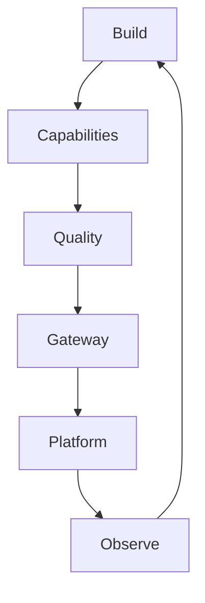

# 0.2. AgentOps

## What is AgentOps?

**AgentOps** is the practice of building, evaluating, securing, deploying, and operating AI agents as reliable production software. Getting an agent to answer correctly once is easy; keeping it correct, safe, affordable, and observable as it runs against real traffic is the hard part. AgentOps is the set of habits and tools that make that repeatable.

It is the agent-shaped sibling of MLOps and LLMOps. Where those disciplines operate models, AgentOps operates something that _acts_: an agent calls tools, takes multi-step decisions, and can change the world. That autonomy is exactly what makes evaluation, guardrails, and observability first-class concerns rather than afterthoughts.

## What is the AgentOps lifecycle?

The lifecycle is a loop — you build an agent, prove it works, harden it, ship it, watch it, and feed what you learn back into the next iteration.

1. **Build**: create the agent — model, instructions, sessions, dev loop.
1. **Capabilities**: give it powers — tools, skills, MCP, memory/RAG, workflows, A2A.
1. **Quality**: make it trustworthy — typing, tests, metrics, evaluations, guardrails, security.
1. **Gateway**: connect and secure it — one place for models, MCP, A2A, auth, and rate limits.
1. **Platform**: run it as a workload — containers and Kubernetes with kagent.
1. **Observe**: keep it healthy — tracing, monitoring, cost, feedback, governance.

Each pass around the loop makes the agent a little more production-ready.

## How do MLOps, LLMOps, and AgentOps relate?

They are three layers of the same lineage, each adding a concern on top of the last:

- **MLOps** operates **trained models**: data pipelines, training, versioning, deployment, and drift monitoring. The unit of work is a model you build.
- **LLMOps** operates **large language models** you mostly consume rather than train: prompts, context windows, retrieval, token cost, latency, and output evaluation.
- **AgentOps** operates **agents** built on those LLMs: tool use, multi-step control flow, autonomy, guardrails, human-in-the-loop, and the safety of _actions_, not just text.

Everything you already know about MLOps still applies — reproducibility, testing, CI/CD, monitoring. AgentOps inherits those and adds the concerns that come with an autonomous, tool-using system.

## How is operating an agent different?

Compared to a stateless model endpoint, an agent introduces new failure modes that shape the whole course:

- **Non-determinism**: the same input can produce different tool calls, so tests and evaluations must judge behavior, not exact strings ([4.4. Evaluations](../4. Quality/4.4. Evaluations.md)).
- **Actions have consequences**: a tool call can change state, so risky actions need validation and approval ([4.5. Guardrails](../4. Quality/4.5. Guardrails.md)).
- **Cost and latency compound**: every loop step is another model call, so token cost and response time must be measured and budgeted ([7.3. Costs](../7. Observability/7.3. Costs.md)).
- **Prompt injection is a real attack surface**: untrusted tool output can hijack the agent, so security spans inputs, tools, and the gateway ([4.6. Security](../4. Quality/4.6. Security.md)).

## How does the lifecycle map to the course?

Each phase of the lifecycle is a chapter, so the table of contents _is_ the lifecycle:

| Lifecycle phase | Course chapter                                   |
| --------------- | ------------------------------------------------ |
| Build           | [2. Agents](../2. Agents/index.md)               |
| Capabilities    | [3. Capabilities](../3. Capabilities/index.md)   |
| Quality         | [4. Quality](../4. Quality/index.md)             |
| Gateway         | [5. Gateway](../5. Gateway/index.md)             |
| Platform        | [6. Platform](../6. Platform/index.md)           |
| Observe         | [7. Observability](../7. Observability/index.md) |

Before that, [1. Setup](../1. Setup/index.md) prepares your environment, and [8. Community](../8. Community/index.md) covers sharing and sustaining what you build.
