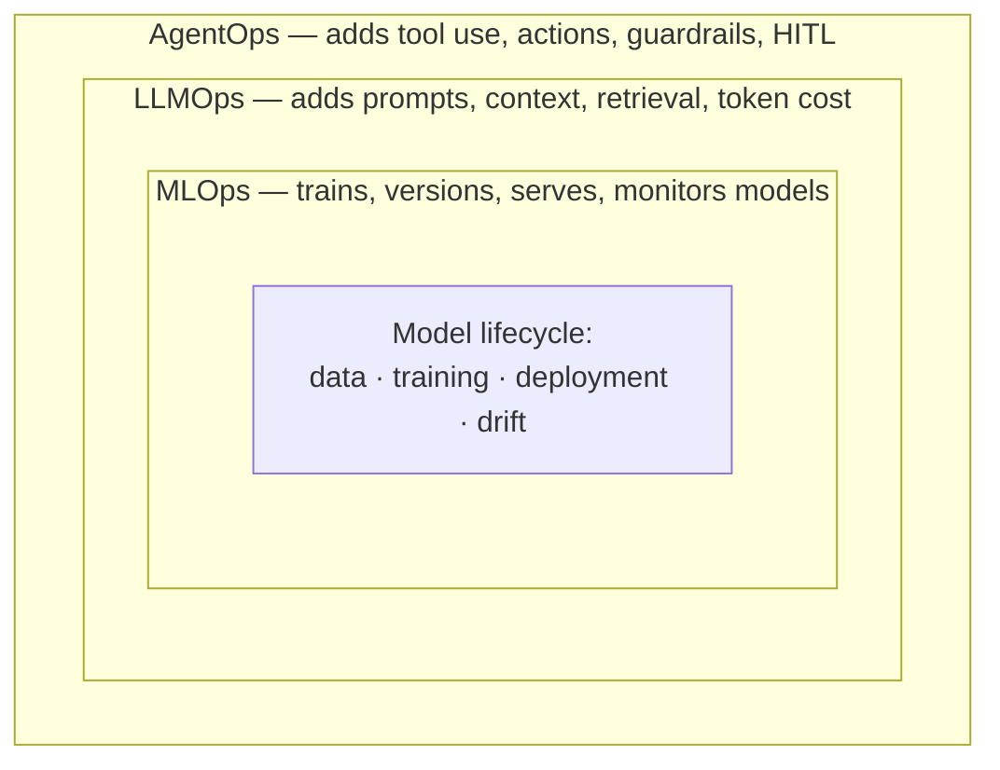
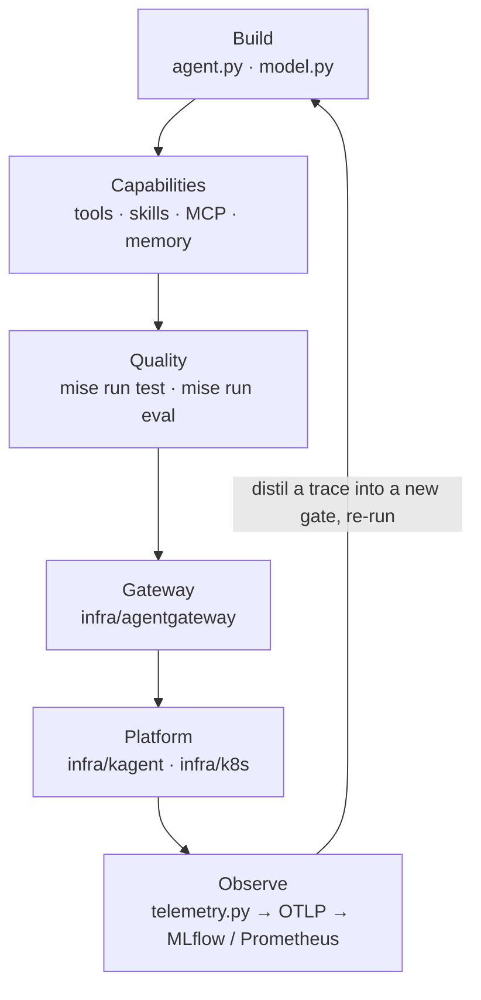

# 0.2. AgentOps

## What is AgentOps?

**AgentOps** is the practice of building, evaluating, securing, deploying, and operating AI agents as reliable production software. Getting an agent to answer correctly once is easy; keeping it correct, safe, affordable, and observable as it runs against real traffic is the hard part. AgentOps is the set of habits and tools that make that repeatable.

It is the agent-shaped sibling of MLOps and LLMOps. Where those disciplines operate models, AgentOps operates something that _acts_: an agent calls tools ([0.1. Agents](0.1. Agents.md)), takes multi-step decisions, and can change the world. That autonomy is exactly what makes evaluation, guardrails, and observability first-class concerns rather than afterthoughts.

This course does not teach AgentOps in the abstract. Every claim below is grounded in one completed reference — the **AgentOps Agent** under `agents/python/` — so a phase is never a bullet point you have to imagine; it is a file you can open, a command you can run, and a gate that fails when the property regresses.

## Where does AgentOps begin?

AgentOps begins _after_ you already have a working agent. That is the framing this course is built on: the `main` branch is a completed, executable reference — `AGENTS.md` states it "is a completed, executable reference that learners inspect and extend; it must not drift into a collection of illustrative snippets." A first correct answer is a demo, and demos are cheap. The discipline starts the moment you ask the production questions a demo never has to answer:

- Will the same prompt still call the right tool next week, on a new model version?
- What happens when a tool call would change real state, or racks up an open-ended bill, or carries an instruction planted by an attacker?
- When it misbehaves at 3 a.m., can you see _why_ from a trace instead of guessing?

Those questions are what separates a prototype from an operated system, and they are exactly the concerns the phases below make routine. If you are still choosing whether an agent is even the right tool, that decision belongs one page earlier ([0.1. Agents — when should you not use an agent?](0.1. Agents.md#when-should-you-not-use-an-agent)); this page assumes the answer was yes and you now have to run the thing.

## How do MLOps, LLMOps, and AgentOps relate?

They are three concentric layers of the same lineage. Each outer layer keeps everything the inner one does and adds the new concern its unit of work introduces:

- **MLOps** operates **trained models**: data pipelines, training, versioning, deployment, and drift monitoring. The unit of work is a model you build.
- **LLMOps** operates **large language models** you mostly consume rather than train: prompts, context windows, retrieval, token cost, latency, and output evaluation.
- **AgentOps** operates **agents** built on those LLMs: tool use, multi-step control flow, autonomy, guardrails, human-in-the-loop, and the safety of _actions_, not just text.

Everything you already know about MLOps still applies — reproducibility, testing, CI/CD, monitoring. AgentOps inherits those and adds the concerns that come with an autonomous, tool-using system. The named tools this course uses to cover each layer — ADK, agentgateway, kagent, MLflow, OpenTelemetry, Ollama — are surveyed in [0.3. Ecosystem](0.3. Ecosystem.md).

## What is the AgentOps lifecycle?

The lifecycle is a loop — you build an agent, give it capabilities, prove it works, ship it through a gateway, run it as a platform workload, watch it, and feed what you learn back into the next iteration. What makes it a discipline rather than a slogan is that every node has an artifact that implements it and a gate that proves it still holds:

Each pass around the loop makes the agent a little more production-ready. The next section names the artifact and gate behind each node so the loop is not an abstraction; the section after it explains what the feedback edge actually consists of in this repository.

## How does each phase show up in the reference agent?

This is where AgentOps stops being a diagram. Each phase maps to a concrete file or directory in this repository and to a command that fails loudly when the phase's property breaks:

| Phase        | Reference artifact                                                                                  | Gate that proves it                                                                  |
| ------------ | --------------------------------------------------------------------------------------------------- | ------------------------------------------------------------------------------------ |
| Build        | `agent.py` (the `root_agent`), `model.py` (provider selection)                                      | `mise run run` for an interactive turn; `mise run test` for the offline suite        |
| Capabilities | `tools.py`, `skills.py`, `mcp_server.py`/`mcp_client.py`, `memory.py`/`retrieval.py`, `workflow.py` | `mise run test`, then `mise run eval` scores the tool trajectory over the seed       |
| Quality      | `tests/`, `evals/`, `guardrails.py`, `pii.py`                                                       | `mise run test` (≥95% branch coverage), `mise run redteam`, `mise run eval:validate` |
| Gateway      | `infra/agentgateway/{host,k3d,gke}/`                                                                | `mise run gateway:host` + `mise run smoke:host`, then curl the governed A2A listener |
| Platform     | `infra/kagent/`, `infra/k8s/base` + `overlays/{local,gke}`                                          | `mise run cluster:start` + `mise run platform:install`, then `skaffold dev -p local` |
| Observe      | `telemetry.py`, `budget.py`, `infra/observability/`                                                 | `mise run observability:up`, then query Prometheus and read the trace in MLflow      |

All source paths are under `agents/python/src/agent/`. The point of the table is not to memorize file names; it is that "harden it" and "watch it" are not aspirations here — they are `guardrails.py` and `telemetry.py`, and a red gate tells you when either stops working. Each chapter walks its row in full.

## How is operating an agent different?

Compared to a stateless model endpoint, an agent introduces new failure modes — and the value of a completed reference is that each one already ships a concrete defense you can read, not just a warning to heed:

| New failure mode                                                     | How the reference agent defends against it                                                                                                                             | Chapter                                                                                              |
| -------------------------------------------------------------------- | ---------------------------------------------------------------------------------------------------------------------------------------------------------------------- | ---------------------------------------------------------------------------------------------------- |
| **Non-determinism**: the same input can produce different tool calls | Eval sets score the _trajectory_ (which tools, which arguments, in order) over fixed seed data, not exact strings — `evals/ops.evalset.json`, `mise run eval`          | [4.4. Evaluations](../4. Quality/4.4. Evaluations.md)                                                |
| **Actions have consequences**: a tool call can change state          | Mutating tools carry `require_confirmation=True` and, on approval, write state plus an append-only audit row in one SQLite transaction — `actions.py`, schema triggers | [4.5. Guardrails](../4. Quality/4.5. Guardrails.md)                                                  |
| **Cost and latency compound**: every loop step is another model call | Per-session token accounting and a hard ceiling — `record_token_usage`/`enforce_token_budget` in `budget.py`, bounded by `AGENT_MAX_TOKENS_PER_SESSION`                | [7.3. Costs](../7. Observability/7.3. Costs.md)                                                      |
| **Prompt injection**: untrusted tool output can hijack the agent     | `secure_tool_output` NFKC-normalizes, neutralizes known injection markers, and spotlights free-text surfaces as data-not-instructions — `guardrails.py`                | [4.5. Guardrails](../4. Quality/4.5. Guardrails.md), [4.6. Security](../4. Quality/4.6. Security.md) |

Read each cell as a promissory note the chapter cashes: the audit trail is append-only through SQLite triggers but not tamper-proof against an administrator, spotlighting is best-effort defense-in-depth rather than a guarantee, and the token budget bounds one conversation rather than one client. AgentOps is honest about those edges, which is why each defense is layered rather than trusted alone.

## What closes the AgentOps loop?

The loop's hardest edge is the one from Observe back to Build: "feed what you learn back" is easy to assert and easy to leave hollow. In this repository three concrete habits close it, and none of them is an automated online scorer or a feedback API — do not read more into the loop than ships:

1. **A bad trace becomes a new gate.** When a trace shows a wrong trajectory or an unsafe proposal, you distil it into one eval case that pins that single behavior — the method [4.4. Evaluations](../4. Quality/4.4. Evaluations.md) calls "grow the set from real failures." The next `mise run eval` then fails until the regression is fixed.
1. **Every change re-runs the same gates.** The continuity is enforced by re-running `mise run format`, `mise run check`, and `mise run test` (≥95% branch coverage) after a change, exactly as `AGENTS.md`'s "Definition of done" requires, so the reference cannot silently rot into a broken snapshot.
1. **Time-sensitive claims get re-verified on a schedule.** The `.github/workflows/freshness.yml` workflow opens one quarterly tracking issue so pinned versions, prices, and model names are re-checked each release cycle instead of drifting.

Observability itself is the input to all three; [7. Observability](../7. Observability/index.md) is where the trace, metric, and audit evidence that feeds the next iteration is produced.

## How does the lifecycle map to the course?

Each phase of the lifecycle is a chapter, so the table of contents _is_ the lifecycle:

| Lifecycle phase | Course chapter                                   |
| --------------- | ------------------------------------------------ |
| Build           | [2. Agents](../2. Agents/index.md)               |
| Capabilities    | [3. Capabilities](../3. Capabilities/index.md)   |
| Quality         | [4. Quality](../4. Quality/index.md)             |
| Gateway         | [5. Gateway](../5. Gateway/index.md)             |
| Platform        | [6. Platform](../6. Platform/index.md)           |
| Observe         | [7. Observability](../7. Observability/index.md) |

Before that, [1. Setup](../1. Setup/index.md) prepares your environment, and [8. Community](../8. Community/index.md) covers sharing and sustaining what you build — including [8.7. Capstone](../8. Community/8.7. Capstone.md), which turns this completed reference into an evidence-backed agent platform for your own domain.
