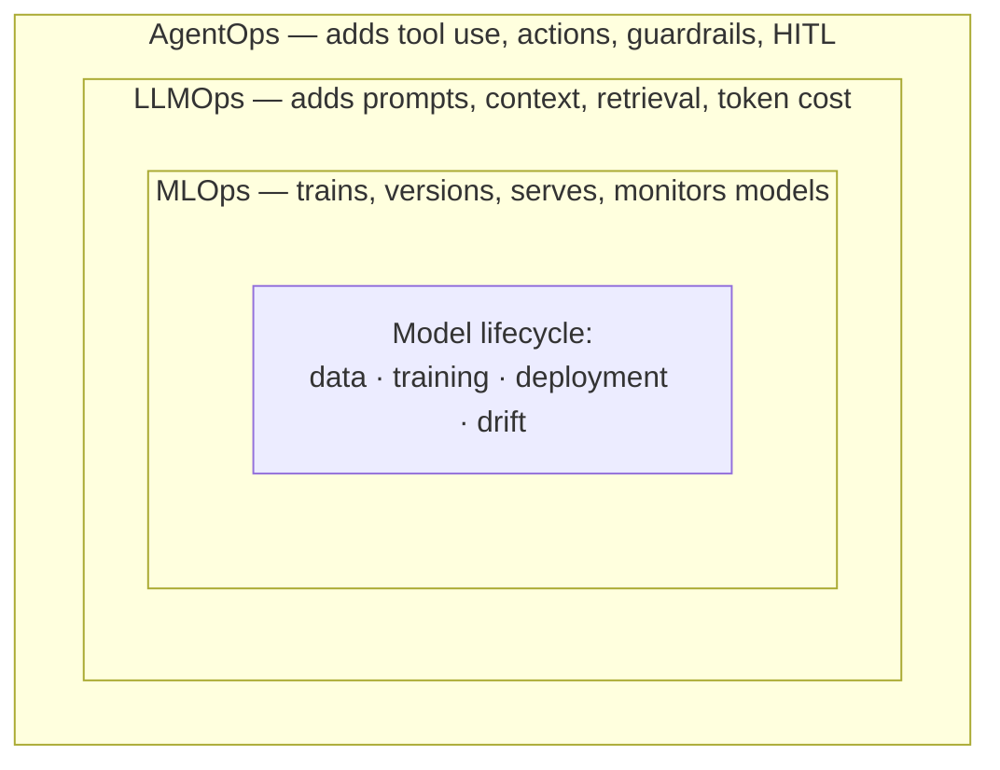
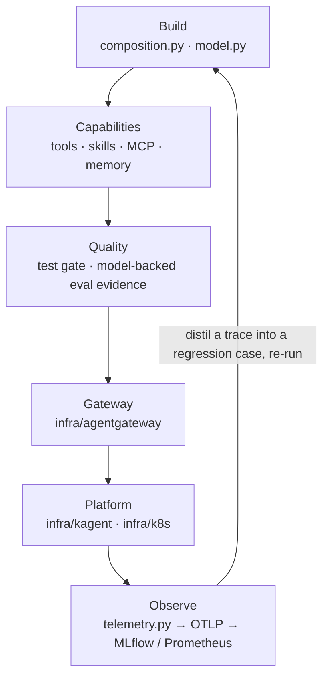

# 0.2. AgentOps

!!! abstract "In one glance"

    - **You will:** Follow the six lifecycle phases the course chapters are built from, and see the file and the command behind each one.
    - **You need:** 0.1. Agents read, so you already know what the loop is.
    - **Time:** about 12 minutes, concept.

## What is AgentOps?

**AgentOps** is the practice of building, evaluating, securing, deploying, and operating AI agents as reliable production software. Getting an agent to answer correctly once is easy; keeping it correct, safe, affordable, and observable as it runs against real traffic is the hard part. AgentOps is the set of habits and tools that make that repeatable.

It is the agent-shaped sibling of MLOps and LLMOps. Where those disciplines operate models, AgentOps operates something that _acts_: an agent calls tools ([0.1. Agents](0.1. Agents.md)), takes multi-step decisions, and can change the world. That autonomy is exactly what makes evaluation, guardrails, and observability first-class concerns rather than afterthoughts.

This course does not teach AgentOps in the abstract. Every claim below is grounded in one completed reference: the **AgentOps Agent** under `agents/python/`. A phase is never a bullet point you have to imagine — it is a file you can open and a command or observation you can inspect.

## Where does AgentOps begin?

AgentOps begins _after_ you already have a working agent. That is the framing this course is built on: the `main` branch is a completed, executable reference that you inspect and extend, not a collection of illustrative snippets. A first correct answer is a demo, and demos are cheap. The discipline starts the moment you ask the production questions a demo never has to answer:

- Will the same prompt still call the right tool next week, on a new model version?
- What happens when a tool call would change real state, or racks up an open-ended bill, or carries an instruction planted by an attacker?
- When it misbehaves at 3 a.m., can you see _why_ from a trace instead of guessing?

Those questions are what separates a prototype from an operated system, and they are exactly the concerns the phases below make routine. This page assumes you already decided an agent is the right tool and now have to run the thing.

If you are still choosing, that decision belongs one page earlier: [0.1. Agents — when should you not use an agent?](0.1. Agents.md#when-should-you-not-use-an-agent).

## How do MLOps, LLMOps, and AgentOps relate?

They are three concentric layers of the same lineage. Each outer layer keeps everything the inner one does and adds the new concern its unit of work introduces:

```mermaid
flowchart TB
    subgraph AgentOps["AgentOps — adds tool use, actions, guardrails, HITL"]
        subgraph LLMOps["LLMOps — adds prompts, context, retrieval, token cost"]
            subgraph MLOps["MLOps — trains, versions, serves, monitors models"]
                Core["Model lifecycle:<br/>data · training · deployment · drift"]
            end
        end
    end
```

- **MLOps** operates **trained models**: data pipelines, training, versioning, deployment, and drift monitoring. The unit of work is a model you build.
- **LLMOps** operates **large language models** you mostly consume rather than train: prompts, context windows, retrieval, token cost, latency, and output evaluation.
- **AgentOps** operates **agents** built on those LLMs: tool use, multi-step control flow, autonomy, guardrails, human-in-the-loop, and the safety of _actions_, not just text.

Everything you already know about MLOps still applies: reproducibility, testing, CI/CD, monitoring. AgentOps inherits those and adds the concerns that come with an autonomous, tool-using system. The named tools this course uses to cover each layer — ADK, agentgateway, kagent, MLflow, OpenTelemetry, Ollama — are surveyed in [0.3. Ecosystem](0.3. Ecosystem.md).

## What is the AgentOps lifecycle?

The lifecycle is a loop of six phases. You build an agent, give it capabilities, prove it works, and ship it through a gateway. Then you run it as a platform workload, watch it, and feed what you learn back into the next iteration.

What makes it a discipline rather than a slogan is that every node has an artifact that implements it and a check or observation that shows how it behaves:

```mermaid
flowchart TD
    Build["Build<br/>composition.py · model.py"]
    Capabilities["Capabilities<br/>tools · skills · MCP · memory"]
    Quality["Quality<br/>test gate · model-backed eval evidence"]
    Gateway["Gateway<br/>infra/agentgateway"]
    Platform["Platform<br/>infra/kagent · infra/k8s"]
    Observe["Observe<br/>telemetry.py → OTLP → MLflow / Prometheus"]
    Build --> Capabilities --> Quality --> Gateway --> Platform --> Observe
    Observe -->|distil a trace into a regression case, re-run| Build
```

Each pass around the loop makes the agent a little more production-ready. The next section names the artifact and proof behind each node, so the loop is not an abstraction. The section after it explains what the feedback edge actually consists of in this repository.

Nothing here expects you to recognize the names in that diagram yet. Each has a one-line definition in [0.7. Glossary](0.7. Glossary.md), and the chapter that owns it explains it in full.

## How does each phase show up in the reference agent?

This is where AgentOps stops being a diagram. Each phase maps to a concrete file or directory in this repository:

| Phase        | Reference artifact                                                                                  |
| ------------ | --------------------------------------------------------------------------------------------------- |
| Build        | `composition.py` (the `root_agent`), `model.py` (provider selection)                                |
| Capabilities | `tools.py`, `skills.py`, `mcp_server.py`/`mcp_client.py`, `memory.py`/`retrieval.py`, `workflow.py` |
| Quality      | `tests/`, `evals/`, `guardrails.py`, `pii.py`                                                       |
| Gateway      | `infra/agentgateway/{host,k3d,gke}/`                                                                |
| Platform     | `infra/kagent/`, `infra/k8s/base` + `overlays/{local,gke}`                                          |
| Observe      | `telemetry.py`, `budget.py`, `infra/observability/`                                                 |

All source paths are under `agents/python/src/agent/`. You are not meant to memorize the file names. The point is that "harden it" and "watch it" are not aspirations here — they are `guardrails.py` and `telemetry.py`. Each chapter walks its row in full.

Each phase also has a command that checks or observes its property. Most belong to later chapters, so they are collapsed here rather than dropped:

??? note "Deeper: the command that checks each phase"

    Deterministic gates block changes; model-backed and runtime commands produce evidence a person must interpret. You cannot run most of these yet — read the column as a preview, not a to-do list.

    | Phase        | Command and repository role                                                                |
    | ------------ | ------------------------------------------------------------------------------------------ |
    | Build        | `mise run test` is an offline gate; `mise run run` is an interactive model-backed check   |
    | Capabilities | `mise run test` gates deterministic behavior; `mise run eval` records trajectory evidence |
    | Quality      | `mise run test`, `mise run redteam`, and `mise run eval:validate` are deterministic gates |
    | Gateway      | `mise run gateway:host` starts it; `mise run smoke:host` exercises the governed host path |
    | Platform     | `mise run cluster:start` + `mise run platform:install`, then `mise run platform:dev`      |
    | Observe      | `mise run observability:up`, then query Prometheus and read the trace in MLflow            |

    Agent-scoped commands (`mise run run`, `mise run eval`, `mise run redteam`) run from `agents/python/`, while repository-wide gates (`mise run test`, `mise run check`) run from the repository root.

## How is operating an agent different?

Compared to a stateless model endpoint, an agent introduces four new failure modes. Each one already ships a concrete defense you can read, not just a warning to heed:

| New failure mode                                                     | How the reference agent defends against it                                                                                                                                                                                   | Chapter                                                                                              |
| -------------------------------------------------------------------- | ---------------------------------------------------------------------------------------------------------------------------------------------------------------------------------------------------------------------------- | ---------------------------------------------------------------------------------------------------- |
| **Non-determinism**: the same input can produce different tool calls | Model-backed evals record the _trajectory_ (which tools, which arguments, in order) over fixed seed data, not exact strings — `evals/ops.evalset.json`, `mise run eval`                                                      | [4.4. Evaluations](../4. Quality/4.4. Evaluations.md)                                                |
| **Actions have consequences**: a tool call can change state          | Mutating tools pause for a human yes (`require_confirmation=True`). On approval they write the state change plus an audit row whose schema triggers reject row updates and deletes, in one SQLite transaction — `actions.py` | [4.5. Guardrails](../4. Quality/4.5. Guardrails.md)                                                  |
| **Cost and latency compound**: every loop step is another model call | Per-session token accounting; when `AGENT_MAX_TOKENS_PER_SESSION` is configured, it blocks the next call after tracked usage reaches the limit — `record_token_usage`/`enforce_token_budget` in `budget.py`                  | [7.3. Costs](../7. Observability/7.3. Costs.md)                                                      |
| **Prompt injection**: untrusted tool output can hijack the agent     | Normalizes lookalike Unicode characters, neutralizes known injection markers, and spotlights free text: wraps it in a marker telling the model to treat it as data, not orders — `secure_tool_output` in `guardrails.py`     | [4.5. Guardrails](../4. Quality/4.5. Guardrails.md), [4.6. Security](../4. Quality/4.6. Security.md) |

Each defense also has an edge the chapter is explicit about. That is why each defense is layered rather than trusted alone.

??? note "Deeper: the honest limits of each defense"

    Each edge, in the chapter's own words:

    - the audit trail is append-only through SQLite triggers but not tamper-proof against an administrator
    - spotlighting is best-effort defense-in-depth rather than a guarantee
    - the token budget bounds one conversation rather than one client

## What closes the AgentOps loop?

The loop's hardest edge is the one from Observe back to Build. "Feed what you learn back" is easy to assert and easy to leave hollow.

Three concrete habits close it in this repository. None of them is an automated online scorer or a feedback API — do not read more into the loop than ships:

1. **A bad trace becomes a regression case.** When a trace shows a wrong trajectory or an unsafe proposal, you distil it into one eval case that names that behavior. `mise run eval:validate` gates its structure; model-backed evals report whether the agent passes it. One new failing case does not necessarily push the aggregate `25%` floor below its threshold, so inspect the named case instead of treating the aggregate as its gate.
1. **Every change re-runs the same gates.** The continuity is enforced by re-running `mise run format`, `mise run check`, and `mise run test` after a change, so the reference cannot silently rot into a broken snapshot. That test gate enforces ≥95% branch coverage: the share of if/else paths the tests actually exercise.
1. **Time-sensitive claims get re-verified on a schedule.** The `.github/workflows/freshness.yml` workflow opens one quarterly tracking issue so pinned versions, prices, and model names are re-checked each release cycle instead of drifting.

Observability itself is the input to all three. [7. Observability](../7. Observability/index.md) is where the trace, metric, and audit evidence that feeds the next iteration is produced.

## How does the lifecycle map to the course?

Each phase of the lifecycle is a chapter, so the table of contents _is_ the lifecycle:

| Lifecycle phase | Course chapter                                   |
| --------------- | ------------------------------------------------ |
| Build           | [2. Agents](../2. Agents/index.md)               |
| Capabilities    | [3. Capabilities](../3. Capabilities/index.md)   |
| Quality         | [4. Quality](../4. Quality/index.md)             |
| Gateway         | [5. Gateway](../5. Gateway/index.md)             |
| Platform        | [6. Platform](../6. Platform/index.md)           |
| Observe         | [7. Observability](../7. Observability/index.md) |

Before that, [1. Setup](../1. Setup/index.md) prepares your environment, and [8. Community](../8. Community/index.md) covers sharing and sustaining what you build.

That last chapter ends with [8.7. Capstone](../8. Community/8.7. Capstone.md), which turns this completed reference into an evidence-backed agent platform for your own domain.

## What proves this page worked?

This page has nothing to run. What it has to leave behind is a map you can redraw from memory.

**You are done when:**

- You can name the six phases in order: Build, Capabilities, Quality, Gateway, Platform, Observe.
- You can name the course chapter that owns each phase, without scrolling back to the table above.
- You can name one reference artifact for any two phases, such as `guardrails.py` for Quality.
- You can say in your own words why an agent needs guardrails and evaluation that a stateless model endpoint does not.
- You can describe the Observe-to-Build edge concretely: a bad trace becomes one validated eval case, and model-backed runs report that case separately from the aggregate floor.

Continue to [0.3. Ecosystem](./0.3.%20Ecosystem.md) when you can name the six phases in order and the chapter that owns each.
