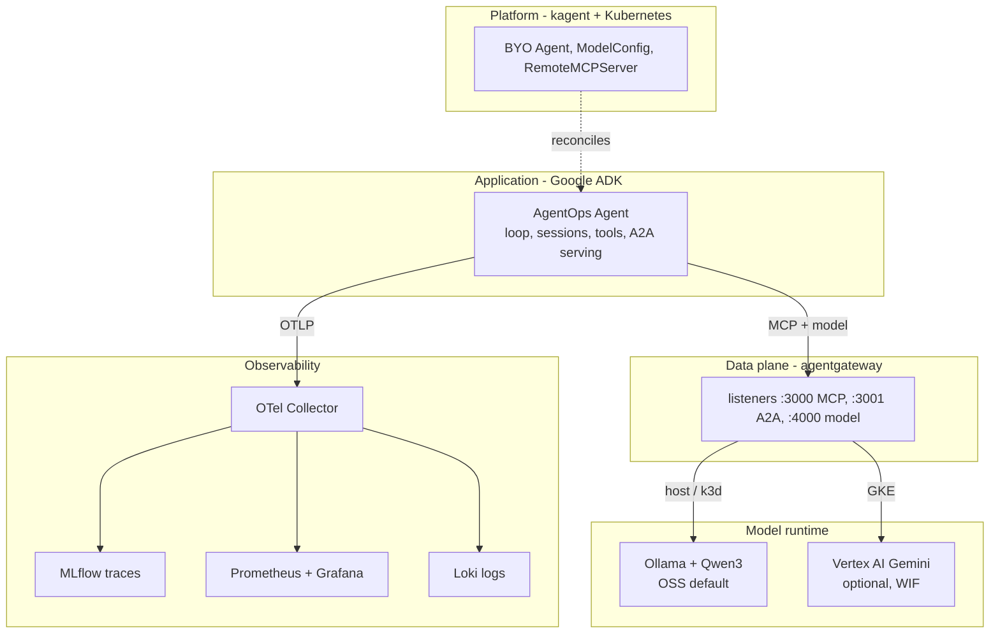
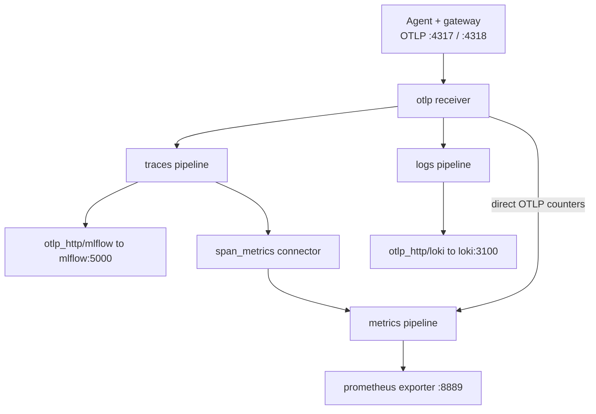

# 0.3. Ecosystem

An AgentOps stack is not one framework; it is a set of boundaries, each with a single owner and a stable contract across it. This page is the map: which tool owns which boundary, how they meet at runtime, and why the course keeps them separate instead of buying one all-in-one agent platform. The chapters that follow build each boundary in depth; treat this page as the index you return to when you lose the shape of the whole.

## Which components form the course stack?

Each component owns one clear boundary:

| Layer                 | Component                                                                                                  | Responsibility                                                      |
| --------------------- | ---------------------------------------------------------------------------------------------------------- | ------------------------------------------------------------------- |
| Application           | [Google ADK](https://google.github.io/adk-docs/)                                                           | Agent loop, sessions, tools, callbacks, workflows, and A2A serving. |
| Connectivity          | [agentgateway](https://agentgateway.dev/)                                                                  | MCP, A2A, and model routing with policy and telemetry.              |
| Platform              | [kagent](https://kagent.dev/)                                                                              | Kubernetes custom resources and lifecycle for agent workloads.      |
| Experiment and traces | [MLflow](https://mlflow.org/docs/latest/genai/)                                                            | Prompt versions, evaluations, runs, and trace exploration.          |
| Telemetry             | [OpenTelemetry](https://opentelemetry.io/)                                                                 | Vendor-neutral collection and export of runtime signals.            |
| Metrics               | [Prometheus](https://prometheus.io/) and [Grafana](https://grafana.com/oss/grafana/)                       | Queryable time series, dashboards, and alerts.                      |
| Local model           | [Ollama](https://github.com/ollama/ollama) and [Qwen3](https://huggingface.co/Qwen/Qwen3-4B-Instruct-2507) | Apache-2.0 open-weight inference without a provider account or fee. |

The table reads top to bottom; the ownership actually nests as layered planes. Read the diagram by plane, not by arrow: the arrows only show who calls whom, while the boxes show who owns what. Unlike the traffic-flow diagram in the repository [`README.md`](https://github.com/MLOps-Courses/agentops-open-course/blob/main/README.md), which traces one request end to end, this one groups components by the boundary they own:



The model plane is owned by [0.4. Providers](0.4.%20Providers.md); the rest of this page walks each remaining plane in turn.

## Why keep each responsibility in a separate tool?

An all-in-one agent framework bundles the loop, the model client, the router, the deployment target, and the telemetry backend into one dependency. That is fast to start and expensive to change: you inherit its opinion at every layer, and swapping one — a different model, a different runtime, a different trace store — drags the others with it. This course takes the opposite bet. Each boundary is a contract, and the payoff is concrete rather than aesthetic:

1. **The application does not change when the platform does.** The same OCI image (`agentops-agent:dev`) runs as a plain host process and as a kagent workload. `infra/kagent/agent.yaml` declares `type: BYO`, so kagent wraps a Kubernetes lifecycle around the course's own container instead of generating a new one. Nothing in the Python code knows whether kagent is present.
1. **The application does not change when the model backend does.** The agent speaks one OpenAI-compatible contract to gateway `:4000`. Whether that resolves to Ollama/Qwen3 (host and k3d) or Vertex AI/Gemini (the GKE profile) is the gateway's decision. The Python agent never grows a provider-specific SDK or a cloud key; the GKE overlay obtains identity through Workload Identity Federation and mounts no secret.
1. **The application does not know its observability backend.** It emits OTLP and stops there. MLflow, Prometheus, and Loki are wiring in the collector, not imports in the agent.

The honest cost of this design is coordination: more moving parts means more versions that must agree, which is exactly what [What should you verify before upgrading the stack?](#what-should-you-verify-before-upgrading-the-stack) exists to manage. The trade is deliberate — a little version bookkeeping in exchange for boundaries you can test and replace one at a time.

## What does Google ADK own?

ADK is the Python framework running inside the application process. It defines agents and tools, drives the model-and-tool loop, persists sessions, runs callbacks, and serves the AgentOps Agent over A2A. The repository pins a compatible range from `google-adk[a2a]>=2.4.0` in `agents/python/pyproject.toml` and locks the exact resolution in `uv.lock`; it never runs against whatever version happens to be newest. The `[a2a]` extra pulls in the serving layer, and the comment in the manifest deliberately avoids the unused Spanner `db` extra to keep the dependency tree tight.

ADK is not the gateway, the model provider, the Kubernetes operator, or the observability backend. Keeping those out of the framework is what makes the separation above possible. The concrete code — how the root agent is constructed, how the model is built, how tools and callbacks attach — is owned by [2.1. First Agent](../2.%20Agents/2.1.%20First%20Agent.md) and [2.2. Models](../2.%20Agents/2.2.%20Models.md); this page only fixes ADK's boundary.

## What does agentgateway own?

[agentgateway](https://agentgateway.dev/docs/standalone/main/about/introduction/) is an open-source HTTP and gRPC data plane for ordinary services plus AI-native MCP, A2A, and LLM traffic. It is the single place the course applies routing, rate limits, and content policy, so the application stays a plain client. It exposes three explicit listeners:

1. `:3000` for MCP tool traffic.
1. `:3001` for A2A traffic.
1. `:4000` for an OpenAI-compatible model endpoint.

Those three are the front door, but the full stable network contract also includes the gateway's own metrics on `:15020`, the host wrapper's readiness probe on `:15021`, and the raw upstream services it fronts — the MCP server on `:8000` and the A2A server on `:8080` — which stay off the workstation's LAN interfaces. The same contract ships in three profiles under `infra/agentgateway/{host,k3d,gke}`: a loopback host data plane, an in-cluster k3d variant, and the GKE variant that swaps the model backend for Vertex. The host profile is grounded in [`infra/agentgateway/host/config.yaml`](https://github.com/MLOps-Courses/agentops-open-course/blob/main/infra/agentgateway/host/config.yaml), whose three `binds` carry per-minute rate limits (120 MCP, 60 A2A, 30 model), an `mcpAuthorization` allowlist of the six read-only tools, and a prompt/response guard on the model route.

The agent uses the OpenAI-compatible contract directly against Ollama in Chapters 2 to 4; Chapter 5 changes only `OPENAI_BASE_URL` to the gateway, which routes to Ollama/Qwen3 locally. The policy details behind each listener are owned by [5.0. Gateway](../5.%20Gateway/5.0.%20Gateway.md) and [5.5. Gateway Security](../5.%20Gateway/5.5.%20Gateway%20Security.md); here the point is only that one component owns connectivity for every protocol.

## What does kagent own?

kagent is a CNCF Sandbox project that manages agents as Kubernetes custom resources. The course installs its stable Helm chart pinned to `0.9.11` (`infra/helmfile.yaml`) and drives it entirely through the `kagent.dev/v1alpha2` API. Three manifests under `infra/kagent/` declare the whole platform contract:

1. [`agent.yaml`](https://github.com/MLOps-Courses/agentops-open-course/blob/main/infra/kagent/agent.yaml) — a `kind: Agent` with `type: BYO`, which tells kagent to run the course's own A2A image (`agentops-agent:dev`) under a hardened pod spec (non-root, read-only root filesystem, dropped capabilities) rather than synthesizing one.
1. [`modelconfig.yaml`](https://github.com/MLOps-Courses/agentops-open-course/blob/main/infra/kagent/modelconfig.yaml) — a `kind: ModelConfig` that points the platform's model access at the in-cluster agentgateway `:4000` endpoint, so even kagent's view of the model goes through the data plane.
1. [`toolserver.yaml`](https://github.com/MLOps-Courses/agentops-open-course/blob/main/infra/kagent/toolserver.yaml) — a `kind: RemoteMCPServer` describing the governed read-only tools reached over `STREAMABLE_HTTP` through the gateway `:3000/mcp` route.

The application stays responsible for its logic and sessions; kagent is responsible for translating those custom resources into a running Kubernetes workload. That clean split is exactly why the same container runs without kagent during host development. The full walkthrough is owned by [6.0. Platform](../6.%20Platform/6.0.%20Platform.md).

## Why use both MLflow and OpenTelemetry?

OpenTelemetry is the transport and semantic layer; MLflow is the agent-specific workspace on top of it. They are not redundant — one moves signals, the other curates them. The collector is a single vendor-neutral OTLP entry point on `:4317`/`:4318`, and [`infra/observability/otel-collector.yaml`](https://github.com/MLOps-Courses/agentops-open-course/blob/main/infra/observability/otel-collector.yaml) fans the incoming signals out three ways: traces to MLflow (`otlp_http/mlflow` at `mlflow:5000`), span-derived RED metrics to Prometheus (the `span_metrics` connector feeding a `prometheus` exporter on `:8889`), and logs to Loki (`otlp_http/loki` at `loki:3100`). MLflow then adds prompt versions, evaluations, runs, and trace exploration around those traces. Neither backend hides behind a hosted SaaS account; the MLflow server itself is a locked, non-root image ([`infra/mlflow/Dockerfile`](https://github.com/MLOps-Courses/agentops-open-course/blob/main/infra/mlflow/Dockerfile)).

The reproducibility side (prompts, runs, logged models) is owned by [7.0. Reproducibility](../7.%20Observability/7.0.%20Reproducibility.md) and tracing by [7.1. Tracing](../7.%20Observability/7.1.%20Tracing.md); this page only names the boundary and the fan-out.

## How do the components fit together at runtime?

A single agent turn crosses every boundary above exactly once. The application handles the request, the data plane brokers each external call, the model plane produces tokens, and the observability plane records what happened — no component reaches past its own edge:

1. A client (an engineer, the offline web client, or another agent) sends an A2A `message/send` to gateway `:3001`; ADK runs the loop.
1. When the model needs a tool, ADK calls MCP through gateway `:3000`; when it needs a completion, it calls the OpenAI-compatible endpoint on `:4000`, which the gateway routes to Ollama or Vertex.
1. Throughout, ADK and the gateway emit OTLP to the collector, which splits the signals apart.

That last split is the piece a request diagram flattens, so it is worth its own picture. The pipelines below are exactly those declared in the collector config:



Because traces feed both MLflow and the span-metrics connector, one turn becomes a trace you can open, a set of RED metrics you can alert on, and a stream of logs you can correlate by trace id — from a single OTLP export. [7.2. Monitoring](../7.%20Observability/7.2.%20Monitoring.md) walks that three-pillar correlation end to end.

## What do Prometheus and Grafana own?

Prometheus owns the metric store and the alert engine; Grafana owns the read-only visualization. Prometheus scrapes the collector's `:8889` endpoint (the span-derived series such as `agentops_calls_total` and `agentops_duration_seconds_bucket`) plus the gateway's own `:15020` metrics, and evaluates the rules in [`infra/observability/prometheus-rules.yml`](https://github.com/MLOps-Courses/agentops-open-course/blob/main/infra/observability/prometheus-rules.yml): two recording rules and six alerts — `AgentErrorBudgetBurn`, `ObservabilityCollectorDown`, `AgentTurnLatencyP95High`, `AgentTokenTelemetryMissing`, `AgentInjectionNeutralizedSpike`, and `AgentTriageSchemaFailures`. Grafana provisions the `AgentOps overview` dashboard from [`infra/observability/grafana/dashboards/agentops.json`](https://github.com/MLOps-Courses/agentops-open-course/blob/main/infra/observability/grafana/dashboards/agentops.json): six metric panels (agent and gateway request rate, p95 latency, error ratio, guardrail rejects) and one Loki logs panel filterable by trace id.

On the host Compose profile these surface on well-known loopback ports — Prometheus on `:9090`, Grafana on `:3002`, MLflow on `:5000` — while the Kubernetes overlays keep them as ClusterIPs behind port-forwards. Every alert is grounded in a metric the stack verifiably exports, and none routes to an external pager. [7.2. Monitoring](../7.%20Observability/7.2.%20Monitoring.md) owns the alert semantics, the dashboard, and the alert-response runbooks.

## Which open standards connect the components?

Boundaries only hold if the contract across them is a standard, not a private API:

1. **[MCP](https://modelcontextprotocol.io/)** describes how an agent discovers and invokes tools and resources.
1. **[A2A](https://a2a-protocol.org/)** describes how independently deployed agents advertise capabilities and exchange tasks.
1. **[OpenTelemetry](https://opentelemetry.io/)** describes and transports traces, metrics, and logs.
1. **[OCI images](https://opencontainers.org/)** package the same application for local and cloud runtimes.
1. **[AGENTS.md](https://agents.md/)** gives coding agents repository-local instructions, a convention this repository dogfoods.

Standards reduce coupling; they do not guarantee interoperability by themselves. Two implementations can each claim MCP or A2A and still disagree on a version, an auth mode, or a streaming detail. The course pins concrete implementations and verifies the versions together rather than trusting the labels.

## Where do the AAIF and CNCF fit?

The [Agentic AI Foundation](https://aaif.io/) is a Linux Foundation home for open agent infrastructure, including agentgateway, MCP, and A2A. The [Cloud Native Computing Foundation](https://www.cncf.io/) stewards Kubernetes, Prometheus, and kagent among many other projects. Foundation status is useful governance context — a signal about open licensing and shared maintenance — not evidence that a pre-1.0 API is stable. kagent and agentgateway are young; treat their `v1alpha2` and pre-2.0 surfaces as movable and let the pins, not the foundation logo, decide what you run.

## What should you verify before upgrading the stack?

Separate boundaries mean separate release cadences, so an upgrade is a coordination exercise, not a single bump. The current coordinated pins live in the repository, and `AGENTS.md` records them under "Pinned contracts": Google ADK from `2.4.0` (exact in `uv.lock`), agentgateway `1.3.1` (image digest-pinned for Kubernetes), kagent Helm `0.9.11` on API `v1alpha2`, MLflow `3.14.0`, OpenTelemetry Collector contrib `0.156.0` (by image digest), and Python `3.13`. Read those files as the version authority — `agents/python/pyproject.toml` and `uv.lock` for Python, `infra/helmfile.yaml` for kagent, the digest-pinned manifests for the gateway and collector — rather than a floating `latest` tag.

Upgrade one component at a time, read its release notes and schema changes, regenerate the lock, and run the offline gate:

```bash
mise run format
mise run check
mise run test
```

For an infrastructure upgrade, also render and validate the manifests before a local `skaffold run -p local`. Never infer compatibility from a project name, a shared foundation, or a `latest` tag; the whole point of the boundaries is that each contract is verified where it is pinned.
